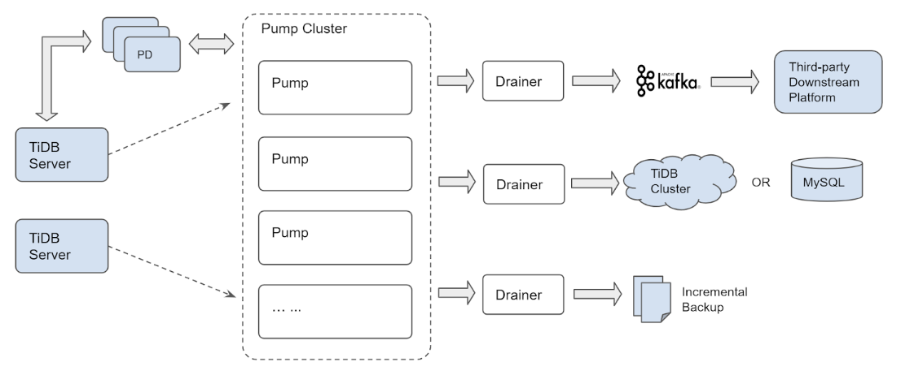

## 0x00 闲来无聊

> 闲来无聊干点啥，买了几个域名（如有雷同 纯属巧合），比如本站的 tidb.cc  
> TiDB-AirPlan 站名来自于某项运动的战术代号，Airplan（空中加油：先让一部分人先富起来，然后带动后面的人突围）  

## 0x01 Who TiDB

> 在线体验 TiDB 请去 [play.pingcap.com](https://play.pingcap.com/  "基于 WebAssembly 实现")（使用 Chrome 浏览器效果最佳，基于 [TiDB-Wasm](https://pingcap.com/blog-cn/tidb-wasm-introduction/) 实现）  

- [TiDB 的正确使用姿势](https://pingcap.com/blog-cn/how-to-use-tidb/)
  - TiDB 应用场景与基础选型
  - 选配 TiDB ，应用业务可能需要处理的部分
- [TiDB 源码阅读系列文章（三）SQL 的一生](https://pingcap.com/blog-cn/tidb-source-code-reading-3/)
  - 理解下 TiDB 与 MySQL 的区别，TiDB 不是由 MySQL 包装而得到的产品
- [三篇文章了解 TiDB 技术内幕——说存储](https://zhuanlan.zhihu.com/p/26967545)
- [三篇文章了解 TiDB 技术内幕——说计算](https://zhuanlan.zhihu.com/p/27108657)
- [三篇文章了解 TiDB 技术内幕——谈调度](https://zhuanlan.zhihu.com/p/27275483)

### 基石

- **\*** [In Search of an Understandable Consensus Algorithm](https://web.stanford.edu/~ouster/cgi-bin/papers/raft-atc14)
  - [TiKV 源码解析系列 - 如何使用 Raft](https://pingcap.com/blog-cn/tikv-how-to-use-raft/)
  - [TiKV 源码解析系列 - multi-raft 设计与实现](https://pingcap.com/blog-cn/the-design-and-implementation-of-multi-raft/)
  - [TiKV 功能介绍 - Raft 的优化](https://pingcap.com/blog-cn/optimizing-raft-in-tikv/)
  - [使用 Rust 构建分布式 Key-Value Store](https://pingcap.com/blog-cn/rust-key-value-store/)
- **\*** [Percolator Large-scale Incremental Processing Using Distributed Transactions and Notifications](https://ai.google/research/pubs/pub36726)
  - [Percolator 和 TiDB 事务算法](https://pingcap.com/blog-cn/percolator-and-txn/)
- **\*** [F1: A Distributed SQL Database That Scales](https://ai.google/research/pubs/pub41344)
- **\*** [Spanner: Google's Globally-Distributed Database](https://ai.google/research/pubs/pub39966)
  - [Spanner - CAP, TrueTime and Transaction](https://pingcap.com/blog-cn/Spanner-cap-truetime-transaction/)
  - [TiKV 事务模型概览，Google Spanner 开源实现](https://pingcap.com/blog-cn/tidb-transaction-model/)

## 0x02 同台竞技

> TiDB 分布式场景下的一些自身特性与优化

- [TiDB 历史数据回溯](https://github.com/pingcap/docs-cn/blob/master/op-guide/history-read.md)
- [TiDB 垃圾回收 (GC)](https://github.com/pingcap/docs-cn/blob/master/op-guide/gc.md)
- [统计信息简介 (analyze table)](https://github.com/pingcap/docs-cn/blob/master/sql/statistics.md)
- [TiDB 专用系统变量和语法](https://github.com/pingcap/docs-cn/blob/master/sql/tidb-specific.md)
- [TiDB 内存控制文档](https://github.com/pingcap/docs-cn/blob/master/sql/tidb-memory-control.md)
- [Transaction in TiDB](https://andremouche.github.io/tidb/transaction_in_tidb.html)

## 0x03 运维

- [安装部署软硬件要求](https://pingcap.com/docs-cn/dev/how-to/deploy/hardware-recommendations/)

### 部署

- Binary 裸奔
- [docker-compose 安装部署](https://pingcap.com/docs-cn/dev/how-to/get-started/local-cluster/install-from-docker-compose/)
- [TiDB-Ansibel 安装部署](https://pingcap.com/docs-cn/dev/how-to/deploy/orchestrated/ansible/)

- [ ] Docker-compose faq
- [ ] ansible-playbook faq
- [ ] 部署常见问题

### 监控

- 围观站内文档 [Monitoring](/categories/monitoring/ "ap.tidb.cc 提供") ，提供部分参考意义

## 0x04 数据生态

> 数据怎么进来  
> 数据怎么出去  

### 数据导出

> 理论上支持 mysql-protocol 均可用于 TiDB ，以下是优化版 mydumper

- 社区版：`https://github.com/maxbube/mydumper`
- PingCAP 优化版：`https://github.com/pingcap/mydumper`
- 修改版相比原版功能上 针对 TiDB 有部分优化
  - 支持单表多线程输出
  - 支持 TiDB savepoint 数据导出
  - 支持 TiDB 数据查询优先级( tidb_force_priority variable )
  - 移除 TiDB 外键检查
  - 以及部分针对 TiDB 适配性优化
- PingCAP 版本下载信息如下：

  ```yml
  # Download the tool package.
  wget http://download.pingcap.org/tidb-enterprise-tools-latest-linux-amd64.tar.gz
  wget http://download.pingcap.org/tidb-enterprise-tools-latest-linux-amd64.sha256

  # Check the file integrity. If the result is OK, the file is correct.
  sha256sum -c tidb-enterprise-tools-latest-linux-amd64.sha256

  # Extract the package.
  tar -xzf tidb-enterprise-tools-latest-linux-amd64.tar.gz
  cd tidb-enterprise-tools-latest-linux-amd64
  ```

### 数据导入

> TiDB 对事物大小有一些限制，如 单个事物最大 100MB、30w kv、单 KV 不大于 6MB ；这些限制导致需要严格控制事物提交，开源版的 myloader 与 mysql-load 工具不适配；官方开发了新工具 loader ，还支持断点续传和热点打散  
> TiDB 可承载的数据量庞大，loader 导入速度逐渐跟不上，又升级开发了 lighting 工具

- Loader 工具可阅读官方文档
- lighting 工具可阅读官方文档

### 数据同步

> 主要支持 MySQL、MariaDB 同步到 TiDB ，其他场景不支持  
> 起初是 mydumper、loader、syncer 打包作为 mysql 同步到 TiDB 的三剑客，为提高工作效率和补充分库分表场景，升级开发 DM 工具，该工具将三剑客内置并增加 *同步会话* 管理功能  

- Syncer 数据同步软件，不支持分库分表场景，其他都挺好用
- DM 支持分库分表，写完 taks.yml 之后可以做到一键 *导出、导入、增量同步* 到 TiDB；架构如下 ⬇️


- Data Migration：`https://github.com/pingcap/dm`
- 中文文档：`https://github.com/pingcap/docs-cn/blob/master/tools/dm/overview.md`
- 特性
  - 支持上游[分库分表](https://github.com/pingcap/docs-cn/blob/master/tools/dm/data-synchronization-features.md#table-routing)
  - 支持 [database、table](https://github.com/pingcap/docs-cn/blob/master/tools/dm/data-synchronization-features.md#black--white-table-lists) 级过滤
  - 支持 [DML、DDL](https://github.com/pingcap/docs-cn/blob/master/tools/dm/data-synchronization-features.md#binlog-event-filter)数据类型过滤
  - 支持 [Black & white table lists](https://github.com/pingcap/docs-cn/blob/master/tools/dm/data-synchronization-features.md#black--white-table-lists) 过滤
  - 支持分库分表自增 ID 主键数据合并(此处选用自增 ID 改写方案，有一定的局限性，详情见 [Column mapping](https://github.com/pingcap/docs-cn/blob/master/tools/dm/data-synchronization-features.md#column-mapping))

### TiDB Binlog

> 与 mysql binlog 完全独立，从使用、运维、数据格式上完全不一样；

- 官方文档 [传送门](https://pingcap.com/docs-cn/dev/reference/tidb-binlog/overview/)



## 0x05 性能调整

> 分布式数据库架构庞大，横跨主机、网络、存储三大架构，需要一连串数据获取然后综合分析

### 性能分析工具

- [火焰图](https://pingcap.com/blog-cn/flame-graph/)

- [ ] 场景疑问，case by case
- [ ] POC & Benchmark

## 0x06 深入发展

- Go 语言
  - [Go 语言编程](https://book.douban.com/subject/11577300/)
  - [Go 教学](https://tour.golang.org/welcome/1)
- Rust 语言
  - [Rust 编程之道](https://book.douban.com/subject/30418895/) & [深入浅出 Rust](https://book.douban.com/subject/30312231/)
  - [Rust 教学](https://doc.rust-lang.org/book/)
- Kubernetes(k8s)
- 数据相关
  - [数据库系统概念](https://book.douban.com/subject/1929984/)
- 系统网络
  - [gRPC-rs：从 C 到 Rust](https://pingcap.com/blog-cn/grpc-rs/)

### TiDB 源码阅读

> 关注官方 Blog ，[TiDB 源码解读](https://pingcap.com/blog-cn/#TiDB-%E6%BA%90%E7%A0%81%E9%98%85%E8%AF%BB)

- [TiDB 源码阅读系列文章（一）序](https://github.com/pingcap/blog-cn/blob/master/tidb-source-code-reading-1.md)
- [初识 TiDB 源码](https://github.com/pingcap/blog-cn/blob/master/tidb-source-code-reading-2.md)
- [SQL 的一生](https://github.com/pingcap/blog-cn/blob/master/tidb-source-code-reading-3.md)
- [Insert 语句概览](https://github.com/pingcap/blog-cn/blob/master/tidb-source-code-reading-4.md)
- [TiDB SQL Parser 的实现](https://github.com/pingcap/blog-cn/blob/master/tidb-source-code-reading-5.md)
- [Select 语句概览](https://github.com/pingcap/blog-cn/blob/master/tidb-source-code-reading-6.md)
- [基于规则的优化](https://github.com/pingcap/blog-cn/blob/master/tidb-source-code-reading-7.md)
- [基于代价的优化](https://github.com/pingcap/blog-cn/blob/master/tidb-source-code-reading-8.md)
- [Hash Join](https://github.com/pingcap/blog-cn/blob/master/tidb-source-code-reading-9.md "TiDB Hash Join 的实现以及几种常见的问题")
- [Chunk 和执行框架简介](https://github.com/pingcap/blog-cn/blob/master/tidb-source-code-reading-10.md)
- [Index Lookup Join](https://github.com/pingcap/blog-cn/blob/master/tidb-source-code-reading-11.md)
- [统计信息（上）](https://github.com/pingcap/blog-cn/blob/master/tidb-source-code-reading-12.md)
- [索引范围计算简介](https://github.com/pingcap/blog-cn/blob/master/tidb-source-code-reading-13.md)
- [统计信息（下）](https://github.com/pingcap/blog-cn/blob/master/tidb-source-code-reading-14.md)
- [Sort Merge Join](https://github.com/pingcap/blog-cn/blob/master/tidb-source-code-reading-15.md)
- [INSERT 语句详解](https://github.com/pingcap/blog-cn/blob/master/tidb-source-code-reading-16.md)
- [DDL 源码解析](https://github.com/pingcap/blog-cn/blob/master/tidb-source-code-reading-17.md)
- [tikv-client（上）](https://github.com/pingcap/blog-cn/blob/master/tidb-source-code-reading-18.md)
- [tikv-client（下）](https://github.com/pingcap/blog-cn/blob/master/tidb-source-code-reading-19.md)
- [Table Partition](https://github.com/pingcap/blog-cn/blob/master/tidb-source-code-reading-20.md)
- [基于规则的优化 II](https://github.com/pingcap/blog-cn/blob/master/tidb-source-code-reading-21.md)
- [Hash Aggregation](https://github.com/pingcap/blog-cn/blob/master/tidb-source-code-reading-22.md)
- [Prepare/Execute 请求处理](https://github.com/pingcap/blog-cn/blob/master/tidb-source-code-reading-23.md)
- [TiDB Binlog 源码解析](https://github.com/pingcap/blog-cn/blob/master/tidb-source-code-reading-24.md)

### TiKV 源码阅读

> 关注官方 blog，[TiKV 源码解析](https://pingcap.com/blog-cn/#TiKV-%E6%BA%90%E7%A0%81%E8%A7%A3%E6%9E%90)

- [TiKV 源码解析系列文章（一）序](https://github.com/pingcap/blog-cn/blob/master/tikv-source-code-reading-1.md)
- [raft-rs proposal 示例情景分析](https://github.com/pingcap/blog-cn/blob/master/tikv-source-code-reading-2.md)
- [Prometheus（上）](https://github.com/pingcap/blog-cn/blob/master/tikv-source-code-reading-3.md)
- [Prometheus（下）](https://github.com/pingcap/blog-cn/blob/master/tikv-source-code-reading-4.md)
- [fail-rs 介绍](https://github.com/pingcap/blog-cn/blob/master/tikv-source-code-reading-5.md)
- [raft-rs 日志复制过程分析](https://github.com/pingcap/blog-cn/blob/master/tikv-source-code-reading-6.md)
- [gRPC Server 的初始化和启动流程](https://github.com/pingcap/blog-cn/blob/master/tikv-source-code-reading-7.md)

### Ecosystem 源码阅读

> 关注官方 Blog，[DM 源码阅读](https://pingcap.com/blog-cn/#DM-%E6%BA%90%E7%A0%81%E9%98%85%E8%AF%BB)

- [DM 源码阅读系列文章（一）序](https://github.com/pingcap/blog-cn/blob/master/dm-source-code-reading-1.md)
- [整体架构介绍](https://github.com/pingcap/blog-cn/blob/master/dm-source-code-reading-2.md)
- [数据同步处理单元介绍](https://github.com/pingcap/blog-cn/blob/master/dm-source-code-reading-3.md)
- [dump/load 全量同步的实现](https://github.com/pingcap/blog-cn/blob/master/dm-source-code-reading-4.md)
- [Binlog replication 实现](https://github.com/pingcap/blog-cn/blob/master/dm-source-code-reading-5.md)

### TiDB Binlog 源码

> 官方 Blog，[TiDB-Binlog 源码解析](https://pingcap.com/blog-cn/#TiDB-Binlog-%E6%BA%90%E7%A0%81%E9%98%85%E8%AF%BB)

## 0x07 一键三连

> 点赞、转发、收藏  
> 首推 TiDB B 站 [TiDB Robot](https://space.bilibili.com/86485707)。会不定时更新 meetup、社区活动视频

| 网站 | 网址 |
| --- | ----- |
| 微信公众号 | pingcap2015
| Product Weekly | `https://pingcap.com/weekly/`
| v2ex |   `https://www.v2ex.com/member/PingCAP`
| Github | `https://github.com/pingcap/`
| TiKV |   `https://github.com/tikv/`
| weibo |  `https://www.weibo.com/pingcap`
| zhihu |  `https://zhuanlan.zhihu.com/newsql`
| reddit | `https://www.reddit.com/r/TiDB/`
