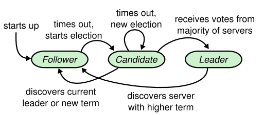
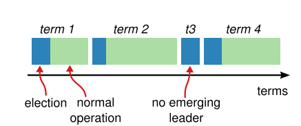
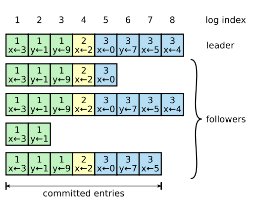

## 0x00 Look

> 全文复制 [青蛙小白 - Raft](https://blog.frognew.com/2016/01/raft-comprehension.html)

[Raft](https://raft.github.io/) 多数派选举策略

分布式一致性协议允许一组服务器节点像一个整体一样工作，允许其中一些节点出现故障也能继续工作下去。正式因为如此，一致性算法在构建大规模分布式软件系统扮演着十分重要角色。Paxos 一直是分布式领域内一致性协议的代名词，但 Paxos 十分难以理解，绝大数实现基于 Paxos 进行修改才能应用到实际系统中，因此 Paxos 的具体实现具有不统一性。

## 0x01 Raft

为构建成员稳定 and 和谐共处的环境，Raft 有三大要素

- 领导者选举【必须是奇数且大于三】
  - Leader (领导者)
  - Follwer (追随者)
  - Candidate (候选者)
- 日志复制
- 安全性

### Leader

Raft 采用的是 Master-Slave 模式，通过领导者选举步骤选出一个 Leader，后续的日志复制和安全性都是由 Leader 来完成，简化了一致性维护问题。如果 Leader 失效，会通过领导者选举步骤选出新的 Leader 继续后续的过程。

正常情况下集群中只有一个 Leader 负责响应来自所有客户端的请求，其他节点都是 Follower，处于 Follower 状态的节点都是被动接收 RPC 消息，从不会主动发送 RPC 消息。Candidate 状态是 Follower 节点准备发起新的领导者选举前需要转化到的状态，是从 Follower 到 Leader 转化的中间状态。

### Terms

Raft 将整个 Raft 集群执行时间划分为若干个不同时间间隔的时间片段，每个时间片段被称为一个任期(Term)，每个 Term 以递增数字来标识。

每个任期由两个期间组成：选举期间 (election) 和常规操作期间(normal operation)。有的任期可能在选举期间内没有选出 Leader 而没有常规操作期间。 因此可以看出，每个任期都是由选举期间开始，在这个期间内若干个处于 Candidate 状态的节点试图竞争称为新的 Leader，如果某个节点赢得选举，则将在这个任期内作为 Leader，进入常规操作期。某些情况下，因为选票的分流，在选举期间内没有成功选出 Leader，则会进入下一个任期。此外，Raft 还需保证一个任期内最多有一个节点被选举为 Leader。

### RPC

RequestVote(请求投票)：由 Candidate 节点在选举期间发起
AppendEntries(附加条目)：由 Leader 发起，用来向 Follower 复制日志和提供心跳机制。

### Vote

Raft 使用心跳机制来触发领导者选举过程。

当整个系统启动时，所有服务器节点都处于 Follower 状态，只要节点保持收到来自 Leader 或 Candidate 的 RPC，将一直维持这个状态。

Leader 周期性的向所有 Followers 发送心跳 RPC(AppendEntries 不包含 log entry)来宣称其处于领导者地位。 如果某个 Follower 经过一定时间间隔 (这个时间间隔被称为选举超时时间) 没有收到任何心跳消息，则认为集群中的 Leader 已经不存在，于是将触发领导者选举过程。

在开始选举前，Follower 将增加其 Term 编号并转化为 Candidate 状态，然后它会向集群中其他所有节点发送 RequestVote RPC 来给他自己投票。

- Candidate 节点发出 RequestVote RPC 消息，之后一直处于 Candidate 状态，除非以下某一种情况发生：

  - 它自己赢得了本次选举：这种情况表示该 Candidate 收到了大多数与其处于相同任期编号的选票，赢得这次选举称为 Leader，之后需要向其他接地那发送心跳宣告并维护其 Leader 的地位。注意每个服务器节点做多会对一个任期编号投出一张票，按照先来先服务原则先到先得。
  - 其他服务器节点宣称并确认是新的 Leader：Candidate 在等待投票的过程中可能会接收到新的 RPC 消息，如果这个 RPC 消息是另外一个服务器节点宣称其是新的 Leader 发出的，并且这个 RPC 里面的任期编号大于等于该 Candidate 自身的任期编号，则它会承认这个新的 Leader 有效，自己会转换为 Follwer 状态；否则会拒绝承认这个新的 Leader，它自己会继续维持 Candidate 状态。
  - 经过一段时间间隔，仍然没有新的 Leader 产生：即 Candidate 没有赢得选举也没有其他服务器节点赢得选举，出现这种情况有可能是因为多个 Follower 转换为 Candidate 状态，导致选票分流而没有得到多数选票。发生这种情况时，Candidate 会超时并增加自身的任期编号后进入新一轮的选举过程。为了尽量减少这种情况的发生，Raft 为每个节点采取随机超时时间，这样出现选票分流的概率会大大减小。

### Log

当选出 Leader 之后，所有客户端请求都由 Leader 来负责响应。Leader 收到客户端的请求的操作命令后，将这条指令作为新的日志条目 (Log Entry) 附加到日志的尾部，然后并行向集群中所有其他服务器节点发送 AppendEntries RPC，让其他服务器节点复制这个日志条目。当其他服务器安全复制了这个日志条目后，Leader 会将这个日志条目应用到其内部状态机，然后把请求执行结果返回给客户端。

每个日志条目 (Log Entry) 包含一个全局的日志索引 (log index) 来表示日志条目在日志中的位置(顺序)，另外包含请求操作命令本身，还包含 Leader 接收到操作命令时的任期编号。

Leader 会决定哪些日志条目可以安全的应用到状态机上，这些条目被称作已经提交的条目(commit entries)，Raft 保证这些已经提交的日志条目的持久化以及让所有服务器节点都按照相同的顺序执行这些操作命令。一般情况下，当大多数服务器节点都正确的在日志里存储了这个日志条目，则可以认为这个日志条目是可提交的。 上图中，日志索引为 7 及其之前的日志项目都是可提交的，因为 5 个服务器节点之中的 3 个已经正确的复制了这些日志条目。

### Sec

通过前面的领导者选举和日志复制，Raft 在大多数情况下都可以正常运行，但是在某些情况下还是无法做到完全的安全性保证，即无法保证每个服务器的状态机都能够按照相同顺序执行相同的操作命令。

为了达到真正的安全性，Raft 增加了如下的约束条件：

- 要求只有其 Log 包含了所有已经提交的日志条目的服务器节点才有权没选举为新的 Leader
- 对于新的 Leader，只有他已经提交过当前任期的日志条目才被认为是真正的提交

## 0x03 Paper

- [Raft follower read 场景](raft-follwer-read.pdf)【中文】
- [Raft 论文精简版](./raft.pdf)【英文】
- [Raft 论坛全文版](./raft-full-text.pdf)【英文】
