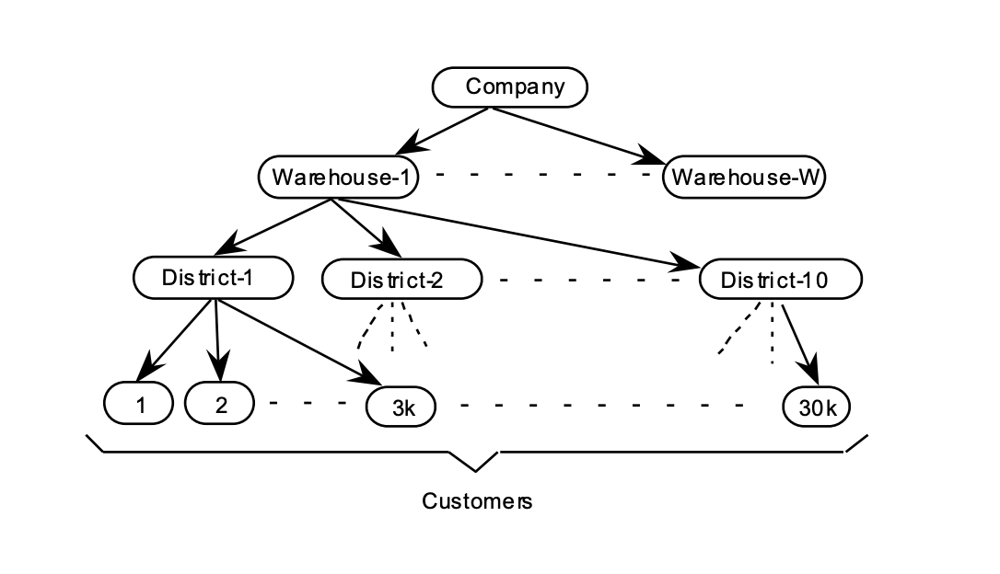
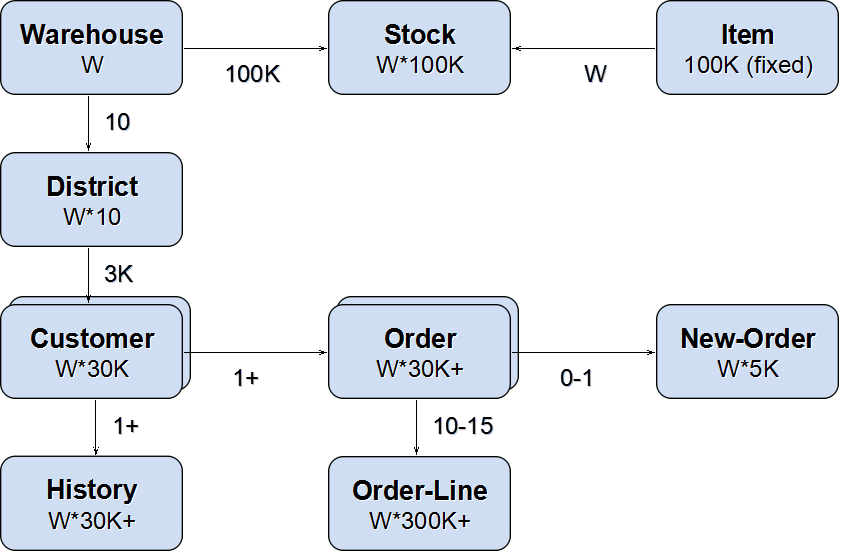
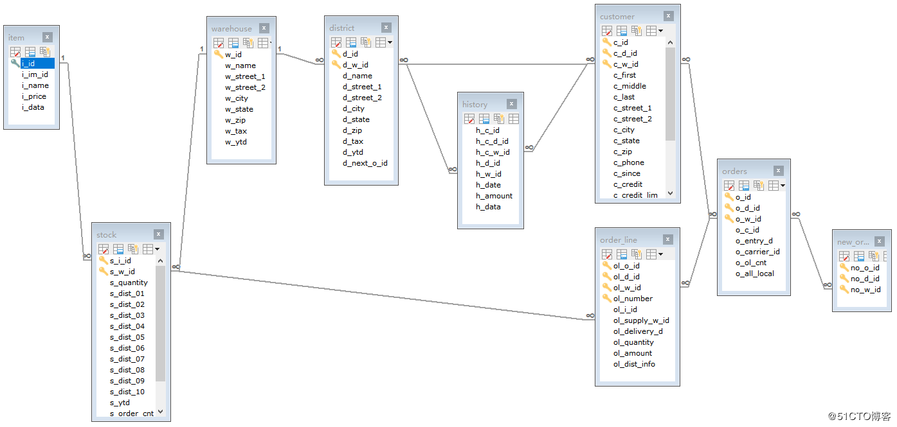

## 0x00

[TPC-C](http://www.tpc.org/tpcc/) 是 TPC(Transaction Processing Performance Council) 组织发布的一个测试规范，用于模拟测试复杂的在线事务处理系统。其测试结果包括每分钟事务数 (tpmC)，以及每事务的成本 (Price/tpmC)。  
TPC-C 使用 tpmC 值（Transactions per Minute）来衡量系统最大有效吞吐量（MQTh，Max Qualified Throughput），其中 Transactions 以 NewOrder Transaction 为准，即最终衡量单位为每分钟处理的新订单数。  

有一个大型商品批发商，在地理分布的多个**区域(district)**有业务，并且使用仓库管理。当业务扩展的时候，公司将添加新的 **仓库(warehouse)**。每个仓库负责为 10个区域供货；每个区域为 **3000个客户(customer)**提供服务。所有仓库维护公司销售的 **100,000中商品(item)**的 **库存(stock)**记录。平均每个客户的一个 **订单(order)**有 **10个订单项(order line)**；所有订单中约 1%的订单项在其直接所属的仓库中没有存货，需要由其他区域的仓库来供货。  
客户向公司的系统发出新的订单或者查询其订单状态。  
公司的系统也用于处理客户的付款，处理发货的订单，检查库存状态以便发现潜在的供货短缺问题。  
下图显示了**仓库 (warehouse)**，**区域(district)**和 **客户(customer)**间的关系。  

> TPC-C [PDF](http://www.tpc.org/tpc_documents_current_versions/pdf/tpc-c_v5.11.0.pdf)

## 0x01

> 数据量

L | R
--- | ---
客 户 |  customer
地 区 |  district
商 品 |  item
历史订单 |  history
新订单  |  new_orders
订单状态 |  order_line
订 单 |  orders
库存状态 |  stock
仓 库 |  warehouse

> tpcc-mysql 的业务场景及其相关的几个表作用如下（对于前四种类型交易，要求响应时间在 5秒内；对于库存状况查询事务，要求响应时间在 20秒内）：

L | C | R
--- | ---|---|
New-Order | 客户输入一笔新的订货交易，一次完整的订单事务 | all table
Payment  | 更新客户账户余额以反映其支付状况 | orders、history
Order-Status | 订单状态，查询客户最近交易的状态 | orders、order_line
Delivery  | 发货 (模拟批处理交易) | order_line
Stock-Level | 查询仓库库存状况，以便能够及时补货；| stock

- 测试过程有点慢 ，1 个 warehouse 对应 10 个地区，1 地区对应 3000 的用户，10 个仓库刚导入进去的大小约为 1G
- 仓数可根据需要来设置，总结网上资料所说，设置 40-100 个是对 CPU 的测试，400-1000 个是对 IO 的测试，40 以下无论事务多少，锁竞争情况也不太容易发生
- 真实测试场景中，仓库数一般不建议少于 100 个，视服务器硬件配置而定，如果是配备了 SSD 或者 PCIE SSD 这种高 IOPS 设备的话，建议最少不低于 1000 个

## 0x03 tiup bench

> [使用 TiUP bench 组件压测 TiDB](https://pingcap.com/docs-cn/dev/tiup/tiup-bench/)  
> [TPC-C 测试步骤](https://pingcap.com/docs-cn/dev/tiup/tiup-bench/#tpc-c-%E6%B5%8B%E8%AF%95%E6%AD%A5%E9%AA%A4)

- tiup bench tpcc --warehouses 4 --parts 4 prepare
- tiup bench tpcc --warehouses 4 run / -T 10
- tiup bench tpcc --warehouses 4 check
