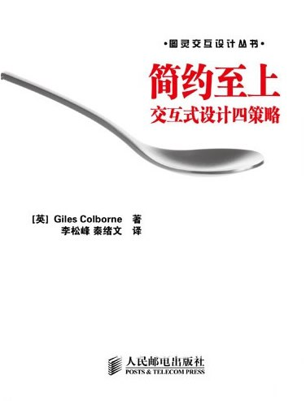

## 0x00 inspired-启示录

> douban [link](https://book.douban.com/subject/5914587/)

1. 产品是什么
2. 产品经理职能定义
3. 产品未来发展方向
    - 平台打包
4. 产品与用户之间的情感曲线

## 0x01 人人都是产品经理

> douban [link](https://book.douban.com/subject/27029547/)

## 0x02 交互式设计四策略

> douban [link](https://book.douban.com/subject/5394309/)  

  

本书一直通过各种各样的小故事告诉读者应该怎么操作，作者说螃蟹很好吃，同时告诉读者应该怎么吃。~~内容不长，也好理解，故事简短+散乱（前后依赖少的情景剧）。~~  
20200609 done  // 以下内容不作为本书主题思想，仅作为提笔忘字训练记忆专用  
PTAL 网络读者的 [douban note](https://book.douban.com/annotation/18027260/)  

- 四策略
  - 删除 - 去掉不必要的
  - 组织 - 分组有意义的
  - 隐藏 - 隐藏不重要得
  - 转移 - 多设备间转移
- 三种用户
  - 专家型用户：愿意探索你的产品或服务，并且会给你提出各种改进建议，少数 / 忽略专家型用户：他们追求主流用户根本不在乎的功能
  - 随意型用户：可能使用过类似的产品或服务，有兴趣使用更高级的产品，但却不愿意接触全新的东西，少数 / 也不要保持中立而过于在乎随意型用户：这类人数量有限，相对极端，他们的技术水平较好，而且比主流用户更具有忍耐力
  - 主流用户：他们自己不会因为你的技术而使用你的产品，使用你产品的目的是完成某项任务 / 主流用户占绝对的主体地位（产品目标群体），专家和随意型用户只是少数
- 展示
  - 使用极其简约的 slogan
    - 设计之前、推荐给客户时、需要**对什么是简单的体验**有一个认识（演讲者与对象之间的共识、标准、启示）
  - 根据事实过程创造一个过程，程重点是：产品的使用场景（环境、时间、地点）、人物、故事情节（主观、客观）、讲用户能听得懂的语言（非专业术语）
  - 切割信息，快速让客户理解特点功能（创造开放式体验）；或者切割较长的事物，减少因外部中断带来的重新开始成本
    - 最好带有高保真原型图或者初版实物原型，方便客户直接体验
    - 同时可建立信任关系
  - 感情需求：想办法分析出用户的隐性感情需求，并用设计来实现和贯彻 // 与《启示录》中的感情曲线异曲同工
    - 这有助于让客户更快融于所讲的故事，可以让 PM 更快了解客户心理动态
    - 简单意味着控制
      - 从简单这个角度来看，最重要的是让用户感到自己在掌控一切。即产品不会出现客户处理不了的线程或者超出客户的预想范围
      - 让用户感觉简单的一个重要前提，是先搞清楚把什么工作交给计算，人负责情绪事态判断，计算机负责复杂的精确计算和存储工作
      - 降低学习负担、识别负担、相近功能测试负担、自动智能优化负担、去除分散注意力的元素
    - 反复问自己“然后呢”，最终会发现用户的感情需求、合理需求，直到出具解决方案
      - “用户在做什么？” —— 描述用户从开始到结束一直在做什么，你应该对用户的行为而不是你的设计感兴趣
    - 描述用户体验，你需要把它转换成一个故事，故事是描述认识的一种好方式
- 其他
  - 清楚真正的问题所在，不是用户想要就给（主流用户 / 专家用户 / 随意用户）
  - 在正确的位置提供正确的内容。在错误的位置，放置再醒目的引导，用户也不会去看
  - 避免不必要的功能以及功能堆砌 // 别做多余的事情
  - 导航比搜索重要。只有在网站没有提供有效导航的情况想，用户才会使用搜索，搜索比浏览困难得多
