## 0x00 inspired

> douban [link](https://book.douban.com/subject/5914587/)

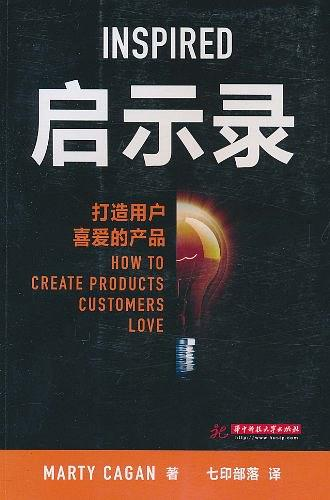

1. 产品是什么
2. 产品经理职能定义
3. 产品未来发展方向
    - 平台打包
4. 产品与用户之间的情感曲线

## 0x01 人人都是产品经理

> douban [link](https://book.douban.com/subject/27029547/)

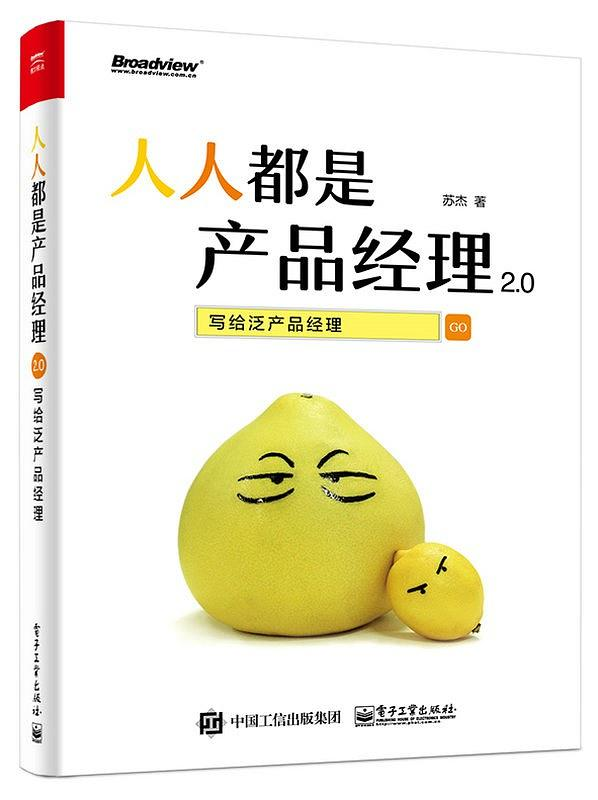
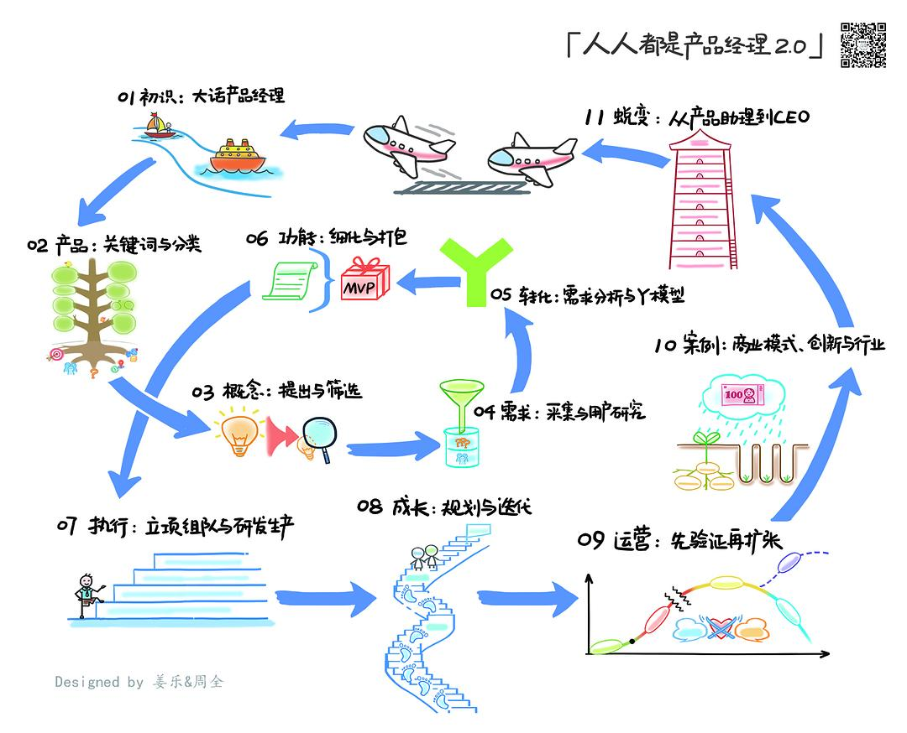
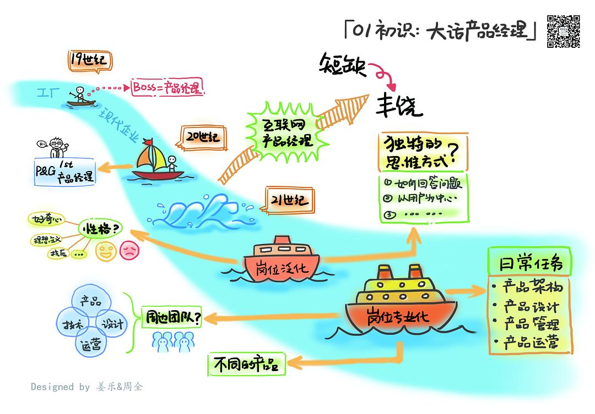
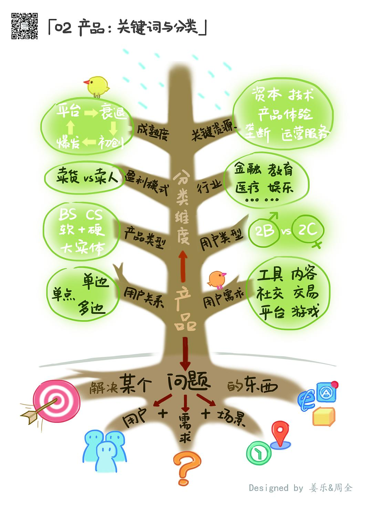
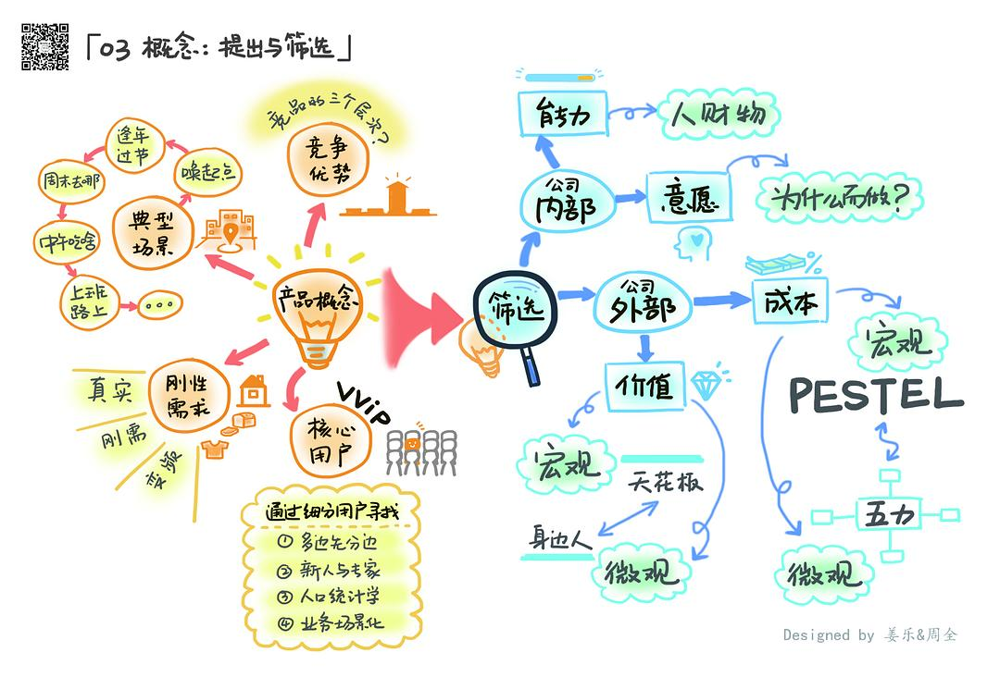
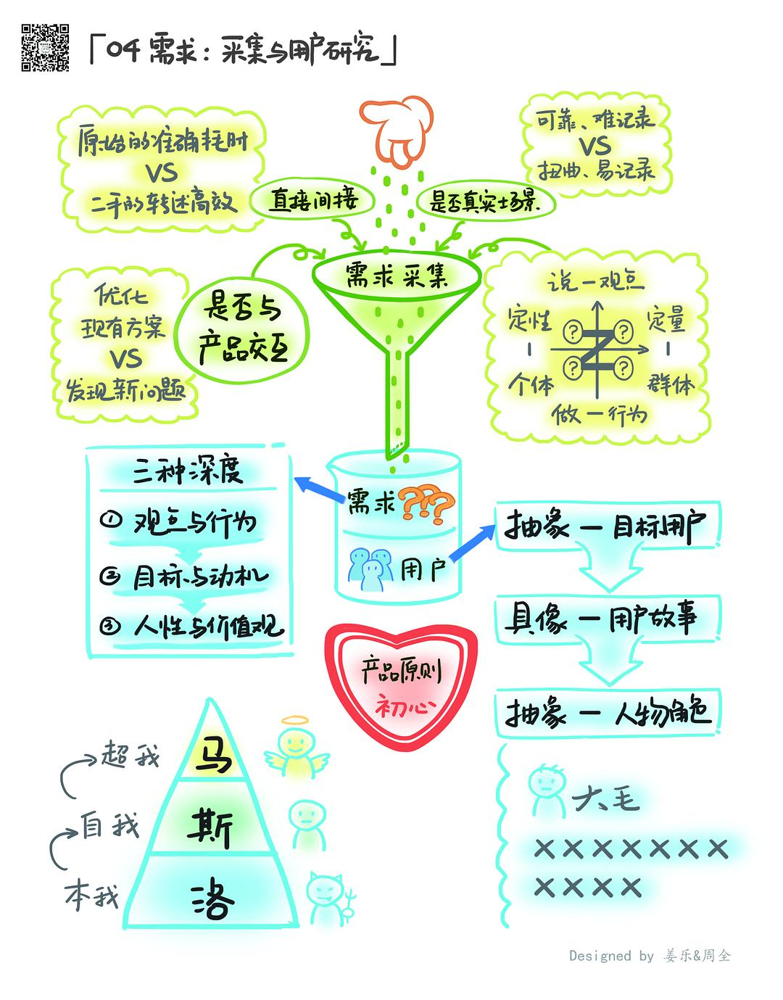
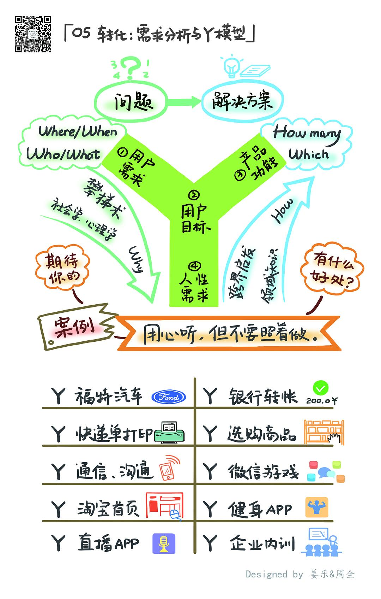
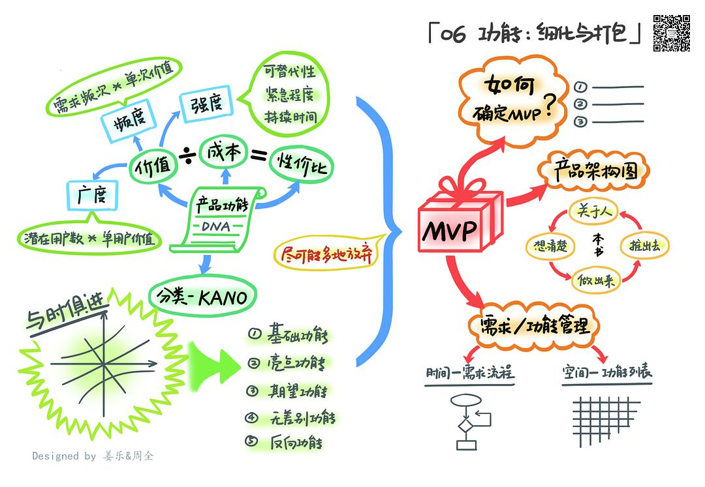
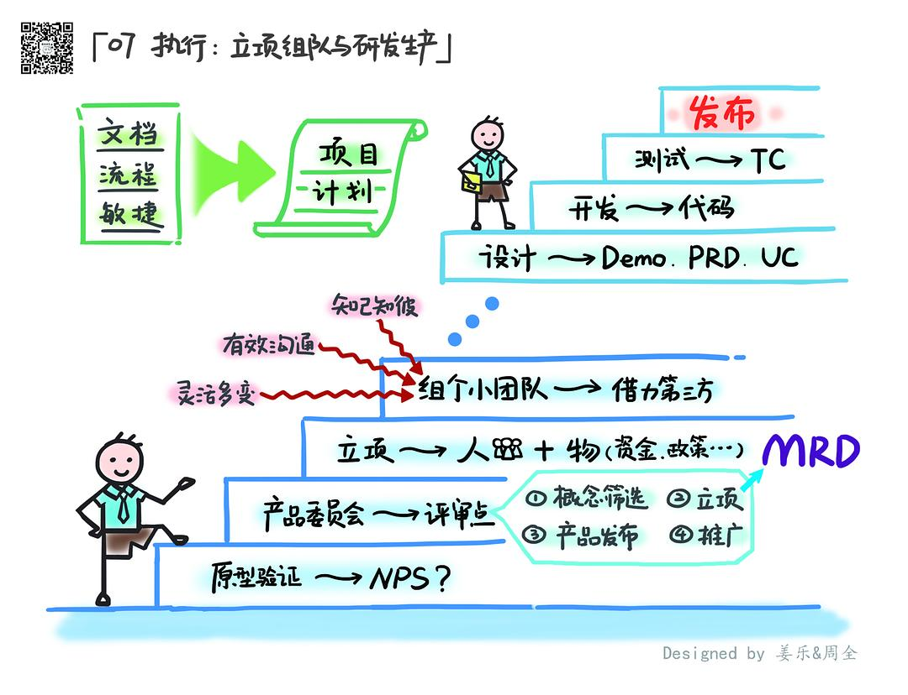
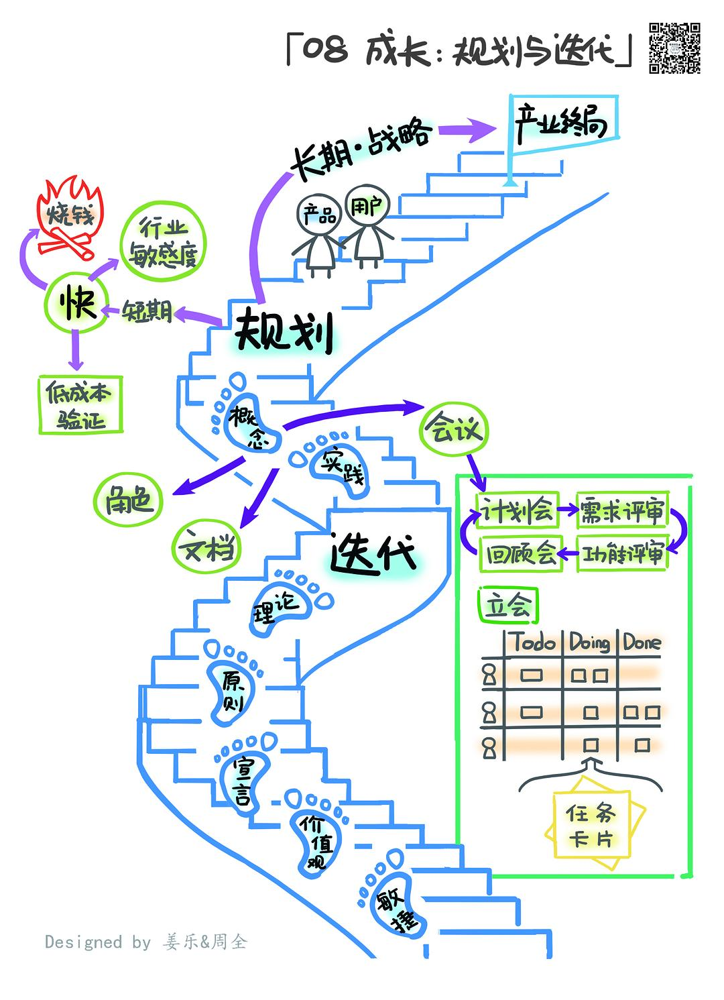
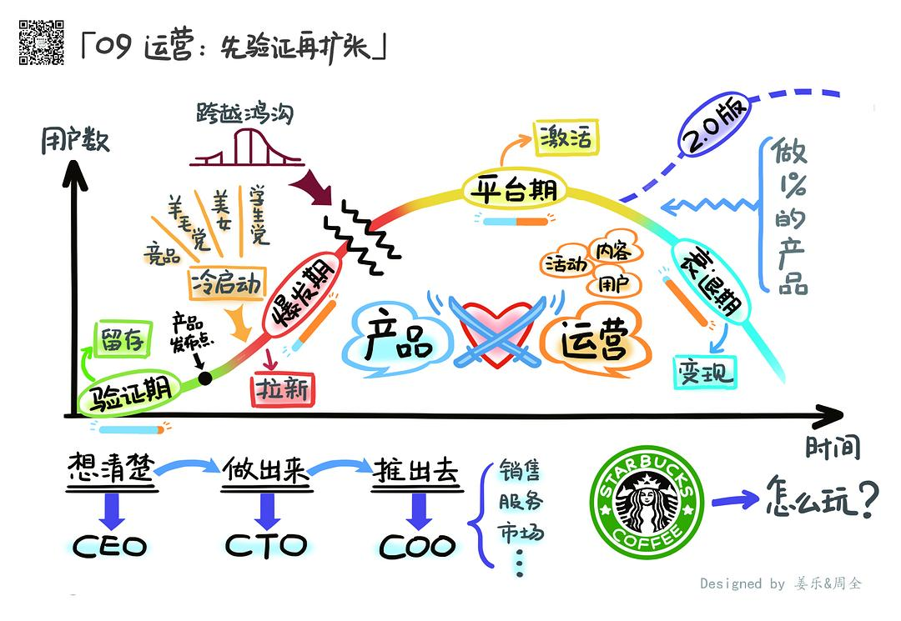
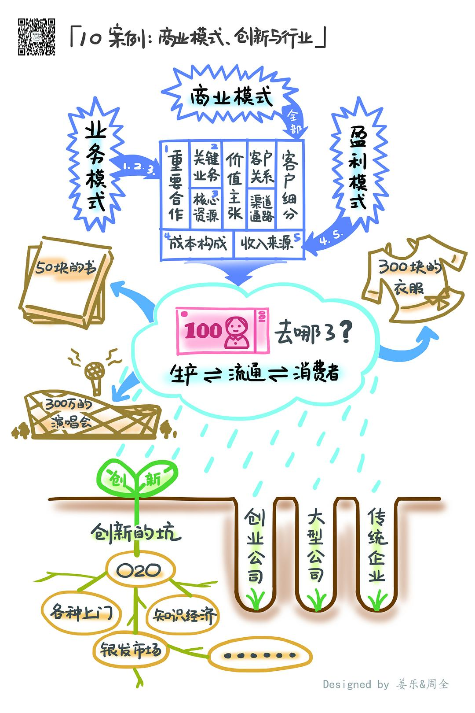
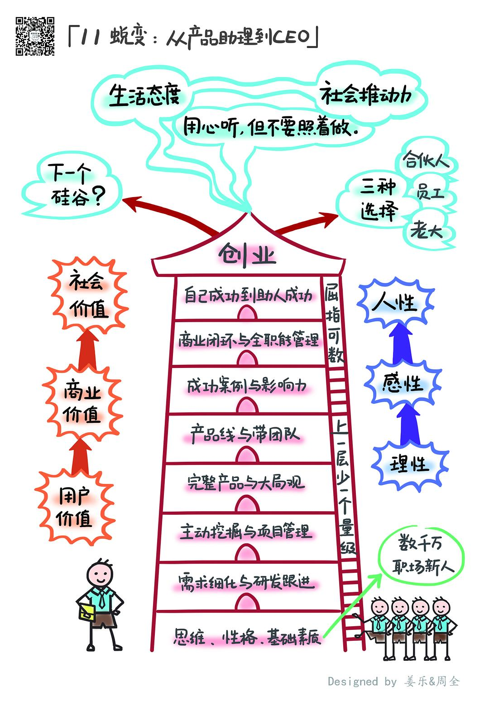

## 0x02 未完待续
