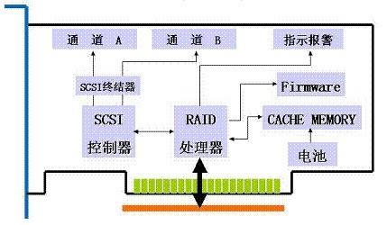

## 0x00 启示

> 服务器在远程机房托管，如果更改 raid level 需要通知机房运维人员下工单重做，时间周期不确定；听朋友介绍了该软件，通过软件对 LSI Raid 卡重新配置 Raid；
> 本文部分网路百家饭，最后有一部分关于实操的信息
> 道路千万条，此路最艰险；一旦操作失误会导致数据永久性丢失。

## 0x01 磁盘

### IO 操作

- 读写 IO(Read/Write IO) 操作
- 单个 IO 操作
- 随机访问 (Random Access) 与连续访问 (Sequential Access)
- 顺序 IO 模式 (Queue Mode)/ 并发 IO 模式 (Burst Mode)
- 单个 IO 的大小 (IO Chunk Size)

### 磁盘指标

- IOPS (IO per Second)
- IO 响应时间 (IO Response Time)
- 传输速度 (Transfer Rate)/ 吞吐率 (Throughput)

## 0x02 RAID 必知必会

RAID(Redundant Array Of Inexpensive Disks) 卡就是用来实现 RAID 功能的板卡，通常是由 I/O 处理器、硬盘控制器、硬盘连接器和缓存等一系列零组件构成的。不同的 RAID 卡支持的 RAID 功能不同。

- 常见 RAID 等级
  - RAID 0
  - RAID 1
  - RAID 5
  - RAID 6
  - RAID 10 / 01
    - 多个 RAID 0 再次组 RAID 1
    - 两个 RAID 1 再次组 RAID 0
  - RAID 50 / 05
    - 多个 RAID 0 再次组 RAID 5
    - 两个 RAID 5 再次组 RAID 0

RAID 卡可以让很多磁盘驱动器同时传输数据，而这些磁盘驱动器在逻辑上又是一个磁盘驱动器，所以使用 RAID 可以达到单个的磁盘驱动器几倍、几十倍甚至上百倍的速率。

RAID 卡有自己的 CPU，Cache Memory，通过集成或借用主板上的 SCSI 控制器来管理硬盘，可以称之为一个智能化的设备。RAID 卡的分类一般根据集成的 SCSI 控制器来划分。如果没有集成 SCSI 控制器，而是借用主板上的 SCSI 控制器来管理硬盘，则为零通道 RAID 卡。根据 RAID 卡集成的 SCSI 控制器的通道数量，可以分为单通道、双通道、三通道 RAID 卡。还可以按照 SCSI 控制器的标准来划分 RAID 卡的种类，如 Ultra Wide、 Ultra2 Wide、Ultra160 Wide。

作为 RAID 卡的 CPU，通过执行闪存中的 Firmware，控制 SCSI 控制器、Cache Memory 以及指示报警电路，来实现 RAID 卡的功能，运作流程如下：

1. 初始化 RAID 卡寄存器
1. 读取 NVRAM 的上次 RAID 参数，与硬盘实际信息进行比较，显示结果
1. 发送配置提示、响应 HOST 命令进入配置界面
1. 提供配置菜单、将用户提供的 RAID 卡参数、RAID 参数存入 NVRAM
1. 根据 RAID 参数，通过 SCSI 控制器对硬盘进行初始化写操作
1. 完成配置
1. 等待 Host 发出读写操作命令



RAID 卡性能的因素主要有 RAID 卡缓存（CACHE）大小、写策略（WRITE POLICY）、读策略（READ POLICY）、条带的大小（STRIPE SIZE）影响。

### RAID Level 介绍

- RAID0

　　RAID0 将数据条带化 (striping) 将连续的数据分散在多个磁盘上进行存取，系统发出的 IO 命令 (不管读 IO 和写 IO 都一样) 就可以在磁盘上被并行的执行，每个磁盘单独执行自己的那一部分请求，这样的并行的 IO 操作能大大的增强整个存储系统的性能。假设一个 RAID0 阵列有 n(n>=2) 个磁盘组成，每个磁盘的随机读写的 IO 能力都达到 140 的话，那么整个磁盘阵列的 IO 能力将是 140*n。同时如果在阵列总线的传输能力允许的话 RAID0 的吞吐率也将是单个磁盘的 n 倍。

- RAID1

　　RAID1 在容量上相当于是将两个磁盘合并成一个磁盘来使用了，互为镜像的两个磁盘里面保存的数据是完全一样的，因此在并行读取的时候速度将是 n 个磁盘速度的总和，但是写入就不一样了，每次写入都必须同时写入到两个磁盘中，因此写入速度只有 n/2。

- RAID5

　　我们那一个有 n(n>=3) 个磁盘的 RAID5 阵列来看，首先看看 RAID5 阵列的读 IO，RAID5 是支持并行 IO 的，而磁盘上的数据呈条带状的分布在所有的磁盘上，因此读 IO 的速度相当于所有磁盘速度的总和。不过这是在没有磁盘损坏的情况下，当有一个磁盘故障的时候读取速度也是会下降的，因为中间需要花时间来计算丢失磁盘上面的数据。

　　读取数据的情况相对就要复杂的多了，先来看下 RAID5 奇偶校验数据写入的过程，我们把写入的数据称为 D1，当磁盘拿到一个写 IO 的命令的时候，它首先会读取一次要入的地址的数据块中修改之前的数据 D0，然后再读取到当前条带中的校验信息 P0，接下来就根据 D0，P0，D1 这三组数据计算出数据写入之后的条带的奇偶校验信息 P1，最后发出两个写 IO 的命令，一个写入 D1，另一个写入奇偶校验信息 P1。可以看出阵列在实际操作的时候需要读、读、写、写一共 4 个 IO 才能完成一次写 IO 操作，也就是实际上的写入速度只有所有磁盘速度总和的 1/4。从这点可以看出 RAID5 是非常不适合用在要大批量写入数据的系统上的。

- RAID6

　　RAID6 和 RAID5 很类似，差别就在于 RAID6 多了一个用于校验的磁盘。就写 IO 速度上来说这两个是完全一样的，都是所有磁盘 IO 速度的总和。

　　在写 IO 上也很是类似，不同的是 RAID 将一个命令分成了三次读、三次写一共 6 次 IO 命令才能完成，也就是 RAID6 实际写入磁盘的速度是全部磁盘速度之和的 1/6。可以看出从写 IO 看 RAID6 比 RAID5 差别是很大的。

- RAID10

　　RAID0 读写速度都很好，却没有冗余保护; RAID5 和 RAID6 都有同样的毛病就是写入的时候慢，读取的时候快。那么 RAID1 呢? 嗯，这里要说的就是 RAID1，其实不管是 RAID10 还是 RAID01，其实都是组合大于 2 块磁盘时候的 RAID1，当先镜像后条带时候就称为 RAID10，先条带后镜像的时候称为 RAID01。从性能上看 RAID01 和 RAID10 都是一样的，都是 RAID1 嘛，但是 RAID10 在重建故障磁盘的时候性能比 RAID01 要快。

　　因为 RAID10 其实就是 RAID1，所以它的性能与 RAID1 也就是一样的了，这里不需要再做过多的讨论。

### RAID Cache 策略

作为缓存，Cache 的作用具体体现在读与写两个不同的方面：

作为写，一般存储阵列只要求数据写到 Cache 就算完成了写操作，当写 Cache 的数据积累到一定程度，阵列才把数据刷到磁盘，可以实现批量的写入。所以，阵列的写是非常快速的。至于 Cache 数据的保护，一般都依赖于镜像 (RAID 0 除外) 与电池 (或者是 UPS)。

Cache 在读数据方面的作用一样不可忽视，因为如果所需要读取的数据能在 Cache 中命中的话，将大大减少磁盘寻道所需要的时间

- 查看缓存策略
  - 查看 RAID 卡缓存大小 (缓存为 0 可直接跳过此部分)
    - `megacli adpAllInfo aAll | grep "Memory Size"`

  ```bash
  [root@jeff MegaCli]# megacli adpAllInfo aAll | grep "Memory Size"
  Memory Size      : 1024MB
  ```

  - 查看默认缓存策略
    - `megacli -cfgdsply -aALL |grep Policy`

  ```bash
  [root@jeff MegaCli]# megacli -cfgdsply -aALL |grep Policy

  Default Cache Policy: WriteBack, ReadAhead, Direct, No Write Cache if Bad BBU
  Current Cache Policy: WriteBack, ReadAhead, Direct, No Write Cache if Bad BBU
  Default Access Policy: Read/Write
  Current Access Policy: Read/Write
  ```

  - 修改 RAID Cache 策略
    - megacli -LDSetProp 指定策略 指定逻辑设备
    - `megacli -LDSetProp [-WB|-WT|-NoCachedBadBBU|-CachedBadBBU|-NORA|-RA|-ADRA|-Cached|-Direct ] [-Lall -aAll|-L0 -a0]`
    - 如： `megacli -LDSetProp -WT -Lall -aAll` 修改全部逻辑设备  or `megacli -LDSetProp -WT -L0 -a0` 修改第一个逻辑设备

- 写策略
  - Write Through：系统的写磁盘操作并不利用阵列卡的 Cache，而是直接与磁盘进行数据的交互
  - Write Back：利用阵列 Cache 作为系统与磁盘间的中间人，系统先将数据交给 Cache，然后再由 Cache 将数据传给磁盘，可提高写入性能
  - Write Back with BBU：此是阵列卡配有 Battery Backup 模块元时的可选项；它的作用是用以在系统断电时保护 Cache 中的数据，避免断电造成中间数据的丢失

- 读策略
  - ReadAheadNone： 关闭预读；不使用缓存
  - ReadAhead： 预读模式；预先把后面顺序的数据载入 raid 卡缓存，在顺序读的环境中能提供很好的性能，但是在随机读的环境中反而降低读的性能（适合文件系统，不适合数据库系统）
  - ReadAdaptive： 自适应预读模式；在缓存和 I/O 空闲时选择预读，默认策略

- Cache 策略: (与读策略不冲突)
  - Direct：读操作不缓存到 RAID 卡缓存 (默认模式，一般性能比 Cached 好)
  - Cached：读操作缓存到 RAID 卡缓存。

- BBU 策略：(BBU(电池) 出现问题是否启用 Write Cache )
  - Write Cache OK if Bad BBU：BBU 出现问题仍启用 Write Cache, 这种配置是非常不安全的，除非是有 UPS 或者双电源的情况下
  - No Write Cache if Bad BBU：BBU 出现问题不使用 Write Cache，从 WriteBack 自动切换到 WriteThrough，默认配置

### RAID BBU 电池

用以在系统断电时保护 Cache 中的数据，避免断电造成中间数据的丢失；

那在更换 RAID 卡电池之前，服务器虽然已经下线，无数据写入，但还有一部分数据存在 RAID Cache 中，并未写入硬盘中；但一般 RAID 卡电池坏掉后，RAID 卡会自动将写缓存（即 write back）禁止，变为 write through 方式，会使写性能有一定的下降，但不影响数据安全

若 RAID 电池和某块硬盘同时出现故障，应先更换 RAID 卡电池，待服务器重启成功，RAID 卡工作正常后再更换故障的硬盘，最大限度保证数据安全

- 查看 RAID 电池状态信息
  - `megacli -AdpBbuCmd -GetBbuStatus -aAll`

  ```bash
  BBU status for Adapter: 0

  BatteryType: CVPM03
  Voltage: 9433 mV
  Current: 0 mA
  Temperature: 24 C
  Battery State: Optimal
  BBU Firmware Status:

    Charging Status              : None
    Voltage                                 : OK
    Temperature                             : OK
    Learn Cycle Requested                   : No
    Learn Cycle Active                      : No
    Learn Cycle Status                      : OK
    Learn Cycle Timeout                     : No
    I2c Errors Detected                     : No
    Battery Pack Missing                    : No
    Battery Replacement required            : No
    Remaining Capacity Low                  : No
    Periodic Learn Required                 : No
    Transparent Learn                       : No
    No space to cache offload               : No
    Pack is about to fail & should be replaced : No
    Cache Offload premium feature required  : No
    Module microcode update required        : No

  BBU GasGauge Status: 0x6bf0
    Pack energy             : 240 J
    Capacitance             : 107
    Remaining reserve space : 0


  Exit Code: 0x00
  ```

- 显示 BBU 所有信息
  - `megacli -AdpBbuCmd -aAll`
- 显示 BBU 容量信息
  - `megacli -AdpBbuCmd -GetBbuCapacityInfo –aALL`
- 显示 BBU 设计参数
  - `megacli -AdpBbuCmd -GetBbuDesignInfo –aALL`
- 显示当前 BBU 属性
  - `megacli -AdpBbuCmd -GetBbuProperties –aALL`
- 查看充电进度状态
  - `megacli -AdpBbuCmd -GetBbuStatus -aALL |grep "Relative State of Charge"`
  - `megacli -AdpBbuCmd -GetBbuStatus -aALL |grep "Charger Status"`

## 0x02 MegaCli Software

### MegaCli Install

- 下载 MegaCli
  - [www.lsi.co](http://www.lsi.com/support/Pages/download-results.aspx?keyword=MegaCLI)

- 安装 MegaCli

  - `rpm -ivh Lib_Utils-1.00-09.noarch.rpm`
  - `rpm -ivh MegaCli-8.07.14-1.noarch.rpm`

- 安装完成后，产生以下文件夹，文件夹内有日志信息和可执行命令

  - `/opt/MegaRAID/MegaCli/`

- 建立命令软链接

  - `ln -s /opt/MegaRAID/MegaCli/MegaCli64 /usr/bin/megacli`

### MegaCli 重组 RAID

> 物理机有 12 块 300G 的 SAS 磁盘；前两块磁盘组成 RAID 1 作为系统盘，后面 10 块盘默认为单盘 RAID0；等同磁盘直接挂载到系统，现在要将最后 10 块盘重新做成 RAID 50，在系统中识别成 2T 大小的逻辑磁盘

- 查看状态
  - `megacli -LdInfo -LALL -aAll`

  ```bash
  Adapter 0 -- Virtual Drive Information:
  Virtual Drive: 0 (Target Id: 0)
  Name                :
  RAID Level          : Primary-1, Secondary-0, RAID Level Qualifier-0
  Size                : 278.875 GB
  Sector Size         : 512
  Is VD emulated      : No
  Mirror Data         : 278.875 GB
  State               : Optimal
  Strip Size          : 64 KB
  Number Of Drives    : 2
  Span Depth          : 1
  Default Cache Policy: WriteBack, ReadAhead, Direct, No Write Cache if Bad BBU
  Current Cache Policy: WriteBack, ReadAhead, Direct, No Write Cache if Bad BBU
  Default Access Policy: Read/Write
  Current Access Policy: Read/Write
  Disk Cache Policy   : Disk's Default
  Encryption Type     : None
  Bad Blocks Exist: No
  PI type: No PI

  Is VD Cached: No

  。。。 。。。


  Virtual Drive: 12 (Target Id: 12)
  Name                :
  RAID Level          : Primary-0, Secondary-0, RAID Level Qualifier-0
  Size                : 278.875 GB
  Sector Size         : 512
  Is VD emulated      : No
  Parity Size         : 0
  State               : Optimal
  Strip Size          : 256 KB
  Number Of Drives    : 1
  Span Depth          : 1
  Default Cache Policy: WriteBack, ReadAhead, Cached, Write Cache OK if Bad BBU
  Current Cache Policy: WriteBack, ReadAhead, Cached, Write Cache OK if Bad BBU
  Default Access Policy: Read/Write
  Current Access Policy: Read/Write
  Disk Cache Policy   : Disk's Default
  Encryption Type     : None
  Bad Blocks Exist: No
  PI type: No PI

  Is VD Cached: No

  ```

- 删掉已有 RAID 0
  - 其中 L1 替换数字 1..10，一直到这些单盘 RAID 0 删干净
  - `megacli -cfglddel -L1 -a0`
  - `megacli -cfglddel -L2 -a0`
  - `megacli -cfglddel -L3 -a0`
  - `megacli -cfglddel -L4 -a0`
  - `megacli -cfglddel -L5 -a0`
  - `megacli -cfglddel -L6 -a0`
  - `megacli -cfglddel -L7 -a0`
  - `megacli -cfglddel -L8 -a0`
  - `megacli -cfglddel -L9 -a0`
  - `megacli -cfglddel -L10 -a0`

- 创建 raid 50
  - megacli -CfgSpanAdd -r50 -Array0[8:2,8:3,8:4,8:5,8:6] Array1[8:7,8:8,8:9,8:10,8:11] WB RA Direct CachedBadBBU -a0
    - `-Array0[8:2,8:3,8:4,8:5,8:6]` 为每块物理磁盘标识符
      - 磁盘标识符通过该命令获取 `megacli -PDlist -aall | grep -e '^Enclosure Device ID:' -e '^Slot Number:'`
    - `-Hsp[8:12]` 添加该参数可指定为热备盘

- 查看阵列后台初始化进度
  - `megacli -LDBI -ShowProg -LALL -aALL`

  ```bash
  [root@jeff ]# megacli -LDBI -ShowProg -LALL -aALL

  Background Initialization on VD #0 is not in Progress.
  Background Initialization on VD #1 is not in Progress.
  Background Initialization on VD #2 is not in Progress.
  Background Initialization on VD #3 is not in Progress.
  Background Initialization on VD #4 is not in Progress.
  Background Initialization on VD #5 is not in Progress.
  Background Initialization on VD #6 is not in Progress.
  Background Initialization on VD #7 is not in Progress.
  Background Initialization on VD #8 is not in Progress.
  Background Initialization on VD #9 is not in Progress.
  Background Initialization on VD #10 is not in Progress.
  ```

  - 动态可视化文字界面显示初始化进度
    - `megacli -LDBI -ProgDsply -LALL -aALL`
  - 查看某个物理磁盘重建进度
    - `megacli -PDRbld -ShowProg -PhysDrv [8:5] -a0`
  - 以动态可视化文字界面显示物理磁盘重建进度
    - `megacli -PDRbld -ProgDsply -PhysDrv [8:5] -a0`

- 查看 cc 校验计划
  - megacli -adpccsched -info -a0

  ```bash
  [root@jeff ]# megacli -adpccsched -info -a0

  Adapter #0

  Operation Mode: Concurrent
  Execution Delay: 168
  Next start time: 05/26/2018, 03:00:00
  Current State: Stopped
  Number of iterations: 109
  Number of VD completed: 1
  Excluded VDs          : None
  Exit Code: 0x00
  ```

- cc 校验进度
  - megacli -ldcc -progdsply -L1 -a0

- 快速初始化
  - megacli -LDInit -start –L1  -a0

- 查看当前所有 RAID 信息

  ```bash
  [root@jeff ~]# megacli -LDInfo -LALL -aALL

  Adapter 0 -- Virtual Drive Information:
  Virtual Drive: 0 (Target Id: 0)
  Name                :
  RAID Level          : Primary-1, Secondary-0, RAID Level Qualifier-0
  Size                : 278.875 GB
  Sector Size         : 512
  Is VD emulated      : No
  Mirror Data         : 278.875 GB
  State               : Optimal
  Strip Size          : 64 KB
  Number Of Drives    : 2
  Span Depth          : 1
  Default Cache Policy: WriteBack, ReadAhead, Direct, No Write Cache if Bad BBU
  Current Cache Policy: WriteBack, ReadAhead, Direct, No Write Cache if Bad BBU
  Default Access Policy: Read/Write
  Current Access Policy: Read/Write
  Disk Cache Policy   : Disk's Default
  Encryption Type     : None
  Bad Blocks Exist: No
  PI type: No PI

  Is VD Cached: No


  Virtual Drive: 1 (Target Id: 1)
  Name                :
  RAID Level          : Primary-5, Secondary-0, RAID Level Qualifier-3
  Size                : 2.178 TB
  Sector Size         : 512
  Is VD emulated      : No
  Parity Size         : 557.75 GB
  State               : Optimal
  Strip Size          : 64 KB
  Number Of Drives per span:5
  Span Depth          : 2
  Default Cache Policy: WriteBack, ReadAhead, Direct, No Write Cache if Bad BBU
  Current Cache Policy: WriteBack, ReadAhead, Direct, No Write Cache if Bad BBU
  Default Access Policy: Read/Write
  Current Access Policy: Read/Write
  Disk Cache Policy   : Disk's Default
  Encryption Type     : None
  Bad Blocks Exist: No
  PI type: No PI

  Is VD Cached: No

  ```

- 获取磁盘标识符
  - `megacli -PDlist -aall | grep -e '^Enclosure Device ID:' -e '^Slot Number:'`

  ```bash
  Enclosure Device ID: 8
  Enclosure position: 1
  Enclosure Device ID: 8
  Enclosure position: 1
  Enclosure Device ID: 8
  Enclosure position: 1
  Enclosure Device ID: 8
  Enclosure position: 1
  Enclosure Device ID: 8
  Enclosure position: 1
  Enclosure Device ID: 8
  Enclosure position: 1
  Enclosure Device ID: 8
  Enclosure position: 1
  Enclosure Device ID: 8
  Enclosure position: 1
  Enclosure Device ID: 8
  Enclosure position: 1
  Enclosure Device ID: 8
  Enclosure position: 1
  Enclosure Device ID: 8
  Enclosure position: 1
  Enclosure Device ID: 8
  Enclosure position: 1
  ```

### 磁盘缓存策略

- 查看逻辑磁盘缓存策略
  - `megacli -LDGetProp -Cache -LALL -aALL`

  `Adapter 0-VD 1(target id: 1): Cache Policy:WriteBack, ReadAhead, Direct, No Write Cache if bad BBU`

- 默认逻辑磁盘缓存策略
  - 写策略：回写 (WriteBack)
  - 读取策略：自适应 (ReadAhead)
  - 磁盘高速缓存策略：禁用 (Direct)
  - BBU 出现问题不使用 Write Cache (No Write Cache if bad BBU)

### 相关命令

| 命令 | 解释
|------ | -------
| `megacli -AdpGetTime –aALL` | 显示适配器时间 |
| `megacli -adpCount` | 显示 RAID 卡数量
| `megacli -AdpAllInfo -aAll` | 显示 RAID 卡信息
| `megacli -FwTermLog -Dsply -aALL` | 查看 raid 卡日志
| `megacli -PDList -aALL` | 显示当前所有物理设备信息
| `megacli -LDInfo -LALL –aAll` | 显示当前所有逻辑设备信息
| `megacli -cfgdsply -aALL` | 显示 Raid 卡型号，Raid 设置，Disk 相关信息
| `megacli -LdPdInfo -aAll -NoLog` | 不懂
| `megacli -DiscardPreservedCache -Lall -a0 -NoLOG` | 清空所有的缓存
| `megacli -LDInit -ShowProg -LALL -aALL` | 查看初始化同步块的过程
| `megacli -LDBI -ShowProg -LALL -aALL`  | 查看阵列后台初始化进度
| `megacli -LDBI -ProgDsply -LALL -aALL` | 动态可视化文字界面显示初始化进度
| `megacli -PDRbld -ShowProg -PhysDrv [8:5] -a0`  | 查看某个物理磁盘重建进度
| `megacli -PDRbld -ProgDsply -PhysDrv [8:5] -a0` | 以动态可视化文字界面显示物理磁盘重建进度
| `megacli -CfgLdDel -L5 -a0` | 删除 RAID 阵列
| `megacli -PDHSP -Set [-EnclAffinity] [-nonRevertible] -PhysDrv[32:5] -a0` | 指定第 5 块盘作为全局热备
| `megacli -PDHSP -Set [-Dedicated [-Array1]] [-EnclAffinity] [-nonRevertible] -PhysDrv[32:5] -a0` | 指定为某个阵列的专用热备
| `megacli -PDHSP -Rmv -PhysDrv[32:5] -a0` | 删除全局热备
| `megacli -PDOnline -PhysDrv [32:4] -a0` | 将某块物理盘上线
| `megacli -PDOffline -PhysDrv [32:4] -a0` | 将某块物理盘下线
| `megacli -pdgetmissing -a0` | 查看raid陈列中掉线的硬盘
| `megacli -LDInit  -start –L0  -a0` | 快速初始化
| `megacli -LDInit  -start  -full –L0 -a0` | 完全初始化
| `megacli -LDInit  -progdsply -L0 -a0` | 显示初始化的进度
| `megacli -LDInit  -abort  -L0  -a0` | 结束完全初始化
| `megacli -AdpBbuCmd -BbuLearn a0` | 手动充电
| `megacli -AdpBbuCmd -GetBbuStatus -aALL` | 查看充电状态
| `megacli -AdpBbuCmd -GetBbuStatus -aALL` | 查看充电进度百分比
| `megacli -FwTermLog dsply -a0 > /tmp/Megacli.log` | 查看 Megacli log

## 0x04 FAQ

### 文档引用

- [MegaCLI 工具的使用](http://www.51niux.com/?id=77) # 在线创建raid阵列，删除阵列，查看进度

### 大缓存的 RAID 卡

- 缓存替换策略也能影响缓存大小的选择：如果某个缓存替换策略足够优秀，跟其他缓存策略相比，即使缓存很小，依然能够维持较高的缓存命中率，达到更好的性能；

- 跟缓存策略也有关：如果是写透缓存，对于写请求来说，其实缓存是起不到加速性能的作用，且如果写请求相对于读请求很多，那么相当于实际上还是直接写磁盘了，如果读请求与写请求无关，那缓存的写数据基本上也没意义了；如果是写回缓存，那么缓存越大就能存储更多的写入数据，这些数据在满足一定的条件 (如时间超过某个阈值、缓存替换算法选择将其换出等) 才写到磁盘，增加了写合并的可能，可以提升性能；

- 跟 IO 请求的特征也有关：因为实际上对操作系统来说，一般 OS 对写都是异步的，而对读则是同步的，实际上真正导致 IO 性能的瓶颈是 OS 对读请求的响应能力。如果读请求没有规律，且也没有部分数据频繁读取的情况，那么大缓存与小缓存的性能其实差别不大（当然，你要是选择一个基本跟底层存储磁盘一样大的缓存那就另当别论了）。实际上，如果读取的数据具有空间和时间的局部性规律或者写入时缓存的策略是写回且写入的数据在不久的将来就会访问到，那么的确是缓存越大越好，但是如果应用不具备这样的特性，那么选择一个相对于底层存储磁盘来说大小有限的缓存实际上也没办法带来性能的显著提升。

总体来说，实际上是应用的 IO 特性决定了最合适的缓存大小。

### PCIE 磁盘与 RAID

- PCIE 磁盘读写不经过 RAID 卡，无法通过 megacli 组 RAID

```bash
[root@jeff ~]# modinfo nvme

filename:       /lib/modules/3.10.0-327.el7.x86_64/kernel/drivers/block/nvme.ko
version:        1.0
license:        GPL
author:         Matthew Wilcox <willy@linux.intel.com>
rhelversion:    7.2
srcversion:     71E0CF0D222671148201A53
alias:          pci:v*d*sv*sd*bc01sc08i02*
depends:
intree:         Y
vermagic:       3.10.0-327.el7.x86_64 SMP mod_unload modversions
signer:         CentOS Linux kernel signing key
sig_key:        79:AD:88:6A:11:3C:A0:22:35:26:33:6C:0F:82:5B:8A:94:29:6A:B3
sig_hashalgo:   sha256
parm:           admin_timeout:timeout in seconds for admin commands (byte)
parm:           io_timeout:timeout in seconds for I/O (byte)
parm:           shutdown_timeout:timeout in seconds for controller shutdown (byte)
parm:           nvme_major:int
parm:           nvme_char_major:int
parm:           use_threaded_interrupts:int
```
