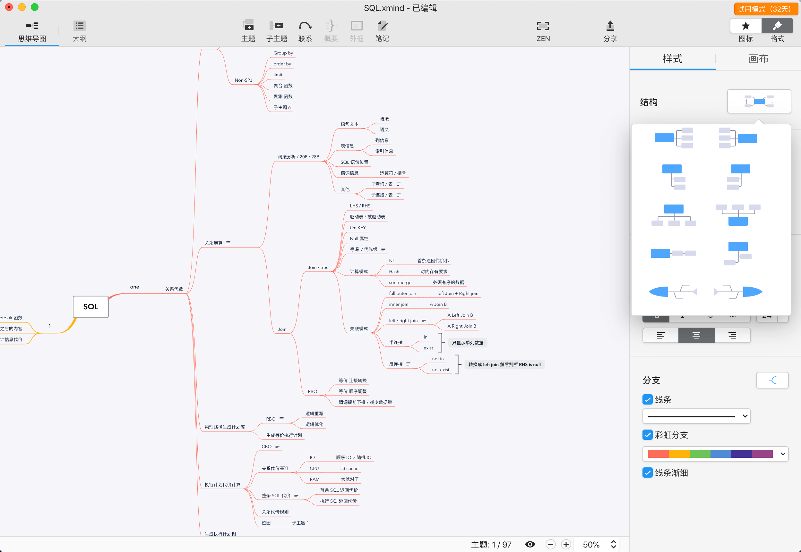

## 0x00 云

业界大佬介绍一款高大上工具用于学习新的知识点 - mindmap / 思维导图。连续在各种场景用了几年，所以聊聊这玩意的看法（仅供参考）  
这玩意当初查百度百科了解后，感觉就是 `神兵在手、天下我有`；复制一段内容如下：  

> 思维导图，英文是The Mind Map，又叫心智导图，是表达发散性思维的有效图形思维工具；由 东尼·博赞（Tony Buzan）建立该体系  
> 思维导图运用图文并重的技巧，把各级主题的关系用相互隶属与相关的层级图表现出来，把主题关键词与图像、颜色等建立记忆链接。思维导图充分运用左右脑的机能，利用记忆、阅读、思维的规律，协助人们在科学与艺术、逻辑与想象之间平衡发展，从而开启人类大脑的无限潜能。思维导图因此具有人类思维的强大功能  
> 思维导图已经在全球范围得到广泛应用，新加坡教育部将思维导图列为小学必修科目，大量的500强企业也在学习思维导图，中国应用思维导图也有20多年时间了  

用了几年之后的感觉就是：这神兵建立在你对该事物已经充分了解和经历之后，用于串联这些关键帧信息。一旦想把 mindmap 直接给其他人用于速成时就极容易产生冲突。每个人读书看报吃经验的方式总有些差别，mindmap 更多就是一书本的大纲，光看大纲怎么可能学习到重要只是呢？  
用于学习整理下知识点还是蛮好玩的过程、也能帮助一部分复习（同时也会让你偷懒和放弃一部分东西，这玩意只能是笔记里的一部分，比如[大纲视图]）  

## 0x01 雨

市场上相关软件挺多的，这几年来回折腾过 xmind6、freemind、百度脑图（在线版）、mind manager，以及几款不咋出名的软件。不同软体各有风骚，尤其是百度脑图这个网页在线版可以做团队协作，mind manager 可以做超级大的项目管理。  

### mind manager

刚开始学习 mindmap 时，无脑选择最贵的、功能最庞大的就是自己所想要的方式，找到了 mind manager 这款软件，官网是 `https://www.mindjet.com/mindmanager/`，这软件由~~苏州思杰马丁~~公司做中国总代理，两个官网风格相差很大。当时用这款软件时电脑还是 windows 7 sp1 ，台式机 i5、8G 内存、7.2k 磁盘，每次运行的时候电脑先狂飙 30s 到 3m ；功能强大到木有朋友，无缝链接 windoes Office 全家桶、大量的精美图标、高端甘特图（当时第一次接触甘特图）、各种脑图结构样式等等等等高大上玩法。  
然就是吃电脑配置，用这软体做个不到 100 关键帧的 mindmap 等同于 *杀鸡焉用牛刀* 了。图片和视频就不放了，可以去官网或者 B 站学习下。  

### 百度脑图

百度脑图是个网页版 mindmap 工具，必须要有百度网盘或者百度账号，网站 `https://naotu.baidu.com/`，并且这个产品是在 Github 上开源的；2015 年感觉这也是个神器，当时围绕我的有办公外网、个人家用、游戏台式等多台电脑，如果做个脑图来回传来传去早就乱掉了。百度脑图将数据存储在百度网盘，通过在线方式直接 mindmap，还可以导入或导出 mxind、freemind 数据文件。  
当时有个问题：如果真的是多个人同时编辑同一个 mindmap 时，有比较大的几率出现操作失效或者不在预期内的现象。用了一段时间之后换了个方式代替掉了百度脑图。  

### xmind

目前最常用的就是 xmind ，有免费版也有订阅版、单版本终身版。xmind 2018 - 2019 也由~~苏州思杰马丁~~公司做中国总代理，那是 xmind 最黑暗时代（各种套马甲、强制防破解、功能相比官方免费版差异待遇）；前前后后计算这是使用时间最长的 mindmap 软件。  
之前用 xmind6、7、8 三个版本，到近期使用 xmind zen 版本，zen 启动速度和颜值上比之前版本好太多。功能还是以前那些没有增加或减少，如果想体验可官方下载个免费版安装下。  

## 0x02 风

xmind 2019 出了 xmind zen ，本文按照 xmind zen 方式记录的。经常使用的 xind 的默认功能、甘特图、导出 SVG PNG 分享功能；其中导出 SVG 、甘特图是付费版才可以用的（完全抓不到 xmind 付费版和免费版的差异化，）；使用上算是轻度用户；一年十几张图的制作量，内容结构不是特别复杂（此时体现出 xmind 比 mindmanager 好的地方，mind manager 功能庞大启动资源也大，适合专业高端用户使用）。  

Xmind 官网是 `https://www.xmind.net/zen/` ，不用再找其他中文版官网了，因为官网支持中文了。官网上的功能介绍已经很详细了，不在复制粘贴了。  

介绍下整体界面，常用这种中心顺时针围绕样式结构，从一个主题开始发散式扩展；偶尔会根据项目需求使用鱼骨图或时序这种目的导向型的架构图。  
下面这个信息是记录之前阅读一本 PGSQL 书籍的 mindmap，纯堆砌了许多的关键词和链接功能，没有使用关键词上的备注功能（坏处就是书籍如果借给别人了，时间一长就找不到这到底是说的啥了）。  

- 中心节点（ xmind 可以导入 markdown 内容生成 mindmap，反之亦然）
  - 结构图
    - 默认中心围绕事件图
    - 起点、终点式鱼骨、时序图
    - 上下平面扩展图
    - 高级图
      - 表格图，类似 excel
      - smart 图，类 UML 流程图（xmind 不支持）
  - 基本功能
    - N 级子节点，不建议超过 6 级；mindmap 是平面设计架构，如果纵深太多不易管理同时不美观
    - 节点链接：远距离不相连的节点互相链接，体现节点之间的跳跃、依赖关系
    - 节点概要：将多个相邻节点打包，比如管理项目或者产品功能时，打包放在一起加重其关系
    - 节点备注：将大段大段的内容放到一个次元空间，这样 mindmap 可以保持美美哒
    - 节点外框：与概要类似，需要相邻节点，用于加重节点关系区域
    - 其他
      - 链接：外部网址或者当前项目下不同画布之间的瞄链接
      - 下钻：当前某子节点内容复杂，可以将子节点作为一个新的中心节点进行编辑，也可以转换为第二张完整画布
  - 高级功能
    - 甘特图：用于管理、绘制项目关系、项目管理、人工消耗等信息
    - 导入导出：支持 jpg、png、svg、excel、word、text 等
    - 大纲视图：类似 word 大纲视图，将内容按照 标题、子标题、内容（备注）方式输出
  - 美化
    - 画布：修改当前 mindmap 风格，比如线条、线框、
    - 图标：用于加强节点美化和语气感

### KM=(P+K)^s

> Personal Knowledge Management(PKM，个人知识管理) ，通过多种流程架构归类学习、细化姿势点，比如 5s、5why、头脑风暴、smart 等架构体考虑分析问题，主要是*数据收集过程、分析过程、归类总结*等几个过程；最后通过 xmind 、PPT 等工具展示出来。  

## 0x03 雪

> xmind 能用上的付费功能就是上文说的导出 SVG 、甘特图 还有 zen 模式，为了这几个频率使用不是很高的东西买个付费版，各位老板见仁见智吧；之前刷某站学习到一个场景：如果频繁使用某个物件且能为之付出一些预期内的费用来降低自己去维护这个物件的时间，那么这个东西就是便宜的，反之亦然。  
> xmind 不是用于做详细的书本笔记工具，ios + mac os 有一款结合 note + mindmap 的软件 - [marginNote](https://www.marginnote.com/)（付费软体）；如果平常需要把阅读电子版的论文、书籍、视频等资料记录整理成笔记， marginnote 可以把视频时间线记录文字笔记、ocr 快速识别图片、PDF 关联标注汇总到一起，然后做成一个非常详细丰富的笔记本。具体可刷下 B 站一些视频。付费按年或版本购买，价格 200 - 300 。  

