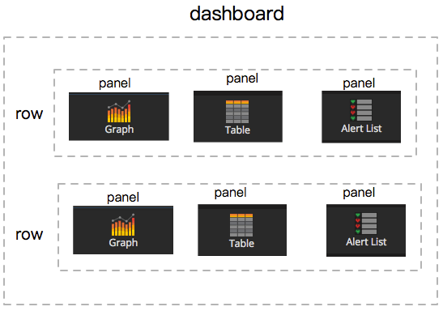

## 0x00 背影

> 通过本篇文档学习 TiDB 集群监控架构 (默认按照 TiDB-ansible 部署为准)
> 本篇文档按照 2019 年中 TiDB-ansible master branch 描述；区别在于是否有 pushgateway 组件 (端口 9091)
> 以下文档（百家饭+机器译文）部分区域 ⚠️ 无法直视

## 0x01 介绍

> TiDB 使用开源时序数据库 Prometheus 组件存放监控数据
> 使用开源数据图形可视化工具 Grafana 做数据展示
> 接下来让我们看下该套监控是如何运作得……

### 监控流程

- v1.0 监控数据工作流程 ⬆️
  - Node exporter 收集主机资源负载信息
  - Blackbox exporter 根据配置文件信息主动探测目标服务状态
    - 该服务按照配置文件主动向被检测目标探测，目标信息在 Prometheus 配置文件中配置
  - TiDB PD TiKV 通过主动将监控数据推送至 PushGateway
  - Prometheus 通过配置文件指定 PushGateway 、 Node exporter 服务地址，Prometheus 主动获取相关信息并存在 TSDB 数据库内
  - Grafana 添加 Prometheus 数据源，根据 dashboard metric 规则主动向 Prometheus 发起查询请求，然后绘图展示。

- v2.0 监控架构 ⬆️
  - TiKV 添加了 mertics 接口，直接通过 Prometheus pull（主动拉取） TiKV 监控数据，从此省略掉 PushGateway 组件（该组件在性能上跟不上产品集群扩展性）
  - 其他流程与上方类似

### 组件介绍

- [Grafana](https://github.com/grafana/grafana) 监控、度量分析仪表板工具，从 Prometheus 获取数据
- [Prometheus](https://github.com/prometheus/prometheus) 用于存放监控数据的时序数据库
- [Push Gateway](https://github.com/prometheus/pushgateway) push acceptor for ephemeral and batch jobs
- [Black-box](https://github.com/prometheus/blackbox_exporter) 黑盒测试工具，支持 HTTP, HTTPS, DNS, TCP and ICMP
- [Node-export](https://github.com/prometheus/node_exporter) 主机资源 agent 组件

### 监控组件端口

- 第三方监控组件端口

  服务 | 端口 | 组件介绍
  ---|---|-----
  Grafana           | 3000 | 监控数据展示工具
  Prometheus        | 9090 | 支持临时性 Job 主动推送指标的中间网关
  PushGatewagy     | 9091 | 监控数据 push 网关 / TiKV 2.1.5 版本以后支持 pull 方式
  node_exporter     | 9100 | 主机性能收集组件
  blackbox_exporter | 9104 | 黑盒主动探测组件
  mysql_exporter    | 9107 | MySQL 状态监测组件
  kafka_exporter    | 9105 | kafka 状态监测组件

### TiDB 组件端口

- TiDB 服务监控数据端口

  服务 | 默认端口 | 组件介绍
  ---|---|-----
  PD | 2379 | Metrics / 不推荐单机部署多套 PD   访问 http://IP:2379/metrics 可预览当前时间点监控项快照，以下类似
  TiDB | 10080 | Metrics / 单机部署多 TiDB 时，必须指定不同 Metrics 端口  （metrics 端口冲突不会导致组件启动失败，会导致无法暴露监控数据而导致集群监控数据不准确，TiKV 雷同）
  TiKV | 20180 | Metrics / 单机部署多 TiKV 时，必须指定不同 Metrics 端口

## 0x02 Prometheus

> 监控架构分三大部分（TiDB、Prometheus 家族、Grafana），现在看下 Prometheus 家族流程工作

- Prometheus 工作流程
  1. Prometheus server 定期从静态配置的 targets 或者服务发现的 targets 拉取数据。
  2. 当新拉取的数据大于配置内存缓存区的时候，Prometheus 会将数据持久化到磁盘（如果使用 remote storage 将持久化到网络存储）。
  3. Prometheus 可以配置 rules，然后定时查询数据，当条件触发的时候，会将 alert 推送到配置的 Alertmanager。
  4. Alertmanager 收到警告的时候，可以根据配置，聚合，去重，降噪，最后发送告警到目的地。
  5. 可以使用 API， Prometheus Console 或者 Grafana 查询和聚合数据。
- 如果担心高可用，Prometheus & alertmanager 提供高可用服务；如果还担心就增加其他旁路组件监控 Prometheus 家族（没有 100% SLA ）

### Who Prometheus

- 多维数据模型（时序列数据由 metric 名和一组 key/value 组成）
- 在多维度上灵活的查询语言 (PromQl)
- 不依赖分布式存储，单主节点工作.
- 通过基于 HTTP 的 Pull 方式采集时序数据
- 可以通过 Push Gateway 进行时序列数据推送 (pushing)
- 可以通过服务发现或者静态配置去获取要采集的目标服务器
- 多种可视化图表及仪表盘支持

- Pull 方式
  - Prometheus 采集数据是用的 Pull 也就是拉模型, 通过 HTTP 协议去采集指标，只要应用系统能够提供 HTTP 接口就可以接入监控系统，相比于私有协议或二进制协议来说开发简单。

- Push 方式 / 目前暂不推荐使用该方案
  - 对于定时任务这种短周期的指标采集，如果采用 Pull 模式，可能造成任务结束了，Prometheus 还没有来得及采集，这个时候可以使用加一个中转层，客户端推数据到 Push Gateway 缓存一下，由 Prometheus 从 Push Gateway Pull 指标过来。(需要额外搭建 Push Gateway，同时需要在 Prometheus 配置文件新增 job 去 Gateway 采集数据)
  - Push Gateway 性能有限，目前 TiDB-ansible 不支持自动部署多套 Push Gateway

### Why Prometheus

- 相对丰富的 Client 代码库：[Prometheus Client libraries](https://prometheus.io/docs/instrumenting/clientlibs/)
- export 组件，支撑开源市场热门软件服务：[Prometheus export](https://prometheus.io/docs/instrumenting/exporters/)
- 高可用方案相对简洁
  - 远程 S3 数据存储；[官方 blog](https://prometheus.io/blog/2019/10/10/remote-read-meets-streaming/)
  - 部署多套 Prometheus 监控相同的目标，然后配置一些参数（主要是 [alertmanager](https://github.com/prometheus/alertmanager#high-availability) 相关的）
- 最后是因为产品用了，所以学习

### 注意事项

- Prometheus 客户端库主要提供 Counter、Gauge、Histogram 、 Summery 四种主要的 metric 类型
- Prometheus 的数据是基于时序的 float64 的值，如果你的数据值有更多类型，无法满足
- Prometheus 不适合做审计计费，因为它的数据是按一定时间采集的，关注的更多是系统的运行瞬时状态以及趋势，即使有少量数据没有采集也能容忍，但是审计计费需要记录每个请求，并且数据长期存储，这个和 Prometheus 无法满足，可能需要采用专门的审计系统

### Prometheus 资料片

- Prometheus 资料
  - [Prometheus Dlownload](https://prometheus.io/download/)
  - [Prometheus 查询运算操作](https://prometheus.io/docs/prometheus/latest/querying/operators/)
  - [Prometheus 查询函数](https://prometheus.io/docs/prometheus/latest/querying/functions/)
  - [Prometheus 配置文件模板](https://github.com/prometheus/prometheus/blob/master/documentation/examples/prometheus.yml)
  - [Prometheus admin API](https://prometheus.io/docs/prometheus/latest/querying/api/#tsdb-admin-apis)
- > [Prometheus](https://songjiayang.gitbooks.io/prometheus/content/concepts/data-model.html) 官方技术文档翻译 (第三方翻译，注意时间线)

## 0x03 Grafana

> 支持 Graphite、OpenTSDB、InfluxDB、Prometheus、Elasticsearch、MySQL 等服务数据接口，主要是提供度量分析和仪表板可视化工具。
> 附带一些用户管理鉴权功能，从 4.0 版本到 5.0+ 版本体验上 *用户管理功能* 逐渐清晰

### 基础功能

#### 用户权限

权限等级 | 权限等级说明
----- | ------
Viewer | 只能查看 Grafana 已经存在的面板而不能编辑
Editor | 可以编辑面板
Admin | 拥有全部权限例如添加数据源、添加插件、增加 API KEY

#### 面板展示 (Dashbord)

- Dashbord 组成如下：
  - 一个 Dashbord 由多个 row 组成。
  - 一个 row 由 1~n 个 panel 组成。
  - 一个 panel 可以是 Graph、Singlestat、Table、Text 或者插件自带 panel 。
    - Graph table text singlestat 等数据通过 查询编辑器（Query Editor）书写相应的规则得到数据；可以套用 dashboard 函数

#### 报警（Alert）

Grafana 在 4.0 版本后增加了报警功能，不过 Grafana 的报警属于数据源的后置查询且只能出发一次告警，容易在大量告警时被淹没，实时性不大能满足需求。  
可以设置一些告警指标（告警指标会在 panel 上绘制一条红线，泛匹配 metrics query 无法添加告警），用于在 dashboard 上可视化巡检使用。

#### 有误差

> 该部分引用 [Grafana 的一些使用技巧](https://juejin.im/post/5a9f29e8f265da23783fccae)

这里有一个常见的 Grafana 误区，因为经常有用数值类型的 count_ps(每秒的数量) 来顺便获取每秒打点数量的情况，注意在这种情况下，一段时间内的打点总量需要使用 count_ps(每秒的数量) 的 avg 平均值来乘以这段时间的秒数来计算，而不是通过界面上的 Total 直接读取。

这是因为，在界面上一条曲线能够展示的点的数量是有限的，Grafana 会根据你的窗口宽度来决定返回的点数，因为像一天这样的时间段肯定没办法在界面上展示每一秒的点，毕竟总量为 86400 个点就算带鱼屏也不可能挤得下。对于无法展示的点，Grafana 默认是使用 avg 平均值的行为来修正返回点的值，举个栗子，如下图：

上图时间范围是一天，上部分为曲线面板的值，下部分为 面饼图表的值，并且上部分图标的曲线为 count 类型（十秒聚一次），可以看到 avg 平均值为 683，那么总量应该为 682 乘以 6 （如果是 count_ps(每秒的数量) 这里则是 60） 乘以 60 （一小时 60 分钟）再乘以 24 （一天 24 小时）得到 589 万，与图片中下部分的 582 万相近，因此上部分 total 的 117 万是一个完完全全让人误解的值，可以认为它毫无意义进而直接无视掉。

我们计算出来的 589 万和界面上的 582 万其实也有一点误差，不过这是可以接受的，因为 statsd 一般情况下是 UDP 的形式（它其实有 TCP 的形式），所以如果想要完全正确的数据，那么最好把打点相关的数据也入库，从数据库里后置查询出来的才是完全可靠。

### Grafana 资料片

- Grafana 官方资料
  - [Grafana Repo](https://github.com/grafana/grafana)
  - [Grafana Docs](http://docs.grafana.org) 官方帮助文档，写的超详细
  - [Grafana Download](https://grafana.com/grafana/download) 下载 & 安装手册
    - [Grafana ChangeLog](https://community.grafana.com/c/releases) 历史版本更新日志
  - [Grafana Plugins](https://grafana.com/plugins) 插件库（虽然不多但基本用不上）
