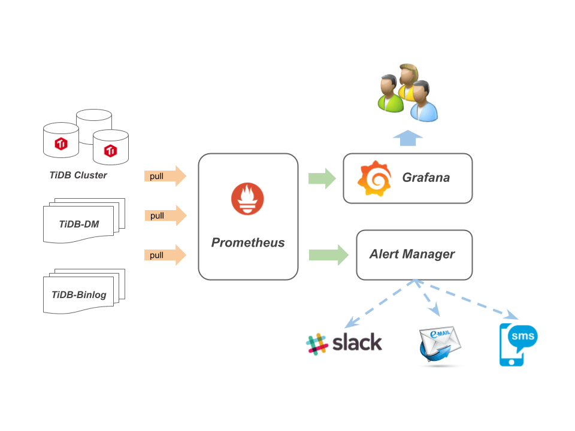

## 创业

> 先帝创业未半而中道崩殂，今三分天下……  
> 因为没有及时收到告警导致整体垮掉而被领导责罚就是这个样子啦，所以小兵挂掉需要及时获知消息用于及时作出战略更新  
> 选用 prometheus 家族的 alertmanager，然后自行设计告警规则定义纲常大道  

- Brain-storming
  - 现有监控架构
  - 现有监控数据
  - 补充监控数据
  - SRE 制定大纲

## 纲常

- labels 定义
  - 参考: [DATA STRUCTURES](https://prometheus.io/docs/alerting/notifications/)
  - 参考: [Custom Alertmanager Templates](https://prometheus.io/blog/2016/03/03/custom-alertmanager-templates/)
  - 参考: [NOTIFICATION TEMPLATE EXAMPLES](https://prometheus.io/docs/alerting/notification_examples/)
  - 参考: [METRIC AND LABEL NAMING](https://prometheus.io/docs/practices/naming/#labels)
- Alert.rules 参数定义 [引用站外文章](http://dockone.io/article/2098)
  - "Alert" 是报警规则的名字，名字间不能有空格，可以用下划线链接；
  - "IF" 是数据的查询表达式
  - "FOR" 是报警状态持续超过 1 分钟后，将报警由状态 "PENDING" 改为 "FIRING"，报警将交给 Alertmanager 处理。
  - "LABELS" 为自定义数据，我们在这里指定了报警的级别和显示 "IF" 中表达式的值。
  - "ANNOTATIONS" 为自定义数据，我们在这里提供报警的现象和原因介绍。

### 目的

> 根据 5W1H 攻略思考该怎么写一条告警规则

- [ ] 告警能否判断集群状态
  - 告警是否能帮助解决或预防问题
  - 在 POC 的时候，是否能(非精准)提醒集群瓶颈在哪里
- [ ] 告警能否有效的被执行
  - 可以设置多条规则监控同一个服务 // 单服务挂掉有多条告警，告警监控服务的不同路线
  - 当告警条件全部成功后，再进行优化、精准告警
- [ ] 告警误报的影响是什么
  - 告警可以误报，但是不可以不告警  // 结果出现有狼来了效应，产生怠慢消极状态
  - 在整体集群垮掉的时候，告警要暂时关闭 // 过多的重复告警，影响现有问题解决
- [ ] 我们还缺少那些告警判断

### 主机监测

> 判断主机状态可能需要这些东东  
> 监控数据来源于 [node_exporter.json](https://raw.githubusercontent.com/BigerCAP/tidb-ops/master/Media/node.json "Github Grafana node_exporter.json")  

- [ ] 主机状态监测
  - 主机探活机制
- [ ] 主机资源监测
  - CPU
    - 单个进程 CPU
    - 主机整体 CPU
    - 机器 load 负载
  - RAM
    - 单个进程 RAM
    - 主机整体 RAM
      - SWAP 使用量 // 超过一定使用量告警
  - DISK
    - 磁盘 读写延迟
    - 磁盘 Utilization
    - 磁盘容量监测
    - 磁盘读写状态
    - 文件描述符占用量
    - 磁盘 inode 使用数量
  - 网络
    - 流量进出

### 数据库监测

> 判断数据库状态数据来值于那些提前在 TiDB、PD、TiKV 代码中定义的代码瞄点

- 数据库组件状态监测
  - 组件探活
- 组件链路状态监测
  - TiDB PD TiKV 组件之间延迟
- 数据库业务
  - QPS 延迟
- 数据库组件运行状态监测
  - PD 调度
  - TiDB SQL 处理
  - TiKV 资源存储与调度
- 数据库资源占用监测
  - TiDB 内存使用量
  - TiKV 存储使用量、计算资源使用量

## 信息战

> 有了数据和目标，思考怎么描述一条告警规则让其将信息准确表达给观察者

- 告警规则
  - 监控目标
  - 监控阈值
  - 自定义 labels
    - 优先级
    - 组件
- 发送告警
  - silences
  - 维护区间
  - 优先级
  - 告警链路
    - 邮箱
    - 微信
    - phone / sms
- 告警重复出现
  - 是否可修复
    - 产品内修复
    - 产品外修复
  - 不可修复
    - 产品 bug
    - 考虑告警优化
- 问题处理  // alertmanger 不涉及该功能
  - 优先级
  - 问题处理
  - 问题升级
  - 问题记录
  - 工单关闭

### 告警等级

> 自定义 lables 信息，补充告警信息

- env
  - test-cluster  // 集群信息
- channels
  - alerts  // 接受告警的 slack channel
- level
  - emergency  0     phone
    - 主要是某个组件挂掉了才会触发
  - critical   1     sms
    - 某个组件出现了问题，但是可以延后处理，比如 8 个小时
  - warning    2     wechat
    - 某个组件通讯或者延迟大于某个阈值，偶然现象或者频发现象，保留类告警，可以根据业务调整或取消
  - notice     3     slack
    - 提示类告警，就是通知下这块延迟高或者要问题了，你应该找个时间看下集群了。这块和业务有关系，不是 tidb 的业务，是 SQL 的业务
- service  // 告警组件
  - TiDB
  - TiKV
  - PD
  - OS
- color  // 根据不同等级可定义不同颜色，slack message 支持不同颜色
  - #2eb886

### 告警模范

- 在 Prometheus 配置文件中引用相关告警规则，重启后生效

  ```YAML
  rule_files:
    - 'test.lablels.yml'
  ```

- 相关内容添加到 `test.lablels.yml` 文件中
- 更多告警规则可以阅读 tidb-ansible [TiDB alert rule](https://github.com/pingcap/tidb-ansible/tree/master/roles/prometheus/files "TiDB alert rule")

  ```YAML
  groups:
  - name: alert.rules      // 文件根，一般默认声明为文件名或该分组
    rules:
    - alert: NODE_disk_readonly  // 告警名称，全局唯一
      expr: node_filesystem_readonly{fstype=~"(ext.|xfs)"}  > 1  // 监控磁盘是否为只读状态
      for: 1m
      labels:
        env: test-cluster  // 声明集群变量
        level: emergency   // 声明告警等级
        service: OS        // 声明服务组件
        channels: alerts   // 声明接受告警的 slack channel
        expr: node_filesystem_readonly{fstype=~"(ext.|xfs)"}  > 1
      annotations:
        description: 'alert:{{ $labels.expr }} instance:
          {{ $labels.instance }} values: {{ $value }}'  // 最终告警内容信息拼接
        value: '{{ $value }}'
        summary: disk readonly      // 根据接受者不同，此处可能是告警 title 或者告警描述

    - alert: TiDB_memery_abnormal
      expr: go_memstats_heap_inuse_bytes{job="tidb"} > 1e+10
      for: 1m
      labels:
        env: test-cluster
        level: warning
        service: TiDB
        channels: alerts
        expr: go_memstats_heap_inuse_bytes{job="tidb"} > 1e+10
      annotations:
        description: 'alert: {{ $labels.expr }}  values: {{ $value }}'
        value: '{{ $value }}'
        summary: TiDB mem heap is over 1GiB

    - alert: PD_etcd_write_disk_latency
      expr: histogram_quantile(0.99, sum(rate(etcd_disk_wal_fsync_duration_seconds_bucket[1m])) by (instance,job,le) ) > 1
      for: 1m
      labels:
        env: test-cluster
        level: emergency
        service: PD
        channels: alerts
        expr:  histogram_quantile(0.99, sum(rate(etcd_disk_wal_fsync_duration_seconds_bucket[1m])) by (instance,job,le) ) > 1
      annotations:
        description: 'alert: {{ $labels.expr }} instance: {{ $labels.instance }}   values:{{ $value }}'
        value: '{{ $value }}'
        summary: PD_etcd_write_disk_latency

    - alert: TiKV_server_report_failure_msg_total
      expr:  sum(rate(tikv_server_report_failure_msg_total{type="unreachable"}[10m])) BY (store_id) > 0
      for: 1m
      labels:
        env: test-cluster
        level: critical
        service: TiKV
        channels: alerts
        color: 2eb886
        expr:  sum(rate(tikv_server_report_failure_msg_total{type="unreachable"}[10m])) BY (store_id) > 0
      annotations:
        description: 'alert: {{ $labels.expr }} instance: {{ $labels.instance }} values: {{ $value }}'
        value: '{{ $value }}'
        summary: TiKV server_report_failure_msg_total error
  ```

## to Slack 案例

- slack_config 配置测试
  - 参考：[slack_config](https://prometheus.io/docs/alerting/configuration/#slack_config)
  - 参考：[slack_api](https://api.slack.com/docs/message-attachments)
  - 参考：AlertManager config 示例 [Example](https://github.com/prometheus/alertmanager#example)
  - alertmanger 配置文件说明阅读 [监控架构 - 专业打小报告好多年](/post/20170604-AlertManager "ap.tidb.cc tidb alertmanager")

- 以下内容保存为 `alertmanager.yml` 文件，AlertManager 启动时指定该配置文件启动

  ```YAML
  global:
    slack_api_url: 'https://hooks.slack.com/services/T0666PYPM/B2E666BSBG/OQ7666666vMupZqTnb1234'
    # slack api 地址
  route:
    receiver: "alerts-test"
    group_by: ['env','instance']
    group_wait:      30s
    group_interval:  3m
    repeat_interval: 3m
    routes:
    - match:
        env: test-cluster
      receiver: alerts
      continue: true
    - match:
        env: test-cluster  #同时满足 env:test-cluster、severity:critical、server: TiKV、channels: alerts 才会发送到 receiver: labels-test
        severity: critical
        server: TiKV
        channels: alerts
      receiver: labels-test
  # 默认 接收器
  receivers:
  - name: 'alerts-test'
    slack_configs:
    - channel: '#alters-test'
      username: 'default'
      icon_emoji: ':innocent:'
      title:   '{{.CommonAnnotations.summary}}'
      text:    'in {{.CommonLabels.env}}: {{ .CommonLabels.alertname }}  {{ .CommonAnnotations.description }}'
  # 普通版
  - name: 'alerts'
    slack_configs:
    - channel: '#long'
      username: 'alert'
      icon_emoji: ':TiDB:'
      title:   '{{.CommonAnnotations.summary}} : {{ .CommonLabels.level}}'
      text:    'in {{.CommonLabels.env}}: {{ .GroupLabels.alertstat }} : {{ .CommonAnnotations.description }}'
  # labels (参考 slack_api 与 slack_config)
  - name: 'labels-test'
    slack_configs:
    - channel: '#{{.CommonLabels.channels}}'
      fallback: '{{.CommonLabels.alertname}} : {{ .CommonAnnotations.summary }}'
      username: 'Robot'
      icon_emoji: ':joy:'
      icon_url: 'http://www.tidb.cc'
      color: '#{{.CommonLabels.color}}' #改变 Slack 文本框颜色
      title:  '{{.CommonLabels.alertname}} : {{ .CommonAnnotations.summary }} : {{ .CommonLabels.server}} : {{ .CommonLabels.level}}'
      title_link: 'http://172.16.10.65:9090/alerts'
      text:   'in {{.CommonLabels.env}} : {{ .CommonAnnotations.description }}'
      pretext: 'http://wiki.tidb.cc/{{.CommonLabels.srv}}/{{ .CommonLabels.alertname}}'
  ```

### 启动参数

- alertmanager 启动参数
  - `./alertmanager -config.file=alertmanager.yml -storage.path=./data/ -log.level=debug -web.listen-address=0.0.0.0:9093 -data.retention=1h -log.format="logger:syslog?appname=alert-rules-test&local=7"`
  - log 输出到 `/var/log/messages` , 搜索 `appname=alert-rules-test`，用于告警调试使用

### 告警过程

- 告警发送经过
  1. Prometheus 根据 alert.rules 匹配 metric 数据，匹配成功后发送到 AlertManager
  1. AlertManager 收到后，一条告警会通过 `route > match > LABELS > receivers` 匹配到接收器
  1. 然后根据 group_by 内容匹配并聚合告警

- group_by: ['env','instance'] 参数说明
  - env and instance 划分为一组，如果有多个参数，递归匹配，直到匹配不到
  - 取值范围 `alert.rule > LABELS` 、`metrics > instance、job、type` 等

### API 信息

- [http api 说明](https://prometheus.io/docs/querying/api/)
- 请求 Prometheus alert 告警 json 格式
  - 使用前需要编码
  - `http://172.16.10.65:9090/api/v1/query?query=(100%20-%20(avg%20by%20(instance)%20(irate(node_cpu%7Bmode%3D%22idle%22%7D%5B5m%5D))%20*%20100))%20&step=15s`
    - 请求 cpu 使用量
  - URL 编码 `URL-encoded`
- 请求 alertmanager 告警 json 格式
  - `curl 'http://localhost:9093/api/v1/alerts'`

## 致谢



- [Grafana](https://github.com/grafana/grafana) 监控、度量分析仪表板工具，从 Prometheus 获取数据
- [Prometheus](https://github.com/prometheus/prometheus) 用于存放监控数据的时序数据库
- [push gateway](https://github.com/prometheus/pushgateway) push acceptor for ephemeral and batch jobs
- [Black-box](https://github.com/prometheus/blackbox_exporter) 黑盒测试工具，支持 HTTP, HTTPS, DNS, TCP and ICMP
- [Node-export](https://github.com/prometheus/node_exporter) 主机资源 agent 组件
- [告警平台设计](http://os.51cto.com/art/201603/507858.htm)