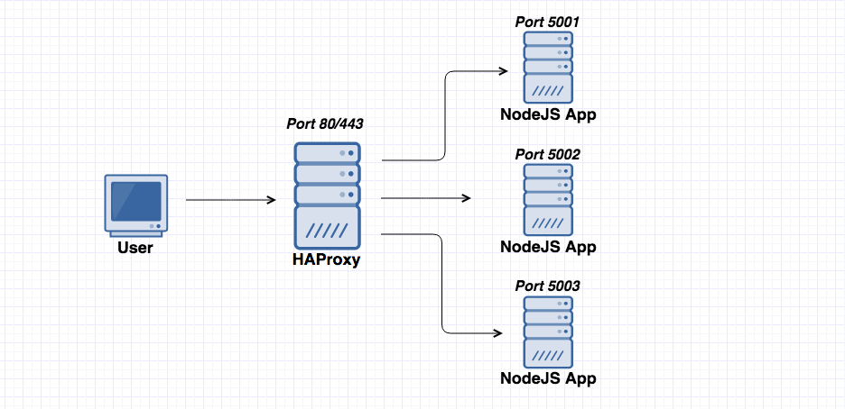
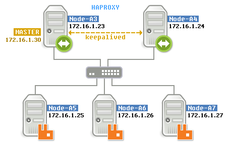
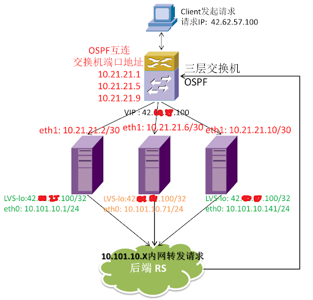

## 0x01 介绍

- Haproxy [官网](http://www.haproxy.org "ap.tidb.cc 负载均衡 - HAProxy & TiDB 配合食用")

> 百家饭内容，将测试环境的最终结果整理了下



## 0x02 功能

- 负载均衡：L4(TCP) 和 L7(HTTP/HTTPS) 两种模式，支持 RR(roundrobin) / 静态 RR / LC / IP Hash/ URI Hash/ URL_PARAM Hash/ HTTP_HEADER Hash 等丰富的负载均衡算法
- 健康检查：支持 TCP 和 HTTP 两种健康检查模式
- 会话保持：对于未实现会话共享的应用集群，可通过 Insert Cookie / Rewrite Cookie / Prefix Cookie，以及上述的多种 Hash 方式实现会话保持
- SSL：HAProxy 可以解析 HTTPS 协议，并能够将请求解密为 HTTP 后向后端传输
- HTTP：请求重写与重定向
- 监控与统计：HAProxy 提供了基于 Web 的统计信息页面，展现健康状态和流量数据。基于此功能，使用者可以开发监控程序来监控 HAProxy 的状态

### balance

- HAProxy 的算法现在也越来越多了，具体有如下：
  - roundrobin，表示简单的轮询，这个不多说，这个是负载均衡基本都具备的
  - static-rr，表示根据权重，建议关注
  - leastconn，表示最少连接者先处理，建议关注
  - ource，表示根据请求源 IP，这个跟 Nginx 的 IP_hash 机制类似，我们用其作为解决 session 问题的一种方法，建议关注
  - ri，表示根据请求的 URI
  - rl_param，表示根据请求的 URl 参数'balance url_param' requires an URL parameter name
  - hdr(name)，表示根据 HTTP 请求头来锁定每一次 HTTP 请求
  - rdp-cookie(name)，表示根据 cookie(name) 来锁定并哈希每一次 TCP 请求

### real server

```yaml
server tidb-3 172.16.18.13:4000 check port 4000 inter 2000 rise 2 fall 3
```

- port 4000  : 对目标机器 22 号端口健康检查；按照以下规则探测
- inter 2000  : 指间隔 2 秒做一次状态检测
- rise 2      : 检测 2 次状态为成功，恢复对该 RS 的流量转发
- fall 3      : 连续 3 次检测失败会被踢掉流量转发

## 0x03 配置文件示例

> TiDB or MySQL 需要使用 L4 (OSI) TCP 层模式

- 使用以下配置文件，可以通过 `http://hostIP:1111` 查看 HAProxy 运行状态

```configuration
#---------------------------------------------------------------------
# Example configuration for a possible web application.  See the
# full configuration options online.
#
#   http://haproxy.1wt.eu/download/1.4/doc/configuration.txt
#
#---------------------------------------------------------------------

#---------------------------------------------------------------------
# Global settings
#---------------------------------------------------------------------
global
    # to have these messages end up in /var/log/haproxy.log you will
    # need to:
    #
    # 1) configure syslog to accept network log events.  This is done
    #    by adding the '-r' option to the SYSLOGD_OPTIONS in
    #    /etc/sysconfig/syslog
    #
    # 2) configure local2 events to go to the /var/log/haproxy.log
    #   file. A line like the following can be added to
    #   /etc/sysconfig/syslog
    #
    #    local2.*                       /var/log/haproxy.log
    #
    log         127.0.0.1 local2

    chroot      /var/lib/haproxy
    pidfile     /var/run/haproxy.pid
    maxconn     4000  # 最大连接数
    nbproc      1     # haproxy 进程数，默认为单进程
    user        haproxy
    group       haproxy
    daemon

    # turn on stats unix socket
    stats socket /var/lib/haproxy/stats

defaults
    log global
    retries 2
  timeout connect  2s       # 连接超时
  timeout client 30000s     # 客户端超时
  timeout server 30000s     # 服务器超时
  option abortonclose       # 当服务器负载很高的时候，自动结束掉当队列处理比较久的链接【不建议使用】
  option redispatch         # 当 serverId 对应的服务器挂掉后，强制定向到其他健康的服务器【不建议使用】

listen admin_stats
  bind 0.0.0.0:1111               # 监控页面地址 & 端口
  mode http
  option httplog                  # 采用 http 日志格式
  maxconn 4000                    # 默认的最大连接数
  stats refresh 30s               # 统计页面自动刷新时间
  stats uri /haproxy              # 统计页面 url
  stats realm Haproxy             # 统计页面密码框上提示文本
  stats auth admin:pingcap123     # 设置监控页面的用户和密码: admin, 可以设置多个用户名
  stats hide-version              # 隐藏统计页面上 HAProxy 的版本信息
  stats  admin if TRUE            # 设置手工启动 / 禁用，后端服务器 (haproxy-1.4.9 以后版本)


listen tidb-cluster
    bind 0.0.0.0:3306     # 对外 vip【virtual ip】 端口
    mode tcp              # 后端 mysql/tidb 需要使用 tcp / OSI L4 协议转发流量
    balance roundrobin    # 轮询转发流量
    server tidb-1 172.16.18.11:4000 check port 4000 inter 2000 rise 2 fall 3
    server tidb-2 172.16.18.12:4000 check port 4000 inter 2000 rise 2 fall 3
    server tidb-3 172.16.18.13:4000 check port 4000 inter 2000 rise 2 fall 3
```

## 0x04 FAQ

如果不能转发流量，你可以检查下这里：在配置内核参数开发转发功能，在 `/etc/sysctl.conf` 文件中底部添加 `net.ipv4.ip_forward = 1`；最后执行 `sysctl -p` 命令使其生效

### HA

Haproxy 的 HA 服务需要一个 keepalived 支持，这个 keepalived 主要作用是给 Linux 加了个灵活的网卡。方便主机切换网卡使用。  



除 keep alived 服务之外其实还有 ospf + haproxy / ospf + lvs 架构，还有 ospf + lvs & haproxy 高级组网方式。【这里的 ospf + lvs 中的 lvs 需要使用 fullnet 流量转发策略】


