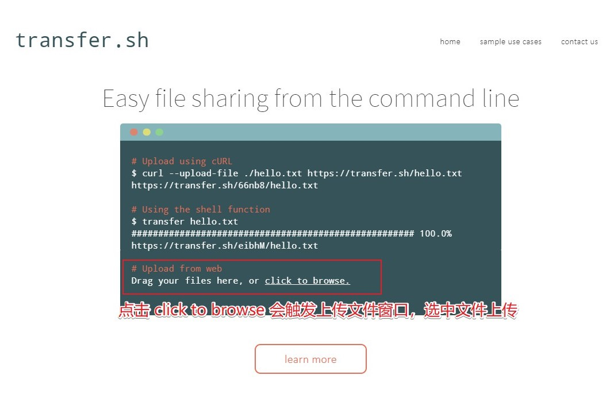
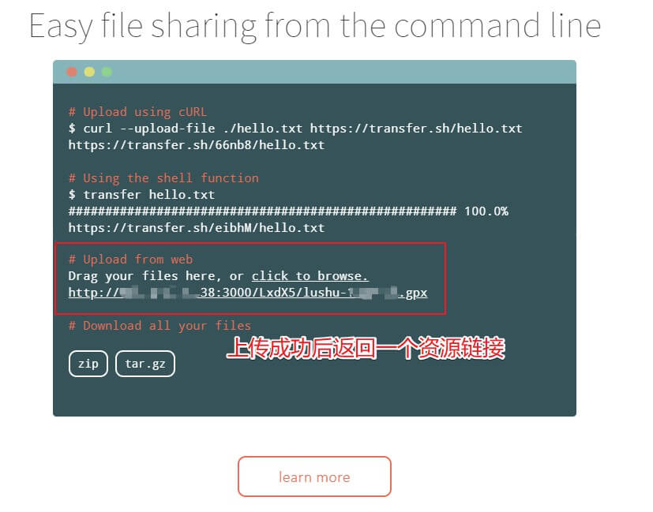
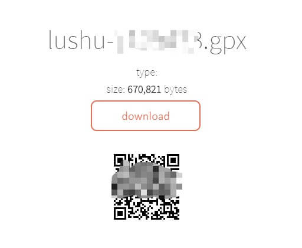

## 0x00 起源

> 平常需要各种传输日志文件，TiDB 部署进程比较多，打包后可能超过 100MB（微信最大支持 100MB 附件传输），发送人和接受人不是同平台时，文件切割什么的真不好用；
> 寻找到这么一个横跨多平台（伪）使用的文件服务器工具，支持浏览器、命令行方式上传下载数据文件。
> transfer.sh 需要一个支持高速下载与上传的 Linux 服务器，否则效率大大降低；另外需要定期清理已上传数据内容（temp-path 参数），工具不自带 GC 功能

## 0x01 介绍

- [Transfer.sh](https://transfer.sh/ "Easy and fast file sharing from the command-line.") 项目官网
- Github [Transfer.sh](https://github.com/dutchcoders/transfer.sh/) Repo 地址

从命令行轻松快速地共享文件。Transfer.sh 可直接启动一个文件共享服务器，使用 curl 命令发送数据 (HTTP 协议) 到 Transfer 服务器，通过 Transfer.sh 共享链接 (HTTP 协议) 下载数据。

Transfer.sh 支持 S3 协议的对象云存储 (Amazon S3)、谷歌网盘 (Google Drive)、系统本地存储 (local) 作为存储资源池。

## 0x02 安装

> 相关服务使用 Golang 编写  
> 官方提供 docker images，通过 `docker pull dutchcoders/transfer.sh` 获取镜像，国内可使用 `docker pull registry.docker-cn.com/dutchcoders/transfer.sh` 获取镜像

- 安装 docker (centos 7.4)
  - `yum install docker -y`
- 启动 dcoker，并设置为开机启动
  - `systemctl start docker`
  - `systemctl enable docker`
- 获取镜像 (国内)
  - `docker pull registry.docker-cn.com/dutchcoders/transfer.sh`
  - 通过这个方式获取到的镜像名为 `registry.docker-cn.com/dutchcoders/transfer.sh`
- 查看镜像信息
  - `docker images`
- 启动 `transfer.sh` 服务前准备
  - 需要使用 root 用户执行 docker run 命令
  - 需要提前关闭 selinux，使用 getenforce 查看 selinux 状态；如果开启状态，使用 `setenforce 0` 临时关闭 selinux
  - 在 centos 7 创建 `/data/transfer_dir/` 数据目录，稍后映射到 docker 容器内
- 启动 `transfer.sh` 服务
  - 命令中 -d 为后台运行，初次运行时建议去掉；启动成功后再次添加，如果第二次启动失败，可以执行 `docker rm -f transfer`
  - `docker run --publish 8000:8080 --name transfer -d -v /data/transfer_dir/:/tmp/ registry.docker-cn.com/dutchcoders/transfer.sh:latest --provider local --basedir /tmp/`
    - docker 容器内默认监听 8080 端口，通过 8000 端口映射后对外提供服务
- 启动成功后，使用 `docker logs transfer` 可以看到以下日志信息

    ```logs
    [root@Jeff-VM1 data]# docker logs 298d8dbd3cdf
    2019/02/15 08:41:57 Transfer.sh server started.
    using temp folder: /tmp/
    using storage provider: local
    2019/02/15 08:41:57 listening on port: :8080
    2019/02/15 08:41:57 ---------------------------
    ```

### Transfer.sh 命令行参数

Parameter | Description | Value | Env
--- | --- | --- | ---
listener | port to use for http (:80) | |
profile-listener | port to use for profiler (:6060)| |
force-https | redirect to https | false |
tls-listener | port to use for https (:443) | |
tls-listener-only | flag to enable tls listener only | |
tls-cert-file | path to tls certificate | |
tls-private-key | path to tls private key | |
http-auth-user | user for basic http auth on upload | |
http-auth-pass | pass for basic http auth on upload | |
temp-path | path to temp folder | system temp |
web-path | path to static web files (for development) | |
ga-key | google analytics key for the front end | |
uservoice-key | user voice key for the front end  | |
provider | which storage provider to use | (s3, grdrive or local) |
aws-access-key | aws access key | | AWS_ACCESS_KEY
aws-secret-key | aws access key | | AWS_SECRET_KEY
bucket | aws bucket | | BUCKET
basedir | path storage for local/gdrive provider| |
gdrive-client-json-filepath | path to client json config for gdrive provider| |
gdrive-local-config-path | path to local transfer.sh config cache for gdrive provider| |
lets-encrypt-hosts | hosts to use for lets encrypt certificates (comma seperated) | |
log | path to log file| |

### SSL

如果要开启 SSL (默认使用 [Let's Encrypt](https://letsencrypt.org "Let’s Encrypt is a free, automated, and open Certificate Authority.") 证书)，需要开启 force-https 并设置 tls-listener 参数，默认 tls-listener 端口 443，需要根据 Let's Encrypt 给的信息设置 lets-encrypt-hosts 参数

如果使用自己的 SSL 证书，需要设置 tls-listener 参数，默认为 :443 ；开启 force-https 参数，设置 tls-cert=file 与 tls-private-key 参数

## 0x03 测试

### 命令行上传

> 该工具没有断点续传，请注意客户端与服务器端的网络质量

```bash
Upload:
  curl --upload-file ./hello.txt https://transfer.sh/hello.txt

Encrypt & upload:
  cat /tmp/hello.txt|gpg -ac -o-|curl -X PUT --upload-file "-" https://transfer.sh/test.txt

Download & decrypt:
  curl https://transfer.sh/1lDau/test.txt|gpg -o- > /tmp/hello.txt

Upload to virustotal:
  curl -X PUT --upload-file nhgbhhj https://transfer.sh/test.txt/virustotal
```

### 网页上传

> 如果是使用上面步骤的启动命令，可通过 `http://IP:3000/` 打开网页，如下图







## 0x04 FAQ

- 调试时出现 `2018/08/01 03:08:38 mkdir /tmp/u5fJW: permission denied`，上传文件失败
  - centos 7 默认开启 selinux ，使用 -v 挂载映射存储时，docker 无法正确映射该存储
  - 解决办法由两种，一种是关闭 selinux ，一种时启动时添加超级权限 `--privileged=true`，建议关闭 selinux
- 调试时出现 401 错误
  - 因为添加了 http-auth-user / http-auth-pass 参数，在网页上传时，没有鉴权功能。
  - 可使用 curl 命令携带鉴权信息

### Linux alias

> 添加到用户 .bashrc or .zshrc 文件内  
> 添加完成后需要使用 source .bashrc or .zshrc 重新加载环境变量

```bash
transfer() {
    curl --progress-bar --upload-file $1 https://transfer.sh/$(basename $1) | tee /dev/null;
}

alias transfer=transfer
```
