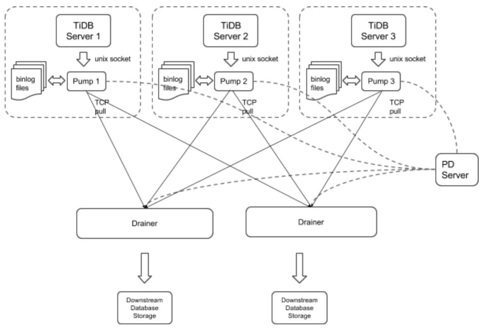

## 0x00 测试

前段时间部署了一套 TiDB 数据库，只有单纯的数据库放养是肯定不行的。还要一些灾备方案满足删库跑路之后的恢复工作。  
按照以往（mysql）经验有物理（文件冷存）备份（xbackup）& 逻辑（热备）备份（ SQL 语句同步）；然 TiDB 底层与 mysql 不一样，没有类似 xbackup 类似的工具做物理备份（测试过程是发现一个~~奇技淫巧~~做*类物理备份*）；那么接下来还有逻辑备份测试，这部分有 PingCAP 官方提供的 TiDB-Binlog 组件来支持。  
没玩过的东西先找个小环境随意折腾下，折腾到死位置……

> 先看下 TiDB-binlog 架构，如图（20171008 复制于官方网站）:



### 组件

> 直接复制官网内容

TiDB-Binlog 支持以下功能场景:  

数据同步: 同步 TiDB 集群数据到其他数据库  
实时备份和恢复: 备份 TiDB 集群数据，同时可以用于 TiDB 集群故障时恢复  

PUMP：Pump 是一个守护进程，在每个 TiDB 的主机上后台运行。他的主要功能是实时记录 TiDB 产生的 Binlog 并顺序写入磁盘文件  

Drainer：Drainer 从各个 Pump 节点收集 Binlog，并按照在 TiDB 中事务的提交顺序转化为指定数据库兼容的 SQL 语句，最后同步到目的数据库或者写到顺序文件  

> ⚠️ 需要为一个 TiDB 集群中的每台 TiDB server 部署一个 pump，目前 TiDB server 只支持以 unix socket 方式的输出 binlog  

## 0x01 部署

### ansible

> 通过修改 inventory.ini 文件中的 enable_binlog 开关确定是否部署 Binlog，针对第一次部署时方便  
> 如果已经部署了 TiDB-server ，就要使用 deploy + stop + start 三板斧解决了  

### manual

> 先部署 PUMP 服务，并在启动参数生命 unix-socket 信息，相当于生命了一个服务端接口  
> 然后配置 TiDB 启动参数，填写 PUMP 的 unix-socket 路径信息，TiDB & PUMP 只能一对一服务，不能跨机器、不能一对多使用  
> 启动优先级为： PUMP > TiDB  
> 停止优先级为 TiDB > PUMP  

## 0x02 常规

当 PUMP & TiDB 都启动后，启动 Drainer ；按照官方手册写配置文件输出到下游的一个 mysql 节点（此处省略 mysql 启动方式，docker run 最省事）。  
然后在上游执行各种 CDUR / 增删改查 DML 工作、DDL 工作，看下游响应。

> 此处⚠️一个事情：Drainer 有个 `ignore-schemas = "INFORMATION_SCHEMA,PERFORMANCE_SCHEMA,mysql"` 参数，默认这里是不同步 mysql 修改的，如果使用 update 语句修改 user 密码，下游不会更改。  
> 还有一个参数是 `replicate-do-db` 只同步那些库，这个优先级比上面那个 ignore 要高，并且设置了这个后就只同步这个数据库了……（按照语义理解貌似没啥毛病，不吐槽了）  
> ⚠️ PS：如果有不同的数据库同步到不同的下游，需要启动多个 Drainer 来工作才能完成这个场景  

主机性能有限，官方文档说通过 `txn-batch = 1` & `worker-count = 1` 可以配置同步速度流控，简单用 sysbench 创建了 15 张表，每张表 10w 数据，上游很畅快的插入成功；然后默默看着 mysql 数据的同步、反正总会有些延迟。【我这上下游都是配置 Binlog 后产生的新数据，不存在老数据 mydumper + loader 的过程，这部分和 mysql 的 mysql dumper + mysql laod 是一样的，就不测试了】  

### 宅男

简单的灾难场景简单测试了下：

1. 比如某个 PUMP 挂掉了，因为有多个 TiDB-server，必须要每个 TiDB-server 配置一个 PUMP；单个 PUMP 挂掉之后 TiDB-server 也就挂掉了……（好吧，我忍了，毕竟官方说如果不停 TiDB-server 那么 PUMP 故障后的 SQL BINLOG 就丢失记录了，可是我业务也断掉了。这里并没有提供啥子选择。比如我想做个好人）  
2. PUMP 所在机器磁盘坏掉了，解决方案就是重新做一套 Binlog 流程。（mysql 貌似也是这样）
3. Drainer 需要链接 PD 获取到 PUMP 信息，如果 PD 地址写错了，辣么要么失败、要么写错数据，貌似没啥校验行为
4. Drainer 启动时有个 init tso 的参数，提示从哪里开始同步。如果写错了辣么数据就不得而知了 （和 mysql 一个行为，木的啥问题）
5. 数据过滤行为只在 Drainer 上有，PUMP 上木有；如果上游 100 个库，只有一个库同步。辣么你懂的。
6. 跨机房行为，比如 PUMP & Drainer 在两个机房，会出现延迟加大（与 mysql 一样，一样可以断点续传，毕竟这是增量同步基本功能），其他就是有可能时断时连，drainer 的断是进程挂掉，所以 ansible 里有个 supervise 的东西一直一直一直的等他挂掉，然后又一直一直一直的拉起他。即时 draienr 不是因为网络挂掉，比如 DDL 、DML 卡住了……（然后、貌似、大概、可能、似乎告警就延迟了）  

后面暂时想不到了，就不测了，这套流程太长了；折腾坏了之后要研究半个多小时才能修好……

## 0x03 折腾

> 既然是折腾，总需要一些手段查问题，在与官方研发沟通中总结出来的东东

出问题排查流程大致分以下几步：

1. 先查 TiDB-Server & PUMP 之间的状态
   1. PUMP 磁盘写满了么
   2. TiDB-server 使用 unix-socket 参数了么
2. 在查 PUMP & Drainer 链接
   1. Drainer PD URL 写对了么
   2. Drainer 配置文件中的 ignore、replicate-do-db、写正确了么
   3. 查 Drainer data-dir 目录下是否有 savepoint 文件，内容是否更新（有时候数据一直同步，但是文件不更新）
   4. Drainer 不确定是否工作，那就调成 PD 模式吧，先看看有木有 PB 文件（这个 PB 是个文本编码格式，用 vi 打开就是乱码，需要解码才能看，搜 protobuf
3. 查 PD 中的一些信息
   1. 需要用到一个 etcd-ctl 工具，读取 PUMP、Drainer 在 PD 中的状态
   2. 使用 pd-ctl 工具查 PD cluster id ，判断 Drainer 同步的那个集群

### status api

- 获取 pump binlog 文件数量信息，请求地址为 pump ip:port
  - `curl  10.10.1.4:8250/status`
- 获取 Drainer 同步信息，以及同步位置断点记录
  - `curl  10.10.1.4:8249/status`

### case one

> 分享一个因为做了很多遍的🦐测试，造成 Drainer 无法启动的排查过程

- 通过 drainer 获取 savepoint 报错
  - `./bin/drainer -gen-savepoint -data-dir ./s -pd-urls "http://10.10.1.6:2379"`
  - 通过 Drainer 先行获取 tso 断点信息时失败，提示有个 pump 节点 ip-10-10-1-6:8250 是离线状态 【只有所有 PUMP 都在线时，Drainer 才可以启动，这样可以保证数据完整性】  

    ```shell
    INFO[0000] new store
    INFO[0000] [pd] create pd client with endpoints [10.30.1.6:2379]
    INFO[0000] [pd] leader switches to: http://10.30.1.5:2379, previous:
    INFO[0000] [pd] init cluster id 6493070954582498647
    2017/12/27 16:35:15 main.go:31: [fatal] fail to generate savepoint error pump &{NodeID:ip-10-10-1-6:8250 Host:10.30.1.6:8250 IsAlive:false LatestBinlogFile:binlog-0000000000000000} is offline
    ```

- 通过 curl 命令请求 PUMP 状态得到以下结果【PUMP 状态接口可以看到邻居的状态】  
  - `curl  10.10.1.6:8250/status`
  - 看到邻居兄弟都是存活的……  

  ```shell
  {"LatestBinlog":{"ip-10-10-1-6:8250":{},"ip-10-10-1-7:8250":{},"tidb-online-tidb-1:8250":{"suffix":81},"tidb-online-tidb-2:8250":{"suffix":77},"tidb-online-tidb-3:8250":{"suffix":80},"tidb-online-tidb-4:8250":{"suffix":80}},"CommitTS":396981399817027585,"ErrMsg":""}
  ```

- 官方大佬提示：观察 data.pump 下 node 文件内容  
  - 此处的 .node  文件内容就是 PUMP ID 信息；回顾下报错日志 `pump &{NodeID:ip-10-10-1-6:8250 Host:10.30.1.6:8250` ，发现文件内容与报错对不起来。看起来是这个问题  

  ```shell
  cat /data1/tidb/deploy/data.pump/.node
  tidb-online-tidb-2:8250
  ```

- 需要用到一个神奇的工（ etcd-ctl）去 PD-server 删除这个无效的 ID 信息  
  - 通过 etcd 删除 `ip-10-10-1-6:8250` 与 `ip-10-10-1-7:8250`

  ```sehll
  export ETCDCTL_API=3 // 配置 etcd api 版本信息

  #在 github etcd repo 下载 etcd-v3.2.9-linux-amd64.tar.gz

  ./etcdctl --endpoints=http://10.10.1.6:2379 get --prefix  tidb-binlog  
    // 获取所有 tidb-binlog key信息

  ./etcdctl --endpoints=http://10.10.1.6:2379 get tidb-binlog/pumps/ip-10-10-1-6:8250/object
    // 获取指定 object 信息，验证其是否存在、是否还有子集

  ./etcdctl --endpoints=http://10.10.1.6:2379 del tidb-binlog/pumps/ip-10-10-1-6:8250/object 
    // 删除指定 object 信息
  ```

- 总结
  - 造成这种问题的原因大概是：没有正常的停止 PUMP 节点，比如使用 kill -9 的方式停止，PUMP 进程在正常退出的时候会自动去 PD 节点执行 offline 和清理自身 ID 的动作，但异常情况下无法清理，辣么造成的垃圾数据就会影响 Drainer 的运行了。

## 0x04 忒傻

### 监控

> 比较重要的几个监控项（实际上就看到了这几个）

- RPC QPS(pump)
  - `irate(binlog_pump_rpc_counter[1m])`
  - pump rpc 接口平均每分钟调用次数

- 95% RPC Latency(pump)
  - pump rpc 请求 95% 平均延迟
  - `histogram_quantile(0.95, rate(binlog_pump_rpc_duration_seconds_bucket[1m]))`

- slave  lower boundary
  - drainer 已经排序处理的事务的最大 TS （也可以理解为最大事务 ID）
  - `binlog_drainer_window{marker=\"lower\", }/(2^18*10^3)`

- slave position
  - drainer 同步到 ts
  - `binlog_drainer_position{}/((2^18)*1000)`

- error binlogs
  - 错误的 binlog 个数
  - `binlog_drainer_error_binlog_count{}`

- slave tikv query
  - drainer 查询 tikv 请求数量
  - `binlog_drainer_query_tikv_count{}`

- synchronization delay
  - drainer 数据同步延迟时间，单位秒
  - `(binlog_drainer_window{marker=\"upper\", } - ignoring(marker)binlog_drainer_position{})/(2^18*10^3)`

- Drainer Event
  - drainer 数据同步 sql 语句类型的数量
  - `rate(binlog_drainer_event{}[1m])`

- 99% drainer txn latency
  - .99 同步 binlog txn 延迟时间
  - `histogram_quantile(0.99, rate(binlog_drainer_txn_duration_time_bucket[1m]))`

- Goroutine
  - binlog 目前存在的go routines数量。
  - `go_goroutines{job=\"binlog\"}`

- Memory
  - 查看 Binlog 组件占用的内存数量，使用的 go 内置统计，而非 linux 系统统计
  - `go_memstats_heap_inuse_bytes{job=\"binlog\"}`

## 0x05 工具人

> 我是一个冷酷无情的工具人，蒸腾到死了


