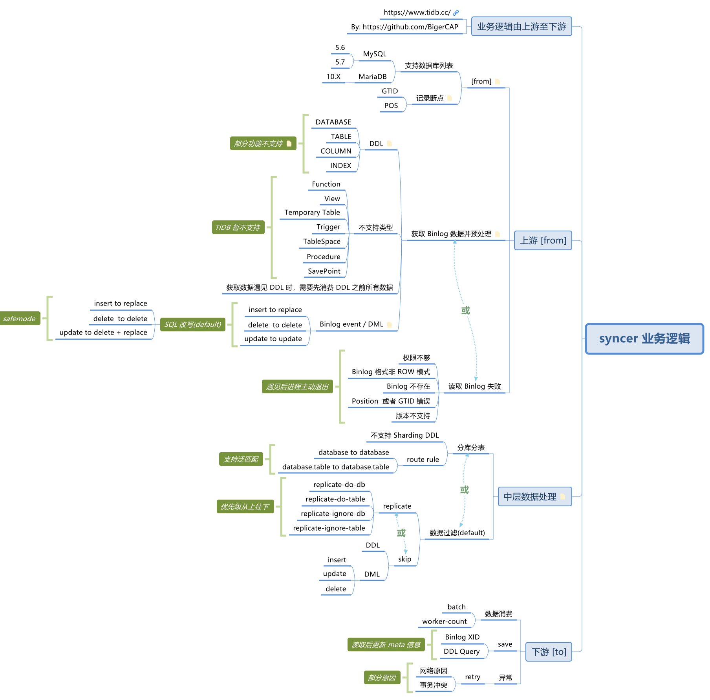

## 0x00 背景

> 长期使用 Syncer 之后经过一番胡思乱想之后的总结经验，类似于“久病成医”的感觉
> 内容按照 201706 - 201806 期间使用经验整理，后续大致是不会遇见了，因为有了新工具（DM）

## 0x01 Syncer-FAQ

- 使用 Syncer 前请详细阅读官方 [Syncer](https://github.com/pingcap/docs-cn/blob/master/tools/syncer.md) 文档
- Syncer 是一个 **同步工具** ，通过 Syncer 配置文件中的 [from] 获取上游 MySQL binlog 信息，解析 binlog 后会根据配置文件中的 skip-dmls、skip-ddls、replicate-do-db、replicate-do-table、route-rules 等参数匹配 or 过滤，然后将匹配 or 过滤后的数据集通过 SQL Client 的方式写入到 [to] 下游数据库

## 0x02 业务逻辑



- Syncer 是个同步工具，Syncer 中分三个部分
  - **上游** binlog 数据读取：这是个单线程模拟读取 MySQL binlog 内容，Syncer 针对 from binlog 有一定的 [约束检查](https://github.com/pingcap/docs-cn/blob/master/tools/syncer.md#syncer-%E5%90%8C%E6%AD%A5%E5%89%8D%E6%A3%80%E6%9F%A5)，检查通过后开始拉取数据并进行数据预处理工作
    - 目前 Syncer 拉取 binlog 不存在性能瓶颈 (远程网络读取 binlog 会受带宽质量影响)
    - 数据预处理工作是主动去掉 TiDB 目前不支持的 SQL format 、DML SQL format 转换、DDL Spilt 等内容
  - **中层** 数据处理：将上游预处理的数据与配置文件中的 `skip-dmls、skip-ddls、replicate-do-db、replicate-do-table、route-rule` 参数做数据过滤、数据匹配、数据转换、数据检查
    - 此处会消耗 Syncer 所在主机的计算资源、内存资源
  - **下游** 数据消费：Syncer 作为 SQL Client 链接 TiDB 消费数据，由配置文件中 worker-count * batch 控制 Syncer 消费数据的速度
    - 在数据消费时 binlog 的语句会被以下方式进行替换：
      - insert == replace
      - update == update / update == delete + replace (safemode)
      - delete == delete
    - 数据消费过程中会记录下数据同步断点：Syncer 断点记录在 Syncer.meta 文件中， 格式是 binlog-name、Position 与 GTID
      - Syncer 会将上游一个大事务进行切分为多个小事务到下游执行，如在一个大事务内发生退出，Syncer 再次启动时会重新执行这个事务
      - Syncer 是以 ROW format binlog 进行回放 SQL 语句，即使事务被重复执行也会保持一致性
    - 此处会消耗 Syncer 所在主机的网络资源

## 0x03 性能调优

- Syncer 根据下游消费能力调整 worker-count 与 batch 参数控制其同步速度，worker-count 提供了并发能力，batch 是每个并发的数据量
  - worker-count 工作能力受 syncer 所在机器的 CPU 影响， worker-count 与 CPU 至少是 1:1 关系
  - 首先提高 worker-count(1-256 之间) ，batch 固定 (比如 100 )，当调大 worker-count 无法加快消费时，可以适当增加 batch 大小，不建议超过 1000
    - 调整 worker-count * batch 时应当注意 [Syncer dashboard](https://github.com/pingcap/docs-cn/blob/master/tools/syncer.md#%E7%9B%91%E6%8E%A7%E6%96%B9%E6%A1%88 "看这里可以知道如何配置 Syncer 监控") 中的 `syncer_txn_costs_gauge_in_second` Panel，该项为 Syncer 执行语句到下游消费成功的时长 (正常该数值在 ms 级)
  - worker count * batch 等于最大消费 QPS ，实际运行过程会低于这个假设值，尤其当内外网之间进行同步时，此时应当注意内外网之间的最大带宽

## 0x04 问题整理

- Syncer 在使用过程中会遇见以下错误：
  1. Syncer 解析 binlog 出错：Syncer 目前支持的 binlog 有限，初始时按照 MySQL 5.7\5.6 版本开发，后期加入了 MariaDB 10 ；如果使用版本不在这个范围之内可能会出现一些异常错误。同时 MySQL 与 MariaDB 自身软件也会产生一些 binglog 相关的 BUG，这类 BUG 需要升级软件版本才可以解决
  2. Syncer 插入数据到下游出错：此类一般是下游 TiDB 不支持。此类报错与 SQL Client 执行 SQL 语句得到的报错一致
  3. Syncer 因为某些事件产生 panic (如使用了比较老版本的 MySQL)：此时需要联系 PingCAP 官方技术支持，发送业务场景、使用疑问信息到 info@pingcap.com
  4. Syncer 使用过程中其他错误：如数据库权限问题、网络闪断或不可达、下游消费出现堵塞、写入冲突、数据同步慢、数据同步不正常 等，其实均可通过自建与阅读文档解决
- Syncer 出现问题时应当先进行自检，完成以下步骤内容
  - Sycner [同步前的一些检查项](https://github.com/pingcap/docs-cn/blob/master/tools/syncer.md#syncer-%E5%90%8C%E6%AD%A5%E5%89%8D%E6%A3%80%E6%9F%A5) ：检查上下游之间的参数是否符合需求
  - Syncer [监控项 / 告警项配置](https://github.com/pingcap/docs-cn/blob/master/tools/syncer.md#%E7%9B%91%E6%8E%A7%E6%96%B9%E6%A1%88) ：设置这个可以观察 Syncer 运行状态
  - Syncer 数据同步不正常，应当先检查 [配置文件](https://github.com/pingcap/docs-cn/blob/master/tools/syncer.md#%E5%90%AF%E5%8A%A8-syncer) 与 [route-rule](https://github.com/pingcap/docs-cn/blob/master/tools/syncer.md#%E6%8C%87%E5%AE%9A%E6%95%B0%E6%8D%AE%E5%BA%93%E5%90%8C%E6%AD%A5)，检查这些是否与期望相等
  - Syncer [启动方式与守护进程](../Docs/180323-Systemd-Syncer.md)

### 上下游 schema 不一致场景

- 该问题主要出现于分库分表，上游执行 DDL 后，Syncer 出现上下游 schema 信息不一致。
- 原因是上游分表同步进步不一致，没有有效的通过中控机制锁住所有分表的 DDL 执行状态。
- 日志输出如下：

```log
2018/07/18 19:21:17 main.go:79: [error] /home/jenkins/workspace/build_tidb_enterprise_tools_master/go/src/github.com/pingcap/tidb-enterprise-tools/syncer/syncer.go:529: gen insert sqls failed: insert columns and data mismatch in length: 25 vs 23, schema: CRM, table: ORDER
/home/jenkins/workspace/build_tidb_enterprise_tools_master/go/src/github.com/pingcap/tidb-enterprise-tools/syncer/syncer.go:165:
2018/07/18 19:21:17 syncer.go:752: [info] print status exits, err:context canceled
```

- 核验步骤
  - 通过 `show create table tablename` 核实上下游 schema info ，或者通过 mysqlbinlog 查看 binlog 内容，或者 syncer 开启 Debug 模式查看输出
    - mysqlbinlog 示例如下 (注意修改 binlogname 与 pos 点位置，可以使用 log 或者 syncer.meta 中的信息)
      - `mysqlbinlog --base64-output=DECODE-ROWS  mysql-bin.002019 --start-position 430862799 --stop-position 430866627 -vv`

- 解决方案
  - 如果数据量小，可以从新来一遍全量，然后再做增量数据
  - 联系 PingCAP 官方服务，官方会解决详细解决方案。
    - 比如：去掉上下游 schema 检查，这种会有一定的潜在问题，如先执行 `alter table A add column`，紧随执行 `alter table A delete column`，此时数据会有影响。
    - 或者使用 Syncer 升级版 Data Migration Product Proposal (DM)，需要联系 PingCAP 商务支持 info@pingcap.com

### unsupported DDL

> Error 1105: unsupported modify column null to not null

- Syncer 日志文件

    ```SQL
    2018/09/28 18:40:54 db.go:123: [warning] [exec][sql]USE `qxf`; ALTER TABLE `fof_strategy` MODIFY COLUMN `start_date` datetime NOT NULL;[args][][error]Error 1105: unsupported modify column null to not null
    ```

- 问题原因
  - 这个错误是 TiDB 不支持  default null 与 default not null 之间的互相转换。详情阅读 [官方文档 DDL 之 Alter table](https://github.com/pingcap/docs-cn/blob/master/sql/ddl.md#alter-table-%E8%AF%AD%E6%B3%95)

### 启动 Syner 失败

- Meta 文件或者配置文件参数有回车符
  - `[error] Near line 3 (last key parsed ''): Strings cannot contain new lines.`

  ```LOG
  2017/12/14 08:36:20 main.go:52: [info] config: log-level:info log-file:/root/prega-syncer/log/card.log log-rotate:day status-addr::11105 server-id:999 worker-count:32 batch:100 meta-file:/root/prega-syncer/meta/card.meta do-tables:[] do-dbs:[~^mmm*] ignore-tables:[] ignore-dbs:[] from:DBConfig(host:10.1.1.14, user:root, port:3306, pass:<omitted>) to:DBConfig(host:10.1.1.25, user:syncer, port:5555, pass:<omitted>) skip-sqls:[] route-rules:[] enable-gtid:true safe-mode:false git-hash: ba3ca1271bb63d58f4d4eecf6d189e353b40440a utc-build-time:[2017-11-23 11:34:40] go-version:go1.9.2
  2017/12/14 08:36:20 main.go:75: [error] Near line 3 (last key parsed ''): Strings cannot contain new lines.
  /home/jenkins/workspace/build_tidb_enterprise_tools_master/go/src/github.com/pingcap/tidb-enterprise-tools/syncer/meta.go:85:
  /home/jenkins/workspace/build_tidb_enterprise_tools_master/go/src/github.com/pingcap/tidb-enterprise-tools/syncer/syncer.go:136:
  2017/12/14 08:36:20 metrics.go:107: [info] listening on :11105 for status and metrics report.
  ```

### 数据同步不正常或数据上下游不一致

> 数据同步不正常或数据上下游不一致问题检查

- 自检 [checklist](https://github.com/pingcap/docs-cn/blob/master/tools/syncer.md#syncer-%E5%90%8C%E6%AD%A5%E5%89%8D%E6%A3%80%E6%9F%A5)

- Syncer 正常运行，主库有插入数据，备库不同步
  - 检查 binlog 是否存在
  - 检查 binlog 格式
  - 检查 binlog 内容

    ```sql
    MySQL [(none)]> show master logs;
    +------------------+------------+
    | Log_name         | File_size  |
    +------------------+------------+
    | mysql-bin.000023 | 1073742014 |
    | mysql-bin.000024 | 1073742302 |
    | mysql-bin.000025 |  101832651 |
    +------------------+------------+
    ```

- 如何区分 binlog 内容格式为 row 模式
  - 使用 `show master logs;` 查到最新的 binlog file name 。
  - 使用 `show binlog events in 'mysql-bin.000025'  limit 10;`
  - 查看 Event_type 列是否有 `Write_rows` `Update_rows` 等值。

- `SET GLOBAL binlog_format = ROW;` 修改 binlog 格式后，下一个 binlog file 才会生效。
  - 执行 `flush logs;` 手动刷新生成 binlog file 。

- 查看 binlog 文件大小
  - 默认 binlog file size  `show global variables like '%max_binlog_size%';`

    ```sql
    +-----------------+------------+
    | Variable_name   | Value      |
    +-----------------+------------+
    | max_binlog_size | 1073741824 |
    +-----------------+------------+
    ```

### MySQL A > B > C > Syncer 同步场景



- MySQL 生产环境数据环境通过 MySQL “主从从” 架构实现高可用灾备模式
  - 在该模式后面放置 syncer 工具同步数据到 TiDB Cluster, 如果未开启 log slave update 参数，会导致数据不一致。
  - 该参数具体功能以及主从之间其他参数可以查看 MySQL 官网 [17.1.6.3 Replication Slave Options and Variables](https://dev.mysql.com/doc/refman/8.0/en/replication-options-slave.html "TiDB-OPS, --log-slave-updates , MySQL 主从从模式")
- 该参数功能
  - 从库只开启 log-bin 功能，不使用 log-slave-updates 功能
    - 从库在主库复制的数据，不会写入 log-bin 文件
    - 直接向从库写入数据时，会写入 log-bin 文件
    - 此时 syncer 读到的数据并不是最终完整数据
  - 从库开启 log-slave-updates 功能
    - 从库从主库复制的数据会写入 log-bin 日志文件里
    - 此时 syncer 可读到最终完整数据

## 0x05 已 fixbug

### GTID 开关问题

- UUID 获取问题
  - Syncer 引入 UUID 库版本问题，即时没有开启 enable-gtid，也会解析 binlog 中 UUID 信息，解析数据时失败
  - 与 syncer.meta 文件内 `binlog-gtid = ""` 信息无关

  ```LOG
  2018/01/17 13:58:17 main.go:75: [error] uuid: invalid version number: %!s(uint8=101)
  ```

### Syncer 未关闭的长连接

- MySQL 上游出现由 Syncer 创建的大量长连接
  - 上游持续未插入数据，Syncer 会固定时间进行重连获取最新信息
  - syncer 每隔一个小时会获取一次新的数据，但在建立新连接的时候未关闭老的连接，导致 mysql 出现非常多的长连接。导致业务告警。
  - 主要原因是，syncer 建立连接未进行正确关闭。
  - 日志 tps 持续为 0 ，通过 sql 查询上下游同步正常

  ```LOG
  2017/12/30 00:17:40 syncer.go:803: [info] [syncer]total events = 102214510, total tps = 50, recent tps = 0, master-binlog = (mysql-bin.001244, 66802580), master-binlog-gtid=8c38f844-2985-11e7-a6f2-18ded76e567c:1-1838809963, syncer-binlog = (mysql-bin.001244, 66802580), syncer-binlog-gtid = 8c38f844-2985-11e7-a6f2-18ded76e567c:1-1838809963,b7ff0e7e-2985-11e7-a6f3-18ded76e34de:1-37
  ```

  - 通过 `show processlist` 查看到很多长连接，通过相邻 time 相减得到固定值 3614s ，确定每隔一段时间去检查一次信息。

  ```SQL
  849978  sync_tidb       10.1.1.2:49773        NULL    Binlog Dump GTID        401307  Master has sent all binlog to slave; waiting for binlog to be updated   NULL
  850140  sync_tidb       10.1.1.2:60822        NULL    Binlog Dump GTID        397693  Master has sent all binlog to slave; waiting for binlog to be updated   NULL
  850308  sync_tidb       10.1.1.2:43534        NULL    Binlog Dump GTID        394079  Master has sent all binlog to slave; waiting for binlog to be updated   NULL
  ```

  - 修复办法：杀掉 syncer 进程，然后登陆 MySQL 杀死所有长连接。

## 0x06 问题排查示例

### 开启 Debug 日志

```LOG
2018/01/13 12:04:12 binlogsyncer.go:98: [info] create BinlogSyncer with config &{100 mysql rm-bp173ev012345rp03.mysql.rds.tidbclouds.com 3306 g7pay_link_ro nxrwcQ47kdIn   false false <nil> false debug 0}
2018/01/13 12:04:12 metrics.go:107: [info] listening on :10073 for status and metrics report.
2018/01/13 12:04:12 binlogsyncer.go:274: [info] begin to sync binlog from position (mysql-bin.002019, 430862751)
2018/01/13 12:04:12 binlogsyncer.go:158: [info] register slave for master server rm-bp173ev012345rp03.mysql.rds.tidbclouds.com:3306
2018/01/13 12:04:12 binlogsyncer.go:632: [info] rotate to (mysql-bin.002019, 430862751)
2018/01/13 12:04:12 syncer.go:521: [info] rotate binlog to (mysql-bin.002019, 430862751)
2018/01/13 12:04:12 syncer.go:676: [debug] gtid information: binlog (mysql-bin.002019, 430862799), gtid b470bfb4-bdb4-11e6-a7e5-70106fac1460:1-277917818
2018/01/13 12:04:12 syncer.go:525: [debug] source-db:cat_link table:link_cat; target-db:cat_link table:link_cat, RowsEvent data: [[E78D56BBBC2357PPPBBBBCACD6EBD2AC 区域经营 - 华南 118OO6009 华中 - 桂琼 - 柳州门店 118006GHJ025OO1 H00O6Q H00O6Q 浙广 TiDB 储物流动公司 陈王 120123ABCD149rrr2 桂 A88888 0 2 梁王 18212238888 <nil> 0000-00-00 00:00:00 0 0 0000-00-00 00:00:00 小芳 lij 0 1 2018-01-12 21:10:09 <nil> 2  291464]]
2018/01/13 12:04:12 db.go:55: [debug] [query][sql]SHOW COLUMNS FROM `cat_link`.`link_cat`
2018/01/13 12:04:12 db.go:55: [debug] [query][sql]SHOW INDEX FROM `cat_link`.`link_cat`
2018/01/13 12:04:12 syncer.go:882: [info] flush all jobs meta = syncer-binlog = (mysql-bin.002019, 430862751), syncer-binlog-gtid = b470bfb4-bdb4-11e6-a7e5-70106fac1460:1-277917817
2018/01/13 12:04:12 meta.go:120: [info] save position to file, binlog-name:mysql-bin.002019 binlog-pos:430862751 binlog-gtid:b470bfb4-bdb4-11e6-a7e5-70106fac1460:1-277917817
2018/01/13 12:04:12 main.go:75: [error] /home/jenkins/workspace/build_tidb_enterprise_tools_master/go/src/github.com/pingcap/tidb-enterprise-tools/syncer/syncer.go:556: gen insert sqls failed: insert columns and data mismatch in length: 27 vs 28, schema: cat_link, table: link_cat
/home/jenkins/workspace/build_tidb_enterprise_tools_master/go/src/github.com/pingcap/tidb-enterprise-tools/syncer/syncer.go:143:
2018/01/13 12:04:12 syncer.go:795: [info] print status exits, err:context canceled
2018/01/13 12:04:12 binlogsyncer.go:126: [info] syncer is closing...
2018/01/13 12:04:12 binlogstreamer.go:47: [error] close sync with err: sync is been closing...
2018/01/13 12:04:12 binlogsyncer.go:141: [info] syncer is closed
```

### 查看下游 TiDB 日志

- Syncer 是作为上游的服务端，获取数据转换后，作为下游的客户端插入数据，以下信息是在插入数据的时候遇见错误接受到的返回
- Syncer 日志内显示以下信息，实际是 Syncer 下游 TiDB 返回的错误信息

  ```LOG
  begin failed Error 1105: [try again later]: backoffer.maxSleep 5000ms is exceeded, errors:
  get timestamp failed: rpc error: code = Unknown desc = rpc error: code = Unavailable desc = not leader
  get timestamp failed: rpc error: code = Unavailable desc = grpc: the connection is unavailable
  get timestamp failed: rpc error: code = Unavailable desc = grpc: the connection is unavailable
  db.go:100: [warning] sql stmt_exec retry 90
  ```

### 查看运行状态

- 检查 syncer 是否还在运行
- 查看 syncer 最后 50 行日志，根据日志提示修复
- 提示 `2017/08/01 08:28:59 binlogsyncer.go:554: [error] connection was bad`
- tidb 链接 源库网络出现异常，tidb 会重试一段时间后退出
