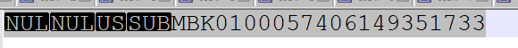

## 0x00 复古文档

根据 PK 查询不不到数据、根据其他索引字段可以查询到数据、根据 count 确认不同字段下数据量一致；

## 0x01 过程

- 先行随机校验数据

```sql
// 使用 min 函数可以查看到数据
MySQL [order-tidb]> select min(order_id) from t-order;
+----------------------------+
| min(order_id)              |
+----------------------------+
|   MBK0100057406149351733 |
+----------------------------+
1 row in set (0.12 sec)

// 执行 where 条件后返回为空
MySQL [tid b]> select * from t-order where order_id = 'MBK0100057406149351733';
Empty set (0.00 sec)

MySQL [ordertidb]> select max(order_id) from t-order;
+-----------------------------+
| max(order_id)               |
+-----------------------------+
| MBKÁ0060110911529542324199  |
+-----------------------------+
1 row in set (0.09 sec)

MySQL [order-tidb]> select order_id from t-order where order_id = 'MBKÁ0060110911529542324199';
+-----------------------------+
| order_id                    |
+-----------------------------+
| MBKÁ0060110911529542324199  |
+-----------------------------+
1 row in set (0.00 sec)
```

- 查看表结构

```sql
CREATE TABLE `t-order` (
  `order_id` varchar(35) NOT NULL COMMENT '订单ID',
  …… 省略其他信息
  PRIMARY KEY (`order_id`),
) ENGINE=InnoDB DEFAULT CHARSET=utf8 COLLATE=utf8_bin COMMENT='骑行订单表'
1 row in set (0.00 sec)
```

- 查询索引与数据是否一致
  - 2.0 版本，暂无 admin check table index 功能

```sql
// 查询 PK 与数据 行数是否一致
// 开始操作前调整 GC life 作为数据保底
update mysql.tidb set VARIABLE_VALUE = '1h' where VARIABLE_NAME = 'tikv_gc_life_time';

// 锁定 snapshot
MySQL [order-tidb]> set @@tidb_snapshot=now();
Query OK, 0 rows affected (0.01 sec)

// count 全表数据量查询
MySQL [order-tidb]> select count(*) from t-order;
+------------+
| count(*)   |
+------------+
| 1969978080 |
+------------+
1 row in set (3 min 4.04 sec)

// 使用 PK 查询数据量
MySQL [order-tidb]> select count(*) from t-order use index(`primary`);
+------------+
| count(*)   |
+------------+
| 1969978080 |
+------------+
1 row in set (3 min 56.73 sec)

// 得到结果数据一致
```

- 校验数据是否存在特殊字符

```sql
// 通过 base64 校验
MySQL [order-tidb]> select to_base64(min(order_id)) from t-order;
+--------------------------------------+
| to_base64(min(order_id))             |
+--------------------------------------+
| AAAfGk1CSzAxMDAwNTc0MDYxNDkzNTE3MzM= |
+--------------------------------------+
1 row in set (0.08 sec)

MySQL [order-tidb]> select to_base64('MBK0100057406149351733');
+-------------------------------------+
| to_base64('MBK0100057406149351733') |
+-------------------------------------+
| TUJLMDEwMDA1NzQwNjE0OTM1MTczMw==    |
+-------------------------------------+
1 row in set (0.00 sec)

// to base64 后得到得结果不一致，数据可能存在 UTF8 不可见字符
```

- 使用编辑器查看发现头部有不可见特殊字符



## 0x02 其他

> 2.0 版本处理相关问题时，其他知识点  
> table 内数据小于 1w 行，select point 使用 tablefullsacn 算子时正常现象

```sql
// PK(varchar) 在 2.0 版本中强制使用索引查询 / PK(varchar) 需要 TiDB 分配 tidb_rowid 作为 handle id 使用
MySQL [order-tidb]> explain select count(*) from trip_order use index(`primary`);
+----------------+--------------+----------------+------+------------------------------------------------------------------------+----------+
| id             | parents      | children       | task | operator info                                                          | count    |
+----------------+--------------+----------------+------+------------------------------------------------------------------------+----------+
| IndexScan_16   | StreamAgg_8  |                | cop  | table:trip_order, index:order_id, range:[<nil>,+inf], keep order:false | 10000.00 |
| StreamAgg_8    |              | IndexScan_16   | cop  | , funcs:count(1)                                                       | 1.00     |
| IndexReader_18 | StreamAgg_17 |                | root | index:StreamAgg_8                                                      | 1.00     |
| StreamAgg_17   |              | IndexReader_18 | root | , funcs:count(col_0)                                                   | 1.00     |
+----------------+--------------+----------------+------+------------------------------------------------------------------------+----------+
4 rows in set (0.01 sec)

// PK(int) 在 2.0 版本中强制使用索引查询 / PK(int) 等于 row handle id
MySQL [order-tidb]> explain select count(*) from trip_order use index();
+----------------+--------------+----------------+------+-------------------------------------------------------+----------+
| id             | parents      | children       | task | operator info                                         | count    |
+----------------+--------------+----------------+------+-------------------------------------------------------+----------+
| TableScan_15   | StreamAgg_8  |                | cop  | table:trip_order, range:[-inf,+inf], keep order:false | 10000.00 |
| StreamAgg_8    |              | TableScan_15   | cop  | , funcs:count(1)                                      | 1.00     |
| TableReader_17 | StreamAgg_16 |                | root | data:StreamAgg_8                                      | 1.00     |
| StreamAgg_16   |              | TableReader_17 | root | , funcs:count(col_0)                                  | 1.00     |
+----------------+--------------+----------------+------+-------------------------------------------------------+----------+
4 rows in set (0.00 sec)

MySQL [order-tidb]> explain select count(*) from trip_order use index( );
+----------------+--------------+----------------+------+-------------------------------------------------------+----------+
| id             | parents      | children       | task | operator info                                         | count    |
+----------------+--------------+----------------+------+-------------------------------------------------------+----------+
| TableScan_15   | StreamAgg_8  |                | cop  | table:trip_order, range:[-inf,+inf], keep order:false | 10000.00 |
| StreamAgg_8    |              | TableScan_15   | cop  | , funcs:count(1)                                      | 1.00     |
| TableReader_17 | StreamAgg_16 |                | root | data:StreamAgg_8                                      | 1.00     |
| StreamAgg_16   |              | TableReader_17 | root | , funcs:count(col_0)                                  | 1.00     |
+----------------+--------------+----------------+------+-------------------------------------------------------+----------+
4 rows in set (0.00 sec)
```
