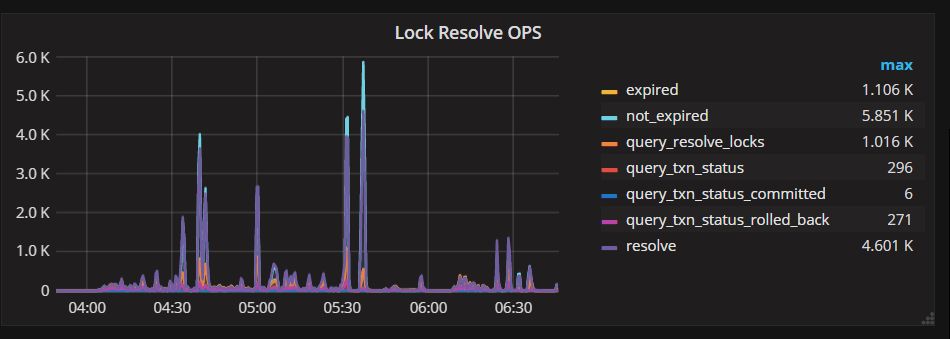
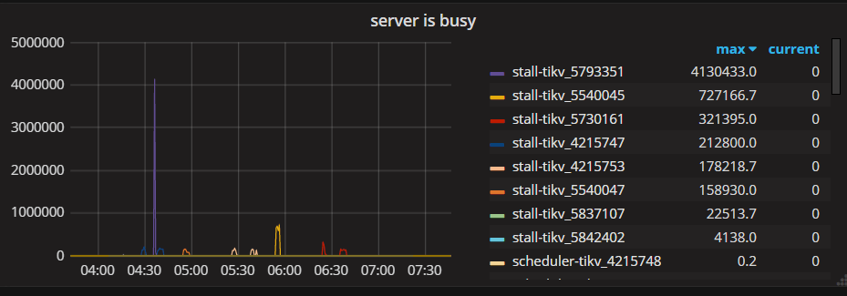
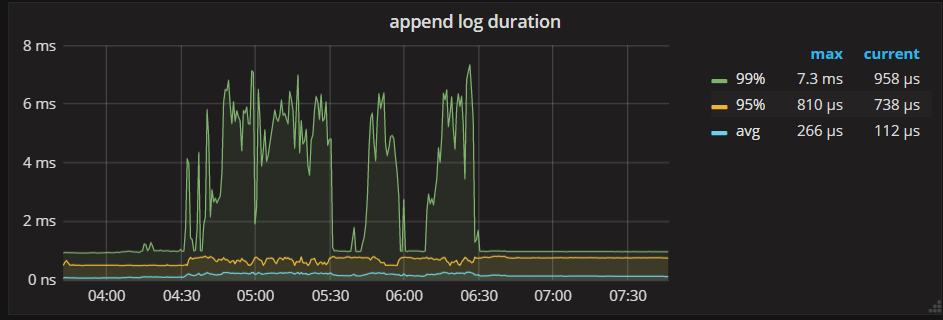
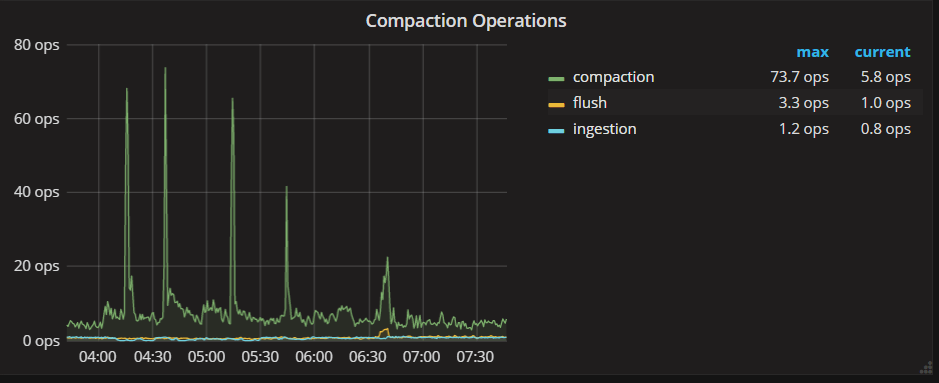
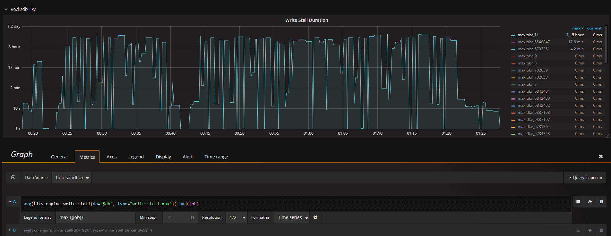

## 0x00 告警

- TiDB 与 TiKV 出现大量 backoff；触发 backoff 告警阈值
  - 相应时间段 tidb kv error 监控趋势升高
  - 相应时间段 tikv thread cpu / apply cpu 监控趋势升高

```json
[FIRING:1] TiDB_tikvclient_region_err_total tidb 1-1-1-9_4000 tidb stale_epoch (tidb increase( tidb_tikvclient_region_err_total[10m] )  > 6000 emergency prometheus)
cluster: tidb, instance: 1-1-1-9_4000, values:7059.979666666667 TiDB tikvclient_backoff_count error 7059.979666666667
Alerts Firing:
Labels:
 - alertname = TiDB_tikvclient_region_err_total
 - cluster = tidb
 - env = tidb
 - expr = increase( tidb_tikvclient_region_err_total[10m] )  > 6000
 - instance = 1-1-1-9_4000
 - job = tidb
 - level = emergency
 - monitor = prometheus
 - type = stale_epoch
Annotations:
 - description = cluster: tidb, instance: 1-1-1-9_4000, values:7059.979666666667
 - summary = TiDB tikvclient_backoff_count error
 - value = 7059.979666666667
Source: http://1.1.1.9:9090/graph?g0.expr=increase%28tidb_tikvclient_region_err_total%5B10m%5D%29+%3E+6000&g0.tab=1
```

## 0x01 监控

> 如不确定趋势为正常状态，请采用划分时间对比方式评估，然后合理进行怀疑











### 二次确认

- {{tikv_deploy_dir}}/db/LOG 日志内搜索 `Stalling writes` 关键词

```log
2018/08/06-00:18:17.562487 7f23db1ff700 [WARN] [/home/jenkins/.cargo/git/checkouts/rust-rocksdb-82ef6e5337b3fbe6/9a1c83c/librocksdb_sys/rocksdb/db/column_family.cc:696] [write] Stalling writes because we have 21 level-0 files rate 13421772
2018/08/06-00:18:17.562509 7f23db1ff700 [/home/jenkins/.cargo/git/checkouts/rust-rocksdb-82ef6e5337b3fbe6/9a1c83c/librocksdb_sys/rocksdb/db/external_sst_file_ingestion_job.cc:231] [AddFile] External SST file /data1/deploy1/data/snap/rev_514666_37_190_write.sst.clone was ingested in L0 with path /data1/deploy1/data/db/23352686.sst (global_seqno=0)
```

### 排查思路图


## 0x02 原因

- Write stall
  - RocksDB L0 层的文件数量超过流控阈值，默认超过 20 * region 会减缓该节点写入，超过 36 个会停止该节点写入
  - L0 层文件的减少需要 compaction 操作，将 L0 文件合并排序后写入到 L1 层「粗略计算需要 region-size * 2 的 IOPS（读、压缩、写入）」
  - 2.0 版本 compaction 是单线程工作；会出现 写入速度过快、compaction 跟不上或者磁盘跟不上的场景

- 临时解决方案 1
  - 确定**磁盘**是否还有 IOPS 余量，如果无余量请扩容 TiKV 集群机器
  - 调整 `[rocksdb.writecf]` 和 `[rocksdb.defaultcf]` 以下参数

    ```toml
    # level0-file-num-compaction-trigger = 4
    # 达到 4 个文件开始 compaction

    # level0-slowdown-writes-trigger = 20
    # 达到 20 个文件，放慢写入速度

    # level0-stop-writes-trigger = 36
    # 达到 36 个文件，停止写入
    ```

> Update: 3.0 以后版本加入 `max-sub-compaction = 2` 参数，加快 compaction sst 动作

- 临时解决方案 2
  - RocksDB 总 7 层，L0 - L1 未开启压缩
  - 将 L0 与 L1 修改为 lz4 压缩算法；如不熟悉请勿操作

    ```toml
    # compression-per-level = ["no", "no", "lz4", "lz4", "lz4", "zstd", "zstd"]
    ## Compression method (if any) is used to compress a block.
    ##   no:     kNoCompression
    ##   snappy: kSnappyCompression
    ##   zlib:   kZlibCompression
    ##   bzip2:  kBZip2Compression
    ##   lz4:    kLZ4Compression
    ##   lz4hc:  kLZ4HCCompression
    ##   zstd:   kZSTD
    ```
