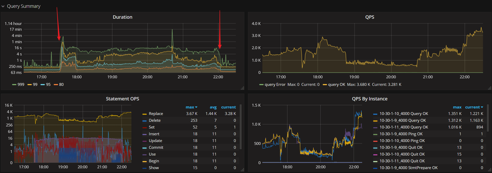
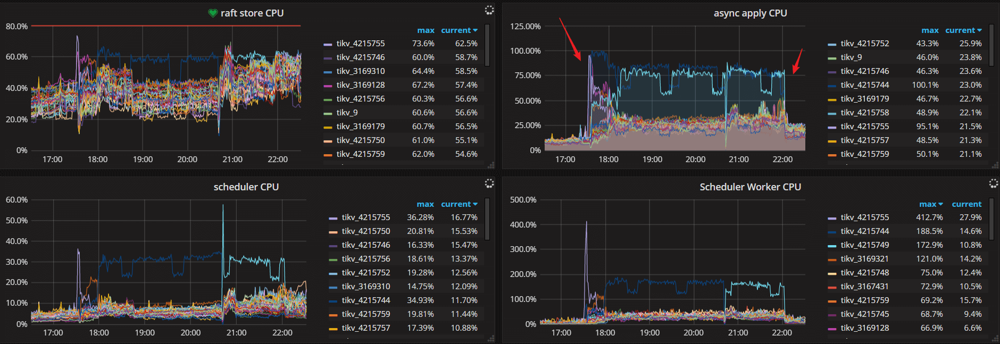
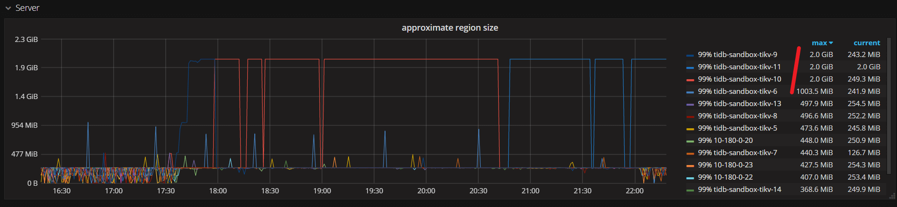
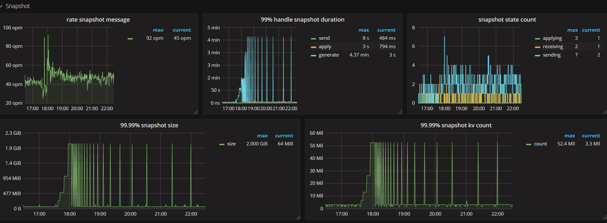
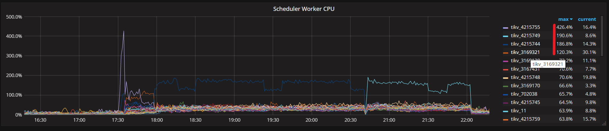
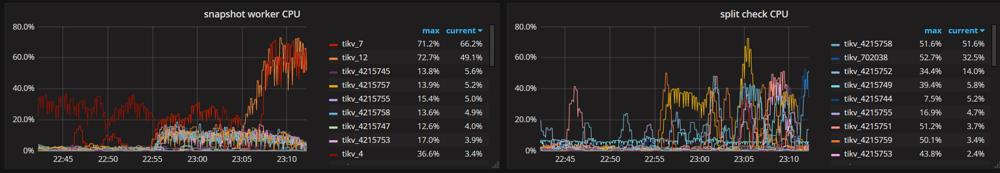
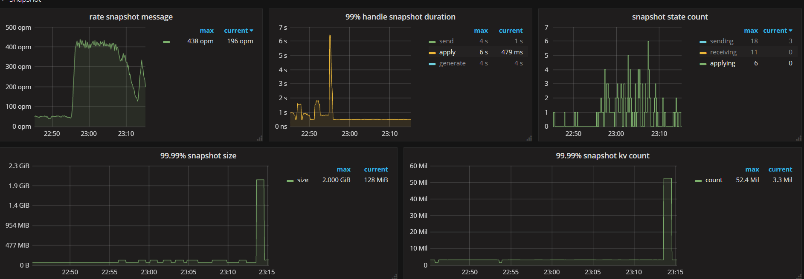
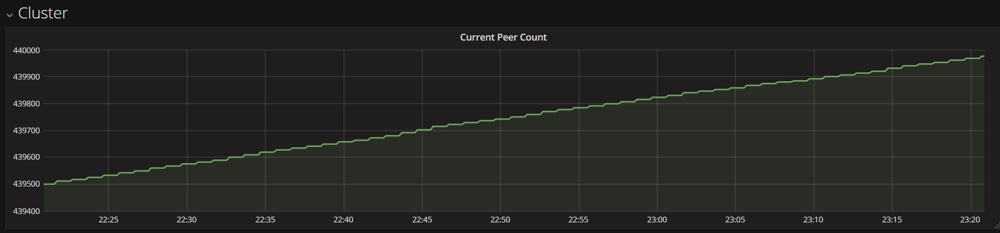

## 0x00 元

> 收到监控 & 业务告警，内容为目前 QPS duration > 1s  
> 首先排查监控缩小范围

  
  
  
  
  

> 交叉信息判定为 region 超过 144mb 以后未分裂，造成 get snapshot 持续失败，同时 region 过大造成**写入和读取**数据动作资源消耗过大  
> SQL 读取数据时 tikv 向命中每 region 发送单次 tikvRPC 请求；由于 region 过大，可能包含该 SQL 命中的所有数据，造成 tikvRPC 数据包过大  
> 写入数据时，region 数量大于过半时才能提交成功，region 过大造成无法 compaction 、被 PD schedule region 时成本加大、region 内查询数据成本过大等  

### region spilt

> 正常流程

1. 初始化 region ，region id 2
2. region id 2 写入数据达到 144MB
3. region id 2 接收 split 操作
   1. region 从尾部追加写入
   2. 切割时从头部粗略计算 96mb
   3. 保持尾部 id 不变、尾部可持续写入
4. region id 2 分列成 id 2 & id 10 两个 region / 其中 id 2 为 48mb，id 10 为 96mb（实际非精准计算）

> 异常场景

- 数据写入过快时，磁盘或者 split cpu work 跟不上时可能会出现 split 持续失败
  - region spilt 单线程工作，前期版本 reigon spilt 根据 IO 大小扫描 96mb 后执行 split
  - 会实际消耗 96mb 扫描 region 的 IOPS / 消耗创建新 region + 创建 snapshot 等 IOPS

### 0x01 二次确认

### TiKV 日志

```log
2018/08/10 22:13:03.168 scheduler.rs:1306: [ERROR] 
    get snapshot failed for cids=[1792370849], error Request(message: "region is stale" 
        stale_epoch {new_regions {id: 4351912 
            start_key:"t\200\000\000\000\000\0009\377\364_i\200\000\000\000\000\377\000\000\003\001A336\3770001\37762\000\377\000\000\000\000\000\371\003\216\377\000\000\001\344\317\341i\000\376" 
            end_key: "t\200\000\000\000\000\0009\377\364_i\200\000\000\000\000\377\000\000\003\001A760\3770035\37733\000\377\000\000\000\000\000\371\003\200\377\000\000\000\000\2233\242\000\376" 
        region_epoch {conf_ver: 1153 version: 15846} peers {id: 4351914 store_id: 4215749} peers {id: 4351915 store_id: 3169321} peers {id: 4841324 store_id: 8}} 
    new_regions {id: 4841440 
            start_key: "t\200\000\000\000\000\0009\377\364_i\200\000\000\000\000\377\000\000\003\001A120\3770031\37739\000\377\000\000\000\000\000\371\003\200\377\000\000\000\000V\311\254\000\376" 
            end_key: "t\200\000\000\000\000\0009\377\364_i\200\000\000\000\000\377\000\000\003\001A336\3770001\37762\000\377\000\000\000\000\000\371\003\216\377\000\000\001\344\317\341i\000\376" 
        region_epoch {conf_ver: 1153 version: 15846} peers {id: 4841441 store_id: 4215749} peers {id: 4841442 store_id: 3169321} peers {id: 4841443 store_id: 8}}})
```

### Region meta

```json
» region 4803248
{
  "id": 4803248,
  "start_key": "t\\x80\\x00\\x00\\x00\\x00\\x00:\\xff$_r\\x80\\x00\\x00\\x00'\\xffױ\\xf4\\x00\\x00\\x00\\x00\\x00\\xfa",
  "end_key": "",
  "epoch": {
    "conf_ver": 1159,
    "version": 17467
  },
  "peers": [
    {
      "id": 4227577,
      "store_id": 4215744
    },
    {
      "id": 4803248,
      "store_id": 4215749
    },
    {
      "id": 4804713,
      "store_id": 4
    }
  ],
  "leader": {
    "id": 4803248,
    "store_id": 4215749
  },
  "pending_peers": [
    {
      "id": 4804713,
      "store_id": 4
    }
  ],
  "written_bytes": 267,
  "approximate_size": 124183 // 此处是 MB 大小。正常应该再 144M 以内
}
```

### 0x02 修复

- 查看 split 线程状态使用用 `strace -p "tid of split worker"`
  - strace 会阻断程序运行，谨慎使用

- 使用 PD-ctl 工具手工发起 split region 请求

    ```json
    >> operator add split-region 1 --policy=approximate     // 将 Region 1 对半拆分成两个 Region，基于粗略估计值
    >> operator add split-region 1 --policy=scan            // 将 Region 1 对半拆分成两个 Region，基于精确扫描值
    ```

  
  
  
