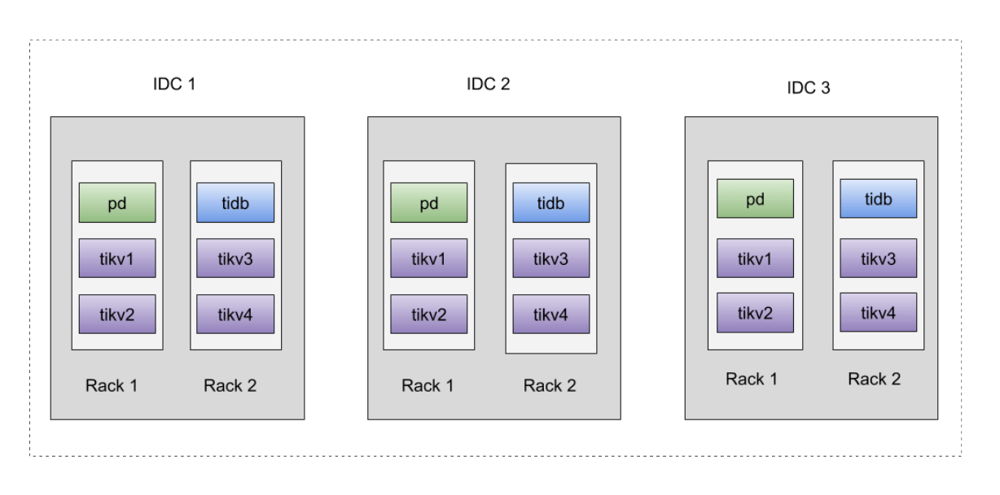
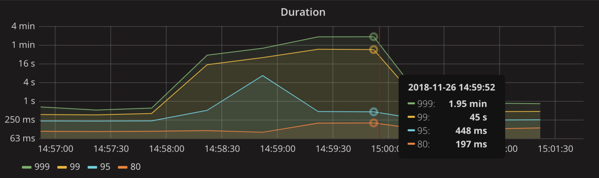
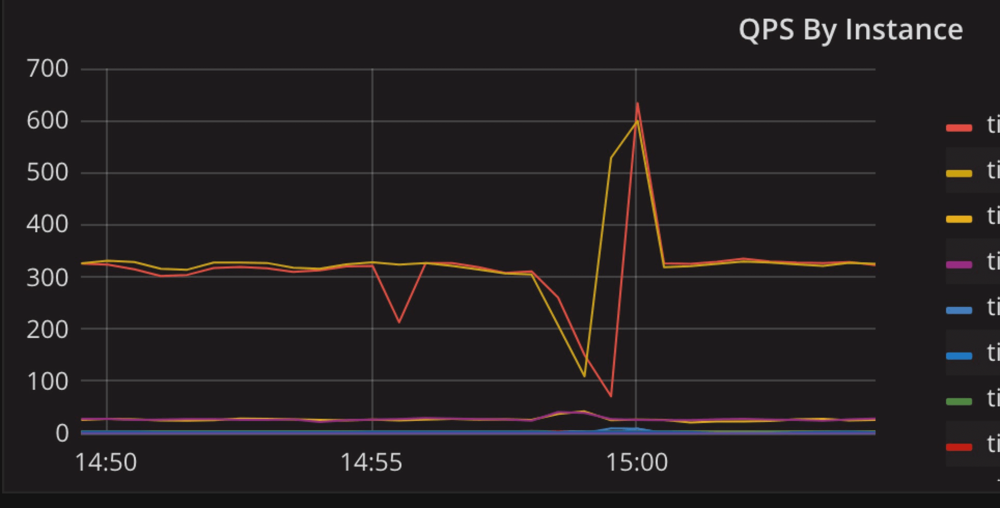
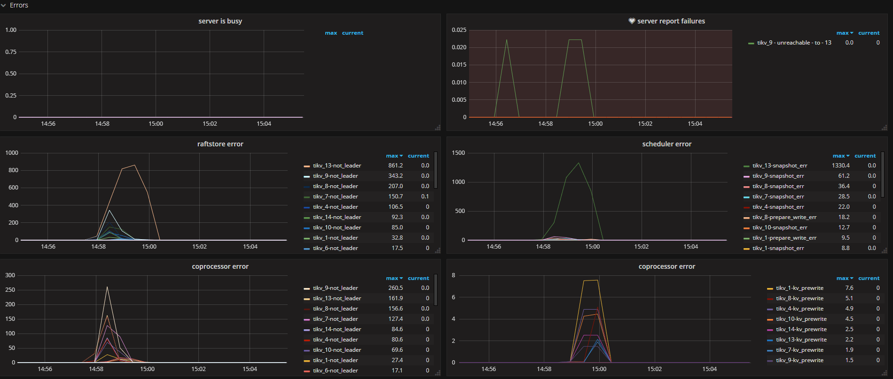
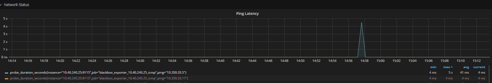
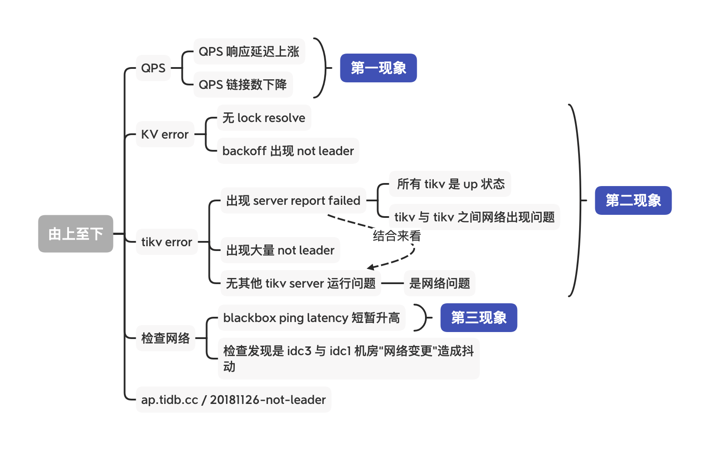
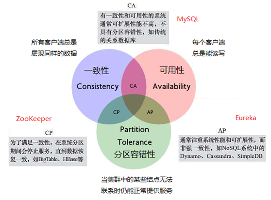
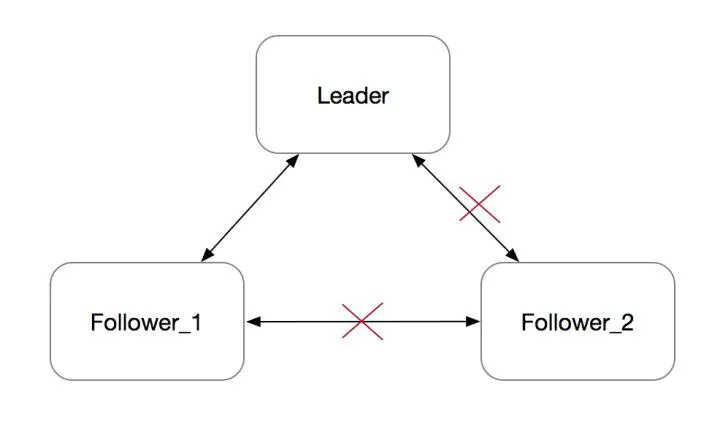

## 0x00 监控

使用云机房物理机设备组建同城三中心方式部署  
部署时已知 idc3 与其他两个机房 ping latency 稍高，大约在 1 - 3 ms 之间，idc1 与 idc2 机房延迟稳定在 1ms 以内  

## 0x01 架构

### 排查思路

## 0x02 原因

- 14:56:30 - 14:58:00 时间出现网络抖动
  - TiKV to TiKV 之间出现 region 心跳链接断开发起重新选举
- 14:58 region 重新被选举过程中遇到 TiDB 读取数据
  - TiKV 经 backoff 返回 not leader 消息
- 整体场景是某个节点被网络隔离后出现的问题（CAP 隔离）

### prevote

Follower_2 在 electionTimeout 没收到心跳之后, 会发起选举，并转为 Candidate。每次发起选举时，会把 Term 加一。由于网络隔离，它既不会被选成 Leader，也不会收到 Leader 的消息，而是会一直不断地发起选举。Term 会不断增大。

一段时间之后，这个节点的 Term 会非常大。在网络恢复之后，这个节点会把它的 Term 传播到集群的其他节点，导致其他节点更新自己的 term，变为 Follower。然后触发重新选主，但这个旧的 Follower_2 节点由于其日志不是最新，并不会成为 Leader。整个集群被这个网络隔离过的旧节点扰乱，显然需要避免的。

> Raft 作者博士论文《CONSENSUS: BRIDGING THEORY AND PRACTICE》的第 9.6 节 "Preventing disruptions when a server rejoins the cluster" 提到了 PreVote 算法的大概实现思路。

在 PreVote 算法中，Candidate 首先要确认自己能赢得集群中大多数节点的投票，这样才会把自己的 term 增加，然后发起真正的投票。其他投票节点同意发起选举的条件是（同时满足下面两个条件）：

没有收到有效领导的心跳，至少有一次选举超时  
Candidate 的日志足够新（Term 更大，或者 Term 相同 raft index 更大）  
PreVote 算法解决了网络分区节点在重新加入时，会中断集群的问题。在 PreVote 算法中，网络分区节点由于无法获得大部分节点的许可，因此无法增加其 Term  
然后当它重新加入集群时，它仍然无法递增其 Term，因为其他服务器将一直收到来自 Leader 节点的定期心跳信息。一旦该服务器从领导者接收到心跳，它将返回到 Follower 状态，Term 和 Leader 一致  
