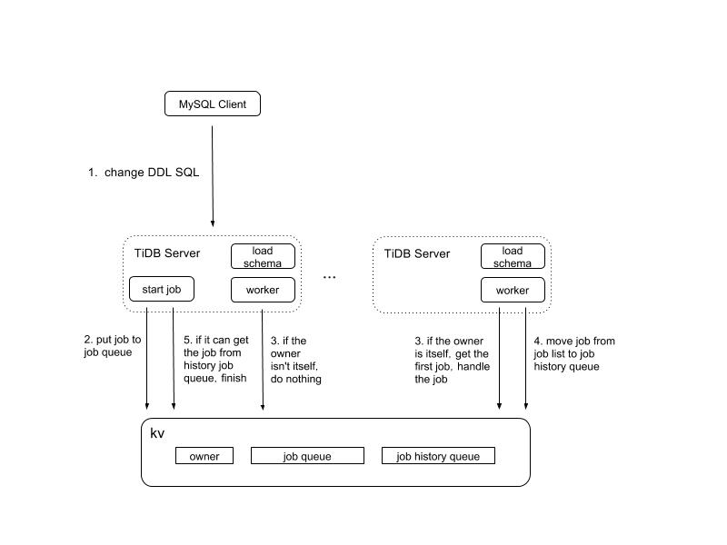
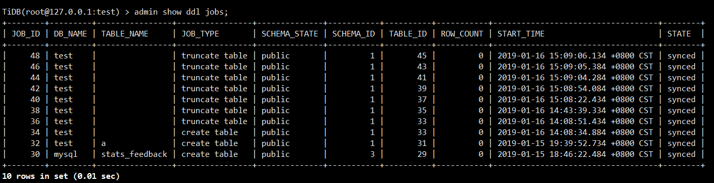
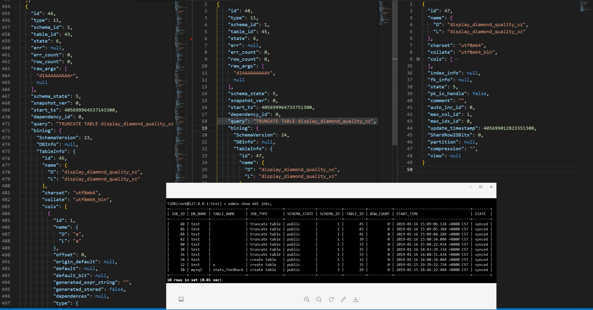

## 0x00 元

> tidb ddl 3.0 版本之前只有一个队列提供服务，所有 ddl 都要在这个队列阻塞  

- 多个 TiDB-server 会先选举 DDL owner
  - TiDB 配置文件中的 `run-ddl = false` 该节点不支持运行 DDL
- DDL owner 处理所有 DDL 信息
  - 更多可阅读 [TiDB 异步 schema 变更实现](https://github.com/ngaut/builddatabase/blob/master/f1/schema-change-implement.md) 文档
  - add index 是所有 DDL 中最耗时的
  - 其他 DDL 均为修改元数据信息，秒级以内可返回



> ddl history 功能来自 [TiDB-API](https://github.com/pingcap/tidb/blob/master/docs/tidb_http_api.md)

- 通过 API 获取到指定 tidb cluster 集群“自搭建成功”到“现在运行”的所有 DDL 记录
  - 早前版本数据输出时所有数据「json」都在一行，通过 jq 命令或者 python 格式化之后会比较方便查看信息
  - [PR #9104](https://github.com/pingcap/tidb/pull/9104) 之后的版本优化了「大一行」输出
  - ~~ddl/history 早前版本获取到 DDL 的信息「不完整」，信息记录了 truncate 当前版本的变更，没有记录 truncate 变更后的信息；问题早已修复~~

```json
#Get all TiDB DDL job history information.

curl http://{TiDBIP}:10080/ddl/history

#Get count {number} TiDB DDL job history information.

curl http://{TiDBIP}:10080/ddl/history?limit={number}
```

- 通过 API 获取指定 db 下所有表、指定 table id、指定 db.table 的 json 元信息

```json
# Get schema Information about db

curl http://{TiDBIP}:10080/schema/{db}


# Get schema Information about db.table, and you can get schema info by tableID (tableID is the unique identifier of table in TiDB)

curl http://{TiDBIP}:10080/schema/{db}/{table}

curl http://{TiDBIP}:10080/schema?table_id={tableID}
```

## 0x01 Admin show ddl

TiDB-server 除 API 功能还有个 [admin show ddl jobs 与 admin show ddl jobs 100](https://docs.pingcap.com/tidb/stable/sql-statement-admin#admin-show-ddl)(该语句需要 3.0 版本以上，输出最近 100 条信息)



## 0x02 Truncate

- truncate table DDL 操作是通过 DROP table + Create table 组成实现，table id 会紧随更改 「DDL 操作 “元信息” 数据」
  - 图片中的首行 ID 是 DDL job ID
  - 每次 truncate table 后的 table_id 会变化「scheme id、table id 、ddl job id 共用同一套计数器」



## 0x03 Json

- 以下为某张表的元信息展示「通过 tidb 4.0 补测」

```json
{
 "id": 47,          // table id
 "name": {
  "O": "sbtest1",  // 原始输入展示
  "L": "sbtest1"   // 程序强转小写展示
 },
 "charset": "utf8mb4",
 "collate": "utf8mb4_bin",
 "cols": [
  {
   "id": 1,         // 列 id
   "name": {        // 列名
    "O": "k",
    "L": "k"
   },
   "offset": 0,     // 以下为 列关键特性
   "origin_default": null,
   "origin_default_bit": null,
   "default": null,
   "default_bit": null,
   "default_is_expr": false,
   "generated_expr_string": "",
   "generated_stored": false,
   "dependences": null,
   "type": {
    "Tp": 3,
    "Flag": 515,
    "Flen": 11,
    "Decimal": 0,
    "Charset": "binary",
    "Collate": "binary",
    "Elems": null
   },
   "state": 5,
   "comment": "",
   "hidden": false,
   "version": 2
  },

 ],
 "index_info": [        // index 信息
  {
   "id": 1,
   "idx_name": {
    "O": "k_1",
    "L": "k_1"
   },
   "tbl_name": {
    "O": "",
    "L": ""
   },
   "idx_cols": [
    {
     "name": {
      "O": "k",
      "L": "k"
     },
     "offset": 1,
     "length": -1
    }
   ],
   "state": 5,
   "comment": "",
   "index_type": 1,
   "is_unique": false,
   "is_primary": false,
   "is_invisible": false,
   "is_global": false
  }
 ],                             // 以下为 tidb 在 table 级别的特性
 "constraint_info": null,       // 4.0 的新字符集架构
 "fk_info": null,               // 盲猜 foreign key
 "state": 5,
 "pk_is_handle": true,          // int 类型的 PK == true
 "is_common_handle": false,     // varchar 类型的 PK 或者联合主键 == true
                    // 表未设置主键时 pk_is_handle & is_common_handle 均为 false
 "comment": "",
 "auto_inc_id": 0,          // AUTO_INCREMENT 功能
 "auto_id_cache": 0,        // AUTO_ID_CACHE 自增 ID 缓存功能
 "auto_rand_id": 0,         // AUTO_RANDOM 功能
 "max_col_id": 4,
 "max_idx_id": 1,
 "max_cst_id": 0,
 "update_timestamp": 418539877049565193,
 "ShardRowIDBits": 0,       // SHARD_ROW_ID_BITS 功能
 "max_shard_row_id_bits": 0,
 "auto_random_bits": 0,     // 与 shard row id bits 结合使用
 "pre_split_regions": 0,    // pre split 预打散 table region 功能
 "partition": null,         // 是否为分区表
 "compression": "",         // 该表是否启用 「COMPRESSION [=] {'ZLIB'|'LZ4'|'NONE'}」 属性
 "view": null,              // 视图功能
 "sequence": null,          // sequence 功能
 "Lock": null,              // 盲猜 table lock，无证实
 "version": 3,
 "tiflash_replica": null    // tiflash 列存副本
}
```
