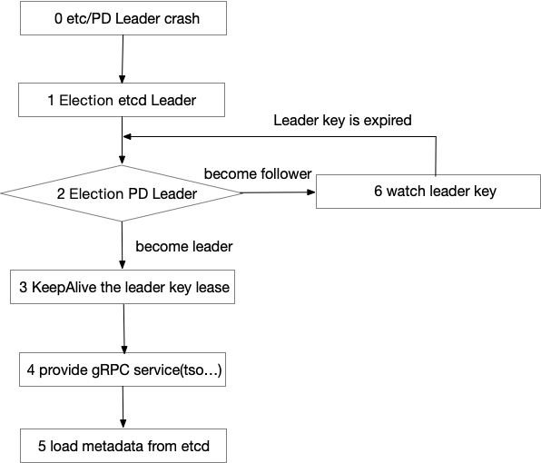

## 0x00 院子

MySQL 有个东东的叫 GTID（GTID = server_uuid:transaction_id）；它在 Binlog 文件中大概长这样【3E11FA55-71CA-99E1-9E10-C80AA9444562:10】.用于管理 MySQL 事物的状态和校验数据在事物之间的正确性。

TiDB 数据库有个类似的东东，由 PD 组件管理和发放。它叫做 TSO（timestamp oracle），长成这样的一个东东【395181938313123110】，是由 physical time + logical time 信息组合计算得到的东东。

> PD 的 TSO 使用的是中心式的混合逻辑时钟。PD 通过集成了 etcd ，保证了持久化数据的强一致性并且可以做到 auto failover，解决了集中式服务带来的单点故障问题。
> 
> 其使用 64 位表示一个时间，其中低 18 位代表逻辑时钟部分，剩余部分代表物理时钟部分，其结构如下图所示。由于其逻辑部分为 18 位，因此理论上每秒可以分配时间戳为 218 * 1000 = 262144000 个，即每秒可以产生 2.6 亿个时间戳。
> 

### 灌水

分布式数据库要实现全局一致性快照，需要解决不同节点之间时钟一致的问题。工业界目前有3种解决方案：

1. 全局集中式授时服务，对网络要求比较高，不能跨地域，理论上可以做到外部一致性【TSO 家族】
2. 混合逻辑时钟（HLC），可以保证同一个进程内部事件的时钟顺序，但是解决不了系统外事件发生的逻辑前后顺序与物理时间前后顺序的一致性，因此做不到 Linearizability，也就做不到外部一致性【比如隔壁小强家】
3. Google 的物理时钟 Turetime API，可以做到外部一致性，同时能做到全球化部署【土豪专属：卫星 GPS + 原子钟（硬件设备）】

## 0x01 院中

> 本文没 TSO 原理，聊聊使用场景就好了。

- [ ] 放空

## 0x02 烧水

- 通过 tso 解析为物理时间
  - 通过 pd-ctl 工具可以解析 tso 信息，并且可以得到 logic 位置点

  ```bash
  >> tso 395181938313123110

  system:  2017-10-09 05:50:59 +0800 CST
  logic:  120102
  ```

- 通过物理时间模糊计算 TSO 范围
  - `timestamp * (2^18*10^3)` 可以得到一个模糊的 TSO
  - 比如 `1588232534 * (2^18*10^3) = 416345629392896000`
  - linux 命令可以用 `date -d '01/12/2019 07:21:22' +"%s"`
  - macos 可以用 `date -j -f "%Y-%m-%d %H:%M:%S" "2019-01-13 18:02:00" "+%s"`


