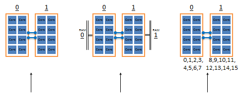
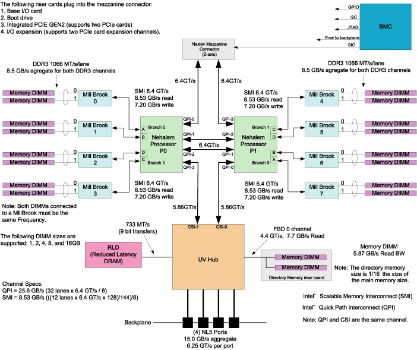

## 0x00 CCC

单个不够，数量来凑，太多人跑也会不规划好跑道容易干架；使用 Linux 软件 numactl 将服务进程绑定在目标 CPU 上，支持按 Vcore、物理 CPU 绑定。



## 0x01 numactl

> numactl --show  
> 查看当前调度策略，主要看 policy & preferred node

```bash
policy: default
preferred node: current
physcpubind: 0 1 2 3 4 5 6 7 8 9 10 11 12 13 14 15 16 17 18 19 20 21 22 23 24 25 26 27 28 29 30 31 32 33 34 35 36 37 38 39
cpubind: 0 1
nodebind: 0 1
membind: 0 1
```

> numactl --hardware 可以看到该服务器 CPU 插槽数量、计算核心信息、CPU & RAM 亲和关系

```bash
available: 2 nodes (0-1)
node 0 cpus: 0 2 4 6 8 10 12 14 16 18 20 22 24 26 28 30 32 34 36 38
node 0 size: 98210 MB
node 0 free: 22647 MB
node 1 cpus: 1 3 5 7 9 11 13 15 17 19 21 23 25 27 29 31 33 35 37 39
node 1 size: 98304 MB
node 1 free: 38192 MB
node distances:
node   0   1
  0:  10  21
  1:  21  10
```

> numactl --physcpubind=1,2,3,4 / --physcpubind=1-4 / --physcpubind=1,2-6,7-8 ${program}  
> 此处填写的是 numactl --hardware 中看见的 node cpus，也就是 0 - 39 这些数字  

```bash
exec numactl --physcpubind=39  bin/tidb-server \
    -P 4444 \
    --status="14080"
```

> numactl --cpunodebind=0 / --cpunodebind=1  
> 此处填写的是 numactl --hardware 中看见的 nodes ，也就是 0 - 1 ，该服务器只有两个物理 CPU  
> 使用 cpu node bind 时，需要配合 --membind=0 / 1 使用，在硬件物理上做到亲和性调优  

```bash
exec env GODEBUG=madvdontneed=1 numactl --cpunodebind=0 --membind=0 bin/tidb-server \
    -P 4444 \
    --status="14080"
```

> 不建议使用 --localalloc 锁定内存参数，该参数一般配合 --preferred （预分配内存）  

### 亲和性

> 图片引用 [Chapter 5. Data Placement Tools](http://www.nacad.ufrj.br/online/sgi/007-5646-002/sgi_html/ch05.html)  

双 CPU 服务器配合 8 条内存，单个 CPU 直系亲属为 4 条，分派 CPU 左右；隔壁 4 条内存可以通过共享使用。 cpu node bind = 1 、mem bind = 0 ，此时 cpu 使用内存时就要去邻居家才能用得到。



## 0x02 numastat

```bash
[tmpuser@jumphost scripts]$ numastat
                           node0           node1
numa_hit              1723819933      1011464781
numa_miss                      0               0
numa_foreign                   0               0
interleave_hit             60914           60922
local_node            1723800894      1011407642
other_node                 19039           57139
```

> miss 值和 foreign 值越高，就要考虑绑定的问题  

| l  | r |
--- | ---
| numa_hit | 为这个节点成功的分配尝试数
| numa_miss | 把内存访问分配到另一个 Node 节点的内存大小，这个值和另一个 Node 的 numa_foreign 相对应。
| numa_foreign | 另一个 Node 访问我的内存大小，与对方 Node 的 numa_miss 相对应
| interleave_hit | 成功分配给这个节点的尝试交错策略数
| local_node | 这个节点的进程成功在这个节点上分配内存访问的大小
| other_node | 这个节点的进程在其它节点上分配的内存访问大小

> numastat -m  
> 显示每个节点中，系统范围内使用内存的情况  

```bash
[tmpuser@jumphost scripts]$ numastat -m

Per-node system memory usage (in MBs):
                          Node 0          Node 1           Total
                 --------------- --------------- ---------------
MemTotal                98210.35        98304.00       196514.35
MemFree                 22488.77        38474.79        60963.56
MemUsed                 75721.59        59829.21       135550.79
Active                  50895.23        37680.84        88576.07
Inactive                17754.17        15100.92        32855.09
Active(anon)             8650.44         4834.63        13485.07
Inactive(anon)            943.71          442.16         1385.87
Active(file)            42244.79        32846.21        75091.00
Inactive(file)          16810.46        14658.76        31469.22
Unevictable                 0.00            0.00            0.00
Mlocked                     0.00            0.00            0.00
Dirty                       0.10            0.25            0.35
Writeback                   0.00            0.00            0.00
FilePages               61853.27        48834.27       110687.54
Mapped                    129.42          195.33          324.75
AnonPages                6796.43         3947.70        10744.13
Shmem                    2798.00         1329.29         4127.30
KernelStack                48.03           46.22           94.25
PageTables                 82.55           73.25          155.80
NFS_Unstable                0.00            0.00            0.00
Bounce                      0.00            0.00            0.00
WritebackTmp                0.00            0.00            0.00
Slab                     4346.52         4646.79         8993.30
SReclaimable             3976.43         4234.94         8211.37
SUnreclaim                370.09          411.84          781.93
AnonHugePages            5438.00         2968.00         8406.00
HugePages_Total             0.00            0.00            0.00
HugePages_Free              0.00            0.00            0.00
HugePages_Surp              0.00            0.00            0.00
```

> numastat -p PID  
> 将 tidb-server 绑定到 cpus 39 上的效果【cpu1 的最后一个核心】  

```bash
[tmpuser@jumphost scripts]$ numastat -p PID

Per-node process memory usage (in MBs) for PID 8059 (tidb-server)
                           Node 0          Node 1           Total
                  --------------- --------------- ---------------
Huge                         0.00            0.00            0.00
Heap                         0.00            0.01            0.01
Stack                        0.00            0.02            0.02
Private                      0.01           58.82           58.83
----------------  --------------- --------------- ---------------
Total                        0.01           58.84           58.86
```

## 0x03 taskset

> 针对当前已经运行的进程操作 cpubind  

```bash
[tmpuser@jumphost scripts]$ taskset -p 8059
pid 8059's current affinity mask: 8000000000

[tmpuser@jumphost scripts]$ taskset -pc 36,38 8059
pid 8059's current affinity list: 39
pid 8059's new affinity list: 36,38

[tmpuser@jumphost scripts]$ taskset -p 8059
pid 8059's current affinity mask: 5000000000
```
