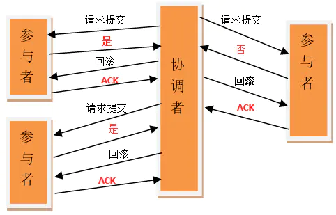
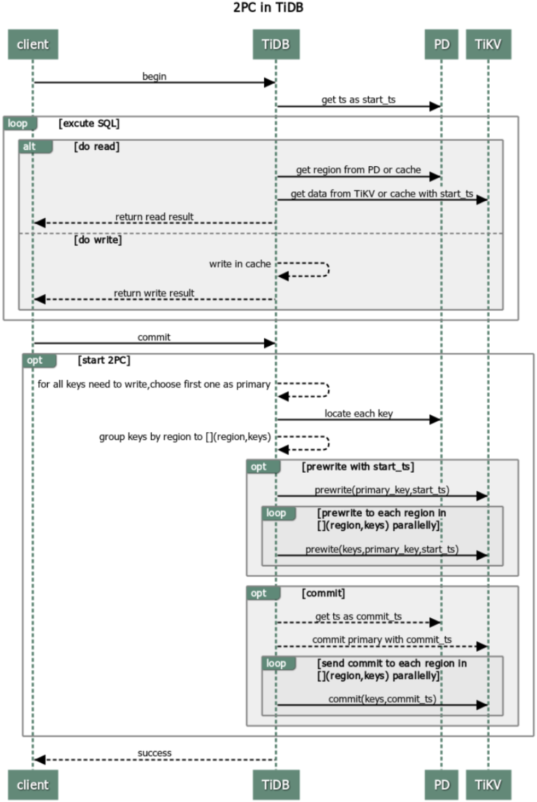
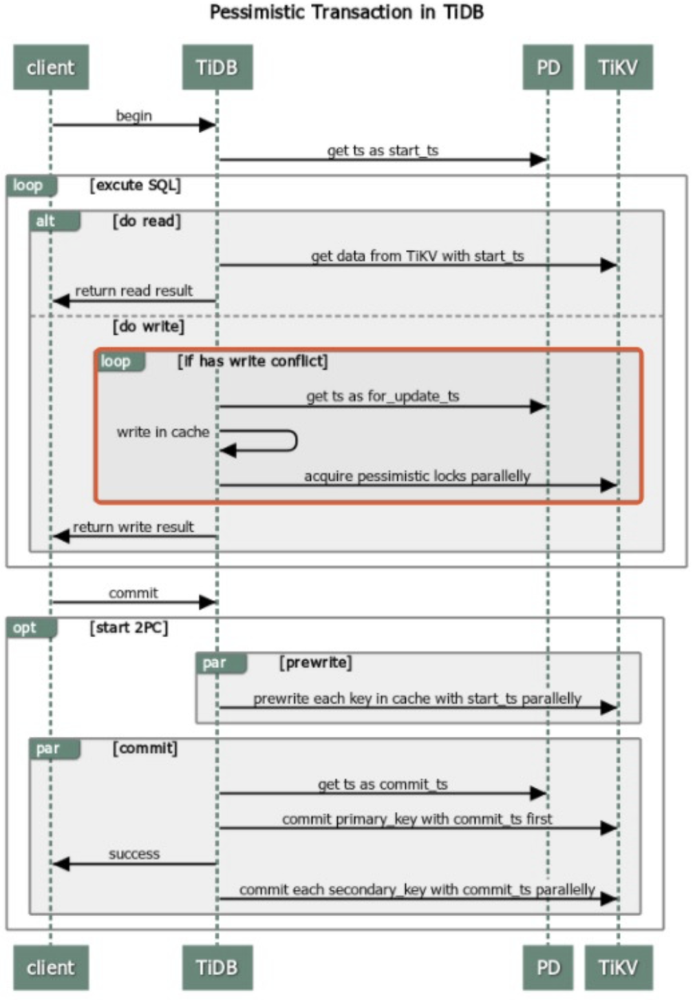
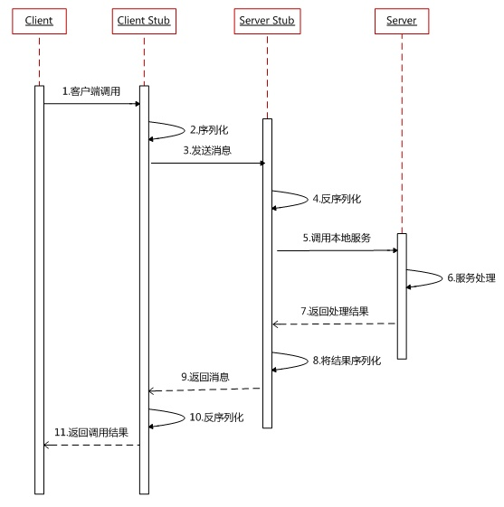

## 0x00 源

TiDB to TiKV 之间的网络状态(图片来自与 PingCAP 官网[锁冲突](https://docs.pingcap.com/zh/tidb/stable/troubleshoot-lock-conflicts))「该图包含悲观锁逻辑，来自 2020 年的 PingCAP 官网」；部分内容来自 [Google Percolator 的事务模型](https://github.com/ngaut/builddatabase/blob/master/percolator/README.md)。

## 0x01 2PC

2PC (Two-phaseCommit) 是指在计算机网络以及数据库领域内，为了使基于分布式系统架构下的所有节点在进行事务提交时保持一致性而设计的一种算法 (Algorithm)。第一阶段：准备阶段(投票阶段)和第二阶段：提交阶段（执行阶段）。

在分布式系统中，每个节点虽然可以知晓自己的操作时成功或者失败，却无法知道其他节点的操作的成功或失败。

当一个事务跨越多个节点时，为了保持事务的 ACID 特性，需要引入一个作为协调者的组件来统一掌控所有节点(称作参与者) 的操作结果，并最终指示这些节点是否要把操作结果进行真正的提交(比如将更新后的数据写入磁盘等等)，参与者将操作成败通知协调者，再由协调者根据所有参与者的反馈情报决定各参与者是否要提交操作还是中止操作。

> see store/tikv/2pc.go // 内容过于复杂，没有理解
> 2PC 模型

> 乐观锁 2PC in TiDB

  

> 悲观锁 2PC in TiDB

  

## 0x02 RPC

RPC（Remote Procedure Call Protocol 远程过程调用）是分布式架构的核心之一  

- TiDB 2.0 之后使用的 Google RPC 协议 [gRPC](https://godoc.org/google.golang.org/grpc)
  - 同步调用：客户端调用服务方方法，等待直到服务方返回结果或者超时，再继续自己的操作
  - 异步调用：客户端把消息发送给中间件，不再等待服务端返回，直接继续自己的操作

## 0x03 Backoff

网络之间建立链接会产生各种各样的状态，只做重连机制会造成网络拥堵或者网络风暴，backoff 机制降低资源开销「CPU、时间」，提高网络资源再次链接成功率。

- RPC 网络交互之间需要一个 backoff 机制 [gRPC backoff](https://godoc.org/google.golang.org/grpc/backoff)
  - Backoff 文档解释 [gRPC backoff protocol](https://github.com/grpc/grpc/blob/master/doc/connection-backoff.md)
  - Backoff Full jitter、Equal jitter、Decorrelated jitter、no jitter 性能测试 [Exponential Backoff And Jitter](https://aws.amazon.com/blogs/architecture/exponential-backoff-and-jitter/)

## 0x04 Resolve lock

> see store/tikv/lock_resolver.go

对应监控图 tidb dashboard -- kv error 中的 resolve lock 部分 `sum(rate(tidb_tikvclient_lock_resolver_actions_total[1m])) by (type)`

