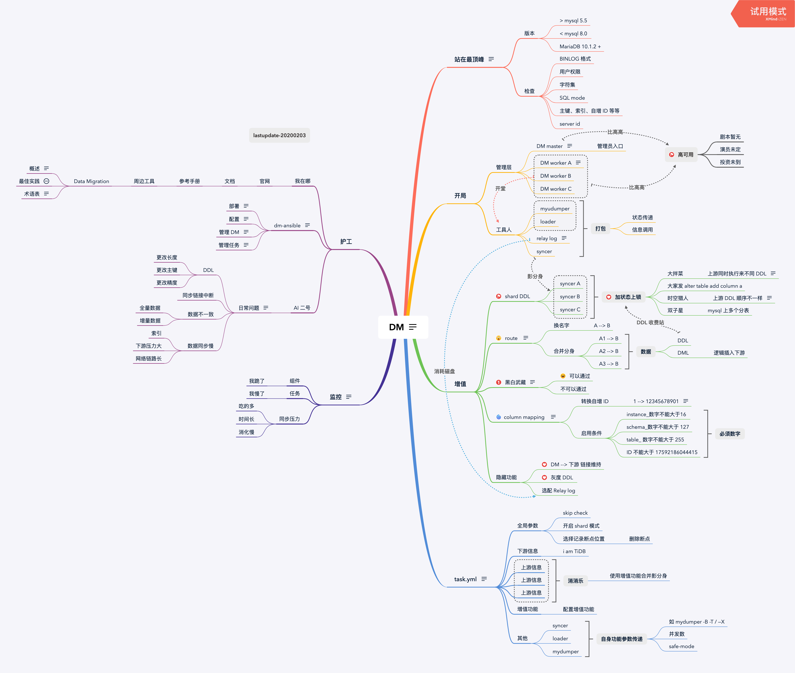

## 0x00 开局

> 本文仅记录了对 DM 的学习，处理问题经验慢慢补充（没有素材编场景）  
> 版本使用从 RC 到 v1.0.3 ；架构整体变化不大，有着上纲上线的框架守护  
> **本页内容没有干货**、学习 DM 使用请关闭本页去 PingCAP [官网文档](https://pingcap.com/docs-cn/stable/reference/tools/data-migration/overview/#dm-%e6%9e%b6%e6%9e%84)  

## 0x01 一

> DM (Data Migration) 是一体化的数据同步任务管理平台，支持从 MySQL 或 MariaDB 到 TiDB 的全量数据迁移和增量数据同步。使用 DM 工具有利于简化错误处理流程，降低运维成本。  
> 如有 Syncer、Loader、MyDumper 使用经验，学习速度加倍  

DM 设计之初是将之前常用的三组件（Syncer、Loader、MyDumper ）数据同步方式做了一个打包集合体，然后加了一些增值管理功能来维护同步任务，同时增加 **sharding ddl lock、auto increment ID 重写**两个刚需功能。  
此处回顾一句话 *“如果整篇文章你只想记住一句话，那就是数据条数少于 5000w 的场景下通常用不到 TiDB，TiDB 是为大规模的数据场景设计的。如果还想记住一句话，那就是单机 MySQL 能满足的场景也用不到 TiDB（[文字传送门](https://pingcap.com/blog-cn/how-to-use-tidb/)）”*。  
数据群体来自于分库分表，如果不支持 sharding ddl 、auto increment ID 那么帮助客户导入数据呢？之前方案 Syncer 同步数据如果有 DDL 就主动退出，等所有分片退出后手动下游执行 DDL，跳过 DDL 后启动 Syncer 继续同步（对于不频繁操作 DDL 场景能用）。  
DM 主要包括三个组件：DM-master，DM-worker 和 dmctl。其中 DM Worker 内打包了 （Syncer、Loader、MyDumper ）；DM master 管理 sharding ddl 状态和同步任务状态，DM-ctl 是运维管理入口。  

创造来下图这个架构流程来同步 MySQL、MariaDB 的数据到 TiDB cluster ⬇️：  

- 想要了解 DM 可阅读[官网文档](https://pingcap.com/docs-cn/stable/reference/tools/data-migration/overview/#dm-%e6%9e%b6%e6%9e%84)（toc 直达车）
  - 四大[增值功能](https://pingcap.com/docs-cn/stable/reference/tools/data-migration/features/overview/)
  - 使用场景：[单库同步场景](https://pingcap.com/docs-cn/stable/reference/tools/data-migration/usage-scenarios/simple-synchronization/)
    - 分库分表[最佳实践](https://pingcap.com/docs-cn/stable/reference/tools/data-migration/usage-scenarios/best-practice-dm-shard/)
  - [安装方式](https://pingcap.com/docs-cn/stable/reference/tools/data-migration/deploy/)
  - 同步会话相关
    - task [配置手册](https://pingcap.com/docs-cn/stable/reference/tools/data-migration/configure/task-configuration-file/)
    - [任务管理](https://pingcap.com/docs-cn/stable/reference/tools/data-migration/manage-tasks/)
  - [监控信息](https://pingcap.com/docs-cn/stable/reference/tools/data-migration/monitor/)
  - [术语表](https://pingcap.com/docs-cn/stable/reference/tools/data-migration/glossary/)

## 0x02 张

通过这张图（下面这张图有 2MB ⬇️）复习下 DM 框架架构（图片按照顺时针的方式查看）：  

这张图将 DM 整体流程划分 上游、开局（框架结构）、增值（核心功能）、task.yml（任务配置）、运维（部署、监控 、日常运维）五个部分；本图不是一概而全，只是列出一些关键信息方便浏览和阅读。

> 自我诡辩，DM 架构是在 syncer、loader 架构上做了个打包，然后使用 DM 做了几个同步数据的项目场景，然后绘制此图。改图肯定还有一些遗漏和错误，仅供参考。

顺时针介绍了 DM 支持上游的 Mysql、MariaDB 版本信息，不在版本范围中的可能会遇见 Binlog 数据不兼容问题，mysql 5.5 到 5.7 横跨近十年的产品，在早起版本和最新版本上有很多数据相关的优化，特定优化需要做相关的兼容性。  
第二、第三两个小节介绍 DM master、DM workder 架构与 DM worker 内部逻辑、DM 核心功能。目前 DM 还没有物理结构的高可用方案，链路上的高可用方案目前有下游到 TiDB 的心跳保持。DM master 管理同步数据任务与 sharding ddl 状态，DM worker 处理数据导出、数据导入、增量数据同步工作（DM worker 与上游 instanceDB 一一绑定工作，无法切换自身状态）。DM 的核心功能中的 route、黑白名单与之前 Syncer 上的一样，只不过此处填写 values 时全部按照上游的信息填写（syncer 在使用 route 后需要按照下游写黑白名单）。而剩下两个功能一个是自动维护的，另一个 column mapping 是人工指定的，在使用上有比较大的限制，如果业务代码中有使用 auto increment id 做业务属性关联，使用 column mapping 改写数据会导致业务失效的，新业务推荐此处修改为全局 UUID 、sequence ID、业务流水号等作为全局唯一 KEY。  
第四小节 task yaml 说了下配置文件内从上到下的划分功能，全局是针对该同步任务的一些开关操作（比如 shard、检查项、断点信息、心跳信息、数据工作模式等），然后是 上下游信息，此处下游信息仅此处填写一个、上游信息支持填写多个 instance （每个 instance 对应一个 DM worker，然后通过 DM-master 配置文件映射到上游的 mysql 实例），在上游 instance 区域内可以选择使用 route、column mapping 、黑白名单等功能（类似与先声明函数然后调用执行函数块）。接下来是声明 route、黑白名单、column mapping 功能了，这部分仅仅是书写规则，在不被调用的情况下是不会开启的。最后这部分是一些特殊参数，关于 syncer、loader、mydumper 原本自身携带的特性，需要通过配置文件传递给这些组件来运行。  
第五、第六两个小节是记录了下 DM 监控和 DM 文档的位置，从这些地方可以看到 DM 相关的文档信息。  

## 0x03 图

> ToDo：此处准备整理几个容易出问题的场景介绍下（预计在未来一个月时间凑够蔬菜做饭 20200315）

- [ ] 数据不一致
- [ ] 数据同步慢
- [ ] 服务启动失败
- [ ] 数据重新同步
