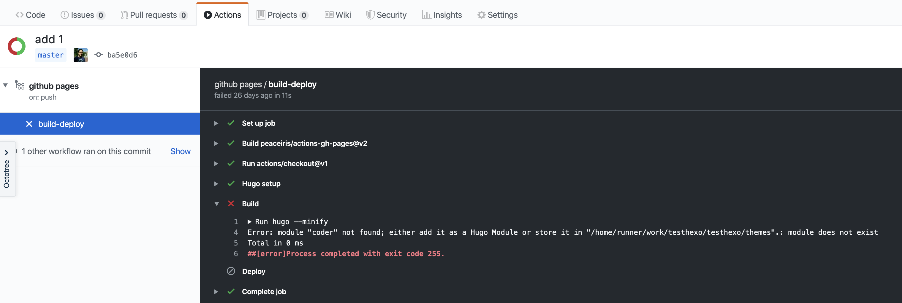
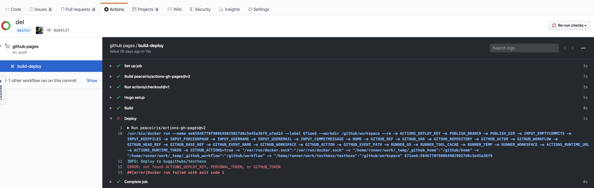
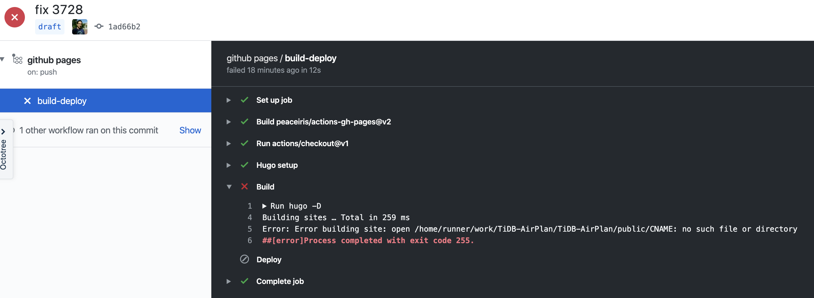
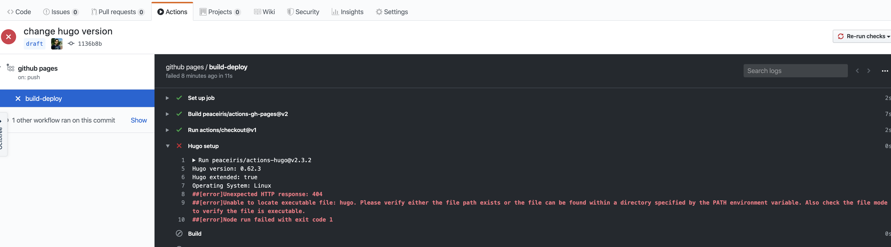

## 0x00 上帝说有光

目标：~~持续~~ tidb.cc 域名的运转  
初衷：~~让更多的人了解 xxxx 产品~~  
内核：~~提升自身技能以及建立良性记录~~  
动力：装逼 ~~助力 OKR、分享与讨论技术的真实性、考核自身对产拼的理解能力、管控自身 GTD~~  

走上选型之路，从 wordpress、typecho 等 PHP 网站程序到后面静态网页生成工具 hexo、hugo 等；综合审判实力以及时间等因素，静态网页 & Gitpage 更适合比较懒的我(懒是第一源动力)，依靠 Github 力量充分的免去各种劳动力与精力。  
然 hugo 与 hexo 需要多个过程与步骤才能让不明观众完成阅读文档的动作，这个上帝说需要优化，否则他就不干了…… 为了节省人力与时间，不要试图锻炼和测试上帝的耐心到底有多强。  

## 0x01 挖掘 Hugo

Hugo 、Hexo & Wordpress、typecho 的对比过程，此处省略 10000 个字；直接跳到 Hugo 程序介绍与测试  

Hugo 是一款 Go 写的静态网站生成工具，可以将标准的 markdown 文本内容结合 HTML + CSS 网页生成一套静态网站。静态的网站好处都有啥，万能的金坷垃网上自己查……  
Hugo：`https://gohugo.io/` & `https://github.com/gohugoio/hugo` 一切从这开始  

duck duck 一阵过后，查到海量关于 Github Actions 、Hugo 、Github Pages 的文档，以下开始逐步折腾：保障办公电脑环境的前提，找了一台  Linux 机器作为本次测试机，以下步骤以 Linux 机器为主  

| 步骤 | 动作 |
| ---- | ---- |
| 安装部署 | `https://github.com/gohugoio/hugo/releases` 下载响应系统安装包 / hugo_extended 扩展版需要较高的 Gcc 版本支持
| --- | 解压下载包，将目录内 hugo 程序复制一份到 /usr/bin 目录下，此时可在系统内直接执行 hugo 命令
| 初始化网站 | hugo new site ske
| 寻找 theme | 从这里下载 `https://themes.gohugo.io/` ; 将主题包解压后放置在 ske/themes 目录下
| --- | 注意将主题目录下 exampleSite/config.toml 复制并替换 /opt/ske/config.toml ，并修改 config.toml 中的 baseurl 信息
| 新建文档 | hugo new posts/one.md   hugo new page/about.md ； 以上动作会在 ske/content 目录下自动生成内容
| --- | 注意！如果使用相对路径引用 /opt/ske 图片、视频等文件，注意查看引用后是否正常
| 查看网站 | hugo -s -D ; -s 后提示查看 localhost:1313 网站，-D 可以将 “daft 草稿” 内容也生成网页；在 one.md 文档头部有 daft:true 代表是草稿文档
| 部署 Nginx | hugo -s 适合本地修改 themes 或者学习使用；如果长期运行网站需要一个 HTML 解析编译工具。如 Nginx、Apache、IIS 三大主流引擎；centos 系统默认使用 yum install nginx 安装
| 调整 nginx.conf | 调整 80 端口网站目录为 /opt/ske/public （此处注意 nginx 运行用户与网站目录权限，否则网站访问 403） ； hugo 生成后的静态网页都在这里
| 生成静态 | 在 /opt/ske 目录下执行 hugo 命令，生成静态网站
| 访问网站 | 在防火墙关闭 & 端口无限制的情况下，访问 IP:port 或者 IP/dir

以上整个过程，除 hugo 新建文档步骤，Github 上有 Dockerfile 以及 docker hub 上有完整的 Docker image 镜像；可以自行搜索下  

## 0x02 堆砌

上面的步骤是如此的复杂，当上帝耗费了很大精力制造完光，限制需要将光共享给大众的时候还有那么多的流程和步骤，而这些都是重复的内容 -- 因此我们需要解放上帝的劳动力。简略分析上述步骤：  

hugo 程序需要以下多个步骤帮助 Markdown 文档生成 Html 静态网站，然后 deploy 至目标仓库。  

- 命令行
  - hugo new site
  - hugo new posts/one.md
  - hugo -D
  - hugo deploy

把以上步骤通过打包整合使用 Travis CI 、Jenkins 等工具或者 Github Actions 工具，整个流水线调通后就是 **持续集成（Continuous integration）** ；后续需要针对不同环境迭代发布各种版本交付生产线需要叠加另一套方法流 **持续交付（Continuous delivery）**  

那么我们需要研究下对比下以上几款 CI 工具；对比过程省略几十上百字，背靠大树好乘凉直接无脑选择 Github Actions（主要是一人家人还是免费用，配置长度上比 jenkins、travis 要简单）  

> 引用官方 Github 对于 Actions 的部分信息 / 围观下该功能是否收费  
> There are some limits on GitHub Actions usage. [Unless specified](https://help.github.com/en/actions/automating-your-workflow-with-github-actions/about-github-actions#usage-limits)  
> GitHub Actions usage is [free for public](https://help.github.com/en/github/setting-up-and-managing-billing-and-payments-on-github/about-billing-for-github-actions#about-billing-for-github-actions) repositories.  
>   

## 0x03 扇风 Github

> `https://github.com/marketplace` 是 Github 的一个 Github repo APP 市场，各位高能开发者针对 Github repo 做了一系列小工具整合成了一个产品平台  
> github actions 功能介绍直接看这篇 **阮一峰 -- [Github Actions 入门教程](http://www.ruanyifeng.com/blog/2019/09/getting-started-with-github-actions.html "外部引用 ｜ Docs.tidb.cc & Github Actions Hugo")**  
> 本次用到两个 Actions App ，第一个是 [github-pages-action](https://github.com/marketplace/actions/github-pages-action)，协助我们生成；第二个是 [hugo-setup](https://github.com/marketplace/actions/hugo-setup)，在 github-pages-action 外面打包了一层 Hugo 生成网页的步骤。  

结合生成以下 actions.yml 文件内容：  

```yaml
name: github pages

on:
  push:
    branches:
    - master  // 该位置不是用于监听 master 分支接收到 push 操作后执行以下内容。
              // 而是当前分支收到 push 操作后，去对 master 分支做 jobs 操作

jobs:  // actions 在上述分支遇见 push 操作后，执行 jobs 内的动作
  build-deploy:
    runs-on: ubuntu-18.04
    steps:
    - uses: actions/checkout@v1
      # with:
      #   submodules: true

    - name: Hugo setup
      uses: peaceiris/actions-hugo@v2.3.2
      with:
        hugo-version: 'latest'
        extended: true

    - name: Build
      run: hugo -D  // hugo 命令，用于生成静态文件， -D 将草稿也生成文档

    - name: Deploy  // 引用 github-pages 将数据推送到当前 repo gh-pages 分支
      uses: peaceiris/actions-gh-pages@v2
      env:
        ACTIONS_DEPLOY_KEY: ${{ secrets.si }}  // 注意此处 secrets.si 声明 ssh-key 信息，si 是自定义变量名，取决于在 repo-setting-secrers 中的配置信息
        PUBLISH_BRANCH: gh-pages
        PUBLISH_DIR: ./public  //推送 hugo/public 目录下的数据到远程 repo gh-pages 分支
```

## 0x04 点火

降低 master commit 那难看的记录，使用到了三个分支，master、draft、gh-pages，分别是 master 放置不用、draft 放 hugo 程序和 content/markdown 文档、gh-pages 放静态网页内容  
不断向 draft 提交文档，然后触发 gh-pages 自动更新，期间遇见的问题请向下滚动屏幕  

## 0x05 FAQ

### Gcc 版本

在低版本 Linux 内核运行 hugo 会提示 gcc 版本过低

```bash
[root@Jeff-VM1 hugo]# ./hugo -V
./hugo: /lib64/libstdc++.so.6: version `GLIBCXX_3.4.20' not found (required by ./hugo)
./hugo: /lib64/libstdc++.so.6: version `GLIBCXX_3.4.21' not found (required by ./hugo)
```

该 Liunx 内核版本执行正常，使用的 ubuntu 18 版本

```bash
[root@fresh-frog-3 ~]# uname -a
Linux fresh-frog-3.localdomain 4.18.0-80.el8.x86_64 #1 SMP Tue Jun 4 09:19:46 UTC 2019 x86_64 x86_64 x86_64 GNU/Linux
```

### yarn

hugo 主题可能会使用比较火爆的 _scss 框架，scss 框架修改后需要通过 yarn 工具编译生成 dist 文件才能使用。辣么需要安装 yran 并编译主题包；复制粘贴安装

```bahs
sudo wget https://dl.yarnpkg.com/rpm/yarn.repo -O /etc/yum.repos.d/yarn.repo
yum install yarn
```

安装成功后，进入主题目录下：

```bash
cd ./themes/even/
# install dependencies
yarn install
# build
yarn build
```

### build failed

根据内容分析，是因为 branch 中没有 hugo 的数据目录；上传后 hugo 执行编译成功。  
（PS：注意 hugo new site 方式，如果网站目录中已有 .git* 的目录，辣么会变成 GitHub 子项目展示）  
（PPS：hugo/theme/ 目录是重灾区，常用是通过 git clone 方式下载 theme，辣么这个 theme 目录里的 .git* 一定要删除，否则会发现 Github pages 看不到任何 html、css 编译后的内容）  



### no found token

actions.yml 配置完成，提交 push 记录；检查 actions 操作记录发现未 push ./public 数据到 gh-pages 分支下，提示 `not found ACTIONS_DEPLOY_KEY, PERSONAL_TOKEN, or GITHUB_TOKEN`。  



前后思考很久都没理解为啥会报错，yml 配置文件也没写错。后百度发现 `ACTIONS_DEPLOY_KEY: ${{ secrets.si }}` 参数中 secrets.si 代表了 repo-setting 中 secrets 的设置信息，si 为 secrets 中添加的 ssh-key 信息（PS：就是因为没读这这段信息 github-pages-actions [personal_token](https://github.com/marketplace/actions/github-pages-action#%EF%B8%8F-personal_token)。  

### CNAME

整体流程都可以工作了，但是每次 draft push 提交更新后，访问自定义域名就无法打开网站（提示 404），经过查看发现是 gh-pages branch 下没有 **CNAME** 文件。  
然后我就手动新建一个再次提交一次修改，发现网站又打不开了……  
分析了 actions 发现下图，思考十分钟发现是因为 hugo/content 目录下木有 CNAME 文件，辣么 hugo 生成的网站中也没有这个文件，按照 gh-pages 先全部删掉然后在提交 PR 的逻辑就想通了。  


最后当然是在 hugo/content 目录下创建一个 CNAME 文件，该文件并不影响网站静态生成。  

### 奇怪知识点

github repo 三个分支分别别是 master、draft、gh-pages，master 中存放 actions.yml、draft 存放 hugo 程序和 markdown 文档、gh-pages 是用于发布网站的分支  
此时不断向 draft 提交文档修改，发现 gh-pages actions 并未有任何动作  
经过一番测试发现是 actions.yml 文件所在的 branch 收到 push 操作才会去工作（嗯，肯定是我脑等级太低了）//  
（PS：每个 barnch 都可以放 actions.yml ，并且可以是不同的内容信息，跨 branch 执行 jobs 也可以工作。每个 branch 下的 actions.yml 由当前 barnch 接受 pull、push 等操作而触发）  

### 匪夷所思

提交更新本篇文档，首次 hugo 编译遇见以下问题，第二次静态编译成功。没有 actions 运行日志，不知道咋回事……



### hugo version

因为填错了 hugo version 信息，hugo 木有 0.62.2 版本。与上面那个问题是联动的，第一次失败时为了触发再次执行 actions，就修改了下 hugo version 排查下问题，还把版本填错了。



## 0x06 emmm

> 没及时搞出来文档，貌似忘记了一部分内容咋写了、先这样了
> 
