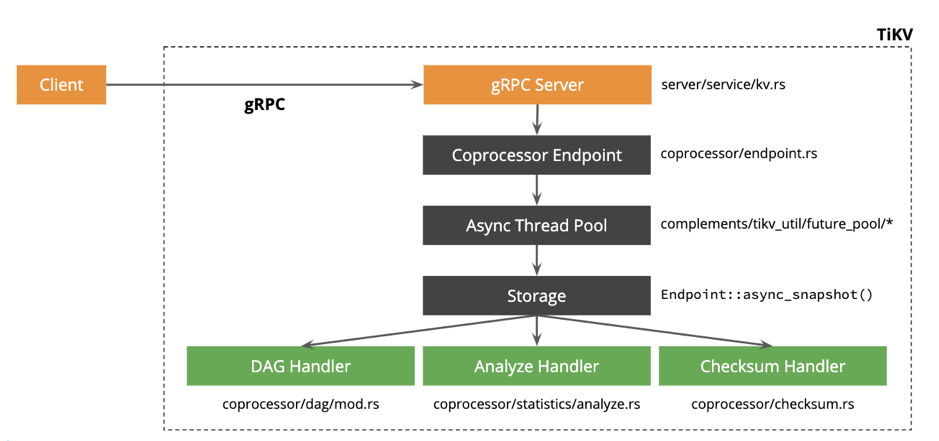

## 0x00 缘 妙不可言

> 开局一张图，其他全靠编。本文内容中 performance map 基于 TiDB 2.1 & TiDB 3.0 构建；部分内容与新版本不适配，具体以官方解释为准（e.g: TiDB 4.0 Titan engine 读写与本文流程会有区别 ）  
> 本页内容中 performance map 来自 [PingCAP/TiDB-map](https://github.com/pingcap/tidb-map/) 项目，最终所有权&解释权归 PingCAP 所有。  
>  
> - 阅读本文前请先围观以下文档（本文内容来自以下文档的~~复制、黏贴、串改、汇总~~）：  
>   - [SQL 的一生](https://pingcap.com/blog-cn/tidb-source-code-reading-3/) ✨
>   - [TiDB 源码阅读](https://pingcap.com/blog-cn/#TiDB-%E6%BA%90%E7%A0%81%E9%98%85%E8%AF%BB)
>   - [TiKV 源码阅读](https://pingcap.com/blog-cn/#TiKV-%E6%BA%90%E7%A0%81%E8%A7%A3%E6%9E%90)

## 0x01 开局

> 首先了解下 TiDB 整体的架构  

- TiDB（产品）三大金刚组件：PD、TiDB、TiKV
  - TiDB-server 负责 session 链接管理、SQL 解析 & 执行、使用 SQL 语言读写 TiKV 中的 KV 数据
  - PD 负责 region 调度 & region 信息统计、TiKV 状态管理、TSO 分发（类似 SCN / GTID 的东东）
  - TiKV 负责存储数据以及部分**下推 SQL** 的计算（数据格式为 Key-value）
    - 三副本强一致概念实现 [raft-rs](https://pingcap.com/blog-cn/tikv-source-code-reading-2/)
  
合体后的姿势是这样的（暂时忽略掉 tispark，本文不涉及这部分）：

### TXN

如果链接到 TiDB，执行一条 insert 语句差不多是这么一个流程（图片中好像少了一部分，让我们继续往后看）

> 该图来自于 [分布式事物](https://pingcap.com/blog-cn/tikv-source-code-reading-12/)

### SQL

而事物在 TiDB 经历了什么呢？

> 该图来自于 TiDB [SQL 的一生](https://pingcap.com/blog-cn/tidb-source-code-reading-3/)

](./tidb-sql.png)

从图片中可以看到 TiDB 通过 conn.go 建立 session 链接，随后接收 SQL text 内容交由 session.go 来处理。  
session.go 收到 SQL text 后将数据发送给 parser 验证 SQL text 格式、内容是否有效；验证成功后发送给 plan 两兄弟（plan.preprocess & plan optimize），兄弟两个一个是用来思考怎么帮助用户规划路径，另一个兄弟是思考如何才能最快的去执行任务拿到数据。  
兄弟两个合拍之后出了报告发送给 executor.build 大佬，大佬专业押镖数十年，由该大佬去 TiKV 存储层获取目标数据。
  
> 辣么 [parser 是怎么检测 sql text](https://pingcap.com/blog-cn/tidb-source-code-reading-5/) 的呢？ [executor 是怎么拿到数据的](https://pingcap.com/blog-cn/tidb-source-code-reading-23/)？plan 两兄弟又出的什么主意呢（[基于规则的优化](https://pingcap.com/blog-cn/tidb-source-code-reading-7/)& [基于代价的优化](https://pingcap.com/blog-cn/tidb-source-code-reading-8/)）？  
> 《走进科学》专业人士与你慢慢细谈

### TiKV server

TiDB 接收到了 SQL ，怎么送到的 TiKV 、TiKV 又是怎么回复的？或许这是未来 *TiDB 十万个为什么* 必备题吧  
这里没找到图，暂时也没作图，先挖个坑吧，或者看文章也是可以的，比如 [TiKV client in TiDB 上](https://pingcap.com/blog-cn/tidb-source-code-reading-18/) & [TiKV client in TiDB 下](https://pingcap.com/blog-cn/tidb-source-code-reading-19/)

- 本部分信息挖坑
  - grpc 线程池
  - raftstore
  - apply sync
  - mvcc

> 改图来自于 [TiKV-server](https://pingcap.com/blog-cn/tikv-source-code-reading-9/)

### TiKV coprocessor

> 改图来自于 [TiKV coprocess 概览](https://pingcap.com/blog-cn/tikv-source-code-reading-14/)  
> storage readpool 与 coprocessor 负责处理不同场景的 **读**，负责读的还有另一兄弟 kv_get

### TiKV schedule

> 此处暂无内容

## 0x02 awsl

> 看完上面内容迷路了么？如果迷路了这里有份 *[鸟瞰图](https://github.com/pingcap/tidb-map/blob/master/maps/performance-map.png)* 可以拿去看看  
> 齿轮部分是可以用与调优的地方，需要区分读写两个流程哟（读写各有不同的调优参数）  
> rocksDB 内的参数谨慎调试、调了需要一定时间才有反应（非即时反馈）  

- 参数调证
  - TiDB 调整 [tidb.toml](https://pingcap.com/docs-cn/stable/reference/configuration/tidb-server/configuration-file/)& [TiDB session variable](https://pingcap.com/docs-cn/stable/reference/configuration/tidb-server/tidb-specific-variables/#tidb-%E4%B8%93%E7%94%A8%E7%B3%BB%E7%BB%9F%E5%8F%98%E9%87%8F%E5%92%8C%E8%AF%AD%E6%B3%95)，如果想了解 session variable 的调整，还需要先阅读这篇文档 [Chunk 和执行框架简介](https://pingcap.com/blog-cn/tidb-source-code-reading-10/)
  - TiKV 调整 [tikv.toml](https://pingcap.com/docs-cn/stable/reference/configuration/tikv-server/configuration-file/)
    - [Grpc 线程池](https://pingcap.com/blog-cn/tikv-source-code-reading-7/) 介绍
  - 可能还需要 PD 配合，比如 [PD-ctl](https://pingcap.com/docs-cn/stable/reference/tools/pd-control/)，而不是 pd.toml 文件
- 是不是懵逼，即时知道了调那些参数，也不知道该调多少数值？因为少了一部分知识体系：《监控-资源使用》

## 0x03 坑

> 本文坑有些多，先记录下能想到的坑 #顺着网线过来打我也没用

- [ ] coprocessor & schedule 描述
- [ ] 各组件 client
- [ ] 性能监控
- [ ] tikv server
