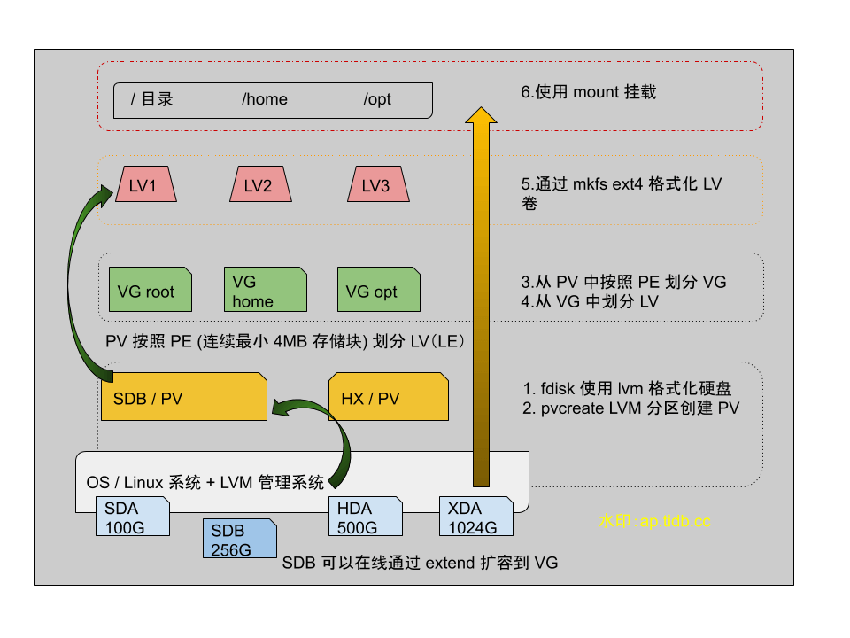

## 0x00 理由

> 接触了个客户环境，物理机磁盘使用的 LVM 方式划分。0202 年了还有公司大量使用该方式规划存储，被迫只能拿起来再复习下这项技术的使用姿势、追踪下最近几年是否有更新。

LVM 是 Logical Volume Manager（逻辑卷管理），内核 3.0 以后的版本默认自身携带。出生在“千禧年”附近，当时受限磁盘比较小，如果需要做大存储或者多用户磁盘划分时，会用到该技术。当时虽然也有 raid 技术，但是 LVM 不花钱啊。  
LVM 通过 4 层设计将多个物理设备逻辑映射（貌似按虚拟化理解也行）到系统的单一设备上，然后由系统管理员使用 LVM 扩所容命令操作分区大小。可以做到在线动态调整～  

## 0x01 LVM

> 以下内容部分来自百度，眼熟的可以发函了；部分内容来自 [archlinux wiki](https://wiki.archlinux.org/index.php/LVM)



### 组件

> Physical volume (PV)
> Unix block device node, usable for storage by LVM. Examples: a hard disk, an MBR or GPT partition, a loopback file, a device mapper device (e.g. dm-crypt). It hosts an LVM header.

> Volume group (VG)
> Group of PVs that serves as a container for LVs. PEs are allocated from a VG for a LV.

> Logical volume (LV)
> "Virtual/logical partition" that resides in a VG and is composed of PEs. LVs are Unix block devices analogous to physical partitions, e.g. they can be directly formatted with a file system.

> Physical extent (PE)
> The smallest contiguous extent (default 4 MiB) in the PV that can be assigned to a LV. Think of PEs as parts of PVs that can be allocated to any LV.

### LVM 命令

LVM|扫描|创建|查看|删除|扩容|缩容
---|---|---|---|---|---|---
PV|pvscan|pvcreate|pvdisplay / pvs |pvremove|---| --- |
VG|vgscan|vgcreate|vgdisplay / vgs |vgremove|vgextend|vgreduce
LV|lvscan|lvcreate|lvdisplay / lvs |lvremove|lvextend|lvreduce

### create lvm

> 此处省略 800 字
> [archlinux wiki](https://wiki.archlinux.org/index.php/LVM) 内容十分详细

## 0x02 extend

> 在机器上实操了下扩容，由于操作不熟练把机器系统搞成了 read only，所以扩容时谨慎操作

有个 1.5T 的磁盘分区已经划分了 LVM，通过 `fdisk -l` 命令可以看到分区。

```shell
# fdisk -l 查看磁盘分区
   Device Boot      Start         End      Blocks   Id  System
/dev/sda1   *        2048     1050623      524288   83  Linux
/dev/sda2         1050624  3124494335  1561721856   8e  Linux LVM
```

随后使用 pvs 命令查看 PV 信息，看到该磁盘被划分到一个 PV

```shell
# pvs
  PV         VG     Fmt  Attr PSize PFree
  /dev/sda2  vg_sto lvm2 a--  1.45t 925.68g
```

查看 VG 信息，VG 是个虚拟的接口，对磁盘不会作出格式化或者修改磁盘元信息的动作。

```shell

# vgs 查看信息
  VG     #PV #LV #SN Attr   VSize VFree
  vg_sto   1   7   0 wz--n- 1.45t 925.68g

#  vgdisplay 查看信息
  --- Volume group ---
  VG Name               vg_sto
  System ID
  Format                lvm2
  Metadata Areas        1
  Metadata Sequence No  9
  VG Access             read/write
  VG Status             resizable
  MAX LV                0
  Cur LV                7
  Open LV               6
  Max PV                0
  Cur PV                1
  Act PV                1
  VG Size               1.45 TiB
  PE Size               4.00 MiB
  Total PE              381279
  Alloc PE / Size       144304 / <563.69 GiB
  Free  PE / Size       236975 / 925.68 GiB
  VG UUID               yAZ3SK-fZjo-VnrK-7777-v3sA-TCfr-888888
```

查看 LV 信息

```shell

# lvs
  LV      VG     Attr       LSize    Pool Origin Data%  Meta%  Move Log Cpy%Sync Convert
  lv_home vg_sto -wi-ao----   <9.77g
  lv_opt  vg_sto -wi-ao----    5.00g
  lv_root vg_sto -wi-ao----   <9.77g

# lvdisplay
  --- Logical volume ---
  LV Path                /dev/vg_sto/lv_home
  LV Name                lv_home
  VG Name                vg_sto
  LV UUID                oafYvb-oFAG-LR1q-7777-pZNq-A6Wk-888888
  LV Write Access        read/write
  LV Creation host, time localhost, 2020-03-19 20:23:25 +0800
  LV Status              available
  # open                 1
  LV Size                <9.77 GiB
  Current LE             2500
  Segments               2
  Allocation             inherit
  Read ahead sectors     auto
  - currently set to     8192
  Block device           253:4
```

### actions-lv

- 执行 lvextend 命令扩容该逻辑卷  
  - `lvextend -L +500G /dev/mapper/vg_sto-lv_home`

> 扩容后 `df -h` 查看空间大小未刷新，此时需要使用另一个命令刷新下元数据信息  
> 执行前先看下该**逻辑卷格式化**方式是 ext4 还是 xfs ，比如通过 `/etc/fstab` 查看  

- 如果是 xfs 执行这条命令

  - `xfs_growfs  /dev/mapper/vg_sto-lv_home`

- 如果是 ext4 执行这条命令

  - `resize2fs -f  /dev/mapper/vg_sto-lv_home`

- 否则可能会看见以下错误

```shell
resize2fs 1.42.9 (28-Dec-2013)
resize2fs: Bad magic number in super-block while trying to open /dev/mapper/vg_sys-lv_home
Couldn't find valid filesystem superblock.
```

- 再次查看 lvs 信息

```shell
# lvs
  LV      VG     Attr       LSize    Pool Origin Data%  Meta%  Move Log Cpy%Sync Convert
  lv_home vg_sto -wi-ao---- <509.77g
```

## 0x03 高级功能

> 我没用过，待我做个测试之后研究下
> 开坑补坑 # 20200321
