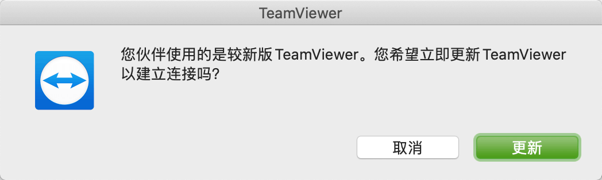
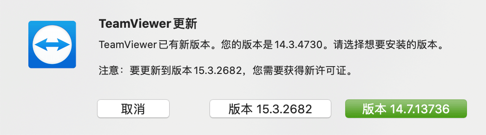

## 0x00 看到

工作需要经常用到 teamviewer 远程桌面工具处理问题，曾也用过向日葵、QQ 远程等类似工具，但都不如该工具的流畅性和稳定性。  
最近两年使用该工具有两个不友好的地方，第一个是通过 ID 建立链接时强制需要走德国鉴权服务器：2017 年咨询商务时获知是全球都在使用德国服务器，据说会在国内使用 aliyun 环境建立青岛数据中心，但现在使用和抓包上看并没有青岛啊。  
另一个问题就是本文主题：当双方甚至多方加入远程桌面时，会优先判断双方的版本信息，低版本使用者不得不升级自身软件，通过这种方式让软件持续更新。

双方建立链接时会如果看到以下图片，那就是要升级了。

## 0x01 工作

最早接触 Teamviewer 的原因是可以远程内网机器，比如双方都在公司内部，但是外网 IP 地址只有一个，此时使用 windoes mstsc 工具是不支持的。Teamviewer 神奇的通过了，初始一直很好奇是怎么做的，一起揭开庐山真面目（整体架构主要是穿透局域网的技术）。超简略版网络通信图---

teamviewer 安装后首先获取本机硬件信息，根据硬件信息计算 teamviewer ID，如此该 ID 与本机系统 &  本机硬件强制绑定，即时重复卸载安装该 ID 也是固定的，至少需要重装系统才可以重制 ID 信息。  
此时有各种神奇的魔法师使用第三世界的魔法可以强制更新 Temaview ID 信息，用于破除 15 分钟会话限制以及拒绝弹窗提示购买商业版权 ©️ 。

## 0x02 猜测

> 
> 以上是 Teamviewer 亮点功能
> 猜测为什么需要用户积极保持新版本？（我也不知道答案

- 基础功能（这部分看来是不需要强制刷新本地信息
  - 远程控制
  - 桌面共享
  - 在线会议（这个功能好卡
  - 网络监控
  - 恶意软件保护
- 可能是安全需求（这块可能性比较大，毕竟不是真杀毒软件，或许把 毒霸 放在了 DLL 里，*没分析过*
  - 256 位 AES 加密
  - 双因素身份验证
  - 经 SOC2 认证符合标准
  - 获得 ISO 27001 信息安全管理认证
  - 符合 HIPAA 标准
  - 暴力破解防护
  - 用户与& IP 白名单
  - 可信设备列表
  - 强制密码重置
- 可能是防破解（当双方其中一个使用破解版时目前感受是不影响使用，没有长期使用过破解版
  - 高速迭代的版本，同时使用不同的算法规避用户破解 15 分钟限制
- 特殊功能需求（这部分信息管理是在网页上，而收集信息也不需要频繁更新软体
  - 远程监控
  - IT资产追踪
  - 终端安全防护
  - 数据备份功能
- 其他貌似没了

## 0x03 行为

在一个你不得不使用的场景下，逼迫你更新版本。类似于就这么一座桥，但是过去需要收费，否则你就趟水过河。  
由于此类软件需求不大，使用场景单一且不频繁。一般人是过河拆桥或者过河就忘记了，所以短暂也不会想着去换软件……

> 先行水一篇文档，待查到原因继续更新 // 20200323 PM
