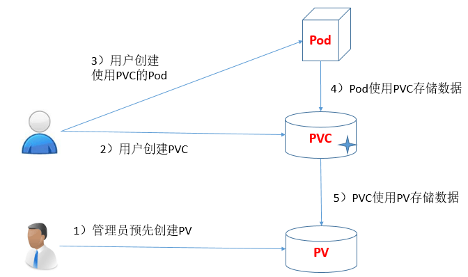
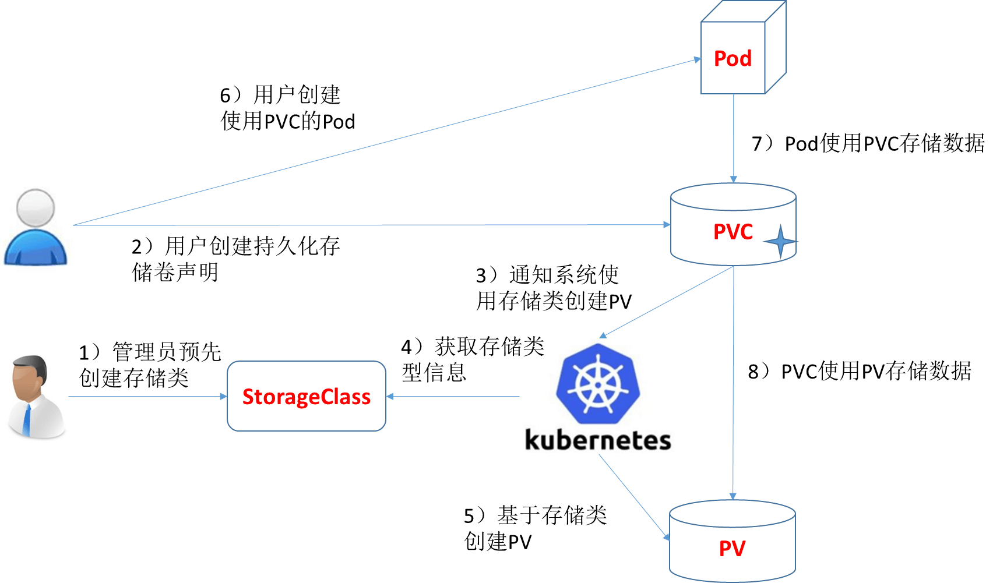

## 0x00 书接上回

> 友情提示：这是一篇非常水的文档，因为对 PV/PVC 理解层次太低；后续继续学习然后会重构文档内容 # 20200410  

安装完 K8S 需要验证下 K8S 整体可用程度，在测试 POD 的时候可能需要用到 PV / PVC，所以水了这篇文档。测试分两步走：

1. 第一步是简单版的：[配置 Pod 以使用 PersistentVolume 作为存储](https://kubernetes.io/zh/docs/tasks/configure-pod-container/configure-persistent-volume-storage/)【中文】
   - 配置成功后可以访问 docker 容器 IP 地址，将会返回 `Hello from Kubernetes storage` 信息。由于上篇文档中使用的 Flannel 网络插件，注意不要使用 node_ip:port 方式访问
   - 要用 docker 容器 IP ，先查到 docker 容器所在位置，然后去相应 node 机器上访问
2. 第二步是升级版的： wordpress mysql + service + deployment 案例。文档链接在这里：[示例：使用 Persistent Volumes 部署 WordPress 和 MySQL](https://kubernetes.io/zh/docs/tutorials/stateful-application/mysql-wordpress-persistent-volume/)【中文】
   - 本内容相比上面升级了 service 、deployment 概念 ~~个人认知：这是个类似于 ansible playbbok 的东东~~
   - 当测试发现 pod 删除不掉时可以先查询下 `kubectl get deployment` & `kubectl get service` 信息

## 0x01 概念

> 官方建议先学习 POD ，我这里反其道而行之先学习存储；经验告诉我从下往上折腾坏的快、学的快、修不好就重搭建

创建前可能需要阅读以下文档，了解下 PV 、PVC、Pod 关系（请不要完全套用 vmware、kvm、xen 那些经验理解，因为有个 emptydir 场景不合适）：

- [Volume](https://kubernetes.io/zh/docs/concepts/storage/volumes/)【中文】
  - 仅仅是数据盘，用来存数据的。不包含 vm 系统盘这个概念
- [Persistent Volumes](https://kubernetes.io/docs/concepts/storage/persistent-volumes/)【英文】
  - 这个网上有中文版，对 PVC 流程的学习很重要，下文中我去盗两张图
- [Kubernetes 1.14: Local Persistent Volumes GA](https://kubernetes.io/blog/2019/04/04/kubernetes-1.14-local-persistent-volumes-ga/)【英文】
  - 介绍 local PV 这个场景

Persistent Volume(持久化卷) 简称 PV, 是一个 K8S 资源对象，我们可以单独创建一个 PV, 它不和 Pod 直接发生关系, 而是通过 Persistent Volume Claim, 简称 PVC 来实现动态绑定, 我们会在 Pod 定义里指定创建好的 PVC, 然后 PVC 会根据 Pod 的要求去自动绑定合适的 PV 给 Pod 使用.

> 持久化卷下 PV 和 PVC 概念:

Persistent Volume（PV）是由管理员设置的存储，它是群集的一部分。就像节点是集群中的资源一样，PV 也是集群中的资源。 PV 是 Volume 之类的卷插件，但具有独立于使用 PV 的 Pod 的生命周期。此 API 对象包含存储实现的细节，即 NFS、iSCSI 或特定于云供应商的存储系统

PersistentVolumeClaim（PVC）是用户存储的请求。它与 Pod 相似。Pod 消耗节点资源，PVC 消耗 PV 资源。Pod 可以请求特定级别的资源（CPU 和内存）。PVC 声明可以请求特定的大小和访问模式（例如，可以以读 / 写一次或 只读多次模式挂载）

> 写手胡说八道

在不使用 emptydir 的场景下，个人理解：PV == VMware 存储池 / PVC == 虚拟机划分的那块精简盘

### 场景

> emptydir、hostpath、local volume 三种场景  
> 课外阅读：[Kubernetes 3种存储傻傻分不清楚！](https://stor.51cto.com/art/201812/588905.htm)

- emptydir

  理解 emptydir 最简单的场景就是 `docker run nginx`  某个服务，不指定 -v 参数映射物理机文件夹到容器中。这样该容器被 docker stop 后数据也就丢失了。  
  这种场景适合纯计算的场景，比如 nginx、httpd、PHP-FPM 等容器，只需要找个 ELK 实时收集日志就好了。

- hostpath

  hostpath 场景就是加了 -v 参数；物理机上有个文件夹，通过 -v 参数映射 `docker run nginx -v /data/web:/var/log/web/html`  这种，即使 docker stop 容器后，数据依旧存在。  
  这个场景适合简单存储，但对存储高可用性比较低的那种场景，因为系统挂了、数据就没了。
  

- local pvc

  如果之前配置过 iscsi 或者 SAN 设备，local volume 就很好理解了。首先必须先把物理存储设备怼到某个 Linux 系统上，然后将这些设备分成 filesystem 、block store drive 两种使用模式。再然后给这些设备声明一个等级制度【高级 SSD、普通 SSD、普通存储、本地 SSD、块存储、网络存储（这些在共有云上很常见吧）】。当有人需要数据盘的时候，就从这个存储池划分大小，然后绑定到相应的容器上。  
  除本地存储场景外，docker 容器就可以做公有云虚拟机类似的**系统盘带数据盘热漂移**了。
  

> 以上两站图片盗取 [Kubernetes - 持久化存储卷 PersistentVolume](https://blog.csdn.net/bbwangj/article/details/82355337)

## 0x02 操作

暂时省略 2000 字 // 官方文档已经给出了 demo yaml

## 0x03 你想

> 如果闲的无聊还想继续测试，可以玩下这个：[Deploy Minio on Kubernetes using Kubespray and Ansible](https://www.linode.com/docs/kubernetes/deploy-minio-on-kubernetes-using-kubespray-and-ansible/)【英文】

## 0x04 FAQ

[改变默认 StorageClass](https://kubernetes.io/zh/docs/tasks/administer-cluster/change-default-storage-class/)
