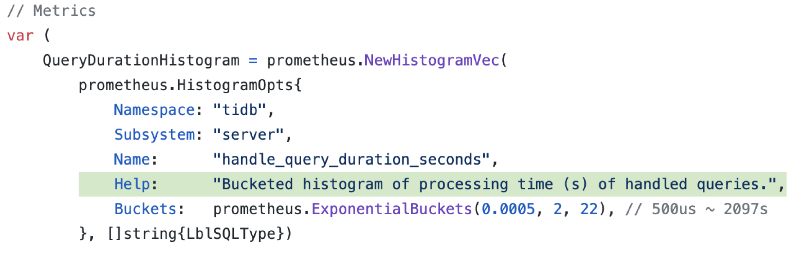

## 0x00 点点滴滴

之前有篇文档是 [纸上谈兵 - TiDB 性能调优](/post/20200311-11-performance-map/ "ap.tidb.cc")，仅仅这篇文档无法承载想表达的豪言壮语，因此出现了一话三联内容，分别是 纸上谈兵（性能调优逻辑、SQL 资源过五关斩六将一路顺风）、沙盘点将（监控概要、踏马观花一目十行的机密所在）、九死一生（问题处理、千军万马一将在，探囊取物有何难？） 三部曲，本次将通过少量图文描述下监控围观方式。

> 本文内容来自 PingCAP 官方培训，然后文字话简述下（不要问我要视频，我没有）# 2020 年 3 月左右的官方活动

## 0x01 监控


Grafana Prometheus 的监控平台架构本次不在多说了，这部分内容可以看浏览下以往文档[站内分类 - monitoring](/categories/monitoring/)

### 那些事

> 以下内容原文手打翻译

- 清理 Prometheus 中残留的 TiKV 监控数据
  - 使用 Prometheus 2.1 以上版本
  - 打开 --web.enable-admin-api 参数；详情看官网 [Prometheus Admin api](https://prometheus.io/docs/prometheus/latest/querying/api/#tsdb-admin-apis) 
  - `curl -X POST -g 'http://127.0.0.1:9090/api/v1/admin/tsdb/delete_series?match[]={instance="10.0.1.4:20181",job="tikv"}'`

- Prometheus 是否可以做审计场景
  - 此处跳过 / 以前文档有说明

> Grafana 看不到数据

- metrics 本身没有数据
  - 事物运行时没有触发到 metrics 逻辑
- 网络防火墙阻断（下方默认端口列表）
  - 云虚拟机检查 安全组 规则
  - 物理机环境检查 硬件防火墙 规则
- 配置文件不正确
  - 依次检查 tidb metrics-status port、prometheus 配置文件、grafana 配置参数
- 目标组件进程退出
  - 进入 tidb-ansible 目录【使用前建议先阅读 ansible 文档，不要像我一样差点折腾挂集群】
  - `ansible tidb_servers -m shell -a “ps aux ｜ grep tidb-server”` 依次查看 tidb pd tikv 组件
- 目标组件端口冲突  
  - TiDB、TiKV metrics-status 端口冲突不影响启动，会影响监控数据展示

组件 | 默认端口 | 说明
--- | --- | ---
TiDB | 4000 | 应用及 DBA 工具访问通信端口
TiDB | 10080 | TiDB 状态信息上报通信端口
TiKV | 20160 | TiKV 通信端口
PD | 2379 | 提供 TiDB 和 PD 通信端口
PD | 2380 | PD 集群节点间通信端口
Pump | 8250 | Pump 通信端口
Drainer | 8249 | Drainer 通信端口
Prometheus | 9090 | Prometheus 服务通信端口
Pushgateway | 9091 | tikv-importer 聚合和上报端口
Node_exporter | 9100 | TiDB 集群每个节点的系统信息上报通信端口
Blackbox_exporter | 9115 | Blackbox_exporter 通信端口，用于 TiDB 集群端口监控
Grafana | 3000 | Web 监控服务对外服务和客户端(浏览器)访问端口
Grafana | 8686 | grafana_collector 通信端口，用于将 Dashboard 导出为 PDF 格式
Kafka_exporter | 9308 | Kafka_exporter 通信端口，用于监控 binlog kafka 集群

### 资料片

- TiKV in Prometheus【中文】描述如何在 TiKV 中设置“检查点”用于统计、收集 TiKV-server 运行信息
  - [TiKV 源码解析系列文章（三）Prometheus（上）](https://pingcap.com/blog-cn/tikv-source-code-reading-3/ "ap.tidb.cc")
  - [TiKV 源码解析系列文章（四）Prometheus（下）](https://pingcap.com/blog-cn/tikv-source-code-reading-4/ "ap.tidb.cc")
  - [如何高效利用 Grafana 监控分析 TiDB 指标](https://pingcap.com/blog-cn/use-grafana-to-monitor-and-analyze-tidb-metrics/ "ap.tidb.cc")

## 0x02 星星点灯

> TiDB 监控千千万万，只有理解了这些监控才能做到天下万物为我所用的“成就色霸气”  
> 通过三小步理解来分解人类三大疑问：监控怎么来的？监控怎么用？监控干了啥？  
> 先放张图理解下啥叫丰富多彩？  


### in Client

> 首先需要知道 Metrics 是怎么来的。比如以下这条数据  

- `tidb_server_handle_query_duration_seconds_bucket`
  - 从名字切割分析下这个 metrics
  - `tidb_`    来自 TiDB 服务
  - `server_`  TiDB 服务中的 server subsystem
  - `handle_query_duration_seconds_bucket` 记录查询语句处理时间的桶状直方图

> 同时需要知道这条 Metrics 代表了什么意思

- Metrics 帮助信息还可以通过浏览器访问 `http://tidbIP:10080/metrics` 获取

  ```yaml
  # HELP tidb_server_handle_query_duration_seconds Bucketed histogram of processing time (s) of handled queries.
  # TYPE tidb_server_handle_query_duration_seconds histogram
  tidb_server_handle_query_duration_seconds_bucket{sql_type="Begin",le="0.0005"} 0
  ```

> 在 Github TiDB repo 搜索 handle_query_duration_seconds 可以获取更多代码逻辑  
> PPT 截图、Golang 大佬可自主常识搜索  
> 从内容上看完整的 metrics 是拼接出来的，所以不要搜完整 metrics  
> 另外我常识搜索 PD / TiKV metrics 有搜不出来的现象，可能需要强撸代码「大佬们可以试下 tikv_pd_heartbeat_tick_total」  




### P-SQL

> Prometheus SQL 查询类似 SQL92 标准，主要有 函数、运算符、metrics 主体、时间字段等构造而成（更多信息可以阅读官网：[Prometheus - query basics](https://prometheus.io/docs/prometheus/latest/querying/basics/ "ap.tidb.cc")）。比如下面这条：

- 理解 Prometheus SQL
  - `histogram_quantile(0.999, sum(rate(tidb_server_handle_query_duration_seconds_bucket[1m])) by (le))`
  - 直方图函数（数据采样比，数据运算（数据窗口范围（数据 metrics bucket [时间范围] ）by （分组）））
  - 该直方图计算后得知 TiDB query duration 信息，比如 P999、P99、P95、P80，在不同数据采样比情况下会有不同的误差；此时根据业务对 query durtion 的延迟要求，比如 5000 tps/sec 并发情况下 duration 50ms，可以从 80 > 99 > 999 逐级分析

> 可以按照 Prometheus 官网 functions 页面，多多常识其他函数，比如 sum()、deriv()、irate()、rate()、year()；我看官方 Dashboard 中主要用了这么几个函数  
> 可以在 Prometheus web 页面测试完成后添加到 Grafana dashboard 中。Prometheus web 页面地址是 IP:9090  

### Dashboard

官方有篇文档 [如何高效利用 Grafana 监控分析 TiDB 指标](https://pingcap.com/blog-cn/use-grafana-to-monitor-and-analyze-tidb-metrics/)，介绍了如何使用 dashboard 中各项 metrics 进行各种自定义查询（利用 metrics 精美的图表查到自己最想要的东西），所以这里就不重复造轮子了  
但是有个东西貌似还要口译下，就是那张繁星点点的图，这部分在上述文档中没有说  


> 通过 tidb-ansible 安装的 4.0 版本，安装打开监控会看到以下监控 dashboard 页面（早期 2.0 版本的至少包含 tidb、tikv、pd、overview dashboard 页面），简单说几个重要的页面  

dashboard | info
---- | ----
PD                | PD 服务监控页面，主要查 PD 运行状态、region 数据量、Region 调度信息等
TiDB              | TiDB 服务监控：QPS、QPS 延迟、主机资源占用、DDL 信息、KV client 信息等
TiKV-details      | TiKV 监控服务页面：内容太多放下面了 [TikV dashboard info](#tikv)
overview          | overview ，你懂的。官方已经做了解释，可以看 [Overview 面板重要监控指标详解](https://pingcap.com/docs-cn/stable/reference/key-monitoring-metrics/overview-dashboard/#overview-%E9%9D%A2%E6%9D%BF%E9%87%8D%E8%A6%81%E7%9B%91%E6%8E%A7%E6%8C%87%E6%A0%87%E8%AF%A6%E8%A7%A3 "ap.tidb.cc")
node export       | 主机监控，主要查询主机 cpu、内存、磁盘、网络等占用
black export      | 网络探测，如 ping 监控主机状态和主机之间的延迟、port 端口服务探活
disk-preformance  | 详细的磁盘监控信息，磁盘 IO util、IO 流量等资源占用信息

> 其他面板是对特定场景的整理，纵览上看 metrics 是重复的。特定 dashboard 比较利于排查问题  

#### PD


> PD 页面打开后是上面这样，具体 metrics 信息可以看这篇文档 [PD-dashboard](https://pingcap.com/docs-cn/stable/reference/key-monitoring-metrics/pd-dashboard/ "ap.tidb.cc") 个人经验是这么看的：

1. 先查看 PD 目前运行状态，通过 `cluster tab` 可以看到 PD leader 信息、TiDB 集群存储资源、TiKV 节点状态
2. 继续查看 Region 在各 TiKV 数量信息，比如 `balance【调度纵览】、hotregion【读写热点数据】、schedule【调度数据】、operator【操作时间】` 这几个 tab 可以查看相关信息
3. 如果 PD 出问题了，可以通过 `etcd` 查看 PD 刷写数据到磁盘的性能
4. 如果 TiKV 和 PD 之间有异常，比如 region 数量在 tikv 和 PD 中显示的不一样，可以关注 PD leader 状态，然后查看 `heartbeat` + `GRPC` 信息
5. 如果 TiDB 向 PD 获取 tso 慢，可以查看 `TiDB` tab 信息

#### TiDB


> TiDB 页面打开后是上面这样，具体 metrics 信息可以看这篇文档 [TiDB-dashboard](https://pingcap.com/docs-cn/stable/reference/key-monitoring-metrics/tidb-dashboard/ "ap.tidb.cc") 个人经验是这么看的：

1. 如果出现 slow query 现象：顺序检查 TiDB 页面中的 `QPS`、`QPS P80、P99 延迟`、`slow query`、`server【TiDB 占用主机资源信息】`、`kv error【TiDB 中的 kv client 与 kv 交互出现错误的统计】`，查看是否有高于其他时间段的`凸起`、`毛刺`、`断崖` 等现象
2. 性能排查还会看：`executor【上文中说的 TiDB SQL 执行器】`、`ditsql【优化其中的下推算子统计（tablescan、indexscan 等一堆东东）】`、`PD client【观察 TSO 获取时间】`、`KV count【SQL 与 KV 查询比例】`、`KV error【resolve lock 锁冲突量】`、`KV Duration【到每个 TiKV 查询 KV 的耗时】` 这些信息，可以综合判断目前 SQL 执行时压力是在 TiDB 还是 TiKV 服务，如过是 TiKV 服务还要具体分析 TiKV 组件信息
3. DDL 问题可以直接看：`DDL【记录 DDL owner、DDL 执行数量、DDL 排队数量等】`
4. TiDB 早期有个错误叫 `Information schema is out of date` 错误，这时候就可以看下  `schema load` tab （[FAQ](https://pingcap.com/docs-cn/stable/faq/tidb/#3314-%E8%A7%A6%E5%8F%91-information-schema-is-out-of-date-%E9%94%99%E8%AF%AF%E7%9A%84%E5%8E%9F%E5%9B%A0) "ap.tidb.cc"）
5. 剩下几个大家满满挖掘吧

#### TiKV

> TiKV-detail 页面打开后是上面这样，具体 metrics 信息可以看这篇文档 [TiKV-dashboard](https://pingcap.com/docs-cn/stable/reference/key-monitoring-metrics/tikv-dashboard/ "ap.tidb.cc") 个人经验是这么看的：


TiKV 内容是最多的，看监控前先区分下两个东西。虽然无关紧要 / TiKV 中有两个 Rockdb 分别存储 Raft-log 和数据库 KV 数据。  
TiKV 监控与上篇文档（[纸上谈兵 - TiDB 性能调优](/post/20200311-11-performance-map/)）中的 performance map 结合食用是最好不过了。  

1. TiKV 由于面板比较多，查问题讲究连贯性。如果是性能问题或者巡检会首先看 `GRPC【TiKV 接受到的 TiDB 读写数据请求信息】`、`thread cpu【TiKV server 线程池资源占用情况】`、`error 【TiKV 运行期间 ERROR 统计】`、`cluster 【TiKV 集群运行状态信息纵览、包含 CPU、DISK、带宽等信息】`、`server 【TiKV server 占用主机资源信息】` 这几组监控来判断目前 TiDB to TiKV 资源压力占用情况
2. 如果是协助 TiDB slow query 场景，先检查 `GRPC【TiKV 接受到的 TiDB 读写数据请求信息】`、`thread cpu【TiKV server 线程池资源占用情况】`，然后是 `coprocess 【 TiDB 聚合下推算子处理器，就是查询会消耗这个资源】`，进阶版之后还有 `task 【TiKV server 中的队列服务】`、`RocksDB - KV【TIKV 中用于存储数据的 rocksDB】` 等监控
3. 如果出现 TiKV 写入慢的情况，先检查 `GRPC【TiKV 接受到的 TiDB 读写数据请求信息】`、`thread cpu【TiKV server 线程池资源占用情况】`，然后是 `schedule-prewrite 【2pc 第一个阶段】` & `schedule-commit 【2pc 第二个阶段】` 等 schedule 开头的监控；以及 disk-prefoemance dashboard 页面；随后还有 `raft-io 【raft 协议运输数据产生的 IO 和资源消耗 】` 等 `raft 开头`的监控
4. 其他高阶功能根据运维场景结合 [performance map](/post/20200311-11-performance-map/#0x02-awsl "ap.tibd.cc") 食用

## 0x03 SQL Life

> PPT 有讲解如何使用监控对 TiDB 集群做调优（[纸上谈兵 - TiDB 性能调优](/post/20200311-11-performance-map/)）  

这部分没啥想说的了，调优前需要了解 SQL 运行逻辑，上篇文档已经说了。大家可以回顾下，然后按照本文再学习下监控和组件的关系  
