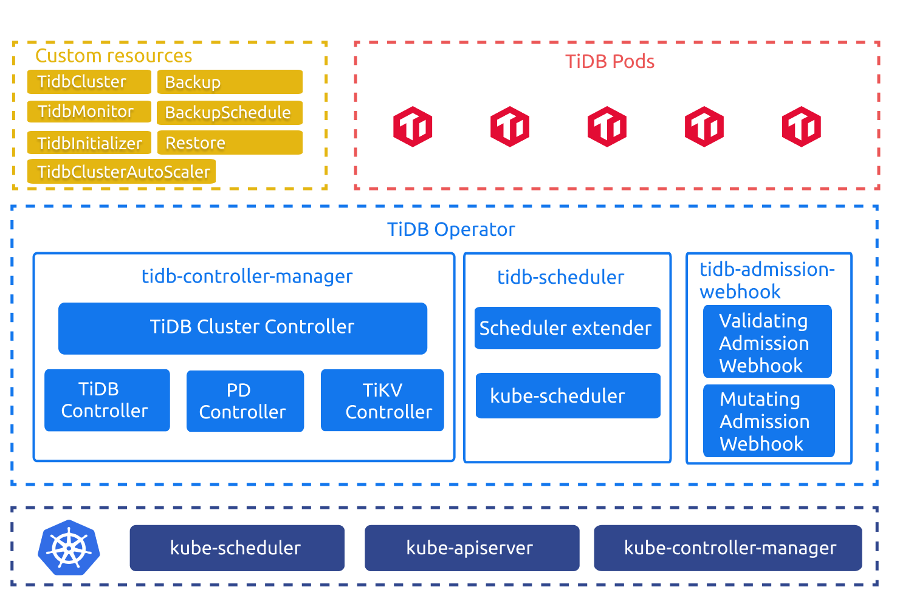
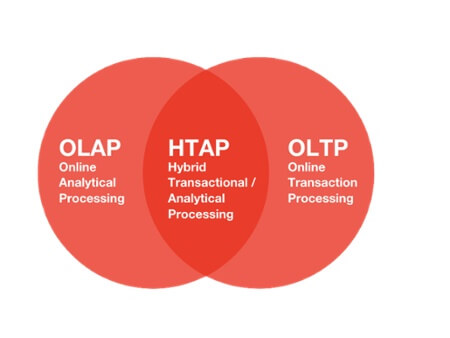
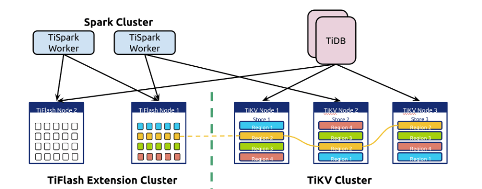
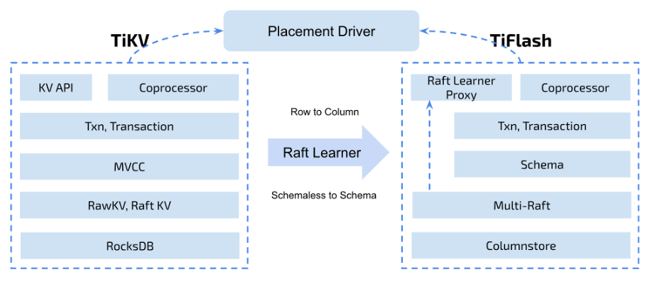
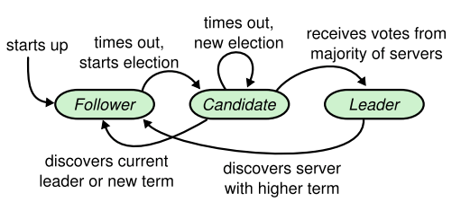
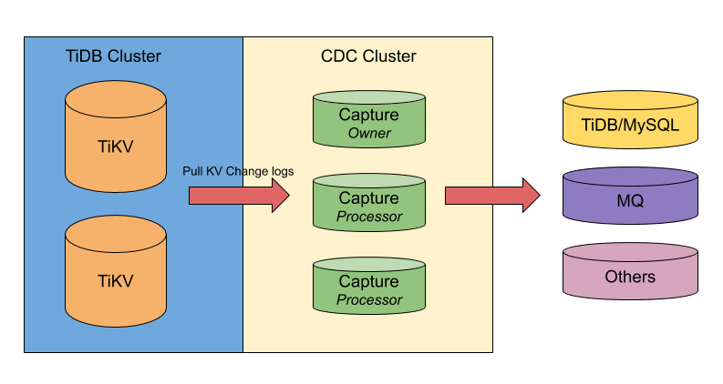
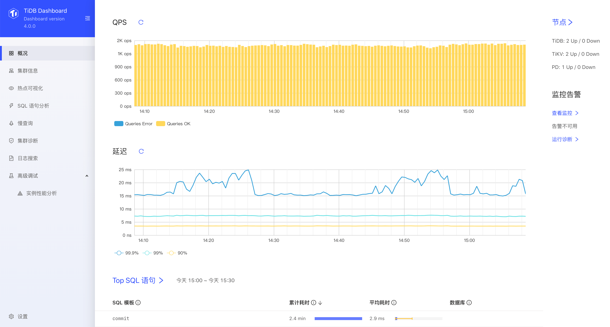

## 0x00 Live

最近几周 TiDB 官方搞了好多次直播，一直在宣传 TiDB 4.0 版本的新特性，本文汇总下 4.0 特色功能；数据来源于 TiDB bilibili 直播、官网文档、用户微信群、公众号等几个地方。

## 0x01 new bee

> 部分数据来源与官方文档 [TiDB 4.0 新特性尝鲜指南](https://pingcap.com/blog-cn/tidb-4.0-new-features-tasting-guide/)

### TiUP

[TiUP](https://tiup.io/) 从使用体验和[官方文档](https://pingcap.com/docs-cn/stable/production-deployment-using-tiup/)介绍来看，是为了替代 tidb-ansible 安装部署的新工具。tidb-ansible 依赖与 ansible & ansible-playbook 程序才能使用，如果没有较好的 Linux 基础，使用 ansible 时会有很多不明所以的地方。官方写了个 TiUP 工具简化这部分工作内容，复制之前 tidb-ansible 的经验在不同场景下反复折腾了几个小时，部分情况下比 tidb-ansible 好用，但自定义场景时没有 tidb-ansible 灵活。见仁见智看各位老板怎么使用了。  

### TiDB-operator

[TiDB-operator](https://github.com/pingcap/tidb-operator) 其实是个老产品，但 GA 时间比较晚；而且从官方直播介绍时添加了不少新功能，所以作为 4.0 特色功能宣传也很赞。官网准备了丰富的文档 [TiDB in Kubernetes 用户文档](https://pingcap.com/docs-cn/tidb-in-kubernetes/stable/)，折腾了许久按照网络文档搭建了一套 K8S 集群；如果要尝鲜 [tidb-operator 功能](https://pingcap.com/docs-cn/tidb-in-kubernetes/stable/tidb-operator-overview/)，建议熟练运用 K8S 各种操作方式、网络插件理论、PVC / PV 场景、service / deployment 等知识。

### Tiflash / HTAP

[Tiflash](https://pingcap.com/docs-cn/stable/tiflash/tiflash-overview/) 是实现 HTAP 场景中重要的一步，做到了行列混存、数据自动同步、数据一致性、TP / AP 统一入口、为 SQL 优化器加了列存场景；关键的是以后报表运算不需要再做 ETL 平台同步数据了，只要多出几台服务器加入 TiDB 集群就实现了自动同步「机器可采用 SAS 15K 机械磁盘，进一步减少成本」，Tiflash 存储节点支持高可用。

### BR / CDC

Backup / Restore 工具（简称 BR，目前官方暂无技术文档，有一篇博文[如何做到 10T 集群数据安全备份、1GB/s 快速恢复？](https://pingcap.com/blog-cn/cluster-data-security-backup)）；从各种渠道收集该工具使用场景定位是快速备份、快速还原使用；使用 tikv-server 中的 raft 副本机制 + raft learner states 打造了 Backup 光速大亮数据快照备份功能。  

Restore 是将 Backup 备份出来的数据还原到一个新的集群；不要问为啥不还原到当前集群，还是继续围观 BR 各种新 PR 吧。

> 通过 TiUP 工具目前可以安装 BR 工具，需要提前准备好比较大的磁盘。Backup 备份让每个 TiKV-server 将备份文件存放在本机磁盘或者 S3 上，做好磁盘规划。

[TiCDC](https://pingcap.com/docs-cn/stable/ticdc/ticdc-overview/) 通过拉取 TiKV 变更日志实现的 TiDB 增量数据同步工具；与大家用过的 TiDB-Binlog 场景重复，这个设计和场景应该是为了替代 TiDB-binlog 架构的。  
之前 TiDB-binlog 是从 TiDB-server 绑定的 PUMP 组件收集 Binlog 数据，这会造成 TiDB-server 与 PUMP 产生状态依赖，同时 TiDB-server 如果损坏那么业务链接就会收到影响，且 PUMP 组件故障后也会丢失一部分 Binlog 信息，无法最小化修复这部分数据「需要重新做全量+增量」。  
TiCDC 从 TiKV-server 中收集 change log 信息作为 Binlog 数据，通过封装整合数据然后传输到下游；单个 TiKV-server 出现问题也可以根据 PD-server 中的新信息去找到新的 region leader 继续工作。

### 悲观锁

不过多介绍了，看官方文档吧；[TiDB 悲观事务模型](https://pingcap.com/docs-cn/stable/pessimistic-transaction/)

### view / windows function

> 与 mysql 基本一致

### SQL Hint & SQL Plan Management

> 暂未测试，放个 ToDo

- [ ] 测试 SQL Hint // 大概是 use index 或者 `/* ---- */` 加强版
- [ ] 测试 SQL Plan Management // 大概是索引走错救命稻草

### Dashboard

4.0 版本的 PD-server，通过浏览器访问 `http://<PDIP>:<PDport>/dashboard/#/overview` 可以看到各种新功能。比如快速抓火焰图（性能分析）、查看 key viz（热点可视化）、查看 slow query、日志搜索功能。

## 0x02 tree  

### 智能调度

- [ ] 一种新奇的设计思路，暂无资料
  - 通过将 follower read & Hot region schedule & Raft peer 结合起来一起食用

### Dumpling/Lighting

- [ ] 升级版的 mydumper 和 loader 场景

### DM

- [ ] 据说在做高可用和适配 K8S
