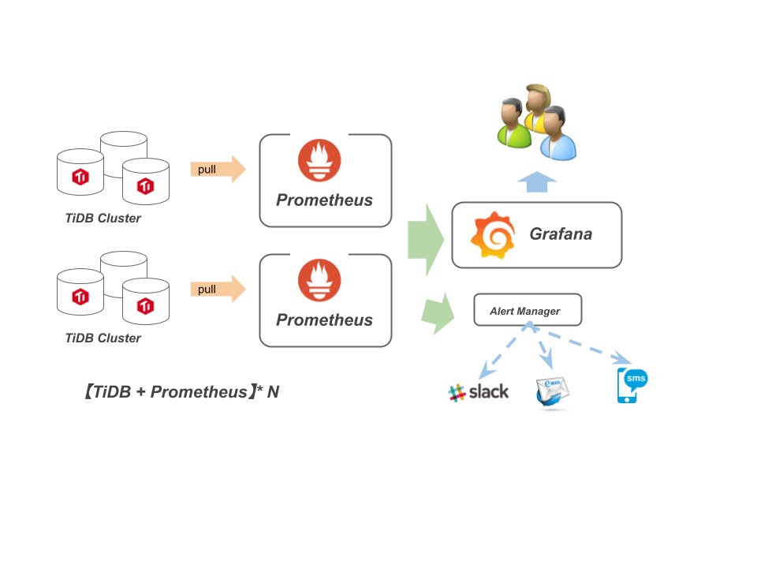

## 0x00 话不多说

Grafana 用于 TiDB-cluster 集群监控展示功能（如果不了解的同学可以看下以前的文档），如果每套集群都部署一个 Grafana，使用不方便且运维也繁琐。因此想通过单套 Grafana 管理多个 TiDB-cluster 集群。  
辣么大概是以下结构：



## 0x01 想

通过 Google 一顿搜索发现其他人也有类似想法 [I've got a new datasource I would like an existing dashboard to use.](https://stackoverflow.com/questions/54776604/how-can-i-change-the-datasource-for-a-grafana-dashboard)、[Dashboard Level Datasource #2748](https://github.com/grafana/grafana/issues/2748) 等、还在 Github 发现了一些 sqllite3 修改 grafana.db 的黑科技。  
但是这些都不太适合懒人且还需要二次修改定制化，不方便随时随地操作。  
抽着烟，试图在 Grafana docs 找到神迹……  


偶然机会看见别人讨论 tidb-ansible 4.0 安装 grafana 删除 dashboard 的问题，挖掘 tidb-ansible & tidb-cluster 等代码后发现 Grafana 6.1 版本的新功能 [Provisioning](https://grafana.com/docs/grafana/latest/administration/provisioning/)；用过 tidb-ansible 应该知道 tidb-ansible/scripts 下面有个 grafana-copy.py  脚本，该脚本通过 Grafana API 把 datasource & dashboard 导入进 Grafana 服务做初始化步骤。但是经常会报错出现问题……  

## 0x02 动动

然后进入了测试阶段：

1. 部署一个 Grafana 6.1 以上的版本
2. 按照模板写 datasource
   - 具体解释可以看 Grafana 官网 [Example Datasource Config File](https://grafana.com/docs/grafana/latest/administration/provisioning/#example-datasource-config-file)

    ```yaml
    apiVersion: 1
    deleteDatasources:
    - name: cluster-1  # 此处传递的 tidb-ansible inventory.ini 文件中的 cluster-name
    datasources:
    - name: cluster-1  # datasource 名称，在配置文件中唯一
        type: prometheus
        access: proxy
        url: http://10.10.10.4:14090
        withCredentials: false
        isDefault: false
        tlsAuth: false
        tlsAuthWithCACert: false
        version: 1
        editable: true
    - name: cluster-2 # 这个是测试手写的
        type: prometheus
        access: proxy
        url: http://10.10.10.4:14090
        withCredentials: false
        isDefault: false
        tlsAuth: false
        tlsAuthWithCACert: false
        version: 1
        editable: true
    ```

3. dashboard 配置文件
   - 具体解释可以看 Grafana 官网 [Dashboards](https://grafana.com/docs/grafana/latest/administration/provisioning/#dashboards)

    ```yaml
    apiVersion: 1
    providers:
    - name: cluster-1
        folder: cluster-1  # 在 Grafana 页面中显示
        type: file
        disableDeletion: false
        editable: true
        updateIntervalSeconds: 30
        options:
        path: /home/tmpuser/tidb-deploy/grafana-14409/cluster-1
    - name: cluster-2
        folder: cluster-2
        type: file
        disableDeletion: false
        editable: true
        updateIntervalSeconds: 30
        # <bool> allow updating provisioned dashboards from the UI
        allowUiUpdates: false # 该功能需要 6.7 以上版本支持
        options:
        path: /home/tmpuser/tidb-deploy/grafana-14409/cluster-2
    ```

4. Grafana 目录结构大致如下
   - 运行目录 /home/user
      - bin/grafana-server
      - conf/grafana.ini
      - provisioning/dashboards/dashboard.yml
      - provisioning/datasources/datasource.yml

    ```bash
    // bin/bin/grafana-server
    ├── bin
    │   ├── bin
    │   │   └── grafana-server  # 运行程序
    │   ├── node.json           # dashboard 模版
    │   ├── public
    ├── conf
    │   ├── dashboard.yml       # provisioning/dashboard 模版
    │   ├── datasource.yml      # provisioning/datasources 模版
    │   └── grafana.ini
    ├── cluster-1               # 要导入集群 1 的 dashboard
    │   ├── node.json
    ├── cluster-2               # 要导入集群 2 的 dashboard
    │   └── node.json
    ├── data                    # Grafana sqllite3 数据库
    │   ├── grafana.db
    │   └── png
    ├── logs                    # 日志目录
    │   ├── grafana.log
    ├── plugins
    ├── provisioning            # 默认 provisioning 实际生效的地方
    │   ├── dashboards
    │   │   └── dashboard.yml
    │   └── datasources
    │   │   └── datasource.yml
    └── scripts
        └── run_grafana.sh
    ```

### Start log

```js
lvl=info msg="Starting Grafana" logger=server version=6.1.6 commit=cf9cb45 branch=HEAD compiled=2019-04-29T21:29:28+0800
lvl=info msg="Config loaded from" logger=settings file=/home/tmpuser/tidb-deploy/grafana-14409/bin/conf/defaults.ini
lvl=info msg="Config loaded from" logger=settings file=/home/tmpuser/tidb-deploy/grafana-14409/conf/grafana.ini
lvl=info msg="Path Home" logger=settings path=/home/tmpuser/tidb-deploy/grafana-14409/bin
lvl=info msg="Path Data" logger=settings path=/home/tmpuser/tidb-deploy/grafana-14409/data
lvl=info msg="Path Logs" logger=settings path=/home/tmpuser/tidb-deploy/grafana-14409/logs
lvl=info msg="Path Plugins" logger=settings path=/home/tmpuser/tidb-deploy/grafana-14409/plugins
lvl=info msg="Path Provisioning" logger=settings path=/home/tmpuser/tidb-deploy/grafana-14409/provisioning
lvl=info msg="App mode production" logger=settings
lvl=info msg="Initializing HTTPServer" logger=server
lvl=info msg="Initializing SqlStore" logger=server
lvl=info msg="Connecting to DB" logger=sqlstore dbtype=sqlite3
lvl=info msg="Starting DB migration" logger=migrator
lvl=info msg="Initializing InternalMetricsService" logger=server
lvl=info msg="Initializing SearchService" logger=server
lvl=info msg="Initializing PluginManager" logger=server
lvl=info msg="Starting plugin search" logger=plugins
lvl=info msg="Initializing RenderingService" logger=server
lvl=info msg="Initializing AlertingService" logger=server
lvl=info msg="Initializing DatasourceCacheService" logger=server
lvl=info msg="Initializing HooksService" logger=server
lvl=info msg="Initializing LoginService" logger=server
lvl=info msg="Initializing QuotaService" logger=server
lvl=info msg="Initializing RemoteCache" logger=server
lvl=info msg="Initializing ServerLockService" logger=server
lvl=info msg="Initializing TracingService" logger=server
lvl=info msg="Initializing UsageStatsService" logger=server
lvl=info msg="Initializing UserAuthTokenService" logger=server
lvl=info msg="Initializing CleanUpService" logger=server
lvl=info msg="Initializing NotificationService" logger=server
lvl=info msg="Initializing ProvisioningService" logger=server

# 响应配置文件需求，每次启动的时候都会删除并重新注册 cluster-1
lvl=info msg="deleted datasource based on configuration" logger=provisioning.datasources name=cluster-1  
lvl=info msg="inserting datasource from configuration " logger=provisioning.datasources name=cluster-1

# 注册 cluster-2 datasource 信息
lvl=info msg="inserting datasource from configuration " logger=provisioning.datasources name=cluster-2

# provisioning 支持三个功能：datasources、dashboard、alert notifiers，然而我这里没有配置告警信息；但是不影响启动
lvl=eror msg="Can't read alert notification provisioning files from directory" logger=provisioning.notifiers path=/home/tmpuser/tidb-deploy/grafana-14409/provisioning/notifiers error="open /home/tmpuser/tidb-deploy/grafana-14409/provisioning/notifiers: no such file or directory"

lvl=info msg="Initializing Stream Manager"
lvl=info msg="HTTP Server Listen" logger=http.server address=0.0.0.0:14409 protocol=http subUrl= socket=
```

## 0x04 下面没了

没了……
