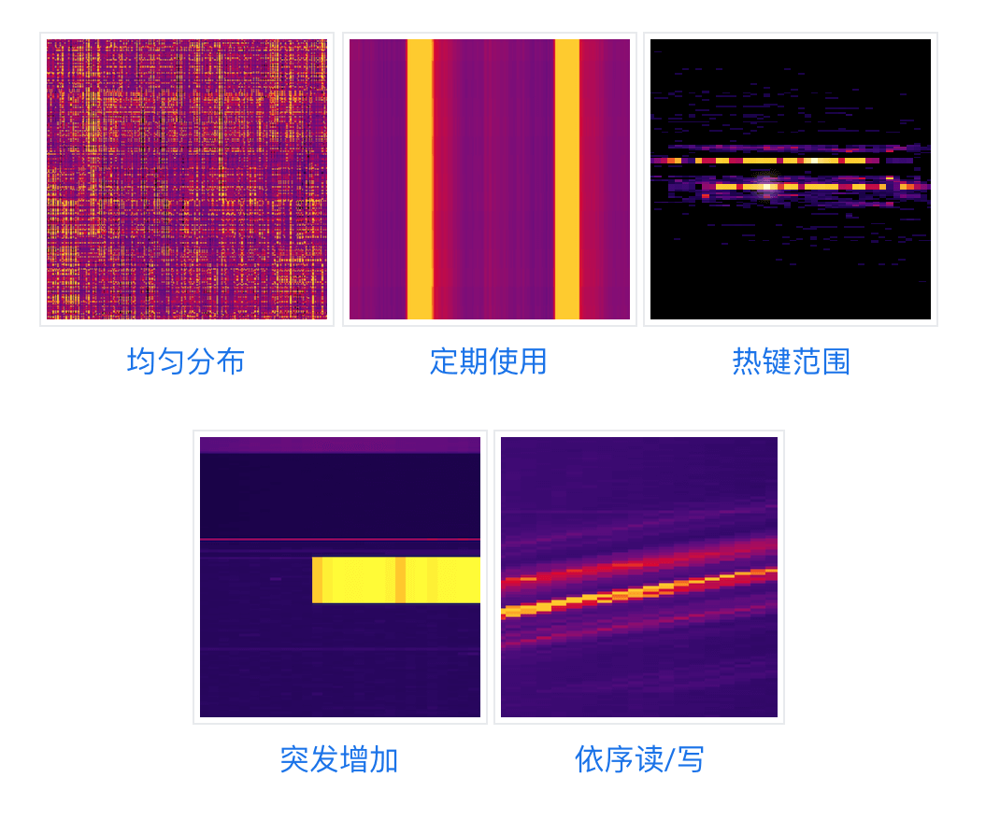
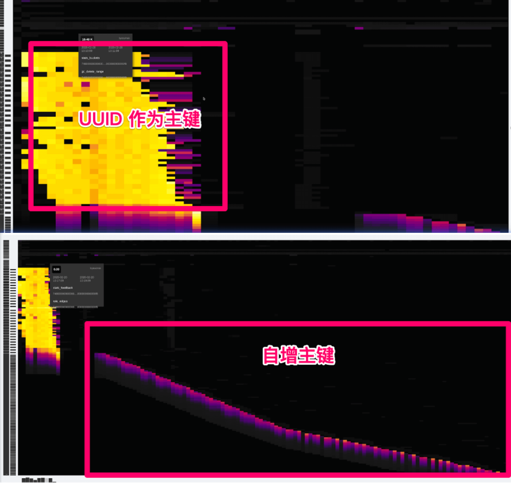
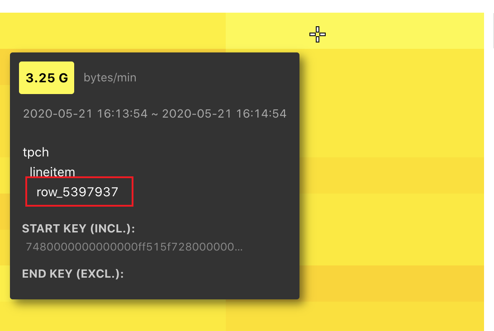
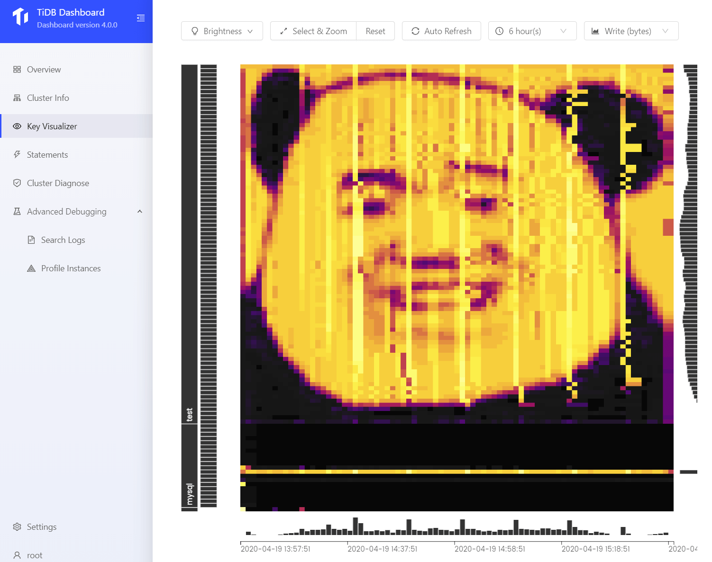
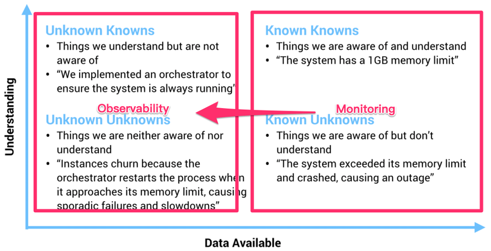

## 0x00 KeyVis

> 不介绍这个功能来历了，贴点资料大家看下开心阅读

- Cloud Bigtable【官方提供多国语言】
  - [Key Visualizer 概览](https://cloud.google.com/bigtable/docs/keyvis-overview)
  - [Key Visualizer 使用入门](https://cloud.google.com/bigtable/docs/keyvis-getting-started)
  - [Key Visualizer 探索热图](https://cloud.google.com/bigtable/docs/keyvis-exploring-heatmaps)
  - [Key Visualizer 热图模式](https://cloud.google.com/bigtable/docs/keyvis-patterns)
  - [Key Visualizer 指标](https://cloud.google.com/bigtable/docs/keyvis-metrics)
  - [Key Visualizer 诊断消息](https://cloud.google.com/bigtable/docs/keyvis-diagnostics)
- TiDB 4.0 新功能物料
  - [Key Visualizer 流量可视化](https://pingcap.com/docs-cn/dev/key-visualizer-monitoring-tool/)
  - [tidb in action / 2.1 识别集群热点和业务访问模式](https://book.tidb.io/session3/chapter2/key-vis.html)：
  - [TiDB 4.0 新特性前瞻（一）拍个 CT 诊断集群热点问题](https://pingcap.com/blog-cn/tidb-4.0-key-visualizer/)
  - [我眼中的分布式系统可观测性](https://pingcap.com/blog-cn/observability-of-distributed-system/)
- 数据业务场景 -- [数据热点](https://asktug.com/t/topic/358)

## 0x01 研究

> from TiDB 官网：古代，医者看病讲究「望、闻、问、切」，通过病人的外部综合表现对病症做出判断。现代，CT 的发明使得人们可以使用 X 光穿透身体各组织内部，将整体的情况以图像的方式展现出来，医生可以根据这个信息快速地排查问题。CT 的出现不仅将诊断的效率提升到了新的高度，也给客观描述身体状态提供了一个标准，是医学史上重要的里程碑。

关于功能测试和图案展现，可以围观上述 Bigtable 或者 TiDB 官方文档，现在我们研究下看到 key-vis 高亮之后的动作。



> TiDB key vis 竖向是 「库 > 表 > 行」信息，横向是时间线，最新数据在右部显示，不断向左归拢消失。

将「业务代码访问硬件资源上的 KV 数据」调度占用「场景形象化」，从观看 QPS / Duration 趋势图转换为 KV Block 「流量、次数」为基础的访问记录「Region」。  

该形象化记录“业务场景  --> 执行动作（get、put、del、post）调用 KV 数据”，不断循环♻️运行后随着时间进度记录下的「流程链路」反应。  

「通过读文档看到」在大量业务场景的测试下并通过一系列的总结，数据反应基本组成以下几个特征图（不同业务特点下的反应）：  

- 自增 ID「三角斜线高亮」
- 周期跑批「竖向的重复高亮，类似夜晚开车看路灯」
- 局部小范围高亮「可能是小表热点（比如参数表）」
- 局部大范围高亮「可能是业务大量增加」
- 期望结果「明暗叠加 — 大范围下的模糊覆盖」



> from TiDB CTO Ed Huang : 现在如果有朋友问我，“这个业务适不适合 TiDB？”我只需要通过录制线上流量，或者搭建一个从集群，只需要把 KeyViz 的图给我看一眼，我甚至都不需要压力测试就能判断这个业务是否适合，而且即使不适合，我也能准确的给出修改建议，因为 KeyViz 的图对我的「假设」的可解释性有了很强的支持。  

## 0x02 探探

使用 Key vis 之前有几个疑问：  

- Key vis 怎么做出来的？
  - TiKV 上报给 PD 的心跳信息包含了 KV 流量信息，通过 html + JS 解析 json 数据在浏览器展现
- Key vis 高亮后 DBA 可以做什么？
- Key vis 高级功能使用方式？
  - 一顿测试玩耍，暂未发现高级功能
- 人工怎么自定义 Key vis 亮暗走向？
  - 见 [0x03 Panda](#pandadalao)

### 高亮后



> 上图是通过 tiup 部署了单节点 TiDB 集群，准备了 100 workhouse 数据，使用 tpch 单线程压测时出现的场景  
> 当 key viz 出现「黄色高亮区域」之后：怎么找到这个数据？怎么找到相应 SQL 或者业务逻辑信息？然后怎么解决它呢？  

和以前一样，我们需要先获取到 QPS、Slow query、duration 等数据库信息和硬件 CPU、IOPS、带宽等信息综合判断目前 TiDB 集群负载和业务压力「这一步看起来是必不可少的」。

有了以上信息后，放在以前 DBA 会想办法「找到最慢或者影响最大」的 SQL 语句，然后加索引或者通知业务调整流量压力。现在 DBA 可以进一步看到 「KV 数据」 的访问次数、流量带宽信息，这可以进一步锁定业务出现问题的场景（然快速意味着拥有更多经验）。

> 一般情况下：数据出现热点、业务流量暴涨都会出现高亮区域，这些相对来说正向问题，不排除产品有 BUG 出现计算错误、调度雪崩等场景。  
> 流量暴涨场景：取决于业务对 schema 的设计是否有隐患「连续自增、小表热点、周期热点、单表暴增」、机器资源是否充足「换更好的硬件是最好的调优方式--鲁迅说的」  

有了经验值「做一些特定场景的测试，然后看 key vis 的断层，鉴该文档第一张图」之后，从两个方向交叉验证 TiDB 集群运行压力和高亮场景。

然目前 Key Viz 提供的信息中无法直接关联到 「业务 SQL」，信息中还剩下 STARK KEY 可以使用

- 通过 `pd-ctl -u http://<PD_ADDRESS> region key <KEY>` 工具解析该 key region 位置，

  ```json
  [tmpuser@jumphost ~]$ tiup ctl pd -u http://172.16.4.51:14379 region key 7480000000000000ff515f728000000000ff044d060000000000fa
  Starting component `ctl`: /home/tmpuser/.tiup/components/ctl/v4.0.0-rc.2/ctl pd -u http://172.16.4.51:14379 region key 7480000000000000ff515f728000000000ff044d060000000000fa
  {
    "id": 240,
    "start_key": "7480000000000000FF515F728000000000FF044D060000000000FA",
    "end_key": "7480000000000000FF515F728000000000FF0B649B0000000000FA",
    "epoch": {
      "conf_ver": 1,
      "version": 40
    },
    "peers": [
      {
        "id": 241,
        "store_id": 1
      }
    ],
    "leader": {
      "id": 241,
      "store_id": 1
    },
    "written_bytes": 0,
    "read_bytes": 1168682168,
    "written_keys": 0,
    "read_keys": 5399413,
    "approximate_size": 100,
    "approximate_keys": 498011
  }
  ```

- 通过 [curl http://{TiDBIP}:10080/regions/{regionID}](https://github.com/pingcap/tidb/blob/master/docs/tidb_http_api.md "文档第 5 条啊") 可以反解析到该 region 属于那张表。
  - 然后可以做 [`pd-ctl operator add split-region 1 --policy=approximate`](https://pingcap.com/docs-cn/stable/pd-control/#operator-show--add--remove)，或者修改 [`shard_row_id_bits=4`](https://pingcap.com/docs-cn/stable/tidb-specific-system-variables/#shard_row_id_bits)，或者查阅 [Split Region 使用文档](https://pingcap.com/docs-cn/stable/sql-statements/sql-statement-split-region/#split-region-%E4%BD%BF%E7%94%A8%E6%96%87%E6%A1%A3)

  ```json
  [tmpuser@jumphost ~]$ curl http://172.16.4.51:14080/regions/240
  {
  "region_id": 240,
  "start_key": "dIAAAAAAAABRX3KAAAAAAARNBg==",
  "end_key": "dIAAAAAAAABRX3KAAAAAAAtkmw==",
  "frames": [
    {
    "db_name": "tpch",
    "table_name": "lineitem",
    "table_id": 81,
    "is_record": true,
    "record_id": 281862
    }
  ]
  ```

如果当前通过 key viz 看横向尾部持续高亮：可以开启 general log 获取目前正在运行的 SQL 「slow query 不等于读取高亮 KV 数据，比如小表热点」；和业务开发一起聊下「业务代码逻辑」确认下目前正在执行的操作，同时看下 slow query 是否有关于该表的信息。

> 截图中有个 `row_5397937` 上是 TiDB rowid（TiDB 特产）信息，可在数据库中执行 `select * from tech.lineitem where _tidb_rowid = 5397937` 查看；这有助于你和开发一起聊业务代码逻辑。

  ```sql
  (root@127.0.0.1) [tpch]>select * from lineitem where _tidb_rowid = 5397937;
  +------------+-----------+-----------+--------------+------------+-----------------+------------+-------+--------------+--------------+------------+--------------+---------------+-------------------+------------+-----------------------+
  | L_ORDERKEY | L_PARTKEY | L_SUPPKEY | L_LINENUMBER | L_QUANTITY | L_EXTENDEDPRICE | L_DISCOUNT | L_TAX | L_RETURNFLAG | L_LINESTATUS | L_SHIPDATE | L_COMMITDATE | L_RECEIPTDATE | L_SHIPINSTRUCT    | L_SHIPMODE | L_COMMENT             |
  +------------+-----------+-----------+--------------+------------+-----------------+------------+-------+--------------+--------------+------------+--------------+---------------+-------------------+------------+-----------------------+
  |    5372642 |    106219 |      8730 |            4 |      39.00 |        47783.19 |       0.10 |  0.08 | A            | F            | 1994-02-07 | 1994-03-28   | 1994-02-16    | DELIVER IN PERSON | RAIL       | e evenly carefully un |
  +------------+-----------+-----------+--------------+------------+-----------------+------------+-------+--------------+--------------+------------+--------------+---------------+-------------------+------------+-----------------------+
  1 row in set (0.00 sec)
  ```

## 0x03 新知识

> 学习 key viz 期间遇见的新知识点，耳目一新的视角

### Pandadalao

源代码存放在 Github [andylokandy/drawvis](https://github.com/andylokandy/drawvis "TiDB key-vis pandadalao")



> 作图思路

计算 d2.jpg 图片高度然后表里插入相应高度的数据：图片高度 == 数据库中的行数，假设图片 1000px 高度，在数据库插入 1000 行数据。

然后从左向右、从上向下扫描黑色和白色；将竖着的黑色和白色映射为 Y 坐标，与数据库中 1 - 1000 行对应。

扫描到白色情况下【链接到数据库】疯狂更新 Y 坐标对应行的数据，遇见黑色的情况停止增删改查。

从左向右间隔 60s 执行一次，随着时间的流失，逐渐在 key-vis 上展现出来一张由高亮热点数据和暗部冷数据组成的图案。

### Know

> 复制于：[我眼中的分布式系统可观测性](https://pingcap.com/blog-cn/observability-of-distributed-system/)  
> 在过去，一个物理机器的状态确实可以通过几个监控指标描述，但是随着我们的系统越来越复杂，我们的观测对象正渐渐的从「Infrastructure」转到「应用」，观察行为本身从「Monitoring（监控）」到「Observability（观测）」。  
> 虽然看上去这两者只是文字上的差别，但是请仔细思考背后的含义。关于这个话题，我很喜欢引用下面这张图：



> 回到数据库的世界，TiDB KeyViz 的意义在于，就像上面提到的，这个工具不仅仅是一个监控工具，而且它能以一个非常低门槛且形象的方式让架构师具象化的看到自己对于业务的「假设」是否符合预期，这些「假设」不一定是能够通过监控反映的，以获得对业务更深刻的 Insight。  

## 0x04 臆测

> 正向循环♻️体系

TiDB 官方文档将 key viz 比喻为医疗行业 CT、核磁共振、X 光 等高精尖机器；现实中医生使用这些工具获取身体断层扫描资料做交叉对比，靠自身医学经验判断该目标是否身陷某种疾病，当有诊断目标后通过血常规、局部微创等进一步确定患者症状。

目前 key viz 依据业务场景可以生成众多现象（图片），剩下的就是汇聚更多的场景 （ 业务逻辑 & 数据结构 & 读写频率 & 修复方案 ）即可智能提出解决方案，毕竟 核磁、CT 等已经做到智能化识别肿瘤、病毒扩散等。

上述文档中已知的几种类型图可转换为特征（医生知识库），根据 QPS、硬件资源占用 综合推算出目前机器可运行业务峰值扭矩，超过后会导致拐点出现断崖式下降。

> CT(Computed Tomography)，即电子计算机断层扫描，它是利用精确准直的 X 线束、γ射线、超声波等，与灵敏度极高的探测器一同围绕人体的某一部位作一个接一个的断面扫描，具有扫描时间快，图像清晰等特点，可用于多种疾病的检查；根据所采用的射线不同可分为：X 射线 CT（X-CT）以及γ射线 CT（γ-CT) 等。它根据人体不同组织对 X 线的吸收与透过率的不同，应用灵敏度极高的仪器对人体进行测量，然后将测量所获取的数据输入电子计算机，电子计算机对数据进行处理后，就可摄下人体被检查部位的断面或立体的图像，发现体内任何部位的细小病变。
>  
> 核磁共振 MRI 是一台巨大的圆筒状机器，能在受检者的周围制造一个强烈磁场区的环境，借由无线电波的脉冲撞击身体细胞中的氢原子核，改变身体内氢原子的排列，当氢原子再次进入适当的位置排列时，会发出无线电讯号，此讯号借由电脑的接收并加以分析及转换处理，可将身体构造及器官中的氢原子活动，转换成 2D 影像，因 MRI 运用了生化、物理特性来区分组织，获得的影像会比电脑断层更加详细。

### 无逻辑思考

现象 --> 特征收集 -->【初步判定 A --> 收集依赖 B --> 判定 A --> 记录循环并继续判定 B （可能需要更高级专家会诊）】（直到解决循环中括号内疑问）--> 解决整个问题并提出完整方案和后续优化建议

这套过程基本上就是病人去医院后的流程

现实例子： 头疼脑热（现象） --> 根据特征现象送选 「脑科 or 感冒发烧」 --> 【抽血化验、测体温 --> 初步判定感冒了 --> 等血常规结果发现是 各种减号  -->  判定比较严重送去「传染科看是否为新冠病毒」 --> 虚惊一场不是感冒，确认是新冠】 --> 启动紧急预案--> 检查接触并隔离人群 --> 就地升华

整个流程中：最大最长最复杂的是发现问题的过程，每次新工具的产生大家希望是发现更深刻的问题以及更快的发现核心问题，然感受到的是对被测介质加测更多的实验场景，导致被测介质不稳定从而爆发。那么怎么才能减少被测介质的实验场景或者减少被测介质焦作不安等煎熬心情呢？

### 展望理论

> [展望理论](https://baike.baidu.com/item/%E5%B1%95%E6%9C%9B%E7%90%86%E8%AE%BA)（prospect theory）也译作 “前景理论”

有时参考点选择的不同甚至可以带来[框架效应](https://baike.baidu.com/item/%E6%A1%86%E6%9E%B6%E6%95%88%E5%BA%94/9738412)，即同样的意思用收益型结果来表述，还是用损失型结果来表述，会影响人的选择。  
比如有 100 个病人，用 (a)、(b) 两种治疗方案，可以将治疗结果表述为：方案 (a) 救活 50 人；方案 (b) 有 50% 的概率全部救活，50% 的概率无人救活；  
也可以表述为：方案 (a) 死去 50 人；方案 (b) 有 50% 的概率无人死去，50% 的概率全部死去。  

多数人两次的选择是不一致的。因为第一种表述是以无人生还为参考点，每多救活一个人都是一种 “收益”；而第二种表述是以无人死去为参考点，每多死去一个人都是一种 “损失”。参考点选择不同改变了决策人的风险偏好，因而做出了不同选择。  
