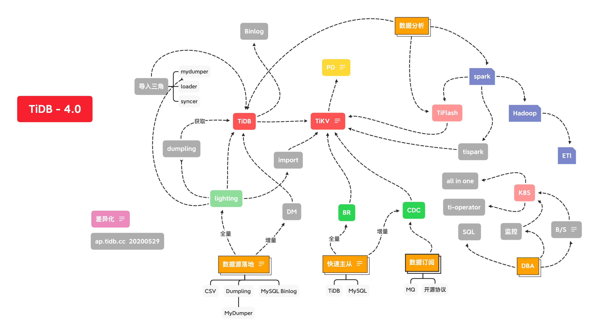
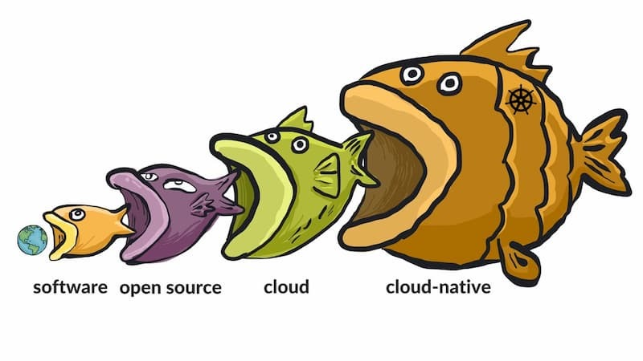

## 0x00 History

- TiDB 1.0 2017 年 10 月 16 日
- TiDB 2.0 2018 年 4 月 27 日
- TiDB 2.1 2018 年 11 月 30 日
- TiDB 3.0 2019 年 6 月 28 日
- TiDB 3.1 2020 年 4 月 16 日
- TiDB 4.0 2020 年 5 月 28 日

## 0x01 4.0

> 没有故事可讲，看图吧  
> 根据上一篇文档 [TiDB 4.0 新特性](/post/20200504-19-tidb4.0/)和各种猜测揣摩构图  
> **本图不代表 TiDB 官方解答，部分组件还未 GA ，请勿直接引用复制**  
> **本图不代表 TiDB 官方解答，部分组件还未 GA ，请勿直接引用复制**  
> **本图不代表 TiDB 官方解答，部分组件还未 GA ，请勿直接引用复制**  

## 0x02 未来可期

> 一些组成故事和场景的关键词，具体故事内容自行脑补  

1. online DDL
2. scale out
3. region schedule
     - hot region
       - follower read（部分）
     - 静默 region
4. 超大容量
5. 高可用
     - Raft
     - 无状态组件
6. 未来可期
     - 文档、工具、生态
     - 代码开源
     - 成本：支出 & 收益
       - 硬件支出与用户量线性可控
       - 收益 与 “平台” 互相扩展
     - 员工幸福度
7. 平台化、标准化
     - 精细可控、水到渠成
     - 打包、共享、自主、灵活
8. 路程 == 不同硬件场景适配
     - 从传统到共有云
     - 从共有云回归私有云
     - 从私有云到 K8S
     - 从人造肉故障到自动化运维
     - 顺应时代的变迁
9. 心砺 == 不同软件场景适配
     - 金融、保险、证券；厂商 mysql  protocols 保底
     - 互联网快速迭代，粮草满足战场
10. 大、快、稳
      - 大数据量到来了
      - 快速分析需求到来了
      - 同时跑起来还要稳起来

