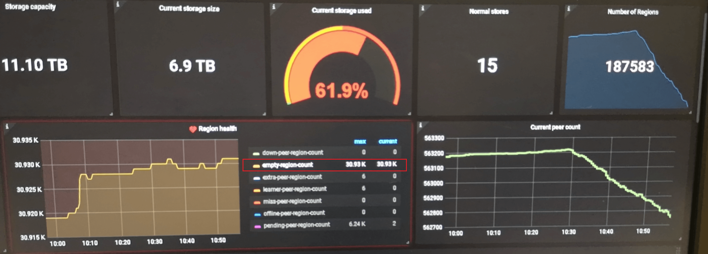
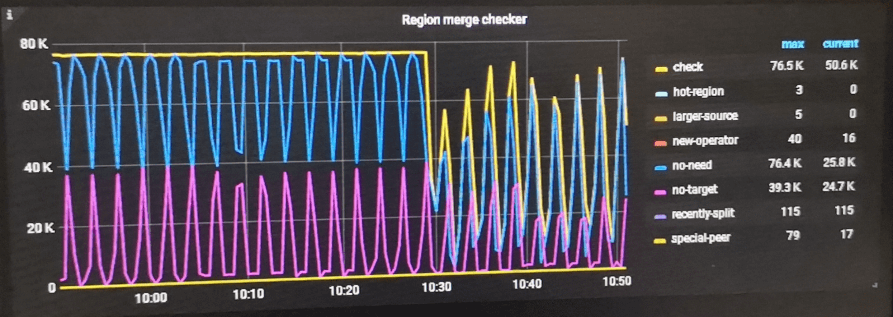

## 0x00 开始

- Region Merge 是否要开启
  - 观察 pd dashboard 中  region health 中 empty-region-count 信息；
    - 如该数值大于 store * 100 ，建议开启 Region Merge
    - 如该数值大于 store * 1000 ，建议调整 Region Merge 阈值「或者检查是否开启了 Region Merge」



- Region Merge 功能由来
  - 频繁 delete 历史数据会删除 region 内数据；循环一段时间之后 region 只留下了 region meta 信息
  - region group 信息需要 raft 状态机维护「raft cpu」；当 empty-region 过多会产生不必要的 region 心跳消耗
  - 开启 Region Merge 可以降低 raft cpu 消耗，同时减少 coprocessor cpu 扫描数据请求「delete 一批数据之后，还剩下 1000 数据，这些数据随机分布在 800 个 region 中，执行 sum/count 时就要向这 800 region 发起请求统计数据；合并之后只需要 1 个 region 请求」

### Regions info

```json
{
  "count": 168,   // 集群中 Region 总数量
  "regions": [
    {
      "id": 241,  // Region id
      "start_key": "7480000000000000FF565F728000000000FF03F07A0000000000FA",
      "end_key": "7480000000000000FF565F728000000000FF0B07BE0000000000FA",
      "epoch": {
        "conf_ver": 5,
        "version": 46
      },
      "peers": [  // Region 成员信息
        {
          "id": 242,
          "store_id": 1
        },
        {
          "id": 243,
          "store_id": 4
        },
        {
          "id": 244,
          "store_id": 5
        }
      ],
      "leader": {
        "id": 244,  // Reigon 成员中 leader id「角色」
        "store_id": 5
      },
      "written_bytes": 0,
      "read_bytes": 0,
      "written_keys": 0,
      "read_keys": 0,
      "approximate_size": 99,     // Region 大小
      "approximate_keys": 478217  // Region Key-Values 数量
    },
  ... ... 省略其他信息
```

### empty-region

```golang
// EmptyRegionApproximateSize is the region approximate size of an empty region
// (heartbeat size <= 1MB).
const EmptyRegionApproximateSize = 1

...-跳过部分信息-...

// 判断 region approximate size 小于等于 1mb ，定义为 empty-region
if region.GetApproximateSize() <= core.EmptyRegionApproximateSize {
    r.stats[EmptyRegion][regionID] = region
    peerTypeIndex |= EmptyRegion
  }

...-跳过部分信息-...

// 定义 pd_checker_event_count 监控
var (
  checkerCounter = prometheus.NewCounterVec(
    prometheus.CounterOpts{
      Namespace: "pd",
      Subsystem: "checker",
      Name:      "event_count",
      Help:      "Counter of checker events.",
    }, []string{"type", "name"})
)

func init() {
  prometheus.MustRegister(checkerCounter)
}

...-跳过部分信息-...

// 详情见 server/schedule/checker/merge_checker.go
// 调用 mergecheck function ，监控系统记录 +1 调用
// 通过 prometheus count 方式统计该信息
checkerCounter.WithLabelValues("merge_checker", "check").Inc()


...-跳过部分信息-...

// Region Merge 还需要检测其他累计十几项内容
// 可在 server/schedule/checker/merge_checker.go 查看
```

## 0x01 开启

> Region Merge 参数

- 开启 [官网文档-Region Merge 功能](https://docs.pingcap.com/zh/tidb/stable/massive-regions-best-practices#%E6%96%B9%E6%B3%95%E4%BA%94%E5%BC%80%E5%90%AF-region-merge)
  - 通过 pd-ctl 工具调整以下参数
  - merge-schedule-limit  为 0 情况下为关闭状态
- region size 与 region keys 两条阈值互相满足的 region 会被列入 Region Merge 需求范围，只满足一项不会被 merge 操作。
- merge-schedule-limit 调度速度，围观官网文档 [Region Merge 速度慢](https://docs.pingcap.com/zh/tidb/stable/pd-scheduling-best-practices#region-merge-%E9%80%9F%E5%BA%A6%E6%85%A2)

```json
// max-merge-region-size 单位 MB；
// 监控上参考“ tikv 总存储量「未压缩」/ tikv 总 region peer 数量”；得到平均 peer 大小
// prometheus 查看 sum(pd_scheduler_store_status{ type="region_size"}) / sum(pd_scheduler_store_status{ type="region_count"}) ；得到单位为 MB
>> pd-ctl config set max-merge-region-size 20

// max-merge-region-keys 单位 KV 数量；监控获取获取不到
>> pd-ctl config set max-merge-region-keys 200000

>> pd-ctl config set merge-schedule-limit 8
```

> 校验集群需要 Region Merge 数据量

- pd-ctl 工具获取：size & keys 范围一下 region 数量
  - 首先检测 linux 系统是否安装了 jq 工具
  - 替换 approximate_size 与 approximate_keys 后的数值
  - 校验后带入到 pd-ctl config set 中

```json
./pd-ctl --pd 'http://10.0.0.1:2379' -d region | jq ".regions | map(select(.approximate_size < 20 and .approximate_keys < 200000)) | length"
```

## 0x02 运维

> 可在 server/schedule/checker/merge_checker.go 查看

0. Region Merge 预检查
   - 见 checker role 内容
1. 确认 reigon 大小是否满足 merge 阈值参数
2. 确认 region 相邻关系，相邻的两个 region 消消乐合并为一个
3. 「潜规则」region leader 必须在相同一个台机器
    - snapshot + add peer ；schedule region
    - schedule ：transfer leader
4. merge region；生成新的 region
5. 新 region 升级为 region group
   - +1 follower
   - +1 follower

- checker role

> 监控图位于 pd dashboard -- scheduler -- 末尾右下角



|num  |  checker  |  描述
|  -  |  ----  |  ------
|  1  |  recently-start  |  判断启动时间是否超过 GetSplitMergeInterval 时间 //</br> PD 初始化启动后 etcd meta 信息中 region size 为 0 ，此时默认跳过 region merge；</br> region size > 0 & <= 1mb 同时满足 region keys & region size 时会进行 merge
|  2  |  recently-split  |  不懂是个啥
|  3  |  check  |  默认属性：检查 region 各种状态、tikv 存储环境等
|  4  |  skip  |  PD 初始化启动后 etcd meta 信息中 region size 为 0 ，此时默认跳过 region merge
|  5  |  no-need  |  // region is not small enough
|  6  |  special-peer  |  // skip region has down peers or pending peers or learner peers
|  7  |  abnormal-replica  |  // IsRegionReplicated checks if a region is fully replicated. When placement rules is enabled, its peers should fit corresponding rules. When placement rules is disabled, it should have enough replicas and no any learner peer.
|  8  |  hot-region  |  // skip hot reigon
|  9  |  no-target  |  没有注释，理解是没有相邻的两个 region 可以用于 merge / 两个 region 的 start end key 不相邻
|  10  |  new-operator | 默认属性：创建一个 operator merge 操作，合并相邻的两个 region
|  11  |  larger-source  |  region 大于 target ，谁是reigon ？ 谁是 target ？// 没追到谁是谁

### emmm

- try tips
  - [Region Merge 速度慢](https://docs.pingcap.com/zh/tidb/stable/pd-scheduling-best-practices#region-merge-%E9%80%9F%E5%BA%A6%E6%85%A2)
  - [PD schedule 配置说明](https://docs.pingcap.com/zh/tidb/stable/pd-configuration-file#schedule)

从底层往上观察 TiDB cluster 各组件监控，与 region merge 慢或者不工作场景排查时可能相关的内容「仅描述各组件涉及 region merge 相关内容」：

- 磁盘性能 IOPS：io util 不超过 70% & iops 读写能力大于 40000 iops
- TiKV thread cpu「监控」
  - RAFT ：默认值为 2 * cpu vcore；region group 状态维护，数据写入与读取
  - apply ：默认值为 2 * cpu vcore；region 合并写入更新至新 region group
  - snapshot：默认值 1 * cpu vcore；在 region leader 上创建全量数据副本，协助 grpc 发送新机器
  - GRPC：默认值 4 * cpu vcore；协助 snapshot 发送新机器
- 2PC Backoff「region 变动而出现的 tidb - tikv 之间交互增加」
  - not leader；leader 位置有变动或者 leader 还未选举成功
  - region miss；根据 region cache 未命中读取到数据
  - 或许还有其他，详情见 tidb dashboard -- kv error -- resolve lock
- PD schedule「region 调度相关」
  - Region merge check
  - Region schedule / Leader Schedule
- PD ctl
  - 检查 max-merge-region 相关的参数是否开启
  - 检查 max-merge-region 中的 size & keys 是否可以命中到数据

## 0x03 其他

[operator [check | show | add | remove]](https://docs.pingcap.com/zh/tidb/stable/pd-control#operator-check--show--add--remove) 是 [2.0 时代](https://docs.pingcap.com/zh/tidb/stable/release-2.0.1#pd)加入功能，当时需要人工使用 `pd-ctl operator add region merge` ，后续逐渐优化到了根据阈值自动处理 region merge。未来可期  

> 手工操作思路

查询 Region size 低于 xx MB 的数量以及 Region id；需要使用 pd-api「http://ip:2379/pdapi/v1/regions」 获取所有 Regions 信息，然后分析 approximate_size 低于 xx MB 的 Region ID  

使用 [region sibling <region_id>](https://docs.pingcap.com/zh/tidb/stable/pd-control#region-sibling-region_id) 查询 Region 相邻的 Region  
`>> region sibling 2`

使用 merge-region <source_region_id> <target_region_id> 功能合并 “小 Region” 和“邻居 Region”  
`operator add merge-region 1 2     // 将 Region 1 与 Region 2 合并`


