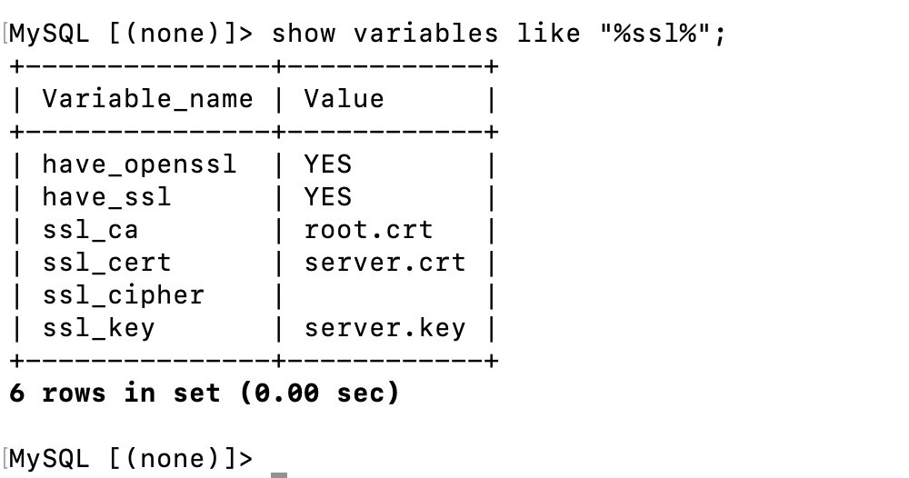
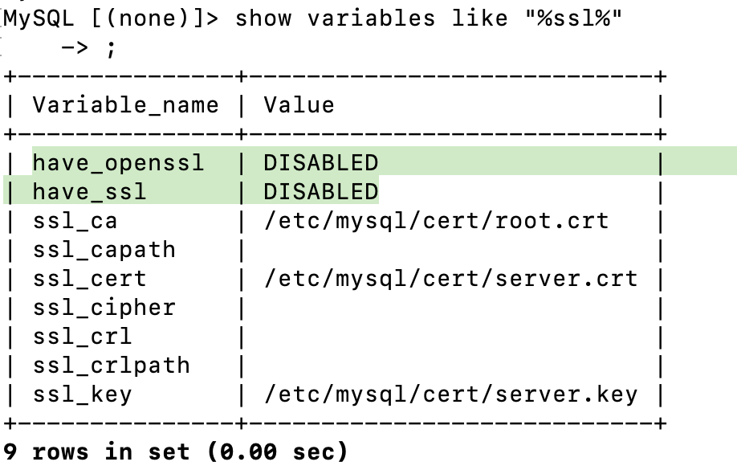
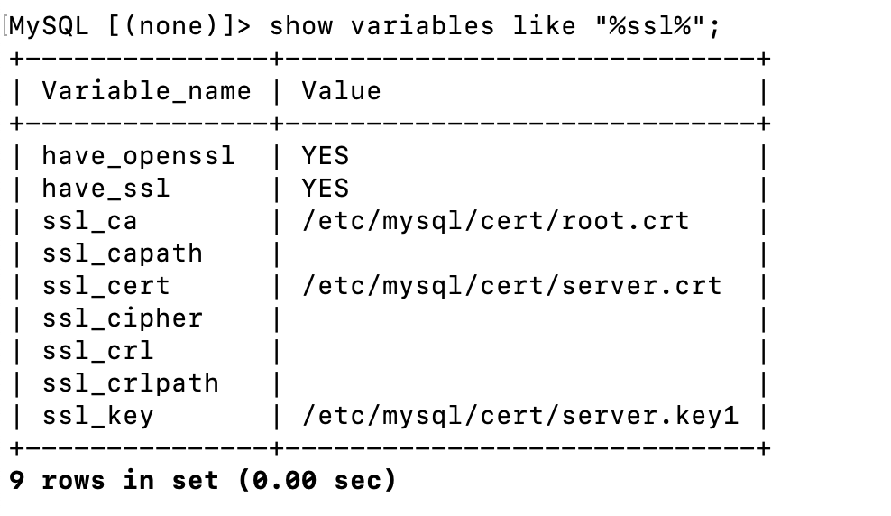

## 0x00 init

测试要求：需要 MySQL 开启 SSL 与 ROW format Binlog 功能

## 0x01 Docker command

// 忽略安装 docker-ce 步骤

搜索网络资料，使用以下命令方式启动：「Docker 指定 --ssl=1 参数时，docker 内已经封装的 mysql_ssl_rsa_setup 会自动生成 TLS 证书，该证书不带有 SAN/CN 扩展属性 」、「参数中不支持使用 --tls-version="TLSv1,TLSv1.2"，因为中间少 TLSv1.1」

```shell
docker run --name TSQL \
    -v /home/tidb/TSQL:/var/lib/mysql \
    -e MYSQL_ROOT_PASSWORD=root -p 36:3306 \
    -d mysql:5.7 \
    --ssl=1 --tls-version "TLSv1.2" \
    --server-id=1 \
    --binlog-format=ROW \
    --gtid-mode=ON \
    --log-bin=mysql-bin \
    --enforce-gtid-consistency=ON
```

> 以下部分信息来源于 [MySQL 官网](https://dev.mysql.com/doc/refman/5.7/en/using-encrypted-connections.html)

- 链接方式
  - 创建 SSL 扩展属性用户，登录时默认检查 SSL 方式
    - `CREATE USER 'remote_user'@'mysql_client_IP' IDENTIFIED BY 'password' REQUIRE X509;`
  - mysql 链接时执行打开 SSL 方式链接
    - 参考以下方案
- 使用 mysql client 链接验证「不同 client 参数不同」
  - mysql client 使用 `mysql --ssl=1 --ssl-mode=required --ssl-ca=ca.pem --ssl-cert=client-cert.pem --ssl-key=client-key.pem`
    - disable // 非 TLS 方式链接
    - required // 如果服务器支持加密连接则加密连接；如果无法构建加密连接，则连接尝试非加密方式「取决用户是否强制加了 require x509 扩展」
    - VERIFY_CA // 对照配置的 CA 证书验证服务器证书颁发机构(CA)证书。如果找不到有效的匹配 CA 证书，则连接尝试将失败。
    - VERIFY_IDENTITY // 对照服务器发送给 Client 端的证书中的身份检查 Client 端用于连接到服务器的主机名来执行主机名身份验证
  - mariadb client 使用  `mysql --ssl=1 --ssl-ca=ca.pem --ssl-cert=client-cert.pem --ssl-key=client-key.pem`
    - 木有 ssl-mode 参数

执行 `show variables like '%ssl%'` 查看 ssl 信息，执行 `\s` 获取链接信息。

// have_ssl & have_openssl 必须为 YES。



## 0x02 Error

验证与第三方工具链接时，对方工具不认可 mysql setup ssl 工具生成的 TLS 证书；需要 Docker 指定 openssl 手动生成的 TLS 证书启动。

```shell
docker run --name TSQL \
    -v /home/tidb/TSQL:/var/lib/mysql \
    -v /opt/ssl.bak:/etc/mysql/cert \
    -e MYSQL_ROOT_PASSWORD=root -p 142:3306 \
    -d mysql:5.7 \
    --ssl=1 --tls-version "TLSv1.2" \
    --server-id=1 \
    --binlog-format=ROW \
    --gtid-mode=ON \
    --log-bin=mysql-bin \
    --enforce-gtid-consistency=ON \
    --ssl-ca="/etc/mysql/cert/root.crt" \
    --ssl-cert="/etc/mysql/cert/server.crt" \
    --ssl-key="/etc/mysql/cert/server.key1"
```

SSL 链接登陆检查时发现可以看到证书信息，但服务并没有启动 SSL 功能「使用  `\s` 查不到链接加密信息」。



随后在 `docker logs TSQL` 查看 MySQL 服务启动日志信息，看到以下问题

`2020-10-21T07:32:22.180801Z 0 [Warning] CA certificate /etc/mysql/cert/root.crt is self signed.`

参考[网上资料](https://askubuntu.com/questions/194074/enabling-ssl-in-mysql)，需要将 openssl 1.0 以后版本生成的证书是二次转换。

  `openssl rsa -in server-key.pem -out server-key.pem`


