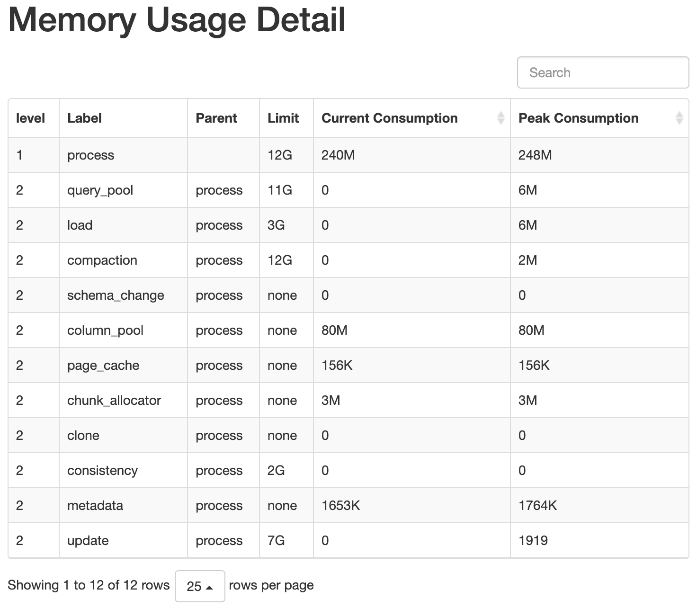
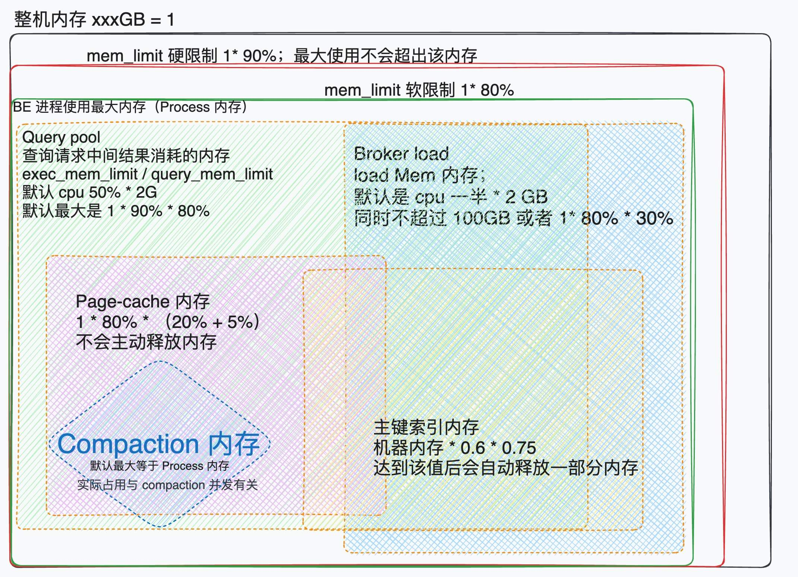

通过访问 `BeIP:8040/mem_tracker` 获取当前 BE 进程内部各项内存项的瞬间使用。
大致如下图所示，以下各项工作可查看[内存管理](https://docs.starrocks.io/zh-cn/latest/administration/Memory_management)文档来了解各项指标的参数、百分比 
 

或者通过以下方式查询内存

```
curl -XGET -s http://BE_IP:BE_HTTP_PORT/metrics | grep "^starrocks_be_.*_mem_bytes\|^starrocks_be_tcmalloc_bytes_in_use"

starrocks_be_chunk_allocator_mem_bytes 0 
## 提高内存分配性能的 Cache，默认上限 2G
starrocks_be_clone_mem_bytes 0 
## clone tablet 使用的内存， 内存使用一般比较小
starrocks_be_column_pool_mem_bytes 0 
## 用于加速内存分配的 Pool，当前没有上限
starrocks_be_compaction_mem_bytes 0 
## Compaction 内存使用
starrocks_be_consistency_mem_bytes 0 
## consistency 计算 CheckSum 内存使用
starrocks_be_load_mem_bytes 0 
## 导入内存使用
starrocks_be_process_mem_bytes 95674408 
## 我们内存统计的 BE 进程内存使用
starrocks_be_query_mem_bytes 0 
## 查询内存使用
starrocks_be_schema_change_mem_bytes 0 
## SchemaChange 内存使用
starrocks_be_storage_page_cache_mem_bytes 0 
## BE 自有 StoragePageCache 内存使用
starrocks_be_tablet_meta_mem_bytes 14249776 
## Tablet 元数据内存使用
starrocks_be_tcmalloc_bytes_in_use 114999192 
## TcMalloc 统计的 BE 内存使用
starrocks_be_update_mem_bytes 0 
## PrimaryKey 模型内存使用
```


各线程工作内存有默认最大值、单任务使用时最大值两个指标。各项内存相加之后会超过 1 * 80% 的内存，因此各项内存之间会存在争抢。下图为常用内存示意图




### 一级内存

- Process 内存
    - 主机内存 X 90% 等于硬限制；不会超过，一旦超过会出现 Out of Memory 现象
    - 主机内存 X 80% 等于软限制，会根据业务压力超过该限制

### 二级内存（执行任务时会互相争抢）

1. 查询任务时所占内存 Query pool 
    - 多任务时最大占用是 `主机内存 X 0.9 X 0.8 - 主键索引内存 - page cache 内存` 
    - 单任务时最大占用是 `CPU core 50% X 2GB` 同时不超过多任务时的最大内存，都则报错退出
    - 查询任务退出后会立即释放内存
1. 导入任务时元数据所占内存 Load memory 
    - 默认最大时 `100GB` 或者 `主机内存 X 0.8 X 0.3` ；两个值取最小的作为内存限制
    - 导入数据时，tablet memtable 占用内存，该内容是对 tablet 做元数据生成，加快导入数据时的 hash 分桶能力
    - 导入任务完成后或者失败时会立即释放内存。目前只有 Broker load 一次性导入大量数据到大量的分桶时会造成该内存快速上涨或者打满。当 load memory 打满时 Broker load 导入任务速度会快说下降，同时硬盘压力快速上涨。
    - 注意：
        - 避免一次性向 1000 个 tablet（分桶/分区）导入数据，控制导入后数据落库的范围。
        - 避免 Broker load 导入大量数据进 Primary Key table，会引发大量主键内存占用。
        - 避免 Broker load 与调度、跑批类的大查询公用同一时间段资源，此时两项内存竞争较大，会同时影响导入、查询任务。
1. 主键表的索引内存（只有 Primary Key 表有）
    - 默认最大值占用 `索引内存总和 <= 主机内存 * 0.6 * 0.75`，6 分钟时间内不被使用的数据会被释放（evict cache）
    - 推荐默认开启每张表的 主键索引落盘功能（create table 文档章节的 xxx
    - 该内存空间时多张表公用内存，主键表越多时内存占用越大。加载或释放内存最小单位时一个 tablet 分桶的主键索引。
1. 热数据交换缓存（类似 Linux Page Cache ）
    - 默认大小是 1* 90% * (20% + 5%)，多的 5% 是 Page cache 自身的元数据
    - 随查询业务触发后会变成常驻内存，默认不会主动释放。
    - 可通过 BE 参数永久关闭该功能，关闭后会影响并发类的查询压力。尤其当硬盘 IOPS 不足时会明显的变慢。


###  后台常驻内存

1. compaction 内存
    - 内部数据整理时内存占用，在大量 base compaction 时会有所升高。具体使用量与当前集群内 compaction 并发有关。
2. Clone 任务内存
    - 任务调度时该内存有所上涨， 内存使用一般比较小
1. column_pool 内存
    - 用于加速内存分配的 Pool，当前没有上限
2. schema change 内存
    - SchemaChange 内存使用
3. chunk_allocator 内存
    - 提高内存分配性能的 Cache，默认上限 2G
4. Metadata 内存
    - 不清楚
5. consistency 内存
    - 默认为 2GB
    - 一致性数据检查时，计算 CheckSum 内存使用
