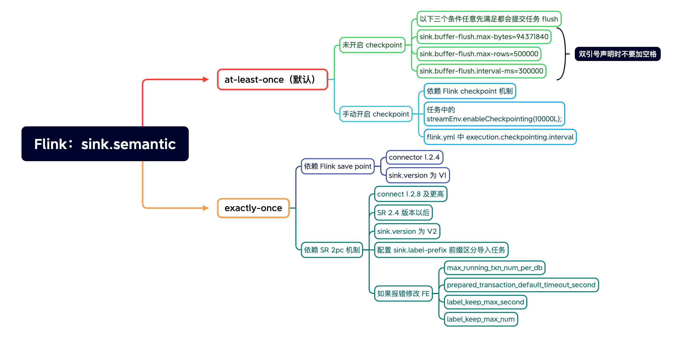
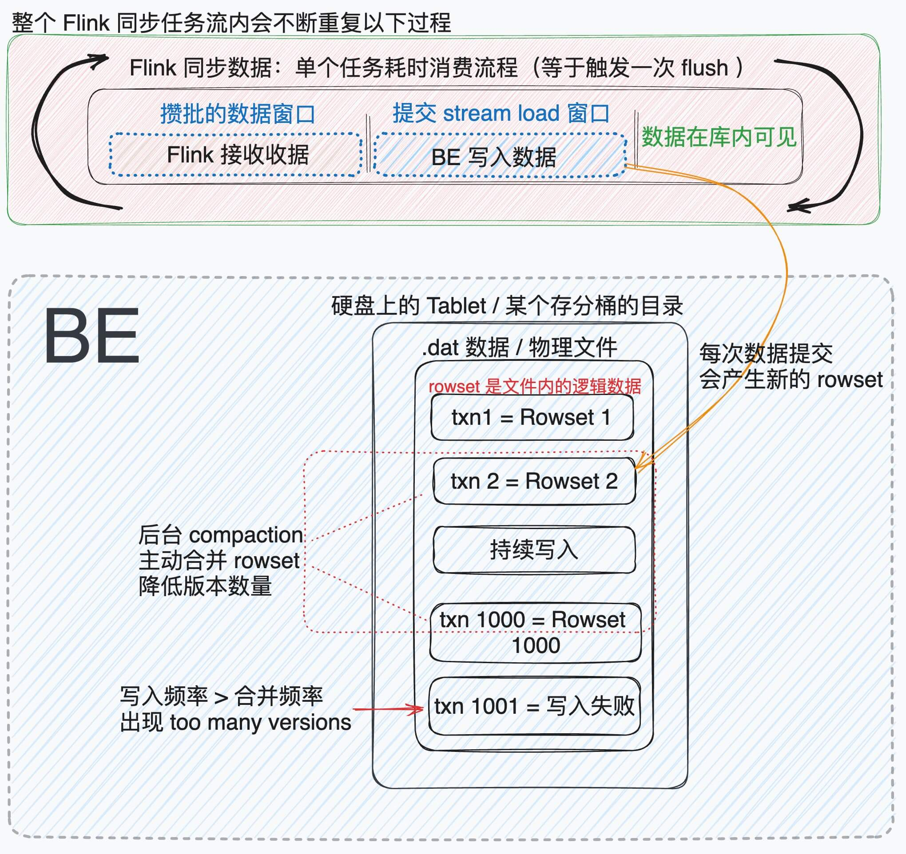

挑选安装版本跳过

1. 下载 Flink 安装包
2. 将 Flink Connector 放到 Flink/lib 目录中
3. 配置 java 环境后，启动 Flink 单机服务
5. 使用 Flink sql 链接该 Flink 服务，当客户端退出后任务失效

## 提交方式



## 任务执行方式



## Flink 任务

`MySQL --> Flink cdc --> StarRocks`
 
数据延迟计算：从源到目的地，小数据量情况下可以做到秒级延迟，数据量大时会在 30 秒到分钟级，延迟取决硬盘 iops 写入能力

### Flink SQL

简单测试（不包含数据删除，`__op` 方式删除数据功能参考 [数据变更](https://docs.starrocks.io/zh-cn/latest/loading/Load_to_Primary_Key_tables#upsert)文档 ）大致如下：

1. SR create table （必须是 Primary Key 模型）
```sql
CREATE TABLE test.c101_flink
(
    `id` int(11) NOT NULL COMMENT "用户 ID",
    `name` varchar(65533) NOT NULL COMMENT "用户姓名",
    `score` int(11) NOT NULL COMMENT "用户得分"
)
ENGINE=OLAP
PRIMARY KEY(`id`)
DISTRIBUTED BY HASH(`id`);
```

2. Flink SQL 创建 Sink 信息同时使用 insert sql 测试下连接性
```sql
CREATE TABLE `c101_flink` (
    `id` INT,
    `name` STRING,
    `score` INT,
    PRIMARY KEY (id) NOT ENFORCED
) WITH (
    'connector' = 'starrocks',
    'jdbc-url' = 'jdbc:mysql://10.10.1.3:9030',
    'load-url' = '10.10.1.3:8030',
    'database-name' = 'test',
    'table-name' = 'c101_flink',
    'username' = 'root',
    'password' = 'test@123'
);

--测试下连接性
-- Flink 执行以下 SQL 后，去 StarRcoks 里查看
INSERT INTO `c101_flink`  VALUES (1, 'starrocks', 100), (2, 'flink', 100);
```
3. Flink SQL 创建 Source 信息，此处使用的 datagen 自动生成的数据，
    - 每次生成 10 条，id 相同、name、score 会不断变动
    - 生成的 id 是相同的，下游数据库只有 10 条数据，数据被原地更新了
```sql
CREATE TABLE source_table 
(    `id` INT,
    `name` STRING,
    `score` INT, 
   PRIMARY KEY (id) NOT ENFORCED
 ) WITH (
'connector' = 'datagen',
'rows-per-second'='5',
'fields.id.kind'='sequence',
'fields.id.start'='1',
'fields.id.end'='10',
'fields.score.min'='1',
'fields.score.max'='10',
'fields.name.length'='10'
 );

-- 执行这个 sql 开启同步
insert into `c101_flink`  select id,name,score from source_table
```

### 最常见的报错

```log
"Message": "Failed to load data into tablet 13239, because of too many versions, current/limit: 1020/1000. You can reduce the loading job concurrency, or increase loading data batch size. If you are loading data with Routine Load, you can increase FE configs routine_load_task_consume_second and max_routine_load_batch_size,:  be:xxxx"
```

`too many versions, current/limit: 1020/1000` 参考图二的写入流程，是数据段时间写入频繁的同时后台异步 compaction 线程未能及时合并版本出现的问题。  
规避方案时调大 `checkpoint` 刷新时间或者 `sink.buffer-flush.interval-ms=300000` 时间，**增大每批消费的数据，降低单位时间内提交任务的次数**。