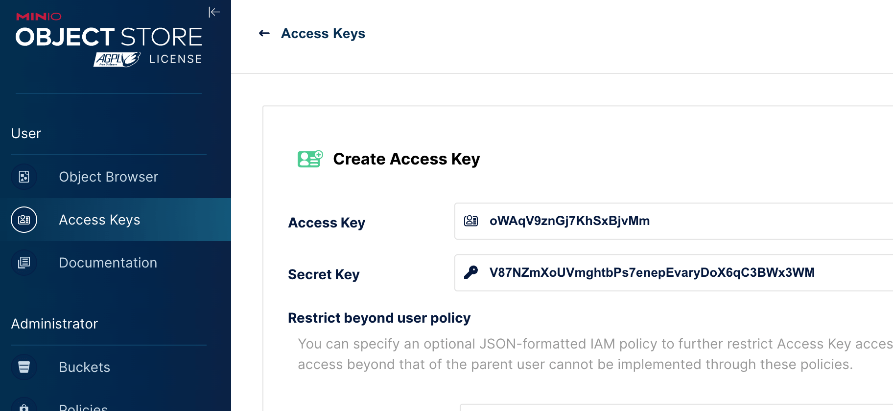
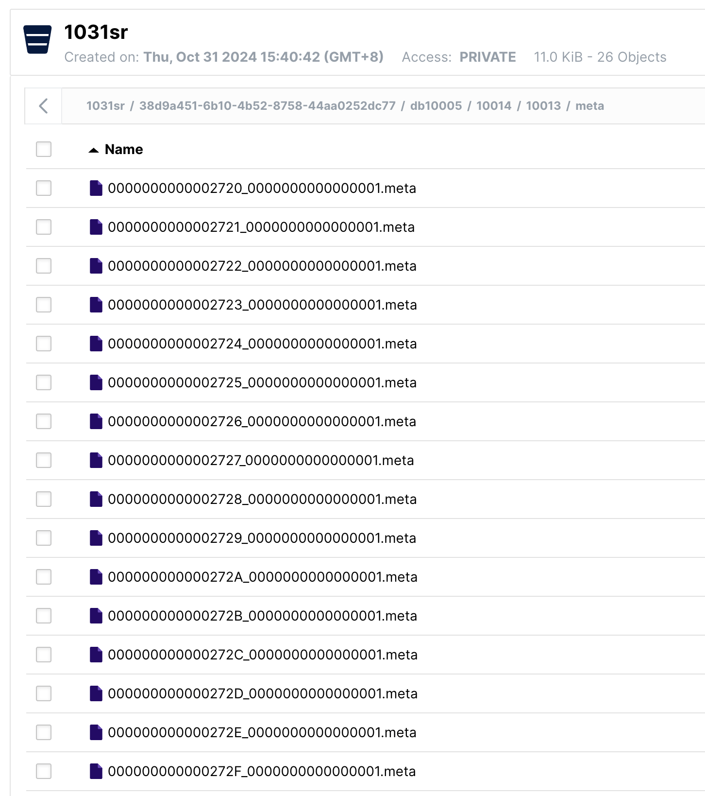
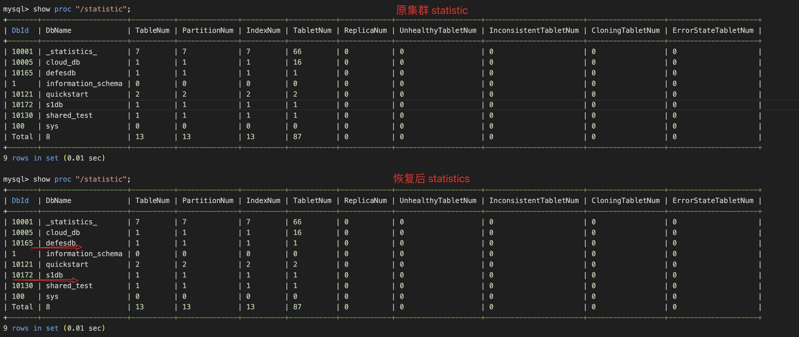
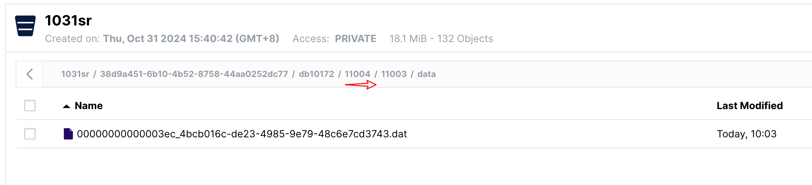
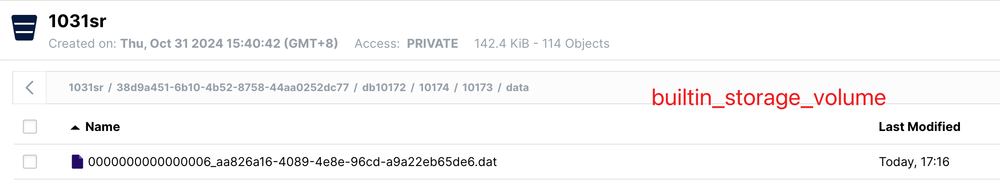
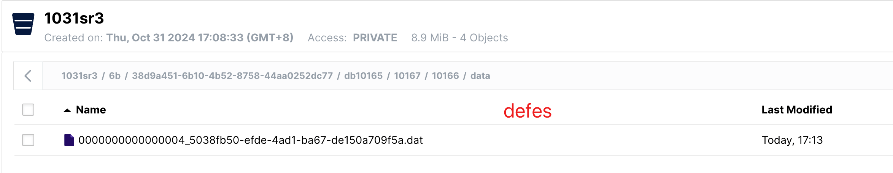
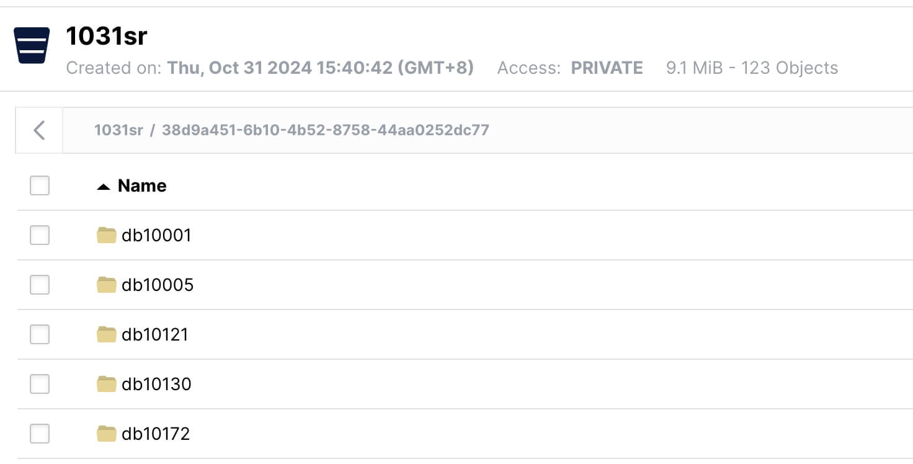
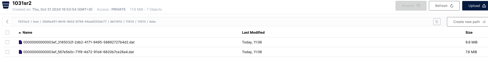
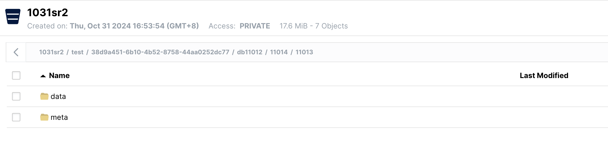
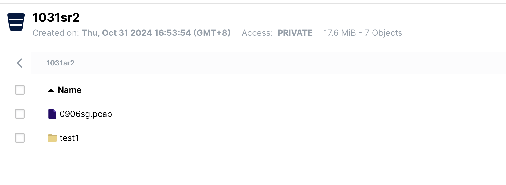

---
title: 纸上谈兵-存算分离 FE 灾难恢复
date: 2024-10-31T00:00:00+08:00
lastmod: 2024-10-31T00:00:00+08:00
categories:
  - StarRocks
tags:
  - FE
  - minio
---

## 0x00 概览

- 验证目标：验证存算分离集群灾难恢复步骤
- 测试环境：
    - Minio S3 存储服务
    - StarRocks v3.3.4
    - Centos v7.9
- 总结：
    - 可用于测试环境下（同 S3 协议）跨云迁移、FE 灾难恢复场景
    - *任何生产环境参考本文操作丢数据后请及时联系官方支持*

## 0x01 准备

### MINIO S3 存储

> `https://min.io/download?license=enterprise&platform=linux`

```bash
wget https://dl.min.io/enterprise/minio/release/linux-amd64/minio
chmod +x minio
MINIO_ROOT_USER=admin MINIO_ROOT_PASSWORD=password ./minio server /mnt/data --console-address ":9001"
```


```bash
./minio server 1031-s3-test/ --console-address ":9001"

./mc alias set 'myminio' 'http://10.11.12.13:9000' 'minioadmin' 'minioadmin'
Added `myminio` successfully.
```

>  访问该 URL （使用 minio 默认账号密码登录）打开 minio 网页控制台 `http://10.11.12.13:9001/access-keys/new-account` 并创建 AK / SK 信息  
>  创建的 AK / SK 默认对已经存在的 s3 backets 生效，对创建 AK/SK 之后 buckets 不生效

```SQL
-- ak/sk demo，测试环境已删除
oWAqV9znGj7KhSxBjvMm
V87NZmXoUVmghtbPs7enepEvaryDoX6qC3BWx3WM
```




### 搭建 StarRocks 存算分离


> [本地手动搭建集群](https://docs.starrocks.io/zh/docs/deployment/shared_data/minio/#%E5%AD%98%E7%AE%97%E5%88%86%E7%A6%BB%E9%83%A8%E7%BD%B2-fe-%E9%85%8D%E7%BD%AE)

- 启动 FE 之前设置 FE 参数信息

```conf
run_mode = shared_data
#cloud_native_meta_port = 6090
cloud_native_storage_type = S3
# 例如 testbucket/subpath
aws_s3_path = 1031sr
# 例如 us-east1
#aws_s3_region = us-2
aws_s3_endpoint = http://10.11.12.13:9000
aws_s3_access_key = oWAqV9znGj7KhSxBjvMm
aws_s3_secret_key = V87NZmXoUVmghtbPs7enepEvaryDoX6qC3BWx3WM
```

- 查看集群上的 storage volume

```
mysql> show STORAGE VOLUMES;
+------------------------+
| Storage Volume         |
+------------------------+
| builtin_storage_volume |
+------------------------+
1 row in set (0.06 sec)


 desc STORAGE VOLUME builtin_storage_volume\G;
*************************** 1. row ***************************
     Name: builtin_storage_volume
     Type: S3
IsDefault: true
 Location: s3://1031sr
   Params: {"aws.s3.access_key":"******","aws.s3.secret_key":"******","aws.s3.endpoint":"http://10.11.12.13:9000","aws.s3.region":"","aws.s3.use_instance_profile":"false","aws.s3.use_aws_sdk_default_behavior":"false"}
  Enabled: true
  Comment: 
1 row in set (0.02 sec)

ERROR: 
No query specified
```

- 添加 CN 节点信息

```
ALTER SYSTEM ADD COMPUTE NODE "10.11.12.15:9050"
```

- 在指定 stroage volume 下创建 db、table

```
SET builtin_storage_volume AS DEFAULT STORAGE VOLUME;

CREATE DATABASE cloud_db;  
USE cloud_db;

CREATE TABLE IF NOT EXISTS detail_demo (  
recruit_date DATE NOT NULL COMMENT "YYYY-MM-DD",  
region_num TINYINT COMMENT "range [-128, 127]",  
num_plate SMALLINT COMMENT "range [-32768, 32767] ",  
tel INT COMMENT "range [-2147483648, 2147483647]",  
id BIGINT COMMENT "range [-2^63 + 1 ~ 2^63 - 1]",  
password LARGEINT COMMENT "range [-2^127 + 1 ~ 2^127 - 1]",  
name CHAR(20) NOT NULL COMMENT "range char(m),m in (1-255) ",  
profile VARCHAR(500) NOT NULL COMMENT "upper limit value 65533 bytes",  
ispass BOOLEAN COMMENT "true/false")  
DUPLICATE KEY(recruit_date, region_num)  
DISTRIBUTED BY HASH(recruit_date, region_num)  
PROPERTIES (  
"storage_volume" = "builtin_storage_volume",  
"datacache.enable" = "true",  
"datacache.partition_duration" = "1 MONTH"  
);
Query OK, 0 rows affected (6.48 sec)
```

- 查看 database ID

```sql
mysql> SHOW PROC "/dbs/";
+-------+--------------------+----------+----------------+--------------------------+---------------------+
| DbId  | DbName             | TableNum | Quota          | LastConsistencyCheckTime | ReplicaQuota        |
+-------+--------------------+----------+----------------+--------------------------+---------------------+
| 1     | information_schema | 46       | 8388608.000 TB | NULL                     | 9223372036854775807 |
| 100   | sys                | 7        | 8388608.000 TB | NULL                     | 9223372036854775807 |
| 10001 | _statistics_       | 7        | 8388608.000 TB | NULL                     | 9223372036854775807 |
| 10005 | cloud_db           | 1        | 8388608.000 TB | NULL                     | 9223372036854775807 |
+-------+--------------------+----------+----------------+--------------------------+---------------------+
4 rows in set (0.05 sec)

mysql> SHOW PROC "/dbs/10005"\G;
*************************** 1. row ***************************
                 TableId: 10014
               TableName: detail_demo
                IndexNum: 1
     PartitionColumnName: 
            PartitionNum: 1
                   State: NORMAL
                    Type: CLOUD_NATIVE
LastConsistencyCheckTime: NULL
            ReplicaCount: 16
           PartitionType: UNPARTITIONED
             StoragePath: s3://1031sr/38d9a451-6b10-4b52-8758-44aa0252dc77/db10005/10014
1 row in set (0.01 sec)
```

- S3 数据目录
    - 数据目录解释跳转到 0x05

```sql
1031sr/38d9a451-6b10-4b52-8758-44aa0252dc77/db10005/10014/10013/meta
1031sr/38d9a451-6b10-4b52-8758-44aa0252dc77/db10005/10014/10013/SCHEMA_000000000000271F
```



## 0x02 从文件强行恢复集群

1. 在机器上新加个 IP 地址
2. 让 FE 、CN 使用新 IP 启动
    - FE 同时使用老的 meta 元数据信息
3. 重新添加 CN 节点信息(新 IP 地址)
4. 按需修改 s3 的 ak / sk 信息与 S3 endpoint 地址（`alter stroage volume` 限制）
    - 当前支持修改 storage volume 鉴权信息（endpoint / region / ak / sk 这几个必须更换的信息）
    - 已有存储卷的 `TYPE` 、`LOCATIONS` 和其他存储路径相关的参数无法更改，仅能更改认证属性。
    -  有 db table 情况下（或删除没有加 force 、没有清理 trash ） ，删不掉 storage volume

> 基于社区 StarRocks v3.3.4 + Minio S3 单机部署，灾难恢复重建 FE 集群、新老集群信息比对、新集群数据测试写入 三个场景均能正常运转

### 恢复新集群

1. 在 fe.conf 增加参数如下：

```sql
bdbje_reset_election_group = true
```

2. 建议屏蔽已有的 S3 信息，如下

```sql
run_mode = shared_data
cloud_native_storage_type = S3

# 下述信息可能已经失效，需要更换
#cloud_native_meta_port = 6090
# 例如 testbucket/subpath
#aws_s3_path = 1031sr 
# 例如 us-east1
#aws_s3_region = us-2
#aws_s3_endpoint = http://10.11.12.13:9000
#aws_s3_access_key = oWAqV9znGj7KhSxBjvMm
#aws_s3_secret_key = V87NZmXoUVmghtbPs7enepEvaryDoX6qC3BWx3WM
```

3. 删除 meta 下的两个文件
    1. fe/meta/image/ROLE 
    2. fe/meta/image/VERSION

```bash
 [root@node220 image]# cat VERSION 
#Thu Oct 31 16:04:47 CST 2024
clusterId=285658961
runMode=shared_data
token=92e5cc06-9862-434c-8308-ed0db4d3e2cf
[root@node220 image]# 


[root@node220 image]# cat ROLE 
#Thu Oct 31 16:04:56 CST 2024
role=FOLLOWER
hostType=IP
name=10.11.12.15_9010_1730361887755

```

5. 启动 FE 

```bash
sh bin/start_fe.sh --daemon
```

4.  1 分钟后检查进程端口是否启动

```bash
[root@node220 StarRocks-3.3.4-ee]# ss -ntlp | grep 27075
LISTEN     0      128       [::]:6090                  [::]:*                   users:(("java",pid=27075,fd=1217))
LISTEN     0      50        [::]:9010                  [::]:*                   users:(("java",pid=27075,fd=1163))
LISTEN     0      128       [::]:9020                  [::]:*                   users:(("java",pid=27075,fd=2090))
LISTEN     0      128       [::]:8030                  [::]:*                   users:(("java",pid=27075,fd=2288))
LISTEN     0      128       [::]:9030                  [::]:*                   users:(("java",pid=27075,fd=2093))
```

### 查看新集群信息

- 链接 9030 后查看 FE 信息
    - 10.11.12.13 为第一次部署 FE IP 地址
    - 10.11.12.15 为第二台用于灾难恢复的 FE IP 地址

```sql
--------------+
2 rows in set (0.11 sec)

mysql> show frontends\G;
*************************** 1. row ***************************
             Name: 10.11.12.13_9010_1730425424679
               IP: 10.11.12.13
      EditLogPort: 9010
         HttpPort: 8030
        QueryPort: 9030
          RpcPort: 9020
             Role: LEADER
        ClusterId: 1423367959
             Join: true
            Alive: true
ReplayedJournalId: 18673
    LastHeartbeat: 2024-11-01 09:43:59
         IsHelper: true
           ErrMsg: 
        StartTime: 2024-11-01 09:43:50
          Version: 3.3.4-ee-7d9a4f0
*************************** 2. row ***************************
             Name: 10.11.12.15_9010_1730361887755
               IP: 10.11.12.15
      EditLogPort: 9010
         HttpPort: 8030
        QueryPort: 9030
          RpcPort: 9020
             Role: FOLLOWER
        ClusterId: 1423367959
             Join: false
            Alive: true
ReplayedJournalId: 18663
    LastHeartbeat: 2024-11-01 09:43:59
         IsHelper: true
           ErrMsg: 
        StartTime: 2024-11-01 09:43:50
          Version: 3.3.4-ee-7d9a4f0
2 rows in 

```

- 删除已有的 fe 信息，只保留当前 IP 地址的信息

```sql
mysql> alter system drop FOLLOWER "10.11.12.15:9010";
Query OK, 0 rows affected (0.07 sec)


mysql> show frontends\G;
*************************** 1. row ***************************
             Name: 10.11.12.13_9010_1730425424679
               IP: 10.11.12.13
      EditLogPort: 9010
         HttpPort: 8030
        QueryPort: 9030
          RpcPort: 9020
             Role: LEADER
        ClusterId: 1423367959
             Join: true
            Alive: true
ReplayedJournalId: 18737
    LastHeartbeat: 2024-11-01 09:47:24
         IsHelper: true
           ErrMsg: 
        StartTime: 2024-11-01 09:43:50
          Version: 3.3.4-ee-7d9a4f0
1 row in set (0.03 sec)

ERROR: 
No query specified
```

- 删除残留的 CN 节点信息

```sql
mysql> SHOW PROC '/compute_nodes'\G;
*************************** 1. row ***************************
        ComputeNodeId: 10012
                   IP: 10.11.12.15
        HeartbeatPort: 9050
               BePort: 9060
             HttpPort: 8040
             BrpcPort: 8060
        LastStartTime: 2024-10-31 16:06:39
        LastHeartbeat: 2024-10-31 16:06:39
                Alive: false
 SystemDecommissioned: false
ClusterDecommissioned: false
               ErrMsg: java.net.ConnectException: Connection refused (Connection refused)
              Version: 3.3.4-ee-7d9a4f0
             CpuCores: 16
             MemLimit: 12.564GB
    NumRunningQueries: 0
           MemUsedPct: 0.00 %
           CpuUsedPct: 0.0 %
     DataCacheMetrics: N/A
       HasStoragePath: false
          StarletPort: 9070
             WorkerId: 2
        WarehouseName: default_warehouse
            TabletNum: 0
1 row in set (0.04 sec)

ERROR: 
No query specified

mysql> ALTER SYSTEM DROP COMPUTE NODE "10.11.12.15:9050";                                                                                                
Query OK, 0 rows affected (0.06 sec)
```

- 重新添加新的 CN 节点信息

```sql
mysql> ALTER SYSTEM ADD COMPUTE NODE "10.11.12.13:9050"
    -> ;
Query OK, 0 rows affected (0.01 sec)

mysql> SHOW PROC '/compute_nodes'\G;
*************************** 1. row ***************************
        ComputeNodeId: 11002
                   IP: 10.11.12.13
        HeartbeatPort: 9050
               BePort: 9060
             HttpPort: 8040
             BrpcPort: 8060
        LastStartTime: 2024-11-01 09:52:34
        LastHeartbeat: 2024-11-01 09:52:34
                Alive: true
 SystemDecommissioned: false
ClusterDecommissioned: false
               ErrMsg: 
              Version: 3.3.4-ee-7d9a4f0
             CpuCores: 16
             MemLimit: 12.564GB
    NumRunningQueries: 0
           MemUsedPct: 1.02 %
           CpuUsedPct: 0.3 %
     DataCacheMetrics: Status: Normal, DiskUsage: 0B/0B, MemUsage: 0B/0B
       HasStoragePath: true
          StarletPort: 9070
             WorkerId: 1001
        WarehouseName: default_warehouse
            TabletNum: 10
1 row in set (0.01 sec)

ERROR: 
No query specified


```

- 添加后直接查询数据
    - 会返回无法链接到 S3 的报错，或者 ak/sk 错误

```sql
mysql> SHOW PROC '/compute_nodes'\G;
*************************** 1. row ***************************
        ComputeNodeId: 11002
                   IP: 10.11.12.13
        HeartbeatPort: 9050
               BePort: 9060
             HttpPort: 8040
             BrpcPort: 8060
        LastStartTime: 2024-11-01 09:54:49
        LastHeartbeat: 2024-11-01 09:54:54
                Alive: true
 SystemDecommissioned: false
ClusterDecommissioned: false
               ErrMsg: 
              Version: 3.3.4-ee-7d9a4f0
             CpuCores: 16
             MemLimit: 12.564GB
    NumRunningQueries: 0
           MemUsedPct: 1.00 %
           CpuUsedPct: 0.0 %
     DataCacheMetrics: Status: Normal, DiskUsage: 0B/0B, MemUsage: 0B/0B
       HasStoragePath: true
          StarletPort: 9070
             WorkerId: 1001
        WarehouseName: default_warehouse
            TabletNum: 11
1 row in set (0.02 sec)

ERROR: 
No query specified

mysql> select * from crashdata limit 1;
ERROR 1064 (HY000): starlet err [RequestID=1803B561327723C5][StatusCode=403]Get object s3://1031sr/38d9a451-6b10-4b52-8758-44aa0252dc77/db10172/10174/10173/meta/00000000000027C0_0000000000000003.meta error: The Access Key Id you provided does not exist in our records.: BE:11002
```

- 修改 storage volume 的 S3 信息

```sql
ALTER STORAGE VOLUME builtin_storage_volume
SET (
    "aws.s3.endpoint" = "http://10.11.12.13:39000",
    "aws.s3.access_key" = "mNWpnTI3aq6wzh8Ud7h0",
    "aws.s3.secret_key" = "UPn2mItsl1wtbb9kYHBSzJuXVHCs8Wj2VbD7KTIM"
);

ALTER STORAGE VOLUME defes
SET (
    "aws.s3.endpoint" = "http://10.11.12.13:39000",
    "aws.s3.access_key" = "mNWpnTI3aq6wzh8Ud7h0",
    "aws.s3.secret_key" = "UPn2mItsl1wtbb9kYHBSzJuXVHCs8Wj2VbD7KTIM"
);

```

### 新集群-信息校验

- 缺少主动检查全局数据是否完全可用的操作
- 目前在数据元信息、数据文件上无法人工强制校验，理论上两个版本
    -  show statistics ，该信息有滞后的风险
    - select count from 每个数据表
    - analyze table 收集每个表统计信息(不支持对整个 db 收集、表越大时间越长)
    - 无法强形校验每个文件是否完整（比如数据中间有坏块）
- `select count(*) from table` 有两种形式读取文件数据
    - 默认方式扫描目标表的所有数据文件，充分向向每个文件 open file
    - 优化方式： Session 变量 `enable_rewrite_simple_agg_to_meta_scan = true` 配置 select count 只扫 meta ，跳过扫描文件逻辑

```sql
mysql> show proc "/statistic"; // 原始数据集群信息
+-------+--------------------+----------+--------------+----------+-----------+------------+--------------------+-----------------------+------------------+---------------------+
| DbId  | DbName             | TableNum | PartitionNum | IndexNum | TabletNum | ReplicaNum | UnhealthyTabletNum | InconsistentTabletNum | CloningTabletNum | ErrorStateTabletNum |
+-------+--------------------+----------+--------------+----------+-----------+------------+--------------------+-----------------------+------------------+---------------------+
| 10001 | _statistics_       | 7        | 7            | 7        | 66        | 0          | 0                  | 0                     | 0                | 0                   |
| 10005 | cloud_db           | 1        | 1            | 1        | 16        | 0          | 0                  | 0                     | 0                | 0                   |
| 10165 | defesdb            | 1        | 1            | 1        | 1         | 0          | 0                  | 0                     | 0                | 0                   |
| 1     | information_schema | 0        | 0            | 0        | 0         | 0          | 0                  | 0                     | 0                | 0                   |
| 10121 | quickstart         | 2        | 2            | 2        | 2         | 0          | 0                  | 0                     | 0                | 0                   |
| 10172 | s1db               | 1        | 1            | 1        | 1         | 0          | 0                  | 0                     | 0                | 0                   |
| 10130 | shared_test        | 1        | 1            | 1        | 1         | 0          | 0                  | 0                     | 0                | 0                   |
| 100   | sys                | 0        | 0            | 0        | 0         | 0          | 0                  | 0                     | 0                | 0                   |
| Total | 8                  | 13       | 13           | 13       | 87        | 0          | 0                  | 0                     | 0                | 0                   |
+-------+--------------------+----------+--------------+----------+-----------+------------+--------------------+-----------------------+------------------+---------------------+
9 rows in set (0.01 sec)

mysql> show proc "/statistic"; // 恢复后的数据集群信息
+-------+--------------------+----------+--------------+----------+-----------+------------+--------------------+-----------------------+------------------+---------------------+
| DbId  | DbName             | TableNum | PartitionNum | IndexNum | TabletNum | ReplicaNum | UnhealthyTabletNum | InconsistentTabletNum | CloningTabletNum | ErrorStateTabletNum |
+-------+--------------------+----------+--------------+----------+-----------+------------+--------------------+-----------------------+------------------+---------------------+
| 10001 | _statistics_       | 7        | 7            | 7        | 66        | 0          | 0                  | 0                     | 0                | 0                   |
| 10005 | cloud_db           | 1        | 1            | 1        | 16        | 0          | 0                  | 0                     | 0                | 0                   |
| 10165 | defesdb            | 1        | 1            | 1        | 1         | 0          | 0                  | 0                     | 0                | 0                   |
| 1     | information_schema | 0        | 0            | 0        | 0         | 0          | 0                  | 0                     | 0                | 0                   |
| 10121 | quickstart         | 2        | 2            | 2        | 2         | 0          | 0                  | 0                     | 0                | 0                   |
| 10172 | s1db               | 1        | 1            | 1        | 1         | 0          | 0                  | 0                     | 0                | 0                   |
| 10130 | shared_test        | 1        | 1            | 1        | 1         | 0          | 0                  | 0                     | 0                | 0                   |
| 100   | sys                | 0        | 0            | 0        | 0         | 0          | 0                  | 0                     | 0                | 0                   |
| Total | 8                  | 13       | 13           | 13       | 87        | 0          | 0                  | 0                     | 0                | 0                   |
+-------+--------------------+----------+--------------+----------+-----------+------------+--------------------+-----------------------+------------------+---------------------+
9 rows in set (0.01 sec)
```



### 新集群-测试数据写入

```sql
mysql> SET builtin_storage_volume AS DEFAULT STORAGE VOLUME;
Query OK, 0 rows affected (0.01 sec)

mysql> use s1db;
Database changed
mysql> 
mysql> CREATE TABLE IF NOT EXISTS s1db.crashdata1 (
    ->     CRASH_DATE DATETIME,
    ->     BOROUGH STRING,
    ->     ZIP_CODE STRING,
    ->     LATITUDE INT,
    ->     LONGITUDE INT,
    ->     LOCATION STRING,
    ->     ON_STREET_NAME STRING,
    ->     CROSS_STREET_NAME STRING,
    ->     OFF_STREET_NAME STRING,
    ->     CONTRIBUTING_FACTOR_VEHICLE_1 STRING,
    ->     CONTRIBUTING_FACTOR_VEHICLE_2 STRING,
    ->     COLLISION_ID INT,
    ->     VEHICLE_TYPE_CODE_1 STRING,
    ->     VEHICLE_TYPE_CODE_2 STRING
    -> );
Query OK, 0 rows affected (0.19 sec)

mysql> insert into s1db.crashdata1 select * from defesdb.crashdata;
Query OK, 423725 rows affected (2.62 sec)
{'label':'insert_70af4137-97f5-11ef-a251-d27a175796b9', 'status':'VISIBLE', 'txnId':'1004'}

mysql> select count(*) from s1db.crashdata1;
+----------+
| count(*) |
+----------+
|   423725 |
+----------+
1 row in set (0.05 sec)
```

- 验证新写入的数据文件

```sql
mysql> show proc "/dbs/10172"\G;
*************************** 1. row ***************************
                 TableId: 10174
               TableName: crashdata
                IndexNum: 1
     PartitionColumnName: 
            PartitionNum: 1
                   State: NORMAL
                    Type: CLOUD_NATIVE
LastConsistencyCheckTime: NULL
            ReplicaCount: 1
           PartitionType: UNPARTITIONED
             StoragePath: s3://1031sr/38d9a451-6b10-4b52-8758-44aa0252dc77/db10172/10174
*************************** 2. row ***************************
                 TableId: 11004
               TableName: crashdata1
                IndexNum: 1
     PartitionColumnName: 
            PartitionNum: 1
                   State: NORMAL
                    Type: CLOUD_NATIVE
LastConsistencyCheckTime: NULL
            ReplicaCount: 1
           PartitionType: UNPARTITIONED
             StoragePath: s3://1031sr/38d9a451-6b10-4b52-8758-44aa0252dc77/db10172/11004
2 rows in set (0.01 sec)


```




## 0x03 单集群多 storage volume 验证


> [导入数据集](https://docs.starrocks.io/zh/docs/quick_start/shared-data/#%E4%B8%8B%E8%BD%BD%E6%95%B0%E6%8D%AE) 


```bash
curl -O https://raw.githubusercontent.com/StarRocks/demo/master/documentation-samples/quickstart/datasets/NYPD_Crash_Data.csv
curl -O https://raw.githubusercontent.com/StarRocks/demo/master/documentation-samples/quickstart/datasets/72505394728.csv
```

```bash
curl --location-trusted -u root             \
    -T ./NYPD_Crash_Data.csv                \
    -H "label:crashdata-0"                  \
    -H "column_separator:,"                 \
    -H "skip_header:1"                      \
    -H "enclose:\""                         \
    -H "max_filter_ratio:1"                 \
    -H "columns:tmp_CRASH_DATE, tmp_CRASH_TIME, CRASH_DATE=str_to_date(concat_ws(' ', tmp_CRASH_DATE, tmp_CRASH_TIME), '%m/%d/%Y %H:%i'),BOROUGH,ZIP_CODE,LATITUDE,LONGITUDE,LOCATION,ON_STREET_NAME,CROSS_STREET_NAME,OFF_STREET_NAME,NUMBER_OF_PERSONS_INJURED,NUMBER_OF_PERSONS_KILLED,NUMBER_OF_PEDESTRIANS_INJURED,NUMBER_OF_PEDESTRIANS_KILLED,NUMBER_OF_CYCLIST_INJURED,NUMBER_OF_CYCLIST_KILLED,NUMBER_OF_MOTORIST_INJURED,NUMBER_OF_MOTORIST_KILLED,CONTRIBUTING_FACTOR_VEHICLE_1,CONTRIBUTING_FACTOR_VEHICLE_2,CONTRIBUTING_FACTOR_VEHICLE_3,CONTRIBUTING_FACTOR_VEHICLE_4,CONTRIBUTING_FACTOR_VEHICLE_5,COLLISION_ID,VEHICLE_TYPE_CODE_1,VEHICLE_TYPE_CODE_2,VEHICLE_TYPE_CODE_3,VEHICLE_TYPE_CODE_4,VEHICLE_TYPE_CODE_5" \
    -XPUT http://localhost:8030/api/defesdb/crashdata/_stream_load
```


### builtin_storage_volume 创建 db、table

```sql
 CREATE STORAGE VOLUME builtin_storage_volume
TYPE = S3
LOCATIONS = ("s3://1031sr")
PROPERTIES
(
    "enabled" = "true",
    "aws.s3.endpoint" = "http://10.11.12.13:9000",
    "aws.s3.access_key" = "Hp7YatkknWUxRRCqkEDk",
    "aws.s3.secret_key" = "eG8rhk4OKyyK60jzMc26t6W1o2N4dKlE2fSITFdy"
);
SET builtin_storage_volume AS DEFAULT STORAGE VOLUME;


create database s1db;

CREATE TABLE IF NOT EXISTS s1db.crashdata1 (
    CRASH_DATE DATETIME,
    BOROUGH STRING,
    ZIP_CODE STRING,
    LATITUDE INT,
    LONGITUDE INT,
    LOCATION STRING,
    ON_STREET_NAME STRING,
    CROSS_STREET_NAME STRING,
    OFF_STREET_NAME STRING,
    CONTRIBUTING_FACTOR_VEHICLE_1 STRING,
    CONTRIBUTING_FACTOR_VEHICLE_2 STRING,
    COLLISION_ID INT,
    VEHICLE_TYPE_CODE_1 STRING,
    VEHICLE_TYPE_CODE_2 STRING
);
```


### defes 创建 db、table

```sql
 CREATE STORAGE VOLUME defes
TYPE = S3
LOCATIONS = ("s3://1031sr3")
PROPERTIES
(
    "enabled" = "true",
    "aws.s3.endpoint" = "http://10.11.12.13:9000",
    "aws.s3.access_key" = "Hp7YatkknWUxRRCqkEDk",
    "aws.s3.secret_key" = "eG8rhk4OKyyK60jzMc26t6W1o2N4dKlE2fSITFdy",
    "aws.s3.enable_partitioned_prefix" = "true"
);
SET defes AS DEFAULT STORAGE VOLUME;


create database defesdb;

CREATE TABLE IF NOT EXISTS defesdb.crashdata (
    CRASH_DATE DATETIME,
    BOROUGH STRING,
    ZIP_CODE STRING,
    LATITUDE INT,
    LONGITUDE INT,
    LOCATION STRING,
    ON_STREET_NAME STRING,
    CROSS_STREET_NAME STRING,
    OFF_STREET_NAME STRING,
    CONTRIBUTING_FACTOR_VEHICLE_1 STRING,
    CONTRIBUTING_FACTOR_VEHICLE_2 STRING,
    COLLISION_ID INT,
    VEHICLE_TYPE_CODE_1 STRING,
    VEHICLE_TYPE_CODE_2 STRING
);

```


### 数据在 2 个 S3 buckets 之间流转

1. 注意事项
2. CN 到两个 S3 之间的稳定性、任务失败重试策略
3. CN 到 S3 之间数据攒批大小，决定是否频繁创建链接
4. CN 到 S3 带宽对传输的影响
5. 任务失败后数据是否自动清理


```sql
mysql> show proc '/dbs';
+-------+--------------------+----------+----------------+--------------------------+---------------------+
| DbId  | DbName             | TableNum | Quota          | LastConsistencyCheckTime | ReplicaQuota        |
+-------+--------------------+----------+----------------+--------------------------+---------------------+
| 1     | information_schema | 46       | 8388608.000 TB | NULL                     | 9223372036854775807 |
| 100   | sys                | 7        | 8388608.000 TB | NULL                     | 9223372036854775807 |
| 10001 | _statistics_       | 7        | 8388608.000 TB | NULL                     | 9223372036854775807 |
| 10165 | defesdb            | 1        | 8388608.000 TB | NULL                     | 9223372036854775807 |
| 10172 | s1db               | 1        | 8388608.000 TB | NULL                     | 9223372036854775807 |
+-------+--------------------+----------+----------------+--------------------------+---------------------+
8 rows in set (0.01 sec)
```


```sql
mysql> insert into s1db.crashdata select * from defesdb.crashdata;
Query OK, 423725 rows affected (2.22 sec)
{'label':'insert_c877ec08-9768-11ef-bc5d-d27a175796b9', 'status':'VISIBLE', 'txnId':'6'}


mysql> select count(*) from defesdb.crashdata;
+----------+
| count(*) |
+----------+
|   423725 |
+----------+
1 row in set (0.05 sec)

mysql> select count(*) from s1db.crashdata;
+----------+
| count(*) |
+----------+
|   423725 |
+----------+
1 row in set (0.04 sec)
```





## 0x05 附录

### S3 存储目录优化 enable_partitioned_prefix

> https://xie.infoq.cn/article/81bfe878ec4d5fa13647378d9  
> [Github PR](https://github.com/StarRocks/starrocks/pull/41627)

老版本(3.1.3 以及之前的版本)表数据的存储路径按照如下格式组织，用户可以解析出 Table id。

```bash
s3://${bucket_name}/${prefix}/${cluster_id}/${table_id}/
```

中间版本中(3.1.4 以及 3.2.0 后)表数据的存储路径按照如下格式组织，用户可以解析出 Table id 和 Partition id。

```bash
s3://${bucket_name}/${prefix}/${cluster_id}/${table_id}/${partition_id}/
```

最新版本（3.1.8 及 3.2.3 后）中表数据的存储路径按照如下格式组织，用户可以解析出 DB id、Table id 以及 Partition id。

```bash
s3://${bucket_name}/${prefix}/${cluster_id}/db{dbid}/${table_id}/${partition_id}
```


- 不支持对已有 stroage volume 修改 enable_partitioned_prefix 功能

```sql
mysql> ALTER STORAGE VOLUME builtin_storage_volume
    ->  SET ("aws.s3.enable_partitioned_prefix" = "true");
ERROR 1064 (HY000): Storage volume property 'aws.s3.enable_partitioned_prefix' is immutable!
```

- enable_partitioned_prefix 不支持 subpath 

```sql
mysql> CREATE STORAGE VOLUME testpath
    -> TYPE = S3
    -> LOCATIONS = ("s3://1031sr2/test")
    -> PROPERTIES
    -> (
    ->     "enabled" = "true",
    ->     "aws.s3.endpoint" = "http://10.11.12.13:9000",
    ->     "aws.s3.access_key" = "mNWpnTI3aq6wzh8Ud7h0",
    ->     "aws.s3.secret_key" = "UPn2mItsl1wtbb9kYHBSzJuXVHCs8Wj2VbD7KTIM",
    ->     "aws.s3.enable_partitioned_prefix" = "true"
    -> );
ERROR 1064 (HY000): Storage volume 'testpath' has 'aws.s3.enable_partitioned_prefix'='true', the location 's3://1031sr2/test' should not contain sub path after bucket name!
```

### 测试期间报错记录

建表中手动指定了不存在的 storage volume，`show storage volumes;` 查看

```SQL
ERROR 1064 (HY000): Unknown storage volume "def_volume"
```

建表时目前 default_warehouse 里没有 CN 节点，`show backends` 查看

```sql
ERROR 10005 (42000): No alive backend or compute node in warehouse default_warehouse.
```


设定为默认的 default storage volume  无法被删除，重新 set 成其他 storage volume 后可以删除这个

```sql
mysql> DROP STORAGE VOLUME sharedes;
ERROR 1064 (HY000): default storage volume can not be removed
```

数据库删除的时候，元数据信息有 24 小时的回收站时间，导致无法删除  storage volume

```sql
mysql> DROP STORAGE VOLUME shared;
ERROR 1064 (HY000): Storage volume 'shared' is referenced by dbs or tables, dbs: [10154, 10155], tables: []
```

```sql
ADMIN SET FRONTEND CONFIG ("catalog_trash_expire_second" = "1");

mysql> drop storage volume sharedes;
Query OK, 0 rows affected (0.02 sec)

mysql> drop storage volume shared;
Query OK, 0 rows affected (0.01 sec)
```




- drop table 后数据文件在





- drop force db 后，整个 db 下所有目录都会被删除
    - 由于 S3 不显示空文件目录，因此 cluster 目录也消失了

```sql
mysql> drop database testpathabc force;
Query OK, 0 rows affected (0.03 sec)
```




```log
E20241101 11:18:33.538090 140410144474880 scan_operator.cpp:445] scan fragment e6f2a13c-97ff-11ef-a251-d27a175796bb driver 0 Scan tasks error: Internal error: starlet err [RequestID=][StatusCode=-1]Get object s3://1031sr/38d9a451-6b10-4b52-8758-44aa0252dc77/db10172/11004/11003/meta/0000000000002AFE_0000000000000002.meta error: curlCode: 7, Couldn't connect to server
be/src/storage/protobuf_file.cpp:155 value_or_err_L155
be/src/storage/lake/tablet_manager.cpp:235 file.load(metadata.get(), fill_cache)
be/src/storage/lake/tablet_manager.cpp:262 value_or_err_L262
be/src/storage/lake/tablet_manager.cpp:692 value_or_err_L692
be/src/connector/lake_connector.cpp:165 value_or_err_L165
be/src/connector/lake_connector.cpp:323 get_tablet(_scan_range)
be/src/connector/lake_connector.cpp:108 init_tablet_reader(_runtime_state)
be/src/exec/pipeline/scan/connector_scan_operator.cpp:773 _data_source->open(state)
be/src/exec/pipeline/scan/connector_scan_operator.cpp:800 _open_data_source(state, &mem_alloc_failed)
W20241101 11:18:33.538726 140410407794432 pipeline_driver.cpp:315] pull_chunk returns not ok status Internal error: starlet err [RequestID=][StatusCode=-1]Get object s3://1031sr/38d9a451-6b10-4b52-8758-44aa0252dc77/db10172/11004/11003/meta/0000000000002AFE_0000000000000002.meta error: curlCode: 7, Couldn't connect to server
be/src/storage/protobuf_file.cpp:155 value_or_err_L155
be/src/storage/lake/tablet_manager.cpp:235 file.load(metadata.get(), fill_cache)
be/src/storage/lake/tablet_manager.cpp:262 value_or_err_L262
be/src/storage/lake/tablet_manager.cpp:692 value_or_err_L692
be/src/connector/lake_connector.cpp:165 value_or_err_L165
be/src/connector/lake_connector.cpp:323 get_tablet(_scan_range)
be/src/connector/lake_connector.cpp:108 init_tablet_reader(_runtime_state)
be/src/exec/pipeline/scan/connector_scan_operator.cpp:773 _data_source->open(state)
be/src/exec/pipeline/scan/connector_scan_operator.cpp:800 _open_data_source(state, &mem_alloc_failed)
be/src/exec/pipeline/scan/scan_operator.cpp:250 _get_scan_status()
W20241101 11:18:33.538815 140410407794432 pipeline_driver_executor.cpp:174] [Driver] Process error, query_id=e6f2a13c-97ff-11ef-a251-d27a175796b9, instance_id=e6f2a13c-97ff-11ef-a251-d27a175796bb, status=Internal error: starlet err [RequestID=][StatusCode=-1]Get object s3://1031sr/38d9a451-6b10-4b52-8758-44aa0252dc77/db10172/11004/11003/meta/0000000000002AFE_0000000000000002.meta error: curlCode: 7, Couldn't connect to server: BE:11002
I20241101 11:18:33.544936 140410441365248 pipeline_driver_executor.cpp:360] [Driver] Succeed to report exec state: fragment_instance_id=e6f2a13c-97ff-11ef-a251-d27a175796bb, is_done=1
I20241101 11:18:33.545140 140407195260672 pipeline_driver_executor.cpp:360] [Driver] Succeed to report exec state: fragment_instance_id=e6f2a13c-97ff-11ef-a251-d27a175796ba, is_done=1
I20241101 11:18:36.361041 140412289783552 daemon.cpp:199] Current memory statistics: process(139826776), query_pool(0), load(0), metadata(0), compaction(0), schema_change(0), column_pool(0), page_cache(0), update(0), chunk_allocator(4104), clone(0), consistency(0), datacache(0), jit(0)
E20241101 11:18:39.052450 140407333639936 vacuum.cpp:479] Internal error: starlet err [RequestID=][StatusCode=-1]Get object s3://1031sr/38d9a451-6b10-4b52-8758-44aa0252dc77/db10172/11004/11003/meta/0000000000002AFE_0000000000000002.meta error: curlCode: 7, Couldn't connect to server
be/src/storage/protobuf_file.cpp:155 value_or_err_L155
be/src/storage/lake/tablet_manager.cpp:235 file.load(metadata.get(), fill_cache)
be/src/storage/lake/tablet_manager.cpp:262 value_or_err_L262
be/src/storage/lake/vacuum.cpp:389 collect_files_to

_vacuum(tablet_mgr, root_dir, tablet_id, grace_timestamp, min_retain_version, &datafile_deleter, &metafile_deleter, vacuumed_file_size)
be/src/storage/lake/vacuum.cpp:467 vacuum_tablet_metadata(tablet_mgr, root_loc, tablet_ids, min_retain_version, grace_timestamp, &vacuumed_files, &vacuumed_file_size)
E20241101 11:18:39.052703 140407186867968 vacuum.cpp:479] Internal error: starlet err [RequestID=][StatusCode=-1]Get object s3://1031sr/38d9a451-6b10-4b52-8758-44aa0252dc77/db10001/10044/10043/meta/000000000000273E_0000000000000005.meta error: curlCode: 7, Couldn't connect to server
be/src/storage/protobuf_file.cpp:155 value_or_err_L155
be/src/storage/lake/tablet_manager.cpp:235 file.load(metadata.get(), fill_cache)
be/src/storage/lake/tablet_manager.cpp:262 value_or_err_L262
be/src/storage/lake/vacuum.cpp:389 collect_files_to_vacuum(tablet_mgr, root_dir, tablet_id, grace_timestamp, min_retain_version, &datafile_deleter, &metafile_deleter, vacuumed_file_size)
be/src/storage/lake/vacuum.cpp:467 vacuum_tablet_metadata(tablet_mgr, root_loc, tablet_ids, min_retain_version, grace_timestamp, &vacuumed_files, &vacuumed_file_size)
I20241101 11:18:51.366841 140412289783552 daemon.cpp:199] Current memory statistics: process(139922592), query_pool(0), load(0), metadata(0), compaction(0), schema_change(0), column_pool(0), page_cache(0), update(0), chunk_allocator(4104), clone(0), consistency(0), datacache(0), jit(0)
```

- 支持修改 endpoint，修改 endpoint 的时候，cn 会有大量的日志修改。数据表修改后是可以查询的

```log
I20241101 11:23:53.143491 140407333639936 pipeline_driver_executor.cpp:360] [Driver] Succeed to report exec state: fragment_instance_id=b843127d-9800-11ef-a2
51-d27a175796ba, is_done=1
I20241101 11:23:53.143570 140410441365248 pipeline_driver_executor.cpp:360] [Driver] Succeed to report exec state: fragment_instance_id=b843127d-9800-11ef-a2
51-d27a175796bb, is_done=1
I20241101 11:24:02.425391 140408096331520 service.cc:56] Add shard id: 10016, fs type: S3, fs key: 1031sr, file path: s3://1031sr/38d9a451-6b10-4b52-8758-44a
a0252dc77/db10005/10014/10013, cache_enable: 1, cache_ttl: 0, async_write_back: 0, hash_code: 2254
 // 大量修改文件信息的操作
```


