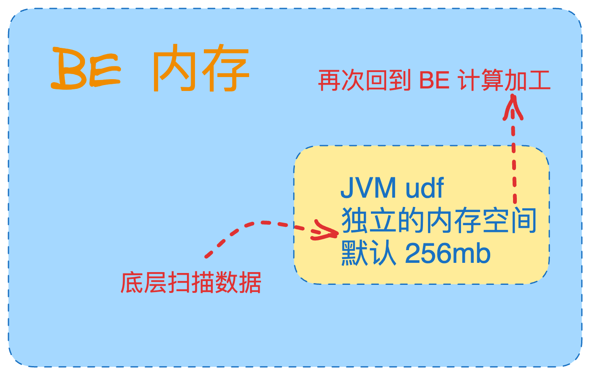
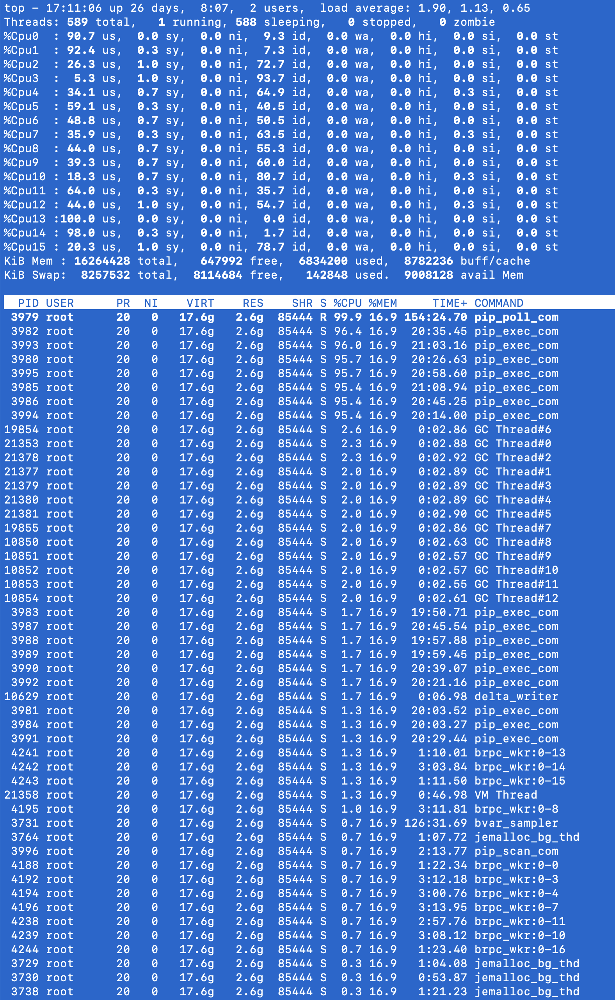
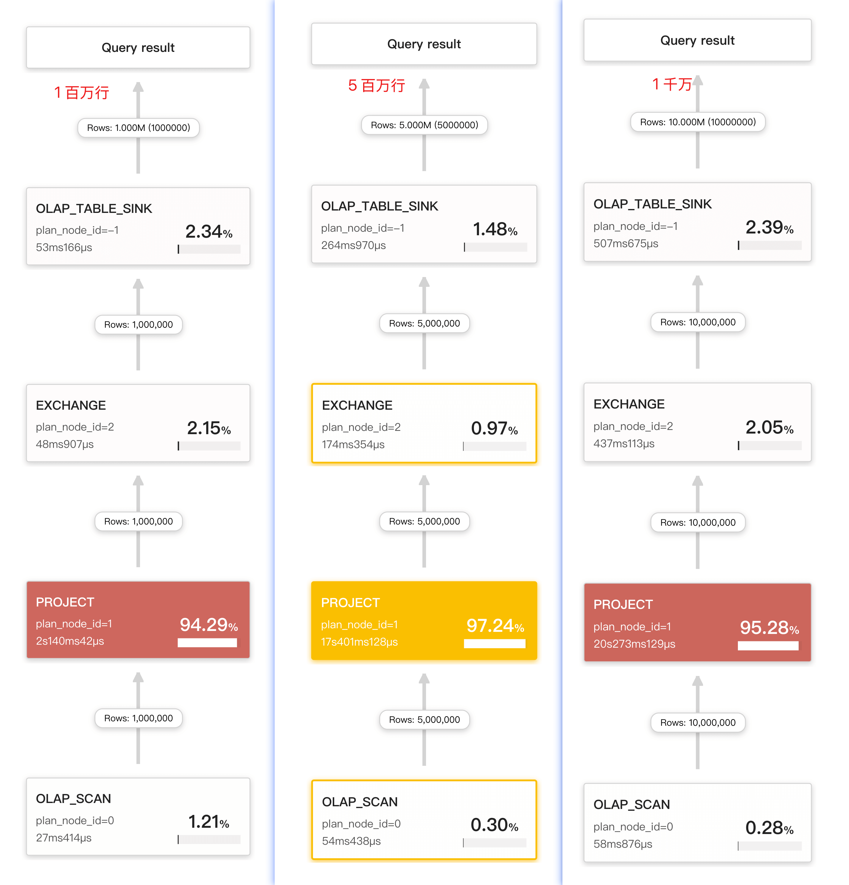
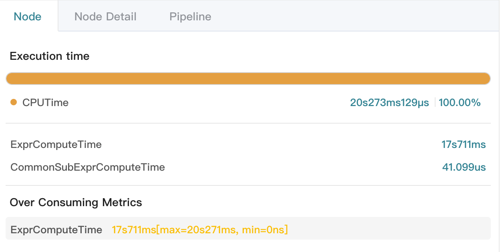
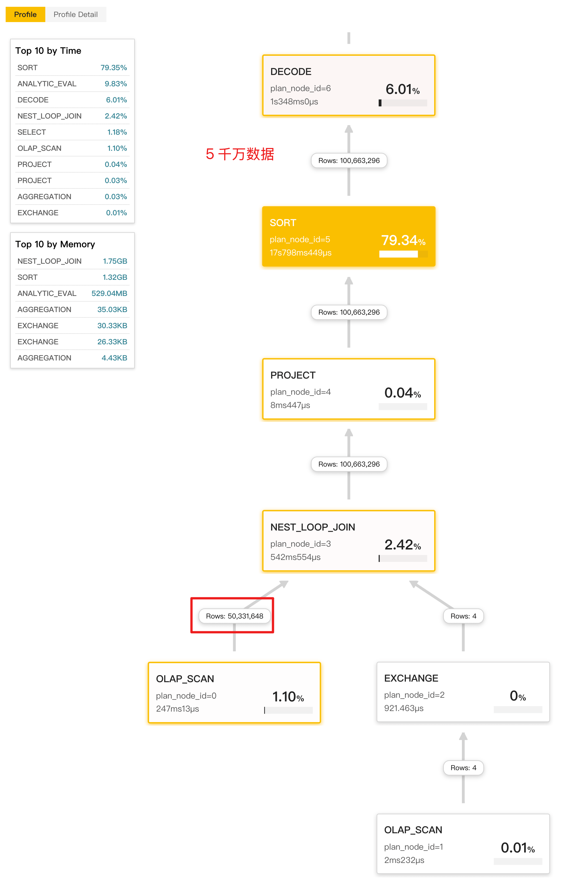

---
title: StarRocks UDF 开发并测试
date: 2024-12-09T00:00:00+08:00
lastmod: 2024-12-09T00:00:00+08:00
categories:
  - StarRocks
tags:
  - StarRocks
  - udf
---  

> 在线 [Java 代码编译验证](https://onecompiler.com/java/432mabfyh)  
> 文章内 Java 使用 chatgpt 开发  

## 业务需求  
  
starrocks 支持 udf 函数，可以参考 Github [StarRocks/udf](https://github.com/StarRocks/starrocks/blob/main/java-extensions/udf-examples/src/main/java/com/starrocks/example/udf/JsonAgg.java)  
参考该[官方 UDF 文档](https://docs.starrocks.io/docs/sql-reference/sql-functions/JAVA_UDF/)  

重构上述 StarRocks UDF 实现如下业务要求：  

1. transactions 表至少包含三列（uid、交易时间、国际时区），按照不同用户所在的国际时区，在交易时间上前推 5 个工作日并打印改天的信息；  
2. Calendar 表记录全球各地的公共节假日信息，在判断工作日的时候需要同时判断所在国际时区的节假日；工作日不包含周六日和公共节假日  
3. 该业务不使用 CTE 递归能力，使用 StarRocks UDF 函数实现  
4. 仅需要 StarRocks udf 函数处理工作日判断，具体判断  5 个工作日 或者更多工作日，由 where 条件输入  
  
- 假设 transactions example：  
  
```sql  
CREATE TABLE `transactions` (  
  `uid` int(11) NULL COMMENT "",  
  `region` varchar(50) NULL COMMENT "",  
  `transaction_time` date NULL COMMENT ""  
) ENGINE=OLAP   
DUPLICATE KEY(`uid`)  
DISTRIBUTED BY HASH(`uid`) BUCKETS 3   
PROPERTIES (  
"compression" = "LZ4",  
"fast_schema_evolution" = "true",  
"replicated_storage" = "true",  
"replication_num" = "1"  
);  
  

INSERT INTO transactions (uid, region, transaction_time) VALUES  
   (1, 'China', '2024-01-01'),  
   (2, 'Europe', '2024-01-02'),  
   (3, 'China', '2024-01-03'),  
   (4, 'Europe', '2024-01-04');  
```  
  
- 假设 Calendar example：  
  
```sql  
CREATE TABLE Calendar (  
    date DATE,  
    is_workday BOOLEAN,  -- TRUE 表示工作日，FALSE 表示非工作日  
    is_china_holiday BOOLEAN,  -- TRUE 表示中国节假日  
    is_europe_holiday BOOLEAN  -- TRUE 表示欧洲节假日  
)  
ENGINE=OLAP   
DUPLICATE KEY(`date`)  
DISTRIBUTED BY HASH(`date`) BUCKETS 1   
PROPERTIES (  
"compression" = "LZ4",  
"fast_schema_evolution" = "true",  
"replicated_storage" = "true",  
"replication_num" = "1"  
);  
  

-- 示例数据填充  
INSERT INTO Calendar (date, is_workday, is_china_holiday, is_europe_holiday)  
VALUES  
('2024-01-01', FALSE, TRUE, FALSE),  -- 中国节假日  
('2024-01-02', TRUE, FALSE, FALSE),  
('2024-01-03', TRUE, FALSE, FALSE),  
-- ...继续插入更多日期和标识...  
('2024-12-31', TRUE, FALSE, FALSE);  
```  
  
- 假设业务 SQL 如下

```sql  
SELECT   
    a.uid,  
    a.region,  
    a.transaction_time,  
    c.date AS 调整后日期  
FROM   
    transactions a,  
    Calendar c  
WHERE   
    c.date <= a.transaction_time and   
    c.is_workday = TRUE  
    AND (  
        (a.region = 'China' AND c.is_china_holiday = FALSE) OR  
        (a.region = 'Europe' AND c.is_europe_holiday = FALSE)  
    )  
    AND (  
        SELECT COUNT(*)   
        FROM Calendar c2  
        WHERE c2.date <= c.date  
        AND c2.date < a.transaction_time  
        AND c2.is_workday = TRUE  
        AND (  
            (a.region = 'China' AND c2.is_china_holiday = FALSE) OR  
            (a.region = 'Europe' AND c2.is_europe_holiday = FALSE)  
        )  
    ) = 5;  
  
```  

- 可优化为 with 方式，降低 SQL 复杂度

```sql
WITH WorkdayCount AS (
    SELECT 
        c.date,
        a.uid,
        a.region,
        a.transaction_time,
        c.is_china_holiday,
        c.is_europe_holiday,
        SUM(
            CASE 
                WHEN c.is_workday = TRUE AND
                     ((a.region = 'China' AND c.is_china_holiday = FALSE) OR
                      (a.region = 'Europe' AND c.is_europe_holiday = FALSE))
                THEN 1 
                ELSE 0 
            END
        ) OVER (PARTITION BY a.uid ORDER BY c.date) AS workday_count
    FROM 
        transactions a
    JOIN 
        Calendar c ON c.date < a.transaction_time
)
SELECT 
    uid,
    region,
    transaction_time,
    date AS 调整后日期
FROM 
    WorkdayCount
WHERE 
    workday_count >= 1
    AND (
        (region = 'China' AND is_china_holiday = FALSE) OR
        (region = 'Europe' AND is_europe_holiday = FALSE)
    );
```

## UDF 实现   

### UDF 编译  
  
1. linux  机器配置 java 11 环境变量  
2. 创建如下目录结构  
3. 放入如下两个 java 文件  
    1. 打包 class 并通过 main 函数验证可行性  
    2. `javac com/starrocks/udf/sample/IsWorkday.java`  
    3. `javac com/starrocks/udf/sample/Main.java`  
    4. `java -cp . com.starrocks.udf.sample.Main`  
4. 打包为 jar 包  
    1. `jar cvf IsWorkday.jar -C . com/starrocks/udf/sample/IsWorkday.class`  
  
```bash  
mkdir -p src/com/starrocks/udf/sample/  
  
.  
└── src  
    ├── com  
    │   └── starrocks  
    │       └── udf  
    │           └── sample  
    │               ├── IsWorkday.class  
    │               ├── IsWorkday.java  
    │               ├── Main.class  
    │               └── Main.java  
    └── IsWorkday.jar  
  
```  

```bash
[root@node220 src]# java -cp . com.starrocks.udf.sample.Main  
日期 2024-10-09 在 中国 的5个工作日前的日期是: 2024-09-25  
```  
  
### Java 代码  
  
- Main.java  
  
```java  
package com.starrocks.udf.sample;  
  
public class Main {  
    public static void main(String[] args) {  
        IsWorkday isWorkday = new IsWorkday();  
        
        // 测试用例  
        String testDate = "2024-12-31";  
        String region = "中国";  
        
        String result = isWorkday.evaluate(testDate, region);  
        System.out.println("日期 " + testDate + " 在 " + region + " 的5个工作日前的日期是: " + result);  
    }  
}  
```  
  
- IsWorkday.java  
  
```java  
package com.starrocks.udf.sample;  
import java.text.ParseException;  
import java.text.SimpleDateFormat;  
import java.util.*;  
  
public class IsWorkday {  
  
    private static final Map<String, Set<String>> holidaysMap = new HashMap<>();  
  
    static {  
        holidaysMap.put("中国", generateChinaHolidays(2024));  
        holidaysMap.put("欧洲", new HashSet<>(Arrays.asList("2024-12-25"))); // 示例：圣诞节  
        holidaysMap.put("美国", new HashSet<>(Arrays.asList("2024-07-04"))); // 示例：独立日  
    }  
  
    private static Set<String> generateChinaHolidays(int year) {  
        Set<String> holidays = new HashSet<>();  
        SimpleDateFormat sdf = new SimpleDateFormat("yyyy-MM-dd");  
  
        try {  
            // 元旦  
            holidays.add(sdf.format(sdf.parse(year + "-01-01")));  
  
            // 春节（假设2024年春节为2月10日，实际日期需根据农历计算）  
            holidays.add(sdf.format(sdf.parse(year + "-02-10")));  
  
            // 清明节（通常是4月4日或5日，这里假设为4月5日）  
            holidays.add(sdf.format(sdf.parse(year + "-04-05")));  
  
            // 劳动节  
            holidays.add(sdf.format(sdf.parse(year + "-05-01")));  
  
            // 端午节（假设2024年为6月10日，实际日期需根据农历计算）  
            holidays.add(sdf.format(sdf.parse(year + "-06-10")));  
  
            // 中秋节（假设2024年为9月21日，实际日期需根据农历计算）  
            holidays.add(sdf.format(sdf.parse(year + "-09-21")));  
  
            // 国庆节  
            holidays.add(sdf.format(sdf.parse(year + "-10-01")));  
            holidays.add(sdf.format(sdf.parse(year + "-10-02")));  
            holidays.add(sdf.format(sdf.parse(year + "-10-03")));  
            holidays.add(sdf.format(sdf.parse(year + "-10-04")));  
            holidays.add(sdf.format(sdf.parse(year + "-10-05")));  
            holidays.add(sdf.format(sdf.parse(year + "-10-06")));  
            holidays.add(sdf.format(sdf.parse(year + "-10-07")));  
        } catch (ParseException e) {  
            e.printStackTrace();  
        }  
  
        return holidays;  
    }  
  
    public String evaluate(String dateStr, String region) {  
        SimpleDateFormat sdf = new SimpleDateFormat("yyyy-MM-dd");  
        Calendar calendar = Calendar.getInstance();  
  
        try {  
            Date date = sdf.parse(dateStr);  
            calendar.setTime(date);  
  
            int workdaysCount = 0;  
            while (workdaysCount < 5) {  
                calendar.add(Calendar.DAY_OF_MONTH, -1);  
                if (isWorkday(calendar, region)) {  
                    workdaysCount++;  
                }  
            }  
  
            return sdf.format(calendar.getTime());  
        } catch (ParseException e) {  
            e.printStackTrace();  
            return null; // 或者抛出异常  
        }  
    }  
  
    private boolean isWorkday(Calendar calendar, String region) {  
        int dayOfWeek = calendar.get(Calendar.DAY_OF_WEEK);  
        String dateStr = new SimpleDateFormat("yyyy-MM-dd").format(calendar.getTime());  
  
        // 检查是否是周末  
        if (dayOfWeek == Calendar.SATURDAY || dayOfWeek == Calendar.SUNDAY) {  
            return false;  
        }  
  
        // 检查是否是节假日  
        Set<String> holidays = holidaysMap.get(region);  
        return holidays == null || !holidays.contains(dateStr);  
    }  
  
}  
```  

## 业务验证  

- 需要 FE 添加如下参数开启 udf 能力，重启后生效；不支持动态开启
    - `enable_udf=true`
- 【注意事项】UDF 注册到 be 后使用的 jvm 内存  
    - UDF 内存在单个 BE 资源预估：使用 `行大小 x 4096 行 x cpu核数 x 单个条目大小 x 2`；单个条目大小 可参考 字段属性 大小
    - be c++ 是无法管理这部分 udf 内存的，当 jvm oom 时会导致 be panic 退出  
    - udf 内存默认为 256mb，通过 be 配置文件中的 JAVA_OPTS 参数控制  
  
```c  
# JVM options for be  
# eg:  
JAVA_OPTS="-Xmx8192m -XX:+UseMemba"  
# For jdk 9+, this JAVA_OPTS will be used as default JVM options  
JAVA_OPTS_FOR_JDK_9_AND_LATER="-Xmx8192m -XX:+UseMemba"  
```  



- UDF 函数权限  
    - 在 3.1 之后，udf 支持 集群内全局、单个 database 内注册以及使用  
    - UDF 权限可以指定 user 、role 信息  
    - UDF 函数的创建、删除可以看 [官网文档](https://docs.starrocks.io/zh/docs/sql-reference/sql-statements/Function/CREATE_FUNCTION/)  
    - UDF 函数更新需要删除、重新创建，目前不支持原地更新  
  
```sql  
GRANT  
    { USAGE | DROP | ALL [PRIVILEGES]}   
    ON { GLOBAL FUNCTION <function_name>(input_data_type) [, < function_name>(input_data_type),...]    
       | ALL GLOBAL FUNCTIONS }  
    TO { ROLE | USER} {<role_name>|<user_identity>} [ WITH GRANT OPTION ]  
```  

- 创建 udf 函数  
    - StarRocks 调用 java udf 函数时，约等于 JNI 计算加工时间（逐行加工输入的内容）  
    - 调用 udf 函数无法使用 c++ avx2 向量化计算能力  
  
```sql  
CREATE FUNCTION IsWorkday(string,string) RETURNS string  
PROPERTIES (  
    "file" = "file:///opt/20241209-jar/src/IsWorkday.jar",  
    "type" = "StarrocksJar",  
    "symbol" = "com.starrocks.udf.sample.IsWorkday"  
);  
```  
  
- 输入相同时间，判断 region 是否工作  
    - 2024-07-04 在美国日历应变吗为假期  
    - 当输入美国区域比中国区域提前一天  
  
```sql  
mysql> select IsWorkday("2024-07-10","美国");  
+-----------------------------------+  
| isworkday('2024-07-10', '美国')   |  
+-----------------------------------+  
| 2024-07-02                        |  
+-----------------------------------+  
1 row in set (0.03 sec)  
  
mysql> select IsWorkday("2024-07-10","中国");  
+-----------------------------------+  
| isworkday('2024-07-10', '中国')   |  
+-----------------------------------+  
| 2024-07-03                        |  
+-----------------------------------+  
1 row in set (0.03 sec)  
```  
  
- 输入格式必须日期 + 区域，不能反向输入为 区域 + 日期  
  
```sql  
  
mysql> select IsWorkday("2024-10-09","中国");  
+-----------------------------------+  
| isworkday('2024-10-09', '中国')   |  
+-----------------------------------+  
| 2024-09-25                        |  
+-----------------------------------+  
1 row in set (0.05 sec)  
  
mysql> select IsWorkday("中国","2024-10-09");  
+-----------------------------------+  
| isworkday('中国', '2024-10-09')   |  
+-----------------------------------+  
| NULL                              |  
+-----------------------------------+  
1 row in set (0.04 sec)  
  
```  
  
- udf 函数仅为 demo，输入不存在的区域也可以运行返回结果 (这部分逻辑未处理) 
  
```sql  
mysql> select IsWorkday("2024-10-09","阿拉伯");  
+--------------------------------------+  
| isworkday('2024-10-09', '阿拉伯')    |  
+--------------------------------------+  
| 2024-10-02                           |  
+--------------------------------------+  
1 row in set (0.05 sec)  
```  
  

## 简单性能验证  

- 结论：
    - 在大量数据计算场景下：同等资源情况下 BE 自带的多表关联 + 向量化能力是 UDF 计算加工性能的 5 -10 倍或更高（取决 udf 的计算逻辑）
    - 在少量数据场景下：UDF 函数可大大降低 SQL 语句书写复杂度

### UDF 性能验证
  
- 最终计算量为 【输入行数 x 地区 x 节假日数量 x 周末(1)】  
    - 比如 1000 万输入 X 中国地区(1) X 节假日(代码定义了 13 天) X 1 个周末判断  
  
```sql  
mysql> select * from transactions;  
+------+--------+------------------+  
| uid  | region | transaction_time |  
+------+--------+------------------+  
|    2 | Europe | 2024-01-02       |  
|    1 | China  | 2024-01-01       |  
|    3 | China  | 2024-01-03       |  
|    4 | Europe | 2024-01-04       |  
|    5 | 中国   | 2024-10-09       |  
+------+--------+------------------+  
5 rows in set (0.03 sec)  
  

mysql> insert into transactions select * from transactions;  
Query OK, 25165824 rows affected (7.02 sec)  
{'label':'insert_386818af-b6d5-11ef-b242-5a0507c05987', 'status':'VISIBLE', 'txnId':'4049'}  
  
mysql> select count(*) from transactions;  
+----------+  
| count(*) |  
+----------+  
| 50331648 |  
+----------+  
1 row in set (0.11 sec)  
```  
  
- 单台 16c、16g 的虚拟机部署 fe x 1  、be x 1  
- 数据副本为 1
- 数据量最大为 5 千万
  
```sql  

-- 单节点 be 集群测试的时候，调整建表时副本大小
mysql> ADMIN SET FRONTEND CONFIG ("default_replication_num" = "1");  
Query OK, 0 rows affected (0.02 sec)  

-- 开启 profile 分析查询
mysql> set enable_profile=1;  
Query OK, 0 rows affected (0.02 sec)  
  
mysql> create table testudf as select IsWorkday(transaction_time,region) from transactions limit 1000000;  
Query OK, 1000000 rows affected (2.59 sec)  
{'label':'insert_64ac6249-b6d6-11ef-b242-5a0507c05987', 'status':'VISIBLE', 'txnId':'4055'}  
  
mysql> create table testudf5 as select IsWorkday(transaction_time,region) from transactions limit 5000000;  
Query OK, 5000000 rows affected (18.39 sec)  
{'label':'insert_8b3e09a2-b6d6-11ef-b242-5a0507c05987', 'status':'VISIBLE', 'txnId':'4069'}  
  
mysql> create table testudf10b as select IsWorkday(transaction_time,region) from transactions limit 10000000;  
Query OK, 10000000 rows affected (21.00 sec)  
{'label':'insert_a8e37455-b6d6-11ef-b242-5a0507c05987', 'status':'VISIBLE', 'txnId':'4071'}  
```  
  
- 执行时 CPU 压力  
  
  
  
- profile 分析 100万、500 万、1000 万 三种规模查询耗时  
    - 时间消耗主要在 project 算子计算（udf 函数加工）  
  
  
  


### SQL 语句执行效果

- 5000 万行数据输入

```SQL
mysql> WITH WorkdayCount AS (
    ->     SELECT 
    ->         c.date,
    ->         a.uid,
    ->         a.region,
    ->         a.transaction_time,
    ->         c.is_china_holiday,
    ->         c.is_europe_holiday,
    ->         SUM(
    ->             CASE 
    ->                 WHEN c.is_workday = TRUE AND
    ->                      ((a.region = 'China' AND c.is_china_holiday = FALSE) OR
    ->                       (a.region = 'Europe' AND c.is_europe_holiday = FALSE))
    ->                 THEN 1 
    ->                 ELSE 0 
    ->             END
    ->         ) OVER (PARTITION BY a.uid ORDER BY c.date) AS workday_count
    ->     FROM 
    ->         transactions a
    ->     JOIN 
    ->         Calendar c ON c.date < a.transaction_time
    -> )
    -> SELECT 
    ->    count(1)
    -> FROM 
    ->     WorkdayCount
    -> WHERE 
    ->     workday_count >= 1
    ->     AND (
    ->         (region = 'China' AND is_china_holiday = FALSE) OR
    ->         (region = 'Europe' AND is_europe_holiday = FALSE)
    ->     );
+----------+
| count(1) |
+----------+
| 25165824 |
+----------+
1 row in set (21.24 sec)
```



## 优化 UDF 内存

> 降低 udf 占用的 jvm 内存，在多并发调用 udf 函数，让 udf static 部分只加载一次测试  
> 参考内容：https://forum.mirrorship.cn/t/topic/6863

### 函数代码

```bash
[root@node220 loadtime]# tree .
.
├── Caller.class
├── Caller.jar
├── Caller.java
├── LoadTest.class
└── LoadTest.java

0 directories, 5 files
```

- LoadTest 打包后扔到  `$STARROCKS_HOME/be/lib/hadoop/common/lib/`
    - 等同注册成 BE 下的 java 函数（性能不等同 be 自带的向量化函数）
    - 为了方便外部 udf 函数调用，以及 jvm 内存共享
    - 内存默认不释放，重启 BE 后释放
    - 内存数据可以被 schedule 策略刷新

```java
import java.util.concurrent.Executors;
import java.util.concurrent.ScheduledExecutorService;
import java.util.concurrent.TimeUnit;

public class LoadTest {

    // 定义一个静态变量来存储 Unix 时间戳
    private static long lastExecutionTime = 0;

    static {
        System.out.println("load UDF");

        // 创建一个调度执行器服务
        ScheduledExecutorService scheduler = Executors.newScheduledThreadPool(1);

        // 设置一个每隔3分钟执行一次的任务
        scheduler.scheduleAtFixedRate(() -> {
            try {
                performScheduledTask();
            } catch (Exception e) {
                e.printStackTrace();
            }
        }, 0, 3, TimeUnit.MINUTES);  // 修改为3分钟
    }

    public String evaluate(String a, Integer b) {
        // 在此处引用 lastExecutionTime 变量
        return a + b + lastExecutionTime;
    }

    // 定时任务要执行的操作
    private static void performScheduledTask() {
        // 更新 lastExecutionTime 变量为当前的 Unix 时间戳（秒级）
        lastExecutionTime = System.currentTimeMillis() / 1000;

        // 模拟任务执行的结果
        String taskResult = "Scheduled task executed at " + lastExecutionTime;

        // 打印任务结果
        System.out.println(taskResult);
    }

    public static void main(String[] args) {
        // 为了保持程序运行，以便观察定时任务的效果
        try {
            Thread.sleep(Long.MAX_VALUE);
        } catch (InterruptedException e) {
            e.printStackTrace();
        }
    }
}

```

- Caller 打包后，注册为 UDF 函数

```java
public class Caller {
    static {
        System.out.println("load Caller");
    }
    public String evaluate(String a, Integer b) {
        return new LoadTest().evaluate(a, b);
    }
}
```

### 注册函数并测试

```sql
CREATE FUNCTION Caller(string,int) RETURNS string  
PROPERTIES (  
    "file" = "file:///opt/20241209-jar/src/loadtime/Caller.jar",  
    "symbol" = "Caller", 
    "type" = "StarrocksJar"
); 
```

- 测试验证
    - loadtest 函数在输入 string、int 两个数字后，
        - 字符串拼接后输出 `string + int + schedule 刷新时间`（年月日时分秒转 unixtime）
        - 输入相同数据，在刷新后，结果得到预期的变化
    - 注意事项：
        - 如果 SQL 执行外部 caller udf 早于 loadtest（实际逻辑函数）加载，结果返回（但是不符合预期）
        - loadtest 函数注册变量有问题，被 load 后加载内容和第一次刷新的加载内容相同，第二次刷新符合预期

```sql
-- caller udf 早于 loadtest 逻辑函数调用和运行
-- 输入 1，2 ，loadtest 未刷新所以返回 lastExecutionTime = 0;
mysql> select caller(1,2);
+--------------+
| caller(1, 2) |
+--------------+
| 120          |
+--------------+
1 row in set (1.17 sec)

-- 初始化加载的内容
-- 对应 be out 日志为 Scheduled task executed at 1733886426
mysql> select caller(1,2);
+--------------+
| caller(1, 2) |
+--------------+
| 121733886246 |
+--------------+
1 row in set (0.02 sec)

-- 第二次刷新加载的内容
-- 对应 be out 日志为 Scheduled task executed at 1733886606
mysql> select caller(1,2);
+--------------+
| caller(1, 2) |
+--------------+
| 121733886606 |
+--------------+
1 row in set (0.05 sec)
```

```log
load Caller
load UDF
Scheduled task executed at 1733886246
load Caller
Scheduled task executed at 1733886426
load Caller
Scheduled task executed at 1733886606
load Caller
```

### UDF isolation 属性

或者基于 StarRocks 3.1+ 创建 UDF 的时候加个 isolation 属性，该属性支持多查询贡献内存

```sql
CREATE FUNCTION test_shared(string)  
RETURNS string properties  ( 
"symbol" = "SharedUDF",
"type" = "StarrocksJar", 
"file" = "http://XXXXX/create_file.jar",
"isolation"="shared"
);
```


## 附录

### udf example 2 （未打包成功）  

> 该函数不符合 starrocks udf 输入、输出的格式，未打包成功
  
```java  
import com.starrocks.udf.Udf;  
import com.starrocks.udf.annotation.UdfDescription;  
import com.starrocks.udf.annotation.UdfParameter;  
  
import java.sql.Connection;  
import java.sql.DriverManager;  
import java.sql.PreparedStatement;  
import java.sql.ResultSet;  
import java.text.SimpleDateFormat;  
import java.util.Calendar;  
import java.util.Date;  
import java.util.HashMap;  
import java.util.Map;  
import java.util.TimeZone;  
import java.util.logging.Level;  
import java.util.logging.Logger;  
  
@UdfDescription(name = "calculate_previous_workday",  
        description = "Calculate the date 5 workdays before the given date considering holidays and weekends")  
public class CalculatePreviousWorkday implements Udf {  
  
    private static final Logger logger = Logger.getLogger(CalculatePreviousWorkday.class.getName());  
    private static final Map<String, Boolean> chinaHolidays = new HashMap<>();  
    private static final Map<String, Boolean> europeHolidays = new HashMap<>();  
    private static final Map<String, Boolean> workdays = new HashMap<>();  
    private static final String JDBC_URL = "jdbc:mysql://your_starrocks_host:port/db_name";  
    private static final String JDBC_USER = "user";  
    private static final String JDBC_PASSWORD = "password";  
  
    // 静态块用于初始化数据  
    static {  
        loadCalendarData();  
    }  
  
    private static void loadCalendarData() {  
        logger.info("Loading calendar data into memory...");  
        try (Connection conn = DriverManager.getConnection(JDBC_URL, JDBC_USER, JDBC_PASSWORD)) {  
            String query = "SELECT date, is_workday, is_china_holiday, is_europe_holiday FROM Calendar";  
            try (PreparedStatement stmt = conn.prepareStatement(query);  
                 ResultSet rs = stmt.executeQuery()) {  
                while (rs.next()) {  
                    String date = rs.getString("date");  
                    workdays.put(date, rs.getBoolean("is_workday"));  
                    chinaHolidays.put(date, rs.getBoolean("is_china_holiday"));  
                    europeHolidays.put(date, rs.getBoolean("is_europe_holiday"));  
                }  
                logger.info("Calendar data loaded successfully.");  
            }  
        } catch (Exception e) {  
            logger.log(Level.SEVERE, "Failed to load calendar data: ", e);  
            // 处理异常，可能需要重试机制或备用数据加载方式  
        }  
    }  
  
    public String evaluate(@UdfParameter(name = "transaction_date") String transactionDate,  
                           @UdfParameter(name = "timezone") String timezone,  
                           @UdfParameter(name = "region") String region) {  
        try {  
            SimpleDateFormat sdf = new SimpleDateFormat("yyyy-MM-dd");  
            sdf.setTimeZone(TimeZone.getTimeZone(timezone));  
            Date date = sdf.parse(transactionDate);  
  
            Calendar calendar = Calendar.getInstance();  
            calendar.setTime(date);  
  
            int workdaysCount = 0;  
            while (workdaysCount < 5) {  
                calendar.add(Calendar.DAY_OF_MONTH, -1);  
                String currentDateStr = sdf.format(calendar.getTime());  
                if (isWorkday(currentDateStr, region)) {  
                    workdaysCount++;  
                }  
            }  
            return sdf.format(calendar.getTime());  
        } catch (Exception e) {  
            logger.log(Level.SEVERE, "Error calculating previous workday: ", e);  
            return null;  
        }  
    }  
  
    private boolean isWorkday(String date, String region) {  
        Boolean isWorkday = workdays.getOrDefault(date, false);  
        Boolean isHoliday = region.equals("China") ? chinaHolidays.getOrDefault(date, false)  
                                                   : europeHolidays.getOrDefault(date, false);  
        return isWorkday && !isHoliday;  
    }  
  
    // Method to update calendar data if needed  
    public static void updateCalendarData() {  
        synchronized (CalculatePreviousWorkday.class) {  
            logger.info("Updating calendar data...");  
            chinaHolidays.clear();  
            europeHolidays.clear();  
            workdays.clear();  
            loadCalendarData();  
            logger.info("Calendar data updated.");  
        }  
    }  
}  
  
```  

### 其他问题

- 假设业务 SQL 如下，在 StarRocks 运行时报错（ subquery 嵌套时不支持 不等式 关联查询 ）

```sql  
ERROR 1064 (HY000): Getting analyzing error. Detail message: Not support Non-EQ correlated predicate in correlated subquery.  
```  

```sql  
WITH WorkdayCount AS (  
    SELECT   
        c.date,  
        a.uid,  
        a.region,  
        a.transaction_time,  
        c.is_china_holiday,  
        c.is_europe_holiday,  
        SUM(  
            CASE   
                WHEN c.is_workday = TRUE AND  
                     ((a.region = 'China' AND c.is_china_holiday = FALSE) OR  
                      (a.region = 'Europe' AND c.is_europe_holiday = FALSE))  
                THEN 1   
                ELSE 0   
            END  
        ) OVER (PARTITION BY a.uid ORDER BY c.date) AS workday_count  
    FROM   
        transactions a  
    JOIN   
        Calendar c ON c.date < a.transaction_time  
)  
SELECT   
    uid,  
    region,  
    transaction_time,  
    date AS 调整后日期  
FROM   
    WorkdayCount  
WHERE   
    workday_count >= 1  
    AND (  
        (region = 'China' AND is_china_holiday = FALSE) OR  
        (region = 'Europe' AND is_europe_holiday = FALSE)  
    );  
```  
